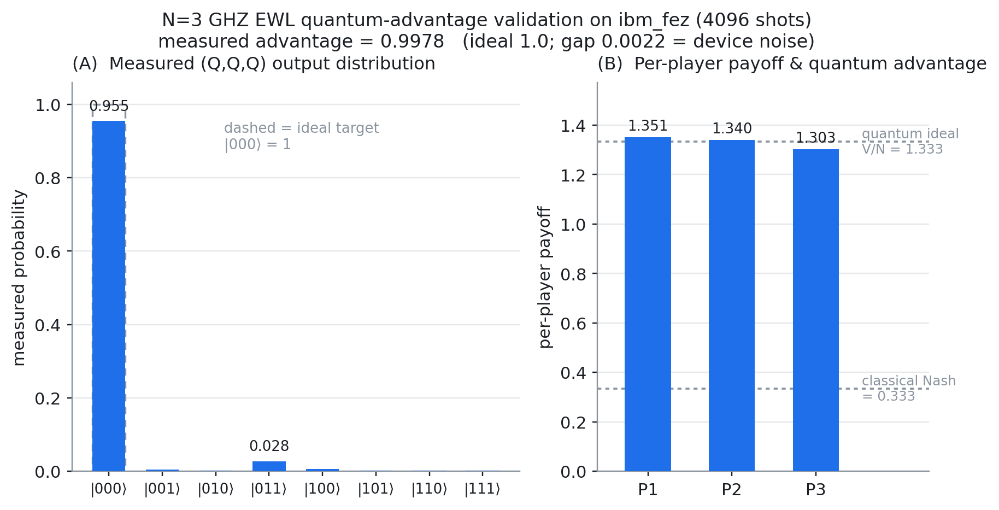
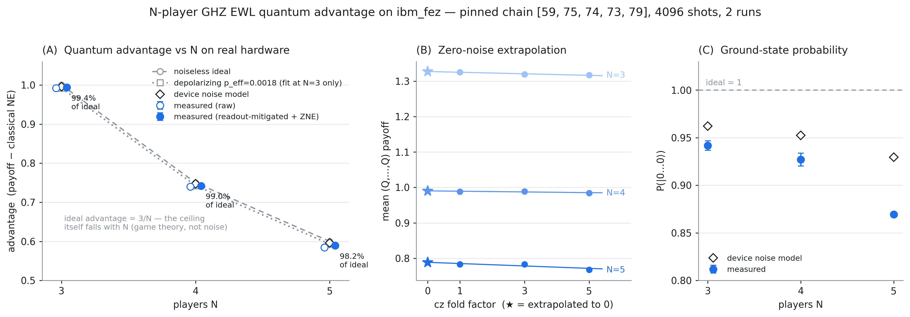

# Entangled Equilibria

*Extending quantum Nash equilibria to N-player financial trading networks via entanglement topology*


This project studies an N-player shared-resource allocation game using the
Eisert-Wilkens-Lewenstein (EWL) protocol, five entangler families, exact
simulation, and IBM hardware through seven players. Equilibrium statements
refer to named finite strategy menus; both cooperative GHZ phase families
admit a profitable unrestricted SU(2) deviation. Payoff retention, player
incentives, and physical implementation are measured separately. The manuscript
targets IEEE Transactions on Quantum Engineering. Khan et al. (2025) is prior
multiplayer trading-game work, not a two-player-only baseline for novelty.

## 1. Current Project Handoff

The journal revision includes the phase-boundary proof, compact ideal GHZ
evaluation through N=128, payoff sensitivity, and two complete registered
hardware batches. Both batches support the incentive criterion at N=4,6;
both fail the overall five-size criterion. See [WHAT-WAS-ADDED.md](WHAT-WAS-ADDED.md)
and [the revision log](paper/JOURNAL-REVISION-LOG.md). The Task 12 handoff remains
a historical record. The September 8 audit additionally hardens invalid-input
handling and aligns the manuscript with the supplied FQCNN reference layout.

---

## 2. Research Questions

1. **RQ1 — Scaling:** Does the quantum payoff advantage survive, grow, or diminish as N increases from 2 to 6 players?
2. **RQ2 — Topology:** Among GHZ state, W state, ring, star, and fully-connected entanglement, which topology maximises collective Nash payoff for N players?
3. **RQ3 — Noise Robustness:** Under a realistic depolarizing noise channel, which topology preserves quantum advantage best? Does GHZ collapse faster than W state as noise increases?

---

## 3. Background

### 3.1 The Hawk-Dove Game

The Hawk-Dove game, when applied to financial trading, models two traders competing over a single asset. Hawk represents a Short position — aggressive, high-risk behaviour that captures full value if unopposed but destroys value in symmetric conflict. Dove represents a Long position — cooperative, stable behaviour that shares value reliably. The full payoff matrix is:

| | Opponent: Dove (Long) | Opponent: Hawk (Short) |
|---|---|---|
| **You: Dove (Long)** | You: V/2, Opponent: V/2 | You: 0, Opponent: V |
| **You: Hawk (Short)** | You: V, Opponent: 0 | You: (V−C)/2, Opponent: (V−C)/2 |

The two pure Nash equilibria (one Hawk, one Dove) are asymmetric and unstable — they require coordination on who plays which role and break down under repeated play without communication. The classical mixed-strategy equilibrium (each player randomises with probability V/C on Hawk) pays less than mutual cooperation. When V > C, both players defecting to Hawk causes payoff destruction analogous to market crashes: the conflict cost C is paid by both, leaving each with (V−C)/2, which is less than the cooperative (V/2, V/2) outcome.

### 3.2 The EWL Quantisation Protocol

The Eisert-Wilkens-Lewenstein protocol quantises any classical 2×2 game by embedding player strategies in the SU(2) rotation group and entangling their qubits before strategy application. Extended to N players, the six steps are:

1. Initialise all N qubits to |0⟩ (the Dove state)
2. Apply entangling operator J (controlled by entanglement parameter γ; at γ = π/2, maximum entanglement is achieved)
3. Each player independently applies their SU(2) strategy U(θ, α, β) to their own qubit
4. Apply disentangling operator J†
5. Measure all qubits in the computational basis
6. Calculate expected payoffs from the measurement probability distribution

The SU(2) strategy matrix and classical mappings are:

```
U(θ, α, β) = [ e^(iα)cos(θ/2)    ie^(iβ)sin(θ/2)  ]
              [ ie^(-iβ)sin(θ/2)  e^(-iα)cos(θ/2)  ]

Classical mappings:
  Dove = U(0, 0, 0)     = Identity matrix
  Hawk = U(π, 0, 0)     = Pauli-X gate
  Q    = U(0, π/2, π/2) = The "miracle move" (quantum Nash equilibrium strategy)
```

The Q strategy is the key quantum insight: when both players play Q, neither can improve their payoff by deviating to any classical strategy (Dove, Hawk, or any mixture). This constitutes a Nash equilibrium that is simultaneously symmetric and Pareto-optimal, yielding payoff (V/2, V/2) — the same as mutual Dove cooperation but now enforced by quantum interference rather than trust or regulation. Classical deviations from Q are punished by the interference structure of the entangled state; the equilibrium is self-enforcing at the level of quantum mechanics.

### 3.3 Why N-Player Extension Is Non-Trivial

With 2 players there is exactly 1 entanglement link and the geometry is trivially fixed. With N players, there are multiple possible connectivity patterns — and each topology produces qualitatively different interference structures, different per-player payoff distributions, and different Nash equilibria. The GHZ state creates all-or-nothing correlations; the W state distributes entanglement pairwise; ring, star, and fully-connected topologies interpolate between local and global correlation structures. Each topology corresponds to a different market architecture and generates a distinct quantum game. The landscape of how topology interacts with player count, strategy space, and noise to determine quantum advantage has not been mapped in the Hawk-Dove trading context. Charting this landscape is the central contribution of this project.

---

## 4. Entanglement Topologies

### 4.1 GHZ State

- **Definition:** |GHZ⟩ = (1/√2)(|00...0⟩ + |11...1⟩)
- **Circuit:** Hadamard on qubit 1, then CNOT(1,2), CNOT(1,3), ..., CNOT(1,N)
- **Market analogy:** Fully centralised order book — all traders are perfectly correlated; every participant sees the same aggregate signal simultaneously
- **Key properties:**
  - Maximum multipartite entanglement (all N qubits maximally correlated)
  - Highly fragile under noise: losing or measuring a single qubit collapses entanglement for all remaining qubits
  - Requires a star-shaped hardware connectivity with qubit 1 as hub
  - Hypothesis: achieves highest per-player payoff at zero noise; degrades fastest as noise increases

### 4.2 W State

- **Definition:** |W⟩ = (1/√N)(|100...0⟩ + |010...0⟩ + ... + |000...1⟩)
- **Circuit:** Recursive construction using F(2/N) rotation gates and controlled-NOTs; each layer redistributes amplitude along the chain
- **Market analogy:** Partial-information market — "Hawkishness" is distributed diffusely across all participants; no single agent holds all the aggression
- **Key properties:**
  - Pairwise entanglement survives single-qubit loss: tracing out any one qubit leaves the remaining N−1 qubits entangled
  - Hardware-efficient on linear nearest-neighbour chains
  - Hypothesis: outperforms GHZ under realistic NISQ noise for N > 4 due to superior noise robustness

### 4.3 Ring Topology

- **Description:** Each player is entangled with their two neighbours via Rxx(γ) gates arranged in a closed cycle; player 1 connects to player 2, player 2 to player 3, ..., player N to player 1
- **Market analogy:** Circular commodity futures trading pit — each participant only interacts bilaterally with their immediate neighbours, and information propagates around the ring
- **Key properties:**
  - Hardware-cheap: requires only N entangling gates (one per edge)
  - No single-point failure, but entanglement is local rather than global
  - Slow information propagation: correlations between non-adjacent players are mediated through intermediate nodes

### 4.4 Star Topology

- **Description:** One central player (the hub) is entangled with all N−1 others via Rxx(γ) gates; non-hub players share no direct entanglement with each other
- **Market analogy:** Centralised market maker or dealer model — a single dealer intermediates all trades; bilateral relationships flow through the hub
- **Key properties:**
  - Fast information flow from hub to all peripheral players
  - Single point of failure: decoherence of the hub qubit destroys all entanglement in the network
  - Requires O(N) entangling gates; linear in player count

### 4.5 Fully-Connected Topology

- **Description:** Every player is entangled with every other player via Rxx(γ) gates; all N(N−1)/2 edges in the complete graph K_N are implemented
- **Market analogy:** Dense interbank lending network — every institution has a direct bilateral exposure to every other institution, as in pre-2008 OTC derivatives markets
- **Key properties:**
  - Maximum pairwise entanglement: every pair of players shares a direct entanglement channel
  - Requires O(N²) entangling gates; quadratic circuit depth growth
  - Most noise-sensitive topology at its natural gate budget — a gate-count effect (O(N²) edges), not a per-gate structural one (per-gate decay rates match the other pairwise topologies; see the §9 controls bullet)
  - Most hardware-expensive; likely infeasible on near-term devices beyond N=5

---

## 5. Technical Architecture

### 5.1 Quantum Circuit Layer (Prithvi Raghu)

This layer constructs and simulates all quantum circuits required for the project:

- **2-player validation circuit:** Reproduces the Khan et al. (2025) result; confirms that Q strategy constitutes a Nash equilibrium with payoff (2, 2) for V=4, C=3
- **N-player GHZ entangler circuit:** Hadamard + N−1 CNOT ladder; parameterised by N and entanglement angle γ
- **N-player W state entangler circuit:** Recursive F-gate + CNOT construction; preserves entanglement under single-qubit loss
- **Parameterised pairwise topology circuits:** NetworkX graph definition (ring, star, fully-connected) → automatic Rxx(γ) gate generation per edge; topology is specified as a graph adjacency list and circuits are auto-compiled
- **Depolarizing noise model (Qiskit Aer):** Single-qubit and two-qubit depolarizing channels; noise parameter p swept from 0.0 to 0.05 in Month 4

### 5.2 Game Theory & Analysis Layer (Aasa Singh Bhui)

This layer computes equilibria and produces all result figures:

- **N-player Hawk-Dove payoff function:** Given N players, k Hawks among them, and parameters V and C, computes the per-player expected payoff for both Hawk and Dove players under the classical model
- **Nash equilibrium computation via Nashpy:** Constructs the full payoff tensor for N players × M strategies; uses support enumeration to find all Nash equilibria
- **Quantum advantage metric:** Advantage(N, topology, noise) = NE_quantum − NE_classical; the primary output of the project
- **2D heatmap:** N × topology grid coloured by quantum advantage; the Month 3 milestone result
- **3D surface plot:** N × noise × advantage axes, one surface per topology; enables direct visual comparison of GHZ vs W noise robustness
- **Financial interpretation:** Mapping of results onto carbon trading equilibria, market microstructure design principles, and DeFi mechanism implications

---

## 6. Tech Stack

| Tool | Purpose | Notes |
|---|---|---|
| Qiskit | Quantum circuit construction and statevector simulation | Already used in QAE project |
| Qiskit Aer | Noise model simulation (depolarizing channel) | Month 4 noise sweep |
| TKET (Quantinuum) | Circuit compilation to IBM heavy-hex topology | Optional; used for hardware gate count analysis |
| Nashpy | Reserved for 2-player cross-validation; not used in the N≥3 path, which uses direct best-response enumeration (spec §2.3) | `pip install nashpy` |
| NetworkX | Entanglement topology graph definition → auto circuit generation | Ring/star/FC graph → Rxx gates |
| NumPy / SciPy | Payoff tensor construction, matrix operations | Standard |
| Matplotlib | 2D heatmaps and 3D surface plots | Key result figures |
| Free IBM Quantum | Real hardware validation (optional, Month 5) | 5–7 qubit free tier |

---

## 7. Project Timeline

| Month | Focus | Prithvi Raghu (Circuits) | Aasa Singh Bhui (Game Theory) | Checkpoint |
|---|---|---|---|---|
| 1 | Foundation & Validation | 2-player EWL circuit; validate Q strategy payoff vs Khan et al. | Reproduce 2-player payoff matrix; confirm classical Nash equilibria | Q strategy is a Nash equilibrium with payoff (2,2) for V=4, C=3 |
| 2 | N=3 Extension | 3-player GHZ circuit; full 8-outcome probability distribution | 3-player payoff tensor; Nashpy Nash equilibria; first advantage data point | Quantum advantage confirmed for N=3 |
| 3 | Full Topology Sweep | All 5 topologies for N=3,4,5,6 using NetworkX+Rxx | 20-configuration payoff sweep; 2D advantage heatmap | Complete (N, topology) advantage matrix |
| 4 | Noise Analysis | Qiskit Aer depolarizing channel; p sweep 0→0.05 | 3D surface plots; noise threshold p* per topology | GHZ vs W noise robustness comparison |
| 5 | Hardware + Writing | TKET compilation; IBM Quantum hardware run (N=3) | Write Introduction, Background, Methodology sections | Complete paper draft |
| 6 | Revision + Submission | Code cleanup, GitHub release | arXiv upload; journal submission | Paper submitted; repo public |

---

## 8. Installation & Quick Start

```bash
# Clone the repository
git clone https://github.com/YOUR_USERNAME/entangled-equilibria
cd entangled-equilibria

# Create virtual environment
python -m venv venv
source venv/bin/activate  # Windows: venv\Scripts\activate

# Install dependencies — versions PINNED to match pyproject.toml.
# Keep the historical simulator pins; current IBM execution uses a separate environment
# (targets qiskit==1.3.2); the sign/basis conventions differ.
pip install "qiskit==1.3.2" "qiskit-aer==0.14.2" "nashpy==0.0.19" \
            "networkx==3.3" "numpy==1.26.4" "scipy==1.13.1" \
            "matplotlib==3.9.2" "pyyaml>=6.0" "pylatexenc>=2.10"

# Validate the codebase — the real validation is the test suite
  pytest tests/ -v
# Expected: all tests pass

# Run the Month 2 result (N=3 quantum advantage)
python scripts/n3_advantage.py
# Expected: advantage = 1.0, (Q₃,Q₃,Q₃) is the unique pure Nash equilibrium

# Month 4 — noise robustness (RQ3): depolarizing p swept 0.0 → 0.05
conda run -n entangled-equilibria python scripts/run_experiment.py --config experiments/noise-sweep.yaml
# Writes results/noise-robustness/<UTC-timestamp>/ with the p* table,
# GHZ-vs-W ordering, and per-topology 3D advantage surfaces (plots/noise/)
```

### 8.1 Configurable Experiment Harness (tweak → run → read)

For exploratory runs you don't have to edit any Python. Tweak one config file,
run one command, and read a self-contained report.

1. **Tweak** `experiments/config.yaml` — set the players `N`, the entanglement
   `topologies` (`ghz`, `ring`, `star`, `fully-connected`, `w`), the game
   parameters `V`/`C`/`gamma`, and which `output` formats to write. Any field
   given as a *list* becomes a sweep axis; the run evaluates the full cartesian
   product (e.g. `gamma: ["pi/2", "pi/4"]` sweeps entanglement strength).

2. **Run**:
   ```bash
   conda run -n entangled-equilibria python scripts/run_experiment.py
   # or point at a different config:
   conda run -n entangled-equilibria python scripts/run_experiment.py --config experiments/config.yaml
   ```

3. **Read** the timestamped run under `results/<name>/<UTC-timestamp>/`:
   - `report.md` — human-readable summary table, an auto-generated **Findings**
     section, and per-cell deviation tables (with per-player vectors for
     asymmetric topologies like star).
   - `results.json` / `results.csv` — machine-readable results.
   - `plots/advantage_vs_N.png`, `plots/topology_heatmap.png`.
   - `plots/topologies/*.png` — **qubit-topology diagrams** (one per topology,
     across the swept N) and the EWL circuit per N. Embedded under the report's
     **Entanglement topologies** section so you can see exactly which topology
     each result used. GHZ/W (global N-body entanglers) are drawn with a distinct
     shaded depiction, never as a plain complete graph.
   - `config.snapshot.yaml` + `metadata.json` — exact parameters and git
     provenance for reproducibility.

   A non-positive advantage or a non-Nash `(Q,...,Q)` is reported as a **finding,
   not a bug** — the harness surfaces it rather than hiding it.

> This harness generalizes `scripts/n3_advantage.py` (one fixed N=3 GHZ run) and
> `scripts/topology_sweep.py` (a fixed topology × N matrix) into a single
> parameter-driven entry point with a readable report.

### 8.2 Visualize a topology on demand

To draw a single entanglement topology (and/or its EWL circuit) without running a
full sweep:

```bash
conda run -n entangled-equilibria python scripts/draw_topology.py --topology star --N 5
conda run -n entangled-equilibria python scripts/draw_topology.py --topology ghz --N 4 --what both
conda run -n entangled-equilibria python scripts/draw_topology.py --topology full --N 6 --out /tmp/diag
```

`--topology` accepts the harness aliases (`full` → `fully-connected`, etc.),
`--what` is `graph`, `circuit`, or `both` (default), and output defaults to a
`results/topology_diagrams/<UTC-timestamp>/` folder.

---

## 9. Key Results (Updated as Project Progresses)

| Result | Status | Notes |
|---|---|---|
| 2-player EWL validation | Complete | Q is Nash @ payoff (2,2) for V=4, C=3; 21/21 tests pass |
| N=3 GHZ quantum advantage | Complete | Advantage = 1.0 (4/3 quantum NE vs 1/3 classical NE); Q_N = U(0,π/N,π/N) |
| Full topology × N heatmap | Complete | 5 topologies × N=2–6; GHZ/ring/FC/W symmetric, star asymmetric for N≥4; advantage matrix + heatmap regression-tested (`scripts/topology_sweep.py`, `tests/test_topology_sweep.py`) |
| Noise robustness surface | Complete | Depolarizing p=0→0.05, GHZ/W/ring, N=2–5; measured p* per (topology, N) + 3D surfaces; two criteria diverge — GHZ's cooperative equilibrium loses pure-NE status at finite p at N=3 (the only N≥3 where (Q,…,Q) is a pure NE at p=0; the N=4,5 † thresholds are advantage-zero crossings), while GHZ keeps the *largest* mean advantage at small N and W keeps a positive-but-small mean advantage across the grid (exact gate-level W, T8); orderings are properties of the production circuits at their gate budgets (see the controls bullet in the findings); 22 collected noise tests (`experiments/noise-sweep.yaml`, `tests/test_noise.py`) |
| IBM hardware validation | Complete | N=3 GHZ Q-profile on **ibm_fez** (Heron r2), 4096 shots: measured advantage **0.9978** vs 1.0 ideal; 3911/4096 shots in \|000⟩. Hand-built J keeps it to 6 two-qubit gates. `results/hardware-n3/2026-07-16T013912Z/` |
| Hardware scaling N=3–5 + error mitigation | Complete | One pinned chain on **ibm_fez**, one batch job: measured advantage (raw/ZNE) **0.992/0.994** (N=3), **0.739/0.740** (N=4), **0.584/0.589** (N=5) vs ideals 1.0/0.75/0.6. Readout-mitigation (tensored, M3-style) + ZNE (cz folding); device-model + fit-one-predict-two depolarizing predictions (p_eff=0.0018 fit at N=3 predicts N=4 to 0.004, N=5 to 0.010 — the registered primary prediction; its N=5 miss is ≈−5σ and reproduced in run 2, and the registered cz-exponential baseline leads the five-model competition in both runs, scores 7.4 and 10.0 (`results/hardware-scaling/repeat-judgments.json`)). `results/hardware-scaling/2026-07-16T074134Z/`, `experiments/hardware_scaling.py` |
| arXiv preprint | Pending | Month 6 |

### Month 2 — N=3 Quantum Advantage

- Quantum strategy generalises: **Q_N = U(0, π/N, π/N)** (not fixed U(0, π/2, π/2))
- (Q₃, Q₃, Q₃) payoff: **4/3 per player** — unique pure Nash equilibrium
- Classical NE payoff: **1/3 per player** (all-Hawk tragedy)
- Quantum advantage: **1.0 per player** (NE-vs-NE framing)
- Scientific claim: quantum makes cooperation (4/3) the *only* equilibrium.
  Classical cooperation is achievable but unstable; quantum cooperation is self-enforcing.

### Month 4 — Noise Robustness (RQ3)

Depolarizing sweep p = 0 → 0.05 (11 points) on the gate-level noisy path
(pinned {u, cx} basis, exact density-matrix simulation; p on every `u`, p on
every `cx`), GHZ / W / ring at N = 2–5, V=4, C=3, γ=π/2, fixed Q strategy.
All entanglers are exact gate-level circuits — W via the T8 conjugation
construction (prep-cascade + anti-controlled RX; 44 cx per J at N=4, 68 at
N=5, vs 100/444 for the retired transpiled-unitary fallback).
Full run: `results/noise-robustness/2026-07-03T0213Z/` (config:
`experiments/noise-sweep.yaml`).

Throughout this section "advantage" means the **mean over players** (the
§5.2 metric averaged across the N players). Depolarizing noise breaks player
symmetry for **every N ≥ 3 cell (all three topologies) and for N=2 W**, so for
those cells the mean can stay positive while some individual players fall below
classical — see the per-player caveat in the findings. It does **not** break
symmetry for **N=2 GHZ and N=2 ring**, which stay player-symmetric at every
noisy p (identical per-player payoffs, spread 0): by the same gate-ordering
mechanism as the ring N=5 finding below, their N=2 noisy circuits load noise
equally on both qubits, whereas W's directional prep circuit does not.
(`symmetric` is a tolerance test — `np.allclose(vec, vec[0], atol=1e-8)` in
`game/nash.py` — so these `True` flags are genuine symmetry, not a
floating-point near-miss registering as equal.)

**Measured noise thresholds p\*** — smallest p at which a series loses its
mean advantage (advantage ≤ 0, linearly interpolated) or (Q,…,Q) stops being a
pure Nash equilibrium, whichever first:

| topology | N=2 | N=3 | N=4 | N=5 |
|---|---|---|---|---|
| GHZ | > 0.05 | 0.0450 | 0.0197 † | 0.0098 † |
| ring | > 0.05 | > 0.05 | 0.0000 † | > 0.05 † |
| W | > 0.05 † | > 0.05 † | > 0.05 † | > 0.05 † |

† = (Q,…,Q) is not a pure NE at any swept p for that series with the fixed
GHZ-derived Q — a Month-3 finding about the topology, not noise fragility; for
those series p* reflects the advantage criterion alone. (Ring N=4's p*=0 is the
known noiseless zero-advantage dip, not a noise effect.)

Findings (measured, with caveats):

- **Topology-vs-implementation controls (2026-07-16): the orderings below are
  largely circuit architecture, not entanglement topology.** Gate-count-matched
  and compilation-varied controls (`scripts/topology_noise_controls.py`, data
  `results/topology-controls/2026-07-16T172737Z/`) show the per-cx advantage
  decay rates are indistinguishable across GHZ/ring/star/fully-connected
  (λ/cx ≈ 2.1–2.7 at every N), so their robustness ordering tracks the
  2q-gate budget of the chosen synthesis; the N≥4 advantage cliffs are
  classical-NE switches whose timing moves with compilation (GHZ N=4 at
  p=0.02: −0.03 production vs +0.44 at opt-level 3, same unitary). W is the
  genuine structural outlier — ~2.5× more robust *per gate* (λ/cx ≈ 0.8–1.0),
  inverting its last-place absolute standing — and the measured p\* values are
  budget-dependent, not topology constants. Read "X is more robust than Y"
  below as "X's production circuit at its natural gate budget is more robust
  than Y's". Per-claim verdicts:
  `docs/findings/2026-07-16-topology-vs-implementation-controls.md`.
- **Two criteria give different orderings — state which you mean.** Under the
  *Nash-equilibrium* criterion, GHZ's cooperative equilibrium is fragile:
  (Q,…,Q) is a pure NE at p=0 only for GHZ N=2,3, and at N=3 it stops being
  one at finite noise (between p=0.04 and 0.045). At N=4,5 (Q,…,Q) is not a
  pure NE even at p=0 (the Month-3 finding; † rows), so the GHZ p* values
  there (≈0.0197, ≈0.0098) are advantage-zero crossings, not equilibrium
  losses. For W and
  ring the fixed GHZ-derived Q is *never* a strict pure NE, even at p=0, so the
  Nash criterion does not apply to them (the † rows). Under the
  *advantage-magnitude* criterion the picture flips: at N=3 GHZ retains the most
  mean advantage at p=0.05 (0.333 — 33% of its noiseless value) versus ring
  0.200 (20%) and W 0.047 (9%). So "GHZ degrades fastest" (the §4.1 hypothesis)
  holds for the *equilibrium*, not for advantage magnitude at small N.
- **W keeps a positive mean advantage across the whole grid, but the mean hides
  per-player losses.** W's mean advantage decays monotonically (N=4: 0.375 →
  0.011; N=5: 0.300 → 0.0013 across p=0 → 0.05) and never crosses zero. But
  noise breaks symmetry, so at N=5 two of the five players have *negative*
  advantage from p=0.01 on (worst −0.077 at p=0.015): the surviving "W
  advantage" is a mean over winners and losers, not a per-player guarantee. Ring
  N=5 likewise has one player just negative (−0.003) at p=0.05, and that
  disadvantaged player is **position-locked** — a confirmed gate-ordering effect,
  not a bug. A wiring-permutation test (`scripts/asymmetry_diagnostics.py`, ring
  N=5) shows the loser follows the entangler's *circuit position*: cyclically
  shifting the wiring rigidly permutes the whole per-player payoff vector with it
  (deviation ≈1e-16), and applying the same depolarizing weight to the *ideal
  final state* instead of per-gate collapses the per-player spread to ~0. So the
  asymmetry lives on the gate-level implementation (gate ordering), not on the
  ideal state or the player label — consistent with the Week-1 permutation-test
  finding.
- **Mechanism at N ≥ 4:** noise kills GHZ's mean advantage mainly by *raising
  the classical baseline* — at N=4 the best classical NE payoff jumps from 0.47
  to 0.98 between p=0.015 and p=0.02 (the classical equilibrium set restructures
  under noise), flipping the advantage negative rather than the quantum payoff
  merely decaying.
- **A retired-circuit artifact, superseded.** The earlier run
  (`results/noise-robustness/2026-07-02T1212Z/`, transpiled-unitary W, 100–444
  cx per J at N=4–5) reported "W saturates to the maximally-mixed payoff" and a
  W N=5 threshold p\*=0.0294. Both were artifacts of that synthesis circuit: the
  p\*=0.0294 was interpolated between mean advantages of +1.5e-10 and −2.0e-11
  on a fully depolarized state (numerical noise, not a physical crossing). With
  the exact T8 circuit (44–68 cx) W does not saturate; that run is superseded by
  the cited `2026-07-03T0213Z`.
- **Ring holds the largest positive mean advantage at N=5:** 0.60 → 0.059 across
  the grid, mean strictly positive throughout (per-player caveat above applies
  at p=0.05), while GHZ N=5's mean goes negative from p≈0.01 and W N=5 decays to
  ≈0.001.
- GHZ retains the largest absolute mean advantage under noise at small N: 0.73
  (N=2) and 0.33 (N=3) at p=0.05; (Q,Q,Q) stays a pure NE for GHZ N=3 through
  p=0.04 and loses it at p=0.045 (the Nash-flip resolution is the 0.005 grid
  step, not interpolated).

#### Exploratory follow-up — T9 adaptation & fairness (PROVISIONAL, not a locked result)

A pilot asks whether letting each player **adapt** their strategy under noise
restores the per-player fairness that the fixed (Q,…,Q) profile loses. For W
N=4 the answer is **no**: independent best-response adaptation equalizes only by
collapsing welfare (p=0: mean 1.00→0.51), fails to converge into a limit cycle
(p=0.02), or barely moves anything (p=0.05) — consistent with the disadvantage
being a *structural* property of the entangler (cf. the position-locked ring N=5
result above), not a coordination failure players adapt away. The adaptation
rule is a provisional modeling choice pending review, so this is **kept out of
the results table above**. Full writeup:
[`docs/findings/2026-07-05-t9-adaptation-fairness.md`](docs/findings/2026-07-05-t9-adaptation-fairness.md).

### Month 5 — Hardware Validation (N=3 GHZ)

The N=3 GHZ quantum advantage reproduces on a **real quantum computer**, not just
in simulation. The validated Q-profile circuit was run on **ibm_fez** (an IBM
Heron r2, 156-qubit superconducting device) with 4096 shots:

- **Measured advantage = 0.9978** against the noiseless ideal of 1.0 — a gap of
  just 0.0022, attributable to device noise.
- **3911 / 4096 shots (95.5%) landed in \|000⟩**, exactly the output the ideal
  (Q,Q,Q) profile should produce; the largest error bin was \|011⟩ at 2.8%.
- Per-player payoffs `[1.351, 1.340, 1.303]` (ideal V/N = 1.333); the small
  spread is per-qubit error-rate variation on the physical device.
- The **hand-built J** decomposition keeps the entangler to **6 two-qubit gates**
  (vs ~35 for generic QSD synthesis), which is what makes a result this clean
  achievable on NISQ hardware.

Verified end-to-end: two safety gates (an 8×8 circuit-identity assertion and a
noiseless Aer dry-run reproducing advantage = 1.0) run before any submission, so
credits are never spent on a wrong circuit. Result artifact + figure:
`results/hardware-n3/2026-07-16T013912Z/` (`result.json`, `plots/`). Pipeline:
`experiments/hardware_n3_ghz.py --hardware`; recover a queued job by ID with
`experiments/fetch_result.py <job_id>`.



### Month 5/6 — Hardware Scaling (N=3,4,5) with Error Mitigation

The scaling curve on real hardware, all three N on prefixes of ONE pinned
5-qubit chain ([59,75,74,73,79] on ibm_fez, chosen by calibration error), in a
single 11-pub batch job (readout calibrations + cz-fold ZNE circuits):

| N | ideal advantage | measured raw | readout-mit + ZNE | P(\|0…0⟩) |
|---|---|---|---|---|
| 3 | 1.00 | 0.9919 | 0.9938 | 0.938 |
| 4 | 0.75 | 0.7386 | 0.7403 | 0.922 |
| 5 | 0.60 | 0.5837 | 0.5887 | 0.868 |

Findings (runs 1–2; repeats accumulate cross-day error bars):

- **Fit-one-predict-two:** a single depolarizing p_eff = 0.0018 fitted to the
  N=3 mitigated point alone predicts N=4 to 0.004 and N=5 to 0.010 of the
  measured advantage. p_eff is the registered primary prediction
  (`results/hardware-scaling/preregistration.json`), but its N=5 miss
  (−0.010, ≈−5σ of the registered predictive interval) is statistically
  significant and reproduced in run 2; in the registered five-model
  competition the cz-exponential baseline leads both runs (scores 10.0 and
  7.4 in runs 1 and 2) with p_eff third — p_eff serves as the physical
  interpretation of the per-gate decay, not the headline law (protocol:
  `docs/findings/2026-07-16-preregistered-baseline-competitors.md`; outcomes:
  `results/hardware-scaling/repeat-judgments.json`).
- **The advantage is far more noise-robust than the state.** P(|0…0⟩) drops
  ~3× faster than the advantage because the mean-payoff observable is
  first-order insensitive to single bit-flips from |0…0⟩: a one-Hawk outcome
  still has mean payoff V/N. Readout mitigation therefore barely moves the mean
  (it mainly redistributes per-player payoffs); ZNE, which targets the
  correlated cz errors that create ≥2-Hawk outcomes, improves all three N.
- **Honesty:** advantage = cooperative (Q,…,Q) payoff minus the analytic
  noiseless classical NE (1/3, 1/4, 1/5); (Q,…,Q) is a pure NE **only at N=3**
  (at N=4,5 a unilateral Hawk deviation profits in the noiseless game — the
  Month-3 finding). The hardware curve measures the cooperative profile, not an
  equilibrium claim at N=4,5.

Pipeline gates (all must pass before any submission): per-N circuit-identity
assertion vs the dense J†·(U⊗…⊗U)·J reference, noiseless Aer dry-run
reproducing `compute_advantage(N)` exactly, and a full dress rehearsal of the
batch + mitigation analysis on the device noise model. Repeat protocol:
`python experiments/hardware_scaling.py --hardware` on later days;
`scripts/plot_hardware_scaling.py` aggregates every run (mean ± std).



---

## 10. Real-World Applications

### Carbon Trading Markets

Carbon markets like the EU ETS work as Hawk-Dove games — companies either reduce emissions (Dove) or buy extra allowances (Hawk). If everyone plays Hawk, the carbon price collapses because demand for allowances overwhelms supply and cooperative reduction incentives disappear. This project shows which entanglement topology best enforces cooperative equilibria among N carbon market participants, replacing costly regulatory enforcement with quantum-mechanical correlation. The topology that maximises cooperative Nash payoff in our simulations corresponds directly to the optimal architecture for a quantum-enhanced carbon trading mechanism.

### Market Microstructure Design

The topology sweep directly answers a market design question: which connectivity structure produces the most stable cooperative equilibrium among N competing traders? A centralised order book (as on NYSE or NASDAQ) is a star topology; OTC derivatives markets and interdealer broker networks are ring or partially-connected topologies. Our results map entanglement topology to market architecture — whichever topology maximises cooperative Nash payoff corresponds to the optimal quantum exchange design for a given number of participants and noise environment.

### Decentralised Finance (DeFi)

DeFi protocols are N-player Hawk-Dove games where front-running (miner extractable value, MEV) causes systematic value destruction as bots compete to exploit pending transactions. A quantum DeFi protocol entangling wallet interactions via a smart-contract-controlled quantum channel could force cooperative equilibria without requiring trusted intermediaries or regulatory oversight. The entanglement topology graph in our model would correspond directly to the smart contract interaction graph — making the extension of this work to on-chain quantum mechanism design a concrete and near-term research direction.

---

## 11. References

1. Khan, Linke, Than & Baron (2025). *Quantum Advantage in Trading: A Game-Theoretic Approach.* Quantum Economics and Finance 2, 40. **[The paper this project extends.]**
2. Eisert, Wilkens & Lewenstein (1999). *Quantum Games and Quantum Strategies.* Physical Review Letters 83, 3077. **[The EWL protocol.]**
3. Varsamis et al. (2025). *N-Player Quantum Games: Entanglement Operators and Scalability.* Advanced Quantum Technologies. **[N-player topology on IBM hardware.]**
4. Benjamin & Hayden (2001). *Multiplayer quantum games.* Physical Review A 64, 030301. **[Foundational N-player quantum game theory.]**
5. Flitney & Abbott (2002). *N-Player Quantum Games in an EPR Setting.* PLoS One 7(5). **[Closest prior work on GHZ vs W state comparison.]**

---

## 12. License and Citation

This project is licensed under the MIT License.

```bibtex
@misc{entangled-equilibria-2025,
  title        = {Entangled Equilibria: Entanglement Topology and Nash Equilibria in N-Player Financial Markets},
  author       = {Prithvi Raghu and Aasa Singh Bhui},
  year         = {2026},
  note         = {Undergraduate research project, VIT Vellore. arXiv preprint forthcoming.},
  url          = {https://github.com/YOUR_USERNAME/entangled-equilibria}
}
```
