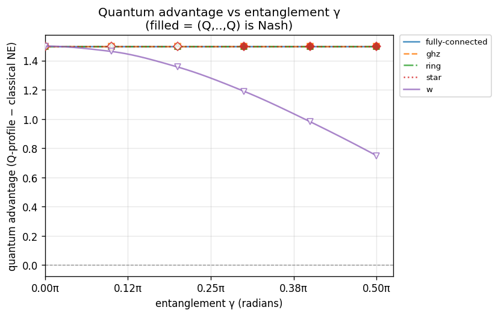
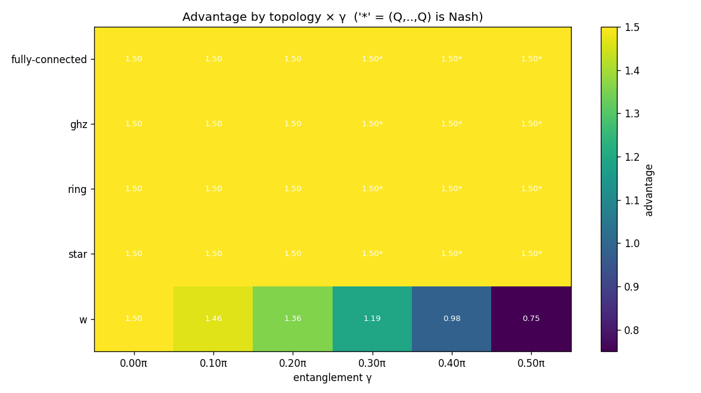

# Experiment report: gamma-sweep-N2

Quantum advantage vs entanglement γ at N=2 across ['fully-connected', 'ghz', 'ring', 'star', 'w']; γ swept 0π→0.5π (config.game.gamma)

_Generated: 2026-07-24T0405Z_

## Parameters used

```yaml
experiment:
  name: gamma-sweep-N2
  description: "Quantum advantage vs entanglement \u03B3 at N=2 across ['fully-connected',\
    \ 'ghz', 'ring', 'star', 'w']; \u03B3 swept 0\u03C0\u21920.5\u03C0 (config.game.gamma)"
generated_at: 2026-07-24T0405Z
output:
  formats:
  - md
  - json
  - csv
  - plots
cells:
- N: 2
  topology: fully-connected
  strategy_names:
  - D
  - H
  - Q
  V: 4.0
  C: 3.0
  gamma: 0.0
  gamma_label: "0\u03C0"
  strategy_mode: fixed
  noise_p: 0.0
- N: 2
  topology: fully-connected
  strategy_names:
  - D
  - H
  - Q
  V: 4.0
  C: 3.0
  gamma: 0.3141592653589793
  gamma_label: "0.1\u03C0"
  strategy_mode: fixed
  noise_p: 0.0
- N: 2
  topology: fully-connected
  strategy_names:
  - D
  - H
  - Q
  V: 4.0
  C: 3.0
  gamma: 0.6283185307179586
  gamma_label: "0.2\u03C0"
  strategy_mode: fixed
  noise_p: 0.0
- N: 2
  topology: fully-connected
  strategy_names:
  - D
  - H
  - Q
  V: 4.0
  C: 3.0
  gamma: 0.9424777960769379
  gamma_label: "0.3\u03C0"
  strategy_mode: fixed
  noise_p: 0.0
- N: 2
  topology: fully-connected
  strategy_names:
  - D
  - H
  - Q
  V: 4.0
  C: 3.0
  gamma: 1.2566370614359172
  gamma_label: "0.4\u03C0"
  strategy_mode: fixed
  noise_p: 0.0
- N: 2
  topology: fully-connected
  strategy_names:
  - D
  - H
  - Q
  V: 4.0
  C: 3.0
  gamma: 1.5707963267948966
  gamma_label: "0.5\u03C0"
  strategy_mode: fixed
  noise_p: 0.0
- N: 2
  topology: ghz
  strategy_names:
  - D
  - H
  - Q
  V: 4.0
  C: 3.0
  gamma: 0.0
  gamma_label: "0\u03C0"
  strategy_mode: fixed
  noise_p: 0.0
- N: 2
  topology: ghz
  strategy_names:
  - D
  - H
  - Q
  V: 4.0
  C: 3.0
  gamma: 0.3141592653589793
  gamma_label: "0.1\u03C0"
  strategy_mode: fixed
  noise_p: 0.0
- N: 2
  topology: ghz
  strategy_names:
  - D
  - H
  - Q
  V: 4.0
  C: 3.0
  gamma: 0.6283185307179586
  gamma_label: "0.2\u03C0"
  strategy_mode: fixed
  noise_p: 0.0
- N: 2
  topology: ghz
  strategy_names:
  - D
  - H
  - Q
  V: 4.0
  C: 3.0
  gamma: 0.9424777960769379
  gamma_label: "0.3\u03C0"
  strategy_mode: fixed
  noise_p: 0.0
- N: 2
  topology: ghz
  strategy_names:
  - D
  - H
  - Q
  V: 4.0
  C: 3.0
  gamma: 1.2566370614359172
  gamma_label: "0.4\u03C0"
  strategy_mode: fixed
  noise_p: 0.0
- N: 2
  topology: ghz
  strategy_names:
  - D
  - H
  - Q
  V: 4.0
  C: 3.0
  gamma: 1.5707963267948966
  gamma_label: "0.5\u03C0"
  strategy_mode: fixed
  noise_p: 0.0
- N: 2
  topology: ring
  strategy_names:
  - D
  - H
  - Q
  V: 4.0
  C: 3.0
  gamma: 0.0
  gamma_label: "0\u03C0"
  strategy_mode: fixed
  noise_p: 0.0
- N: 2
  topology: ring
  strategy_names:
  - D
  - H
  - Q
  V: 4.0
  C: 3.0
  gamma: 0.3141592653589793
  gamma_label: "0.1\u03C0"
  strategy_mode: fixed
  noise_p: 0.0
- N: 2
  topology: ring
  strategy_names:
  - D
  - H
  - Q
  V: 4.0
  C: 3.0
  gamma: 0.6283185307179586
  gamma_label: "0.2\u03C0"
  strategy_mode: fixed
  noise_p: 0.0
- N: 2
  topology: ring
  strategy_names:
  - D
  - H
  - Q
  V: 4.0
  C: 3.0
  gamma: 0.9424777960769379
  gamma_label: "0.3\u03C0"
  strategy_mode: fixed
  noise_p: 0.0
- N: 2
  topology: ring
  strategy_names:
  - D
  - H
  - Q
  V: 4.0
  C: 3.0
  gamma: 1.2566370614359172
  gamma_label: "0.4\u03C0"
  strategy_mode: fixed
  noise_p: 0.0
- N: 2
  topology: ring
  strategy_names:
  - D
  - H
  - Q
  V: 4.0
  C: 3.0
  gamma: 1.5707963267948966
  gamma_label: "0.5\u03C0"
  strategy_mode: fixed
  noise_p: 0.0
- N: 2
  topology: star
  strategy_names:
  - D
  - H
  - Q
  V: 4.0
  C: 3.0
  gamma: 0.0
  gamma_label: "0\u03C0"
  strategy_mode: fixed
  noise_p: 0.0
- N: 2
  topology: star
  strategy_names:
  - D
  - H
  - Q
  V: 4.0
  C: 3.0
  gamma: 0.3141592653589793
  gamma_label: "0.1\u03C0"
  strategy_mode: fixed
  noise_p: 0.0
- N: 2
  topology: star
  strategy_names:
  - D
  - H
  - Q
  V: 4.0
  C: 3.0
  gamma: 0.6283185307179586
  gamma_label: "0.2\u03C0"
  strategy_mode: fixed
  noise_p: 0.0
- N: 2
  topology: star
  strategy_names:
  - D
  - H
  - Q
  V: 4.0
  C: 3.0
  gamma: 0.9424777960769379
  gamma_label: "0.3\u03C0"
  strategy_mode: fixed
  noise_p: 0.0
- N: 2
  topology: star
  strategy_names:
  - D
  - H
  - Q
  V: 4.0
  C: 3.0
  gamma: 1.2566370614359172
  gamma_label: "0.4\u03C0"
  strategy_mode: fixed
  noise_p: 0.0
- N: 2
  topology: star
  strategy_names:
  - D
  - H
  - Q
  V: 4.0
  C: 3.0
  gamma: 1.5707963267948966
  gamma_label: "0.5\u03C0"
  strategy_mode: fixed
  noise_p: 0.0
- N: 2
  topology: w
  strategy_names:
  - D
  - H
  - Q
  V: 4.0
  C: 3.0
  gamma: 0.0
  gamma_label: "0\u03C0"
  strategy_mode: fixed
  noise_p: 0.0
- N: 2
  topology: w
  strategy_names:
  - D
  - H
  - Q
  V: 4.0
  C: 3.0
  gamma: 0.3141592653589793
  gamma_label: "0.1\u03C0"
  strategy_mode: fixed
  noise_p: 0.0
- N: 2
  topology: w
  strategy_names:
  - D
  - H
  - Q
  V: 4.0
  C: 3.0
  gamma: 0.6283185307179586
  gamma_label: "0.2\u03C0"
  strategy_mode: fixed
  noise_p: 0.0
- N: 2
  topology: w
  strategy_names:
  - D
  - H
  - Q
  V: 4.0
  C: 3.0
  gamma: 0.9424777960769379
  gamma_label: "0.3\u03C0"
  strategy_mode: fixed
  noise_p: 0.0
- N: 2
  topology: w
  strategy_names:
  - D
  - H
  - Q
  V: 4.0
  C: 3.0
  gamma: 1.2566370614359172
  gamma_label: "0.4\u03C0"
  strategy_mode: fixed
  noise_p: 0.0
- N: 2
  topology: w
  strategy_names:
  - D
  - H
  - Q
  V: 4.0
  C: 3.0
  gamma: 1.5707963267948966
  gamma_label: "0.5\u03C0"
  strategy_mode: fixed
  noise_p: 0.0
```

## Summary

| N | topology | V | C | gamma | noise_p | q_payoff | classical_ne | advantage | q_is_nash | symmetric | status |
|---|---|---|---|---|---|---|---|---|---|---|---|
| 2 | fully-connected | 4 | 3 | 0π | 0 | 2.000000 | 0.500000 | 1.500000 | **NO** | yes | ok |
| 2 | fully-connected | 4 | 3 | 0.1π | 0 | 2.000000 | 0.500000 | 1.500000 | **NO** | yes | ok |
| 2 | fully-connected | 4 | 3 | 0.2π | 0 | 2.000000 | 0.500000 | 1.500000 | **NO** | yes | ok |
| 2 | fully-connected | 4 | 3 | 0.3π | 0 | 2.000000 | 0.500000 | 1.500000 | yes | yes | ok |
| 2 | fully-connected | 4 | 3 | 0.4π | 0 | 2.000000 | 0.500000 | 1.500000 | yes | yes | ok |
| 2 | fully-connected | 4 | 3 | 0.5π | 0 | 2.000000 | 0.500000 | 1.500000 | yes | yes | ok |
| 2 | ghz | 4 | 3 | 0π | 0 | 2.000000 | 0.500000 | 1.500000 | **NO** | yes | ok |
| 2 | ghz | 4 | 3 | 0.1π | 0 | 2.000000 | 0.500000 | 1.500000 | **NO** | yes | ok |
| 2 | ghz | 4 | 3 | 0.2π | 0 | 2.000000 | 0.500000 | 1.500000 | **NO** | yes | ok |
| 2 | ghz | 4 | 3 | 0.3π | 0 | 2.000000 | 0.500000 | 1.500000 | yes | yes | ok |
| 2 | ghz | 4 | 3 | 0.4π | 0 | 2.000000 | 0.500000 | 1.500000 | yes | yes | ok |
| 2 | ghz | 4 | 3 | 0.5π | 0 | 2.000000 | 0.500000 | 1.500000 | yes | yes | ok |
| 2 | ring | 4 | 3 | 0π | 0 | 2.000000 | 0.500000 | 1.500000 | **NO** | yes | ok |
| 2 | ring | 4 | 3 | 0.1π | 0 | 2.000000 | 0.500000 | 1.500000 | **NO** | yes | ok |
| 2 | ring | 4 | 3 | 0.2π | 0 | 2.000000 | 0.500000 | 1.500000 | **NO** | yes | ok |
| 2 | ring | 4 | 3 | 0.3π | 0 | 2.000000 | 0.500000 | 1.500000 | yes | yes | ok |
| 2 | ring | 4 | 3 | 0.4π | 0 | 2.000000 | 0.500000 | 1.500000 | yes | yes | ok |
| 2 | ring | 4 | 3 | 0.5π | 0 | 2.000000 | 0.500000 | 1.500000 | yes | yes | ok |
| 2 | star | 4 | 3 | 0π | 0 | 2.000000 | 0.500000 | 1.500000 | **NO** | yes | ok |
| 2 | star | 4 | 3 | 0.1π | 0 | 2.000000 | 0.500000 | 1.500000 | **NO** | yes | ok |
| 2 | star | 4 | 3 | 0.2π | 0 | 2.000000 | 0.500000 | 1.500000 | **NO** | yes | ok |
| 2 | star | 4 | 3 | 0.3π | 0 | 2.000000 | 0.500000 | 1.500000 | yes | yes | ok |
| 2 | star | 4 | 3 | 0.4π | 0 | 2.000000 | 0.500000 | 1.500000 | yes | yes | ok |
| 2 | star | 4 | 3 | 0.5π | 0 | 2.000000 | 0.500000 | 1.500000 | yes | yes | ok |
| 2 | w | 4 | 3 | 0π | 0 | 2.000000 | 0.500000 | 1.500000 | **NO** | yes | ok |
| 2 | w | 4 | 3 | 0.1π | 0 | 2.000000 | 0.536708 | 1.463292 | **NO** | yes | ok |
| 2 | w | 4 | 3 | 0.2π | 0 | 2.000000 | 0.643237 | 1.356763 | **NO** | yes | ok |
| 2 | w | 4 | 3 | 0.3π | 0 | 2.000000 | 0.809161 | 1.190839 | **NO** | yes | ok |
| 2 | w | 4 | 3 | 0.4π | 0 | 2.000000 | 1.018237 | 0.981763 | **NO** | yes | ok |
| 2 | w | 4 | 3 | 0.5π | 0 | 2.000000 | 1.250000 | 0.750000 | **NO** | yes | ok |

## Findings

- Evaluated **30** cells: 30 ran, 0 not-implemented, 0 errored.
- Quantum advantage > 0 in **30/30** computed cells.
- (Q,...,Q) is a pure Nash equilibrium in **12/30** computed cells.

**Cells where (Q,...,Q) is NOT Nash (RQ1 finding):**
  - N=2, fully-connected, gamma=0π
  - N=2, fully-connected, gamma=0.1π
  - N=2, fully-connected, gamma=0.2π
  - N=2, ghz, gamma=0π
  - N=2, ghz, gamma=0.1π
  - N=2, ghz, gamma=0.2π
  - N=2, ring, gamma=0π
  - N=2, ring, gamma=0.1π
  - N=2, ring, gamma=0.2π
  - N=2, star, gamma=0π
  - N=2, star, gamma=0.1π
  - N=2, star, gamma=0.2π
  - N=2, w, gamma=0π
  - N=2, w, gamma=0.1π
  - N=2, w, gamma=0.2π
  - N=2, w, gamma=0.3π
  - N=2, w, gamma=0.4π
  - N=2, w, gamma=0.5π

**Entanglement (γ) thresholds** — smallest swept γ at which each series gains advantage / becomes a pure Nash equilibrium (the discovery: how much entanglement the quantum equilibrium needs):
  - fully-connected, N=2: advantage>0 from γ=0π; (Q,…,Q) Nash from γ=0.3π
  - ghz, N=2: advantage>0 from γ=0π; (Q,…,Q) Nash from γ=0.3π
  - ring, N=2: advantage>0 from γ=0π; (Q,…,Q) Nash from γ=0.3π
  - star, N=2: advantage>0 from γ=0π; (Q,…,Q) Nash from γ=0.3π
  - w, N=2: advantage>0 from γ=0π; (Q,…,Q) never Nash in range

## Plots




## Per-cell detail

### N=2 · fully-connected · gamma=0π (V=4, C=3)

- (Q,Q) mean per-player payoff: **2.000000**
- Classical NE mean payoff: **0.500000**
- Advantage (Q-profile − classical NE, mean): **1.500000**
- (Q,Q) is pure Nash: **False**
- Player-symmetric: **True**

Classical pure NE in {D,H}^N: (H,H)

All pure NE: (H,H)

Unilateral deviation table from (Q,...,Q):

| deviator | alt | dev payoff | Q payoff | Q dominates |
|---|---|---|---|---|
| player 0 | D | 2.000000 | 2.000000 | yes |
| player 0 | H | 4.000000 | 2.000000 | **NO — NASH VIOLATED** |
| player 1 | D | 2.000000 | 2.000000 | yes |
| player 1 | H | 4.000000 | 2.000000 | **NO — NASH VIOLATED** |

### N=2 · fully-connected · gamma=0.1π (V=4, C=3)

- (Q,Q) mean per-player payoff: **2.000000**
- Classical NE mean payoff: **0.500000**
- Advantage (Q-profile − classical NE, mean): **1.500000**
- (Q,Q) is pure Nash: **False**
- Player-symmetric: **True**

Classical pure NE in {D,H}^N: (H,H)

All pure NE: (H,H)

Unilateral deviation table from (Q,...,Q):

| deviator | alt | dev payoff | Q payoff | Q dominates |
|---|---|---|---|---|
| player 0 | D | 1.856763 | 2.000000 | yes |
| player 0 | H | 3.618034 | 2.000000 | **NO — NASH VIOLATED** |
| player 1 | D | 1.856763 | 2.000000 | yes |
| player 1 | H | 3.618034 | 2.000000 | **NO — NASH VIOLATED** |

### N=2 · fully-connected · gamma=0.2π (V=4, C=3)

- (Q,Q) mean per-player payoff: **2.000000**
- Classical NE mean payoff: **0.500000**
- Advantage (Q-profile − classical NE, mean): **1.500000**
- (Q,Q) is pure Nash: **False**
- Player-symmetric: **True**

Classical pure NE in {D,H}^N: (H,H)

All pure NE: (H,Q), (Q,H)

Unilateral deviation table from (Q,...,Q):

| deviator | alt | dev payoff | Q payoff | Q dominates |
|---|---|---|---|---|
| player 0 | D | 1.481763 | 2.000000 | yes |
| player 0 | H | 2.618034 | 2.000000 | **NO — NASH VIOLATED** |
| player 1 | D | 1.481763 | 2.000000 | yes |
| player 1 | H | 2.618034 | 2.000000 | **NO — NASH VIOLATED** |

### N=2 · fully-connected · gamma=0.3π (V=4, C=3)

- (Q,Q) mean per-player payoff: **2.000000**
- Classical NE mean payoff: **0.500000**
- Advantage (Q-profile − classical NE, mean): **1.500000**
- (Q,Q) is pure Nash: **True**
- Player-symmetric: **True**

Classical pure NE in {D,H}^N: (H,H)

All pure NE: (Q,Q)

Unilateral deviation table from (Q,...,Q):

| deviator | alt | dev payoff | Q payoff | Q dominates |
|---|---|---|---|---|
| player 0 | D | 1.018237 | 2.000000 | yes |
| player 0 | H | 1.381966 | 2.000000 | yes |
| player 1 | D | 1.018237 | 2.000000 | yes |
| player 1 | H | 1.381966 | 2.000000 | yes |

### N=2 · fully-connected · gamma=0.4π (V=4, C=3)

- (Q,Q) mean per-player payoff: **2.000000**
- Classical NE mean payoff: **0.500000**
- Advantage (Q-profile − classical NE, mean): **1.500000**
- (Q,Q) is pure Nash: **True**
- Player-symmetric: **True**

Classical pure NE in {D,H}^N: (H,H)

All pure NE: (Q,Q)

Unilateral deviation table from (Q,...,Q):

| deviator | alt | dev payoff | Q payoff | Q dominates |
|---|---|---|---|---|
| player 0 | D | 0.643237 | 2.000000 | yes |
| player 0 | H | 0.381966 | 2.000000 | yes |
| player 1 | D | 0.643237 | 2.000000 | yes |
| player 1 | H | 0.381966 | 2.000000 | yes |

### N=2 · fully-connected · gamma=0.5π (V=4, C=3)

- (Q,Q) mean per-player payoff: **2.000000**
- Classical NE mean payoff: **0.500000**
- Advantage (Q-profile − classical NE, mean): **1.500000**
- (Q,Q) is pure Nash: **True**
- Player-symmetric: **True**

Classical pure NE in {D,H}^N: (H,H)

All pure NE: (Q,Q)

Unilateral deviation table from (Q,...,Q):

| deviator | alt | dev payoff | Q payoff | Q dominates |
|---|---|---|---|---|
| player 0 | D | 0.500000 | 2.000000 | yes |
| player 0 | H | 0.000000 | 2.000000 | yes |
| player 1 | D | 0.500000 | 2.000000 | yes |
| player 1 | H | 0.000000 | 2.000000 | yes |

### N=2 · ghz · gamma=0π (V=4, C=3)

- (Q,Q) mean per-player payoff: **2.000000**
- Classical NE mean payoff: **0.500000**
- Advantage (Q-profile − classical NE, mean): **1.500000**
- (Q,Q) is pure Nash: **False**
- Player-symmetric: **True**

Classical pure NE in {D,H}^N: (H,H)

All pure NE: (H,H)

Unilateral deviation table from (Q,...,Q):

| deviator | alt | dev payoff | Q payoff | Q dominates |
|---|---|---|---|---|
| player 0 | D | 2.000000 | 2.000000 | yes |
| player 0 | H | 4.000000 | 2.000000 | **NO — NASH VIOLATED** |
| player 1 | D | 2.000000 | 2.000000 | yes |
| player 1 | H | 4.000000 | 2.000000 | **NO — NASH VIOLATED** |

### N=2 · ghz · gamma=0.1π (V=4, C=3)

- (Q,Q) mean per-player payoff: **2.000000**
- Classical NE mean payoff: **0.500000**
- Advantage (Q-profile − classical NE, mean): **1.500000**
- (Q,Q) is pure Nash: **False**
- Player-symmetric: **True**

Classical pure NE in {D,H}^N: (H,H)

All pure NE: (H,H)

Unilateral deviation table from (Q,...,Q):

| deviator | alt | dev payoff | Q payoff | Q dominates |
|---|---|---|---|---|
| player 0 | D | 1.856763 | 2.000000 | yes |
| player 0 | H | 3.618034 | 2.000000 | **NO — NASH VIOLATED** |
| player 1 | D | 1.856763 | 2.000000 | yes |
| player 1 | H | 3.618034 | 2.000000 | **NO — NASH VIOLATED** |

### N=2 · ghz · gamma=0.2π (V=4, C=3)

- (Q,Q) mean per-player payoff: **2.000000**
- Classical NE mean payoff: **0.500000**
- Advantage (Q-profile − classical NE, mean): **1.500000**
- (Q,Q) is pure Nash: **False**
- Player-symmetric: **True**

Classical pure NE in {D,H}^N: (H,H)

All pure NE: (H,Q), (Q,H)

Unilateral deviation table from (Q,...,Q):

| deviator | alt | dev payoff | Q payoff | Q dominates |
|---|---|---|---|---|
| player 0 | D | 1.481763 | 2.000000 | yes |
| player 0 | H | 2.618034 | 2.000000 | **NO — NASH VIOLATED** |
| player 1 | D | 1.481763 | 2.000000 | yes |
| player 1 | H | 2.618034 | 2.000000 | **NO — NASH VIOLATED** |

### N=2 · ghz · gamma=0.3π (V=4, C=3)

- (Q,Q) mean per-player payoff: **2.000000**
- Classical NE mean payoff: **0.500000**
- Advantage (Q-profile − classical NE, mean): **1.500000**
- (Q,Q) is pure Nash: **True**
- Player-symmetric: **True**

Classical pure NE in {D,H}^N: (H,H)

All pure NE: (Q,Q)

Unilateral deviation table from (Q,...,Q):

| deviator | alt | dev payoff | Q payoff | Q dominates |
|---|---|---|---|---|
| player 0 | D | 1.018237 | 2.000000 | yes |
| player 0 | H | 1.381966 | 2.000000 | yes |
| player 1 | D | 1.018237 | 2.000000 | yes |
| player 1 | H | 1.381966 | 2.000000 | yes |

### N=2 · ghz · gamma=0.4π (V=4, C=3)

- (Q,Q) mean per-player payoff: **2.000000**
- Classical NE mean payoff: **0.500000**
- Advantage (Q-profile − classical NE, mean): **1.500000**
- (Q,Q) is pure Nash: **True**
- Player-symmetric: **True**

Classical pure NE in {D,H}^N: (H,H)

All pure NE: (Q,Q)

Unilateral deviation table from (Q,...,Q):

| deviator | alt | dev payoff | Q payoff | Q dominates |
|---|---|---|---|---|
| player 0 | D | 0.643237 | 2.000000 | yes |
| player 0 | H | 0.381966 | 2.000000 | yes |
| player 1 | D | 0.643237 | 2.000000 | yes |
| player 1 | H | 0.381966 | 2.000000 | yes |

### N=2 · ghz · gamma=0.5π (V=4, C=3)

- (Q,Q) mean per-player payoff: **2.000000**
- Classical NE mean payoff: **0.500000**
- Advantage (Q-profile − classical NE, mean): **1.500000**
- (Q,Q) is pure Nash: **True**
- Player-symmetric: **True**

Classical pure NE in {D,H}^N: (H,H)

All pure NE: (Q,Q)

Unilateral deviation table from (Q,...,Q):

| deviator | alt | dev payoff | Q payoff | Q dominates |
|---|---|---|---|---|
| player 0 | D | 0.500000 | 2.000000 | yes |
| player 0 | H | 0.000000 | 2.000000 | yes |
| player 1 | D | 0.500000 | 2.000000 | yes |
| player 1 | H | 0.000000 | 2.000000 | yes |

### N=2 · ring · gamma=0π (V=4, C=3)

- (Q,Q) mean per-player payoff: **2.000000**
- Classical NE mean payoff: **0.500000**
- Advantage (Q-profile − classical NE, mean): **1.500000**
- (Q,Q) is pure Nash: **False**
- Player-symmetric: **True**

Classical pure NE in {D,H}^N: (H,H)

All pure NE: (H,H)

Unilateral deviation table from (Q,...,Q):

| deviator | alt | dev payoff | Q payoff | Q dominates |
|---|---|---|---|---|
| player 0 | D | 2.000000 | 2.000000 | yes |
| player 0 | H | 4.000000 | 2.000000 | **NO — NASH VIOLATED** |
| player 1 | D | 2.000000 | 2.000000 | yes |
| player 1 | H | 4.000000 | 2.000000 | **NO — NASH VIOLATED** |

### N=2 · ring · gamma=0.1π (V=4, C=3)

- (Q,Q) mean per-player payoff: **2.000000**
- Classical NE mean payoff: **0.500000**
- Advantage (Q-profile − classical NE, mean): **1.500000**
- (Q,Q) is pure Nash: **False**
- Player-symmetric: **True**

Classical pure NE in {D,H}^N: (H,H)

All pure NE: (H,H)

Unilateral deviation table from (Q,...,Q):

| deviator | alt | dev payoff | Q payoff | Q dominates |
|---|---|---|---|---|
| player 0 | D | 1.856763 | 2.000000 | yes |
| player 0 | H | 3.618034 | 2.000000 | **NO — NASH VIOLATED** |
| player 1 | D | 1.856763 | 2.000000 | yes |
| player 1 | H | 3.618034 | 2.000000 | **NO — NASH VIOLATED** |

### N=2 · ring · gamma=0.2π (V=4, C=3)

- (Q,Q) mean per-player payoff: **2.000000**
- Classical NE mean payoff: **0.500000**
- Advantage (Q-profile − classical NE, mean): **1.500000**
- (Q,Q) is pure Nash: **False**
- Player-symmetric: **True**

Classical pure NE in {D,H}^N: (H,H)

All pure NE: (H,Q), (Q,H)

Unilateral deviation table from (Q,...,Q):

| deviator | alt | dev payoff | Q payoff | Q dominates |
|---|---|---|---|---|
| player 0 | D | 1.481763 | 2.000000 | yes |
| player 0 | H | 2.618034 | 2.000000 | **NO — NASH VIOLATED** |
| player 1 | D | 1.481763 | 2.000000 | yes |
| player 1 | H | 2.618034 | 2.000000 | **NO — NASH VIOLATED** |

### N=2 · ring · gamma=0.3π (V=4, C=3)

- (Q,Q) mean per-player payoff: **2.000000**
- Classical NE mean payoff: **0.500000**
- Advantage (Q-profile − classical NE, mean): **1.500000**
- (Q,Q) is pure Nash: **True**
- Player-symmetric: **True**

Classical pure NE in {D,H}^N: (H,H)

All pure NE: (Q,Q)

Unilateral deviation table from (Q,...,Q):

| deviator | alt | dev payoff | Q payoff | Q dominates |
|---|---|---|---|---|
| player 0 | D | 1.018237 | 2.000000 | yes |
| player 0 | H | 1.381966 | 2.000000 | yes |
| player 1 | D | 1.018237 | 2.000000 | yes |
| player 1 | H | 1.381966 | 2.000000 | yes |

### N=2 · ring · gamma=0.4π (V=4, C=3)

- (Q,Q) mean per-player payoff: **2.000000**
- Classical NE mean payoff: **0.500000**
- Advantage (Q-profile − classical NE, mean): **1.500000**
- (Q,Q) is pure Nash: **True**
- Player-symmetric: **True**

Classical pure NE in {D,H}^N: (H,H)

All pure NE: (Q,Q)

Unilateral deviation table from (Q,...,Q):

| deviator | alt | dev payoff | Q payoff | Q dominates |
|---|---|---|---|---|
| player 0 | D | 0.643237 | 2.000000 | yes |
| player 0 | H | 0.381966 | 2.000000 | yes |
| player 1 | D | 0.643237 | 2.000000 | yes |
| player 1 | H | 0.381966 | 2.000000 | yes |

### N=2 · ring · gamma=0.5π (V=4, C=3)

- (Q,Q) mean per-player payoff: **2.000000**
- Classical NE mean payoff: **0.500000**
- Advantage (Q-profile − classical NE, mean): **1.500000**
- (Q,Q) is pure Nash: **True**
- Player-symmetric: **True**

Classical pure NE in {D,H}^N: (H,H)

All pure NE: (Q,Q)

Unilateral deviation table from (Q,...,Q):

| deviator | alt | dev payoff | Q payoff | Q dominates |
|---|---|---|---|---|
| player 0 | D | 0.500000 | 2.000000 | yes |
| player 0 | H | 0.000000 | 2.000000 | yes |
| player 1 | D | 0.500000 | 2.000000 | yes |
| player 1 | H | 0.000000 | 2.000000 | yes |

### N=2 · star · gamma=0π (V=4, C=3)

- (Q,Q) mean per-player payoff: **2.000000**
- Classical NE mean payoff: **0.500000**
- Advantage (Q-profile − classical NE, mean): **1.500000**
- (Q,Q) is pure Nash: **False**
- Player-symmetric: **True**

Classical pure NE in {D,H}^N: (H,H)

All pure NE: (H,H)

Unilateral deviation table from (Q,...,Q):

| deviator | alt | dev payoff | Q payoff | Q dominates |
|---|---|---|---|---|
| player 0 | D | 2.000000 | 2.000000 | yes |
| player 0 | H | 4.000000 | 2.000000 | **NO — NASH VIOLATED** |
| player 1 | D | 2.000000 | 2.000000 | yes |
| player 1 | H | 4.000000 | 2.000000 | **NO — NASH VIOLATED** |

### N=2 · star · gamma=0.1π (V=4, C=3)

- (Q,Q) mean per-player payoff: **2.000000**
- Classical NE mean payoff: **0.500000**
- Advantage (Q-profile − classical NE, mean): **1.500000**
- (Q,Q) is pure Nash: **False**
- Player-symmetric: **True**

Classical pure NE in {D,H}^N: (H,H)

All pure NE: (H,H)

Unilateral deviation table from (Q,...,Q):

| deviator | alt | dev payoff | Q payoff | Q dominates |
|---|---|---|---|---|
| player 0 | D | 1.856763 | 2.000000 | yes |
| player 0 | H | 3.618034 | 2.000000 | **NO — NASH VIOLATED** |
| player 1 | D | 1.856763 | 2.000000 | yes |
| player 1 | H | 3.618034 | 2.000000 | **NO — NASH VIOLATED** |

### N=2 · star · gamma=0.2π (V=4, C=3)

- (Q,Q) mean per-player payoff: **2.000000**
- Classical NE mean payoff: **0.500000**
- Advantage (Q-profile − classical NE, mean): **1.500000**
- (Q,Q) is pure Nash: **False**
- Player-symmetric: **True**

Classical pure NE in {D,H}^N: (H,H)

All pure NE: (H,Q), (Q,H)

Unilateral deviation table from (Q,...,Q):

| deviator | alt | dev payoff | Q payoff | Q dominates |
|---|---|---|---|---|
| player 0 | D | 1.481763 | 2.000000 | yes |
| player 0 | H | 2.618034 | 2.000000 | **NO — NASH VIOLATED** |
| player 1 | D | 1.481763 | 2.000000 | yes |
| player 1 | H | 2.618034 | 2.000000 | **NO — NASH VIOLATED** |

### N=2 · star · gamma=0.3π (V=4, C=3)

- (Q,Q) mean per-player payoff: **2.000000**
- Classical NE mean payoff: **0.500000**
- Advantage (Q-profile − classical NE, mean): **1.500000**
- (Q,Q) is pure Nash: **True**
- Player-symmetric: **True**

Classical pure NE in {D,H}^N: (H,H)

All pure NE: (Q,Q)

Unilateral deviation table from (Q,...,Q):

| deviator | alt | dev payoff | Q payoff | Q dominates |
|---|---|---|---|---|
| player 0 | D | 1.018237 | 2.000000 | yes |
| player 0 | H | 1.381966 | 2.000000 | yes |
| player 1 | D | 1.018237 | 2.000000 | yes |
| player 1 | H | 1.381966 | 2.000000 | yes |

### N=2 · star · gamma=0.4π (V=4, C=3)

- (Q,Q) mean per-player payoff: **2.000000**
- Classical NE mean payoff: **0.500000**
- Advantage (Q-profile − classical NE, mean): **1.500000**
- (Q,Q) is pure Nash: **True**
- Player-symmetric: **True**

Classical pure NE in {D,H}^N: (H,H)

All pure NE: (Q,Q)

Unilateral deviation table from (Q,...,Q):

| deviator | alt | dev payoff | Q payoff | Q dominates |
|---|---|---|---|---|
| player 0 | D | 0.643237 | 2.000000 | yes |
| player 0 | H | 0.381966 | 2.000000 | yes |
| player 1 | D | 0.643237 | 2.000000 | yes |
| player 1 | H | 0.381966 | 2.000000 | yes |

### N=2 · star · gamma=0.5π (V=4, C=3)

- (Q,Q) mean per-player payoff: **2.000000**
- Classical NE mean payoff: **0.500000**
- Advantage (Q-profile − classical NE, mean): **1.500000**
- (Q,Q) is pure Nash: **True**
- Player-symmetric: **True**

Classical pure NE in {D,H}^N: (H,H)

All pure NE: (Q,Q)

Unilateral deviation table from (Q,...,Q):

| deviator | alt | dev payoff | Q payoff | Q dominates |
|---|---|---|---|---|
| player 0 | D | 0.500000 | 2.000000 | yes |
| player 0 | H | 0.000000 | 2.000000 | yes |
| player 1 | D | 0.500000 | 2.000000 | yes |
| player 1 | H | 0.000000 | 2.000000 | yes |

### N=2 · w · gamma=0π (V=4, C=3)

- (Q,Q) mean per-player payoff: **2.000000**
- Classical NE mean payoff: **0.500000**
- Advantage (Q-profile − classical NE, mean): **1.500000**
- (Q,Q) is pure Nash: **False**
- Player-symmetric: **True**

Classical pure NE in {D,H}^N: (H,H)

All pure NE: (H,H)

Unilateral deviation table from (Q,...,Q):

| deviator | alt | dev payoff | Q payoff | Q dominates |
|---|---|---|---|---|
| player 0 | D | 2.000000 | 2.000000 | yes |
| player 0 | H | 4.000000 | 2.000000 | **NO — NASH VIOLATED** |
| player 1 | D | 2.000000 | 2.000000 | yes |
| player 1 | H | 4.000000 | 2.000000 | **NO — NASH VIOLATED** |

### N=2 · w · gamma=0.1π (V=4, C=3)

- (Q,Q) mean per-player payoff: **2.000000**
- Classical NE mean payoff: **0.536708**
- Advantage (Q-profile − classical NE, mean): **1.463292**
- (Q,Q) is pure Nash: **False**
- Player-symmetric: **True**

Classical pure NE in {D,H}^N: (H,H)

All pure NE: (H,H)

Unilateral deviation table from (Q,...,Q):

| deviator | alt | dev payoff | Q payoff | Q dominates |
|---|---|---|---|---|
| player 0 | D | 1.904508 | 2.000000 | yes |
| player 0 | H | 3.932703 | 2.000000 | **NO — NASH VIOLATED** |
| player 1 | D | 1.904508 | 2.000000 | yes |
| player 1 | H | 3.932703 | 2.000000 | **NO — NASH VIOLATED** |

### N=2 · w · gamma=0.2π (V=4, C=3)

- (Q,Q) mean per-player payoff: **2.000000**
- Classical NE mean payoff: **0.643237**
- Advantage (Q-profile − classical NE, mean): **1.356763**
- (Q,Q) is pure Nash: **False**
- Player-symmetric: **True**

Classical pure NE in {D,H}^N: (H,H)

All pure NE: (H,H)

Unilateral deviation table from (Q,...,Q):

| deviator | alt | dev payoff | Q payoff | Q dominates |
|---|---|---|---|---|
| player 0 | D | 1.654508 | 2.000000 | yes |
| player 0 | H | 3.737398 | 2.000000 | **NO — NASH VIOLATED** |
| player 1 | D | 1.654508 | 2.000000 | yes |
| player 1 | H | 3.737398 | 2.000000 | **NO — NASH VIOLATED** |

### N=2 · w · gamma=0.3π (V=4, C=3)

- (Q,Q) mean per-player payoff: **2.000000**
- Classical NE mean payoff: **0.809161**
- Advantage (Q-profile − classical NE, mean): **1.190839**
- (Q,Q) is pure Nash: **False**
- Player-symmetric: **True**

Classical pure NE in {D,H}^N: (H,H)

All pure NE: (H,H)

Unilateral deviation table from (Q,...,Q):

| deviator | alt | dev payoff | Q payoff | Q dominates |
|---|---|---|---|---|
| player 0 | D | 1.345492 | 2.000000 | yes |
| player 0 | H | 3.433205 | 2.000000 | **NO — NASH VIOLATED** |
| player 1 | D | 1.345492 | 2.000000 | yes |
| player 1 | H | 3.433205 | 2.000000 | **NO — NASH VIOLATED** |

### N=2 · w · gamma=0.4π (V=4, C=3)

- (Q,Q) mean per-player payoff: **2.000000**
- Classical NE mean payoff: **1.018237**
- Advantage (Q-profile − classical NE, mean): **0.981763**
- (Q,Q) is pure Nash: **False**
- Player-symmetric: **True**

Classical pure NE in {D,H}^N: (H,H)

All pure NE: (H,H)

Unilateral deviation table from (Q,...,Q):

| deviator | alt | dev payoff | Q payoff | Q dominates |
|---|---|---|---|---|
| player 0 | D | 1.095492 | 2.000000 | yes |
| player 0 | H | 3.049898 | 2.000000 | **NO — NASH VIOLATED** |
| player 1 | D | 1.095492 | 2.000000 | yes |
| player 1 | H | 3.049898 | 2.000000 | **NO — NASH VIOLATED** |

### N=2 · w · gamma=0.5π (V=4, C=3)

- (Q,Q) mean per-player payoff: **2.000000**
- Classical NE mean payoff: **1.250000**
- Advantage (Q-profile − classical NE, mean): **0.750000**
- (Q,Q) is pure Nash: **False**
- Player-symmetric: **True**

Classical pure NE in {D,H}^N: (H,H)

All pure NE: (H,H)

Unilateral deviation table from (Q,...,Q):

| deviator | alt | dev payoff | Q payoff | Q dominates |
|---|---|---|---|---|
| player 0 | D | 1.000000 | 2.000000 | yes |
| player 0 | H | 2.625000 | 2.000000 | **NO — NASH VIOLATED** |
| player 1 | D | 1.000000 | 2.000000 | yes |
| player 1 | H | 2.625000 | 2.000000 | **NO — NASH VIOLATED** |

## Data files

- `results.json` — full structured results
- `results.csv` — one row per cell
- `config.snapshot.yaml` — exact parameters used
