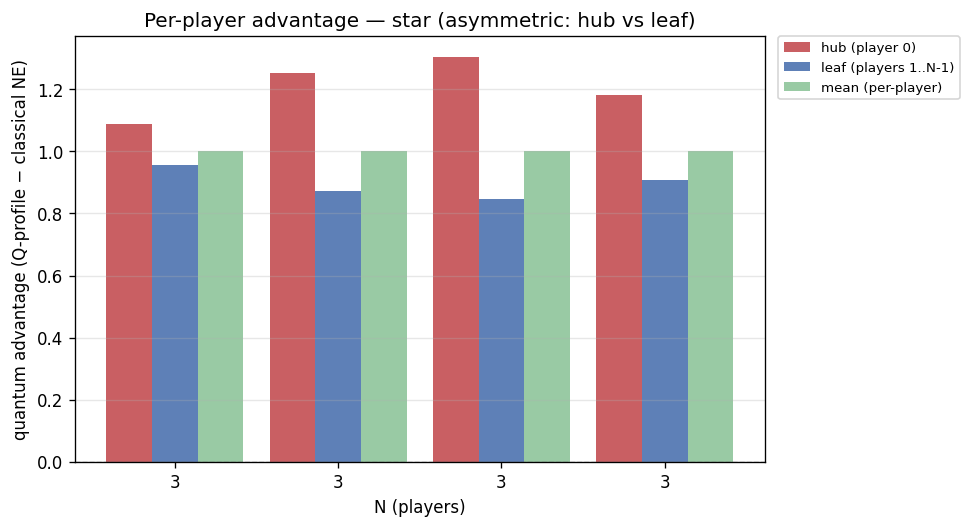
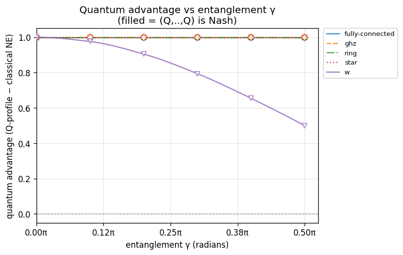
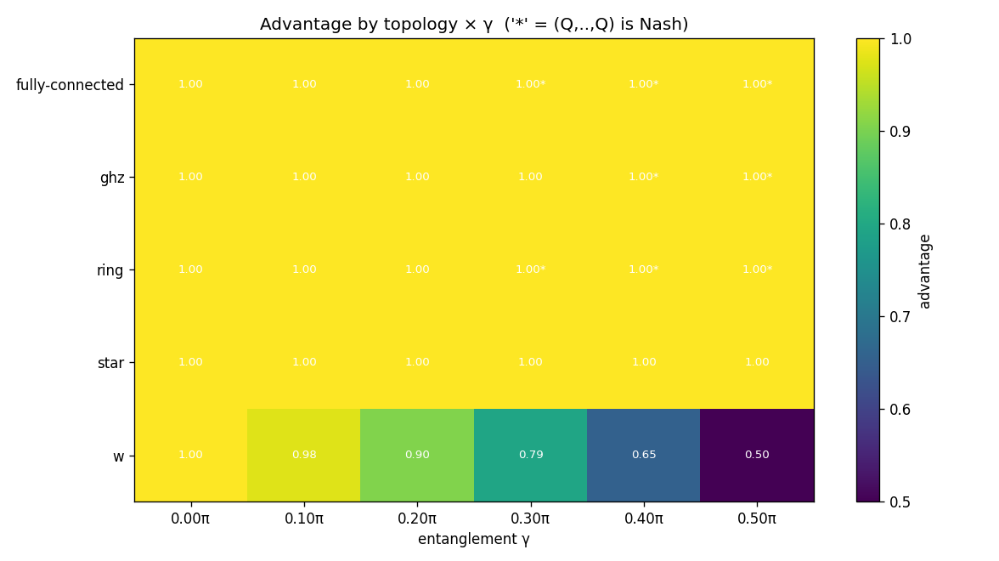

# Experiment report: gamma-sweep-N3

Quantum advantage vs entanglement γ at N=3 across ['fully-connected', 'ghz', 'ring', 'star', 'w']; γ swept 0π→0.5π (config.game.gamma)

_Generated: 2026-07-19T0821Z_

## Parameters used

```yaml
experiment:
  name: gamma-sweep-N3
  description: "Quantum advantage vs entanglement \u03B3 at N=3 across ['fully-connected',\
    \ 'ghz', 'ring', 'star', 'w']; \u03B3 swept 0\u03C0\u21920.5\u03C0 (config.game.gamma)"
generated_at: 2026-07-19T0821Z
output:
  formats:
  - md
  - json
  - csv
  - plots
cells:
- N: 3
  topology: fully-connected
  strategy_names:
  - D
  - H
  - Q
  V: 4.0
  C: 3.0
  gamma: 0.0
  gamma_label: "0\u03C0"
  strategy_mode: fixed
  noise_p: 0.0
- N: 3
  topology: fully-connected
  strategy_names:
  - D
  - H
  - Q
  V: 4.0
  C: 3.0
  gamma: 0.3141592653589793
  gamma_label: "0.1\u03C0"
  strategy_mode: fixed
  noise_p: 0.0
- N: 3
  topology: fully-connected
  strategy_names:
  - D
  - H
  - Q
  V: 4.0
  C: 3.0
  gamma: 0.6283185307179586
  gamma_label: "0.2\u03C0"
  strategy_mode: fixed
  noise_p: 0.0
- N: 3
  topology: fully-connected
  strategy_names:
  - D
  - H
  - Q
  V: 4.0
  C: 3.0
  gamma: 0.9424777960769379
  gamma_label: "0.3\u03C0"
  strategy_mode: fixed
  noise_p: 0.0
- N: 3
  topology: fully-connected
  strategy_names:
  - D
  - H
  - Q
  V: 4.0
  C: 3.0
  gamma: 1.2566370614359172
  gamma_label: "0.4\u03C0"
  strategy_mode: fixed
  noise_p: 0.0
- N: 3
  topology: fully-connected
  strategy_names:
  - D
  - H
  - Q
  V: 4.0
  C: 3.0
  gamma: 1.5707963267948966
  gamma_label: "0.5\u03C0"
  strategy_mode: fixed
  noise_p: 0.0
- N: 3
  topology: ghz
  strategy_names:
  - D
  - H
  - Q
  V: 4.0
  C: 3.0
  gamma: 0.0
  gamma_label: "0\u03C0"
  strategy_mode: fixed
  noise_p: 0.0
- N: 3
  topology: ghz
  strategy_names:
  - D
  - H
  - Q
  V: 4.0
  C: 3.0
  gamma: 0.3141592653589793
  gamma_label: "0.1\u03C0"
  strategy_mode: fixed
  noise_p: 0.0
- N: 3
  topology: ghz
  strategy_names:
  - D
  - H
  - Q
  V: 4.0
  C: 3.0
  gamma: 0.6283185307179586
  gamma_label: "0.2\u03C0"
  strategy_mode: fixed
  noise_p: 0.0
- N: 3
  topology: ghz
  strategy_names:
  - D
  - H
  - Q
  V: 4.0
  C: 3.0
  gamma: 0.9424777960769379
  gamma_label: "0.3\u03C0"
  strategy_mode: fixed
  noise_p: 0.0
- N: 3
  topology: ghz
  strategy_names:
  - D
  - H
  - Q
  V: 4.0
  C: 3.0
  gamma: 1.2566370614359172
  gamma_label: "0.4\u03C0"
  strategy_mode: fixed
  noise_p: 0.0
- N: 3
  topology: ghz
  strategy_names:
  - D
  - H
  - Q
  V: 4.0
  C: 3.0
  gamma: 1.5707963267948966
  gamma_label: "0.5\u03C0"
  strategy_mode: fixed
  noise_p: 0.0
- N: 3
  topology: ring
  strategy_names:
  - D
  - H
  - Q
  V: 4.0
  C: 3.0
  gamma: 0.0
  gamma_label: "0\u03C0"
  strategy_mode: fixed
  noise_p: 0.0
- N: 3
  topology: ring
  strategy_names:
  - D
  - H
  - Q
  V: 4.0
  C: 3.0
  gamma: 0.3141592653589793
  gamma_label: "0.1\u03C0"
  strategy_mode: fixed
  noise_p: 0.0
- N: 3
  topology: ring
  strategy_names:
  - D
  - H
  - Q
  V: 4.0
  C: 3.0
  gamma: 0.6283185307179586
  gamma_label: "0.2\u03C0"
  strategy_mode: fixed
  noise_p: 0.0
- N: 3
  topology: ring
  strategy_names:
  - D
  - H
  - Q
  V: 4.0
  C: 3.0
  gamma: 0.9424777960769379
  gamma_label: "0.3\u03C0"
  strategy_mode: fixed
  noise_p: 0.0
- N: 3
  topology: ring
  strategy_names:
  - D
  - H
  - Q
  V: 4.0
  C: 3.0
  gamma: 1.2566370614359172
  gamma_label: "0.4\u03C0"
  strategy_mode: fixed
  noise_p: 0.0
- N: 3
  topology: ring
  strategy_names:
  - D
  - H
  - Q
  V: 4.0
  C: 3.0
  gamma: 1.5707963267948966
  gamma_label: "0.5\u03C0"
  strategy_mode: fixed
  noise_p: 0.0
- N: 3
  topology: star
  strategy_names:
  - D
  - H
  - Q
  V: 4.0
  C: 3.0
  gamma: 0.0
  gamma_label: "0\u03C0"
  strategy_mode: fixed
  noise_p: 0.0
- N: 3
  topology: star
  strategy_names:
  - D
  - H
  - Q
  V: 4.0
  C: 3.0
  gamma: 0.3141592653589793
  gamma_label: "0.1\u03C0"
  strategy_mode: fixed
  noise_p: 0.0
- N: 3
  topology: star
  strategy_names:
  - D
  - H
  - Q
  V: 4.0
  C: 3.0
  gamma: 0.6283185307179586
  gamma_label: "0.2\u03C0"
  strategy_mode: fixed
  noise_p: 0.0
- N: 3
  topology: star
  strategy_names:
  - D
  - H
  - Q
  V: 4.0
  C: 3.0
  gamma: 0.9424777960769379
  gamma_label: "0.3\u03C0"
  strategy_mode: fixed
  noise_p: 0.0
- N: 3
  topology: star
  strategy_names:
  - D
  - H
  - Q
  V: 4.0
  C: 3.0
  gamma: 1.2566370614359172
  gamma_label: "0.4\u03C0"
  strategy_mode: fixed
  noise_p: 0.0
- N: 3
  topology: star
  strategy_names:
  - D
  - H
  - Q
  V: 4.0
  C: 3.0
  gamma: 1.5707963267948966
  gamma_label: "0.5\u03C0"
  strategy_mode: fixed
  noise_p: 0.0
- N: 3
  topology: w
  strategy_names:
  - D
  - H
  - Q
  V: 4.0
  C: 3.0
  gamma: 0.0
  gamma_label: "0\u03C0"
  strategy_mode: fixed
  noise_p: 0.0
- N: 3
  topology: w
  strategy_names:
  - D
  - H
  - Q
  V: 4.0
  C: 3.0
  gamma: 0.3141592653589793
  gamma_label: "0.1\u03C0"
  strategy_mode: fixed
  noise_p: 0.0
- N: 3
  topology: w
  strategy_names:
  - D
  - H
  - Q
  V: 4.0
  C: 3.0
  gamma: 0.6283185307179586
  gamma_label: "0.2\u03C0"
  strategy_mode: fixed
  noise_p: 0.0
- N: 3
  topology: w
  strategy_names:
  - D
  - H
  - Q
  V: 4.0
  C: 3.0
  gamma: 0.9424777960769379
  gamma_label: "0.3\u03C0"
  strategy_mode: fixed
  noise_p: 0.0
- N: 3
  topology: w
  strategy_names:
  - D
  - H
  - Q
  V: 4.0
  C: 3.0
  gamma: 1.2566370614359172
  gamma_label: "0.4\u03C0"
  strategy_mode: fixed
  noise_p: 0.0
- N: 3
  topology: w
  strategy_names:
  - D
  - H
  - Q
  V: 4.0
  C: 3.0
  gamma: 1.5707963267948966
  gamma_label: "0.5\u03C0"
  strategy_mode: fixed
  noise_p: 0.0
```

## Summary

| N | topology | V | C | gamma | noise_p | q_payoff | classical_ne | advantage | q_is_nash | symmetric | status |
|---|---|---|---|---|---|---|---|---|---|---|---|
| 3 | fully-connected | 4 | 3 | 0π | 0 | 1.333333 | 0.333333 | 1.000000 | **NO** | yes | ok |
| 3 | fully-connected | 4 | 3 | 0.1π | 0 | 1.333333 | 0.333333 | 1.000000 | **NO** | yes | ok |
| 3 | fully-connected | 4 | 3 | 0.2π | 0 | 1.333333 | 0.333333 | 1.000000 | **NO** | yes | ok |
| 3 | fully-connected | 4 | 3 | 0.3π | 0 | 1.333333 | 0.333333 | 1.000000 | yes | yes | ok |
| 3 | fully-connected | 4 | 3 | 0.4π | 0 | 1.333333 | 0.333333 | 1.000000 | yes | yes | ok |
| 3 | fully-connected | 4 | 3 | 0.5π | 0 | 1.333333 | 0.333333 | 1.000000 | yes | yes | ok |
| 3 | ghz | 4 | 3 | 0π | 0 | 1.333333 | 0.333333 | 1.000000 | **NO** | yes | ok |
| 3 | ghz | 4 | 3 | 0.1π | 0 | 1.333333 | 0.333333 | 1.000000 | **NO** | yes | ok |
| 3 | ghz | 4 | 3 | 0.2π | 0 | 1.333333 | 0.333333 | 1.000000 | **NO** | yes | ok |
| 3 | ghz | 4 | 3 | 0.3π | 0 | 1.333333 | 0.333333 | 1.000000 | **NO** | yes | ok |
| 3 | ghz | 4 | 3 | 0.4π | 0 | 1.333333 | 0.333333 | 1.000000 | yes | yes | ok |
| 3 | ghz | 4 | 3 | 0.5π | 0 | 1.333333 | 0.333333 | 1.000000 | yes | yes | ok |
| 3 | ring | 4 | 3 | 0π | 0 | 1.333333 | 0.333333 | 1.000000 | **NO** | yes | ok |
| 3 | ring | 4 | 3 | 0.1π | 0 | 1.333333 | 0.333333 | 1.000000 | **NO** | yes | ok |
| 3 | ring | 4 | 3 | 0.2π | 0 | 1.333333 | 0.333333 | 1.000000 | **NO** | yes | ok |
| 3 | ring | 4 | 3 | 0.3π | 0 | 1.333333 | 0.333333 | 1.000000 | yes | yes | ok |
| 3 | ring | 4 | 3 | 0.4π | 0 | 1.333333 | 0.333333 | 1.000000 | yes | yes | ok |
| 3 | ring | 4 | 3 | 0.5π | 0 | 1.333333 | 0.333333 | 1.000000 | yes | yes | ok |
| 3 | star | 4 | 3 | 0π | 0 | 1.333333 | 0.333333 | 1.000000 | **NO** | yes | ok |
| 3 | star | 4 | 3 | 0.1π | 0 | 1.333333 | 0.333333 | 1.000000 | **NO** | no | ok |
| 3 | star | 4 | 3 | 0.2π | 0 | 1.333333 | 0.333333 | 1.000000 | **NO** | no | ok |
| 3 | star | 4 | 3 | 0.3π | 0 | 1.333333 | 0.333333 | 1.000000 | **NO** | no | ok |
| 3 | star | 4 | 3 | 0.4π | 0 | 1.333333 | 0.333333 | 1.000000 | **NO** | no | ok |
| 3 | star | 4 | 3 | 0.5π | 0 | 1.333333 | 0.333333 | 1.000000 | **NO** | yes | ok |
| 3 | w | 4 | 3 | 0π | 0 | 1.333333 | 0.333333 | 1.000000 | **NO** | yes | ok |
| 3 | w | 4 | 3 | 0.1π | 0 | 1.333333 | 0.357805 | 0.975528 | **NO** | yes | ok |
| 3 | w | 4 | 3 | 0.2π | 0 | 1.333333 | 0.428825 | 0.904508 | **NO** | yes | ok |
| 3 | w | 4 | 3 | 0.3π | 0 | 1.333333 | 0.539441 | 0.793893 | **NO** | yes | ok |
| 3 | w | 4 | 3 | 0.4π | 0 | 1.333333 | 0.678825 | 0.654508 | **NO** | yes | ok |
| 3 | w | 4 | 3 | 0.5π | 0 | 1.333333 | 0.833333 | 0.500000 | **NO** | yes | ok |

## Findings

- Evaluated **30** cells: 30 ran, 0 not-implemented, 0 errored.
- Quantum advantage > 0 in **30/30** computed cells.
- (Q,...,Q) is a pure Nash equilibrium in **8/30** computed cells.

**Cells where (Q,...,Q) is NOT Nash (RQ1 finding):**
  - N=3, fully-connected, gamma=0π
  - N=3, fully-connected, gamma=0.1π
  - N=3, fully-connected, gamma=0.2π
  - N=3, ghz, gamma=0π
  - N=3, ghz, gamma=0.1π
  - N=3, ghz, gamma=0.2π
  - N=3, ghz, gamma=0.3π
  - N=3, ring, gamma=0π
  - N=3, ring, gamma=0.1π
  - N=3, ring, gamma=0.2π
  - N=3, star, gamma=0π
  - N=3, star, gamma=0.1π
  - N=3, star, gamma=0.2π
  - N=3, star, gamma=0.3π
  - N=3, star, gamma=0.4π
  - N=3, star, gamma=0.5π
  - N=3, w, gamma=0π
  - N=3, w, gamma=0.1π
  - N=3, w, gamma=0.2π
  - N=3, w, gamma=0.3π
  - N=3, w, gamma=0.4π
  - N=3, w, gamma=0.5π

**Entanglement (γ) thresholds** — smallest swept γ at which each series gains advantage / becomes a pure Nash equilibrium (the discovery: how much entanglement the quantum equilibrium needs):
  - fully-connected, N=3: advantage>0 from γ=0π; (Q,…,Q) Nash from γ=0.3π
  - ghz, N=3: advantage>0 from γ=0π; (Q,…,Q) Nash from γ=0.4π
  - ring, N=3: advantage>0 from γ=0π; (Q,…,Q) Nash from γ=0.3π
  - star, N=3: advantage>0 from γ=0π; (Q,…,Q) never Nash in range
  - w, N=3: advantage>0 from γ=0π; (Q,…,Q) never Nash in range

## Plots





## Per-cell detail

### N=3 · fully-connected · gamma=0π (V=4, C=3)

- (Q,Q,Q) mean per-player payoff: **1.333333**
- Classical NE mean payoff: **0.333333**
- Advantage (Q-profile − classical NE, mean): **1.000000**
- (Q,Q,Q) is pure Nash: **False**
- Player-symmetric: **True**

Classical pure NE in {D,H}^N: (H,H,H)

All pure NE: (H,H,H)

Unilateral deviation table from (Q,...,Q):

| deviator | alt | dev payoff | Q payoff | Q dominates |
|---|---|---|---|---|
| player 0 | D | 1.333333 | 1.333333 | yes |
| player 0 | H | 4.000000 | 1.333333 | **NO — NASH VIOLATED** |
| player 1 | D | 1.333333 | 1.333333 | yes |
| player 1 | H | 4.000000 | 1.333333 | **NO — NASH VIOLATED** |
| player 2 | D | 1.333333 | 1.333333 | yes |
| player 2 | H | 4.000000 | 1.333333 | **NO — NASH VIOLATED** |

### N=3 · fully-connected · gamma=0.1π (V=4, C=3)

- (Q,Q,Q) mean per-player payoff: **1.333333**
- Classical NE mean payoff: **0.333333**
- Advantage (Q-profile − classical NE, mean): **1.000000**
- (Q,Q,Q) is pure Nash: **False**
- Player-symmetric: **True**

Classical pure NE in {D,H}^N: (H,H,H)

All pure NE: (H,H,H)

Unilateral deviation table from (Q,...,Q):

| deviator | alt | dev payoff | Q payoff | Q dominates |
|---|---|---|---|---|
| player 0 | D | 1.255861 | 1.333333 | yes |
| player 0 | H | 3.223904 | 1.333333 | **NO — NASH VIOLATED** |
| player 1 | D | 1.255861 | 1.333333 | yes |
| player 1 | H | 3.223904 | 1.333333 | **NO — NASH VIOLATED** |
| player 2 | D | 1.255861 | 1.333333 | yes |
| player 2 | H | 3.223904 | 1.333333 | **NO — NASH VIOLATED** |

### N=3 · fully-connected · gamma=0.2π (V=4, C=3)

- (Q,Q,Q) mean per-player payoff: **1.333333**
- Classical NE mean payoff: **0.333333**
- Advantage (Q-profile − classical NE, mean): **1.000000**
- (Q,Q,Q) is pure Nash: **False**
- Player-symmetric: **True**

Classical pure NE in {D,H}^N: (H,H,H)

All pure NE: (H,H,Q), (H,Q,H), (Q,H,H)

Unilateral deviation table from (Q,...,Q):

| deviator | alt | dev payoff | Q payoff | Q dominates |
|---|---|---|---|---|
| player 0 | D | 0.846811 | 1.333333 | yes |
| player 0 | H | 1.667292 | 1.333333 | **NO — NASH VIOLATED** |
| player 1 | D | 0.846811 | 1.333333 | yes |
| player 1 | H | 1.667292 | 1.333333 | **NO — NASH VIOLATED** |
| player 2 | D | 0.846811 | 1.333333 | yes |
| player 2 | H | 1.667292 | 1.333333 | **NO — NASH VIOLATED** |

### N=3 · fully-connected · gamma=0.3π (V=4, C=3)

- (Q,Q,Q) mean per-player payoff: **1.333333**
- Classical NE mean payoff: **0.333333**
- Advantage (Q-profile − classical NE, mean): **1.000000**
- (Q,Q,Q) is pure Nash: **True**
- Player-symmetric: **True**

Classical pure NE in {D,H}^N: (H,H,H)

All pure NE: (H,H,Q), (H,Q,H), (Q,H,H), (Q,Q,Q)

Unilateral deviation table from (Q,...,Q):

| deviator | alt | dev payoff | Q payoff | Q dominates |
|---|---|---|---|---|
| player 0 | D | 0.310524 | 1.333333 | yes |
| player 0 | H | 0.630049 | 1.333333 | yes |
| player 1 | D | 0.310524 | 1.333333 | yes |
| player 1 | H | 0.630049 | 1.333333 | yes |
| player 2 | D | 0.310524 | 1.333333 | yes |
| player 2 | H | 0.630049 | 1.333333 | yes |

### N=3 · fully-connected · gamma=0.4π (V=4, C=3)

- (Q,Q,Q) mean per-player payoff: **1.333333**
- Classical NE mean payoff: **0.333333**
- Advantage (Q-profile − classical NE, mean): **1.000000**
- (Q,Q,Q) is pure Nash: **True**
- Player-symmetric: **True**

Classical pure NE in {D,H}^N: (H,H,H)

All pure NE: (Q,Q,Q)

Unilateral deviation table from (Q,...,Q):

| deviator | alt | dev payoff | Q payoff | Q dominates |
|---|---|---|---|---|
| player 0 | D | 0.233623 | 1.333333 | yes |
| player 0 | H | 0.444736 | 1.333333 | yes |
| player 1 | D | 0.233623 | 1.333333 | yes |
| player 1 | H | 0.444736 | 1.333333 | yes |
| player 2 | D | 0.233623 | 1.333333 | yes |
| player 2 | H | 0.444736 | 1.333333 | yes |

### N=3 · fully-connected · gamma=0.5π (V=4, C=3)

- (Q,Q,Q) mean per-player payoff: **1.333333**
- Classical NE mean payoff: **0.333333**
- Advantage (Q-profile − classical NE, mean): **1.000000**
- (Q,Q,Q) is pure Nash: **True**
- Player-symmetric: **True**

Classical pure NE in {D,H}^N: (H,H,H)

All pure NE: (Q,Q,Q)

Unilateral deviation table from (Q,...,Q):

| deviator | alt | dev payoff | Q payoff | Q dominates |
|---|---|---|---|---|
| player 0 | D | 0.833333 | 1.333333 | yes |
| player 0 | H | 0.437500 | 1.333333 | yes |
| player 1 | D | 0.833333 | 1.333333 | yes |
| player 1 | H | 0.437500 | 1.333333 | yes |
| player 2 | D | 0.833333 | 1.333333 | yes |
| player 2 | H | 0.437500 | 1.333333 | yes |

### N=3 · ghz · gamma=0π (V=4, C=3)

- (Q,Q,Q) mean per-player payoff: **1.333333**
- Classical NE mean payoff: **0.333333**
- Advantage (Q-profile − classical NE, mean): **1.000000**
- (Q,Q,Q) is pure Nash: **False**
- Player-symmetric: **True**

Classical pure NE in {D,H}^N: (H,H,H)

All pure NE: (H,H,H)

Unilateral deviation table from (Q,...,Q):

| deviator | alt | dev payoff | Q payoff | Q dominates |
|---|---|---|---|---|
| player 0 | D | 1.333333 | 1.333333 | yes |
| player 0 | H | 4.000000 | 1.333333 | **NO — NASH VIOLATED** |
| player 1 | D | 1.333333 | 1.333333 | yes |
| player 1 | H | 4.000000 | 1.333333 | **NO — NASH VIOLATED** |
| player 2 | D | 1.333333 | 1.333333 | yes |
| player 2 | H | 4.000000 | 1.333333 | **NO — NASH VIOLATED** |

### N=3 · ghz · gamma=0.1π (V=4, C=3)

- (Q,Q,Q) mean per-player payoff: **1.333333**
- Classical NE mean payoff: **0.333333**
- Advantage (Q-profile − classical NE, mean): **1.000000**
- (Q,Q,Q) is pure Nash: **False**
- Player-symmetric: **True**

Classical pure NE in {D,H}^N: (H,H,H)

All pure NE: (H,H,H)

Unilateral deviation table from (Q,...,Q):

| deviator | alt | dev payoff | Q payoff | Q dominates |
|---|---|---|---|---|
| player 0 | D | 1.261715 | 1.333333 | yes |
| player 0 | H | 3.713525 | 1.333333 | **NO — NASH VIOLATED** |
| player 1 | D | 1.261715 | 1.333333 | yes |
| player 1 | H | 3.713525 | 1.333333 | **NO — NASH VIOLATED** |
| player 2 | D | 1.261715 | 1.333333 | yes |
| player 2 | H | 3.713525 | 1.333333 | **NO — NASH VIOLATED** |

### N=3 · ghz · gamma=0.2π (V=4, C=3)

- (Q,Q,Q) mean per-player payoff: **1.333333**
- Classical NE mean payoff: **0.333333**
- Advantage (Q-profile − classical NE, mean): **1.000000**
- (Q,Q,Q) is pure Nash: **False**
- Player-symmetric: **True**

Classical pure NE in {D,H}^N: (H,H,H)

All pure NE: (H,H,Q), (H,Q,H), (Q,H,H)

Unilateral deviation table from (Q,...,Q):

| deviator | alt | dev payoff | Q payoff | Q dominates |
|---|---|---|---|---|
| player 0 | D | 1.074215 | 1.333333 | yes |
| player 0 | H | 2.963525 | 1.333333 | **NO — NASH VIOLATED** |
| player 1 | D | 1.074215 | 1.333333 | yes |
| player 1 | H | 2.963525 | 1.333333 | **NO — NASH VIOLATED** |
| player 2 | D | 1.074215 | 1.333333 | yes |
| player 2 | H | 2.963525 | 1.333333 | **NO — NASH VIOLATED** |

### N=3 · ghz · gamma=0.3π (V=4, C=3)

- (Q,Q,Q) mean per-player payoff: **1.333333**
- Classical NE mean payoff: **0.333333**
- Advantage (Q-profile − classical NE, mean): **1.000000**
- (Q,Q,Q) is pure Nash: **False**
- Player-symmetric: **True**

Classical pure NE in {D,H}^N: (H,H,H)

All pure NE: (H,H,Q), (H,Q,H), (Q,H,H)

Unilateral deviation table from (Q,...,Q):

| deviator | alt | dev payoff | Q payoff | Q dominates |
|---|---|---|---|---|
| player 0 | D | 0.842452 | 1.333333 | yes |
| player 0 | H | 2.036475 | 1.333333 | **NO — NASH VIOLATED** |
| player 1 | D | 0.842452 | 1.333333 | yes |
| player 1 | H | 2.036475 | 1.333333 | **NO — NASH VIOLATED** |
| player 2 | D | 0.842452 | 1.333333 | yes |
| player 2 | H | 2.036475 | 1.333333 | **NO — NASH VIOLATED** |

### N=3 · ghz · gamma=0.4π (V=4, C=3)

- (Q,Q,Q) mean per-player payoff: **1.333333**
- Classical NE mean payoff: **0.333333**
- Advantage (Q-profile − classical NE, mean): **1.000000**
- (Q,Q,Q) is pure Nash: **True**
- Player-symmetric: **True**

Classical pure NE in {D,H}^N: (H,H,H)

All pure NE: (Q,Q,Q)

Unilateral deviation table from (Q,...,Q):

| deviator | alt | dev payoff | Q payoff | Q dominates |
|---|---|---|---|---|
| player 0 | D | 0.654952 | 1.333333 | yes |
| player 0 | H | 1.286475 | 1.333333 | yes |
| player 1 | D | 0.654952 | 1.333333 | yes |
| player 1 | H | 1.286475 | 1.333333 | yes |
| player 2 | D | 0.654952 | 1.333333 | yes |
| player 2 | H | 1.286475 | 1.333333 | yes |

### N=3 · ghz · gamma=0.5π (V=4, C=3)

- (Q,Q,Q) mean per-player payoff: **1.333333**
- Classical NE mean payoff: **0.333333**
- Advantage (Q-profile − classical NE, mean): **1.000000**
- (Q,Q,Q) is pure Nash: **True**
- Player-symmetric: **True**

Classical pure NE in {D,H}^N: (H,H,H)

All pure NE: (Q,Q,Q)

Unilateral deviation table from (Q,...,Q):

| deviator | alt | dev payoff | Q payoff | Q dominates |
|---|---|---|---|---|
| player 0 | D | 0.583333 | 1.333333 | yes |
| player 0 | H | 1.000000 | 1.333333 | yes |
| player 1 | D | 0.583333 | 1.333333 | yes |
| player 1 | H | 1.000000 | 1.333333 | yes |
| player 2 | D | 0.583333 | 1.333333 | yes |
| player 2 | H | 1.000000 | 1.333333 | yes |

### N=3 · ring · gamma=0π (V=4, C=3)

- (Q,Q,Q) mean per-player payoff: **1.333333**
- Classical NE mean payoff: **0.333333**
- Advantage (Q-profile − classical NE, mean): **1.000000**
- (Q,Q,Q) is pure Nash: **False**
- Player-symmetric: **True**

Classical pure NE in {D,H}^N: (H,H,H)

All pure NE: (H,H,H)

Unilateral deviation table from (Q,...,Q):

| deviator | alt | dev payoff | Q payoff | Q dominates |
|---|---|---|---|---|
| player 0 | D | 1.333333 | 1.333333 | yes |
| player 0 | H | 4.000000 | 1.333333 | **NO — NASH VIOLATED** |
| player 1 | D | 1.333333 | 1.333333 | yes |
| player 1 | H | 4.000000 | 1.333333 | **NO — NASH VIOLATED** |
| player 2 | D | 1.333333 | 1.333333 | yes |
| player 2 | H | 4.000000 | 1.333333 | **NO — NASH VIOLATED** |

### N=3 · ring · gamma=0.1π (V=4, C=3)

- (Q,Q,Q) mean per-player payoff: **1.333333**
- Classical NE mean payoff: **0.333333**
- Advantage (Q-profile − classical NE, mean): **1.000000**
- (Q,Q,Q) is pure Nash: **False**
- Player-symmetric: **True**

Classical pure NE in {D,H}^N: (H,H,H)

All pure NE: (H,H,H)

Unilateral deviation table from (Q,...,Q):

| deviator | alt | dev payoff | Q payoff | Q dominates |
|---|---|---|---|---|
| player 0 | D | 1.255861 | 1.333333 | yes |
| player 0 | H | 3.223904 | 1.333333 | **NO — NASH VIOLATED** |
| player 1 | D | 1.255861 | 1.333333 | yes |
| player 1 | H | 3.223904 | 1.333333 | **NO — NASH VIOLATED** |
| player 2 | D | 1.255861 | 1.333333 | yes |
| player 2 | H | 3.223904 | 1.333333 | **NO — NASH VIOLATED** |

### N=3 · ring · gamma=0.2π (V=4, C=3)

- (Q,Q,Q) mean per-player payoff: **1.333333**
- Classical NE mean payoff: **0.333333**
- Advantage (Q-profile − classical NE, mean): **1.000000**
- (Q,Q,Q) is pure Nash: **False**
- Player-symmetric: **True**

Classical pure NE in {D,H}^N: (H,H,H)

All pure NE: (H,H,Q), (H,Q,H), (Q,H,H)

Unilateral deviation table from (Q,...,Q):

| deviator | alt | dev payoff | Q payoff | Q dominates |
|---|---|---|---|---|
| player 0 | D | 0.846811 | 1.333333 | yes |
| player 0 | H | 1.667292 | 1.333333 | **NO — NASH VIOLATED** |
| player 1 | D | 0.846811 | 1.333333 | yes |
| player 1 | H | 1.667292 | 1.333333 | **NO — NASH VIOLATED** |
| player 2 | D | 0.846811 | 1.333333 | yes |
| player 2 | H | 1.667292 | 1.333333 | **NO — NASH VIOLATED** |

### N=3 · ring · gamma=0.3π (V=4, C=3)

- (Q,Q,Q) mean per-player payoff: **1.333333**
- Classical NE mean payoff: **0.333333**
- Advantage (Q-profile − classical NE, mean): **1.000000**
- (Q,Q,Q) is pure Nash: **True**
- Player-symmetric: **True**

Classical pure NE in {D,H}^N: (H,H,H)

All pure NE: (H,H,Q), (H,Q,H), (Q,H,H), (Q,Q,Q)

Unilateral deviation table from (Q,...,Q):

| deviator | alt | dev payoff | Q payoff | Q dominates |
|---|---|---|---|---|
| player 0 | D | 0.310524 | 1.333333 | yes |
| player 0 | H | 0.630049 | 1.333333 | yes |
| player 1 | D | 0.310524 | 1.333333 | yes |
| player 1 | H | 0.630049 | 1.333333 | yes |
| player 2 | D | 0.310524 | 1.333333 | yes |
| player 2 | H | 0.630049 | 1.333333 | yes |

### N=3 · ring · gamma=0.4π (V=4, C=3)

- (Q,Q,Q) mean per-player payoff: **1.333333**
- Classical NE mean payoff: **0.333333**
- Advantage (Q-profile − classical NE, mean): **1.000000**
- (Q,Q,Q) is pure Nash: **True**
- Player-symmetric: **True**

Classical pure NE in {D,H}^N: (H,H,H)

All pure NE: (Q,Q,Q)

Unilateral deviation table from (Q,...,Q):

| deviator | alt | dev payoff | Q payoff | Q dominates |
|---|---|---|---|---|
| player 0 | D | 0.233623 | 1.333333 | yes |
| player 0 | H | 0.444736 | 1.333333 | yes |
| player 1 | D | 0.233623 | 1.333333 | yes |
| player 1 | H | 0.444736 | 1.333333 | yes |
| player 2 | D | 0.233623 | 1.333333 | yes |
| player 2 | H | 0.444736 | 1.333333 | yes |

### N=3 · ring · gamma=0.5π (V=4, C=3)

- (Q,Q,Q) mean per-player payoff: **1.333333**
- Classical NE mean payoff: **0.333333**
- Advantage (Q-profile − classical NE, mean): **1.000000**
- (Q,Q,Q) is pure Nash: **True**
- Player-symmetric: **True**

Classical pure NE in {D,H}^N: (H,H,H)

All pure NE: (Q,Q,Q)

Unilateral deviation table from (Q,...,Q):

| deviator | alt | dev payoff | Q payoff | Q dominates |
|---|---|---|---|---|
| player 0 | D | 0.833333 | 1.333333 | yes |
| player 0 | H | 0.437500 | 1.333333 | yes |
| player 1 | D | 0.833333 | 1.333333 | yes |
| player 1 | H | 0.437500 | 1.333333 | yes |
| player 2 | D | 0.833333 | 1.333333 | yes |
| player 2 | H | 0.437500 | 1.333333 | yes |

### N=3 · star · gamma=0π (V=4, C=3)

- (Q,Q,Q) mean per-player payoff: **1.333333**
- Classical NE mean payoff: **0.333333**
- Advantage (Q-profile − classical NE, mean): **1.000000**
- (Q,Q,Q) is pure Nash: **False**
- Player-symmetric: **True**

Classical pure NE in {D,H}^N: (H,H,H)

All pure NE: (H,H,H)

Unilateral deviation table from (Q,...,Q):

| deviator | alt | dev payoff | Q payoff | Q dominates |
|---|---|---|---|---|
| player 0 | D | 1.333333 | 1.333333 | yes |
| player 0 | H | 4.000000 | 1.333333 | **NO — NASH VIOLATED** |
| player 1 | D | 1.333333 | 1.333333 | yes |
| player 1 | H | 4.000000 | 1.333333 | **NO — NASH VIOLATED** |
| player 2 | D | 1.333333 | 1.333333 | yes |
| player 2 | H | 4.000000 | 1.333333 | **NO — NASH VIOLATED** |

### N=3 · star · gamma=0.1π (V=4, C=3)

- (Q,Q,Q) mean per-player payoff: **1.333333**
- Classical NE mean payoff: **0.333333**
- Advantage (Q-profile − classical NE, mean): **1.000000**
- (Q,Q,Q) is pure Nash: **False**
- Player-symmetric: **False**

**Per-player breakdown (asymmetric topology):**

- Q payoff vector: [1.4219, 1.2890, 1.2890]
- Classical NE payoff vector: [0.3333, 0.3333, 0.3333]
- Advantage vector: [1.0886, 0.9557, 0.9557]

Classical pure NE in {D,H}^N: (H,H,H)

All pure NE: (H,H,H)

Unilateral deviation table from (Q,...,Q):

| deviator | alt | dev payoff | Q payoff | Q dominates |
|---|---|---|---|---|
| player 0 | D | 1.415147 | 1.421929 | yes |
| player 0 | H | 3.449278 | 1.421929 | **NO — NASH VIOLATED** |
| player 1 | D | 1.290204 | 1.289036 | **NO — NASH VIOLATED** |
| player 1 | H | 3.463619 | 1.289036 | **NO — NASH VIOLATED** |
| player 2 | D | 1.290204 | 1.289036 | **NO — NASH VIOLATED** |
| player 2 | H | 3.463619 | 1.289036 | **NO — NASH VIOLATED** |

### N=3 · star · gamma=0.2π (V=4, C=3)

- (Q,Q,Q) mean per-player payoff: **1.333333**
- Classical NE mean payoff: **0.333333**
- Advantage (Q-profile − classical NE, mean): **1.000000**
- (Q,Q,Q) is pure Nash: **False**
- Player-symmetric: **False**

**Per-player breakdown (asymmetric topology):**

- Q payoff vector: [1.5862, 1.2069, 1.2069]
- Classical NE payoff vector: [0.3333, 0.3333, 0.3333]
- Advantage vector: [1.2528, 0.8736, 0.8736]

Classical pure NE in {D,H}^N: (H,H,H)

All pure NE: (H,H,Q), (H,Q,H), (Q,H,H)

Unilateral deviation table from (Q,...,Q):

| deviator | alt | dev payoff | Q payoff | Q dominates |
|---|---|---|---|---|
| player 0 | D | 1.499778 | 1.586151 | yes |
| player 0 | H | 2.218002 | 1.586151 | **NO — NASH VIOLATED** |
| player 1 | D | 1.223420 | 1.206924 | **NO — NASH VIOLATED** |
| player 1 | H | 2.186214 | 1.206924 | **NO — NASH VIOLATED** |
| player 2 | D | 1.223420 | 1.206924 | **NO — NASH VIOLATED** |
| player 2 | H | 2.186214 | 1.206924 | **NO — NASH VIOLATED** |

### N=3 · star · gamma=0.3π (V=4, C=3)

- (Q,Q,Q) mean per-player payoff: **1.333333**
- Classical NE mean payoff: **0.333333**
- Advantage (Q-profile − classical NE, mean): **1.000000**
- (Q,Q,Q) is pure Nash: **False**
- Player-symmetric: **False**

**Per-player breakdown (asymmetric topology):**

- Q payoff vector: [1.6388, 1.1806, 1.1806]
- Classical NE payoff vector: [0.3333, 0.3333, 0.3333]
- Advantage vector: [1.3054, 0.8473, 0.8473]

Classical pure NE in {D,H}^N: (H,H,H)

All pure NE: (Q,H,H)

Unilateral deviation table from (Q,...,Q):

| deviator | alt | dev payoff | Q payoff | Q dominates |
|---|---|---|---|---|
| player 0 | D | 1.345270 | 1.638752 | yes |
| player 0 | H | 1.117129 | 1.638752 | yes |
| player 1 | D | 1.248073 | 1.180624 | **NO — NASH VIOLATED** |
| player 1 | H | 0.902061 | 1.180624 | yes |
| player 2 | D | 1.248073 | 1.180624 | **NO — NASH VIOLATED** |
| player 2 | H | 0.902061 | 1.180624 | yes |

### N=3 · star · gamma=0.4π (V=4, C=3)

- (Q,Q,Q) mean per-player payoff: **1.333333**
- Classical NE mean payoff: **0.333333**
- Advantage (Q-profile − classical NE, mean): **1.000000**
- (Q,Q,Q) is pure Nash: **False**
- Player-symmetric: **False**

**Per-player breakdown (asymmetric topology):**

- Q payoff vector: [1.5163, 1.2419, 1.2419]
- Classical NE payoff vector: [0.3333, 0.3333, 0.3333]
- Advantage vector: [1.1829, 0.9085, 0.9085]

Classical pure NE in {D,H}^N: (H,H,H)

All pure NE: (none found)

Unilateral deviation table from (Q,...,Q):

| deviator | alt | dev payoff | Q payoff | Q dominates |
|---|---|---|---|---|
| player 0 | D | 1.010638 | 1.516274 | yes |
| player 0 | H | 0.567155 | 1.516274 | yes |
| player 1 | D | 1.398113 | 1.241863 | **NO — NASH VIOLATED** |
| player 1 | H | 0.220919 | 1.241863 | yes |
| player 2 | D | 1.398113 | 1.241863 | **NO — NASH VIOLATED** |
| player 2 | H | 0.220919 | 1.241863 | yes |

### N=3 · star · gamma=0.5π (V=4, C=3)

- (Q,Q,Q) mean per-player payoff: **1.333333**
- Classical NE mean payoff: **0.333333**
- Advantage (Q-profile − classical NE, mean): **1.000000**
- (Q,Q,Q) is pure Nash: **False**
- Player-symmetric: **True**

Classical pure NE in {D,H}^N: (H,H,H)

All pure NE: (none found)

Unilateral deviation table from (Q,...,Q):

| deviator | alt | dev payoff | Q payoff | Q dominates |
|---|---|---|---|---|
| player 0 | D | 0.833333 | 1.333333 | yes |
| player 0 | H | 0.437500 | 1.333333 | yes |
| player 1 | D | 1.583333 | 1.333333 | **NO — NASH VIOLATED** |
| player 1 | H | 0.312500 | 1.333333 | yes |
| player 2 | D | 1.583333 | 1.333333 | **NO — NASH VIOLATED** |
| player 2 | H | 0.312500 | 1.333333 | yes |

### N=3 · w · gamma=0π (V=4, C=3)

- (Q,Q,Q) mean per-player payoff: **1.333333**
- Classical NE mean payoff: **0.333333**
- Advantage (Q-profile − classical NE, mean): **1.000000**
- (Q,Q,Q) is pure Nash: **False**
- Player-symmetric: **True**

Classical pure NE in {D,H}^N: (H,H,H)

All pure NE: (H,H,H)

Unilateral deviation table from (Q,...,Q):

| deviator | alt | dev payoff | Q payoff | Q dominates |
|---|---|---|---|---|
| player 0 | D | 1.333333 | 1.333333 | yes |
| player 0 | H | 4.000000 | 1.333333 | **NO — NASH VIOLATED** |
| player 1 | D | 1.333333 | 1.333333 | yes |
| player 1 | H | 4.000000 | 1.333333 | **NO — NASH VIOLATED** |
| player 2 | D | 1.333333 | 1.333333 | yes |
| player 2 | H | 4.000000 | 1.333333 | **NO — NASH VIOLATED** |

### N=3 · w · gamma=0.1π (V=4, C=3)

- (Q,Q,Q) mean per-player payoff: **1.333333**
- Classical NE mean payoff: **0.357805**
- Advantage (Q-profile − classical NE, mean): **0.975528**
- (Q,Q,Q) is pure Nash: **False**
- Player-symmetric: **True**

Classical pure NE in {D,H}^N: (H,H,H)

All pure NE: (H,H,H)

Unilateral deviation table from (Q,...,Q):

| deviator | alt | dev payoff | Q payoff | Q dominates |
|---|---|---|---|---|
| player 0 | D | 1.270205 | 1.333333 | yes |
| player 0 | H | 3.945618 | 1.333333 | **NO — NASH VIOLATED** |
| player 1 | D | 1.270205 | 1.333333 | yes |
| player 1 | H | 3.945618 | 1.333333 | **NO — NASH VIOLATED** |
| player 2 | D | 1.270205 | 1.333333 | yes |
| player 2 | H | 3.945618 | 1.333333 | **NO — NASH VIOLATED** |

### N=3 · w · gamma=0.2π (V=4, C=3)

- (Q,Q,Q) mean per-player payoff: **1.333333**
- Classical NE mean payoff: **0.428825**
- Advantage (Q-profile − classical NE, mean): **0.904508**
- (Q,Q,Q) is pure Nash: **False**
- Player-symmetric: **True**

Classical pure NE in {D,H}^N: (H,H,H)

All pure NE: (H,H,H)

Unilateral deviation table from (Q,...,Q):

| deviator | alt | dev payoff | Q payoff | Q dominates |
|---|---|---|---|---|
| player 0 | D | 1.111111 | 1.333333 | yes |
| player 0 | H | 3.787797 | 1.333333 | **NO — NASH VIOLATED** |
| player 1 | D | 1.111111 | 1.333333 | yes |
| player 1 | H | 3.787797 | 1.333333 | **NO — NASH VIOLATED** |
| player 2 | D | 1.111111 | 1.333333 | yes |
| player 2 | H | 3.787797 | 1.333333 | **NO — NASH VIOLATED** |

### N=3 · w · gamma=0.3π (V=4, C=3)

- (Q,Q,Q) mean per-player payoff: **1.333333**
- Classical NE mean payoff: **0.539441**
- Advantage (Q-profile − classical NE, mean): **0.793893**
- (Q,Q,Q) is pure Nash: **False**
- Player-symmetric: **True**

Classical pure NE in {D,H}^N: (H,H,H)

All pure NE: (H,H,H)

Unilateral deviation table from (Q,...,Q):

| deviator | alt | dev payoff | Q payoff | Q dominates |
|---|---|---|---|---|
| player 0 | D | 0.934755 | 1.333333 | yes |
| player 0 | H | 3.541984 | 1.333333 | **NO — NASH VIOLATED** |
| player 1 | D | 0.934755 | 1.333333 | yes |
| player 1 | H | 3.541984 | 1.333333 | **NO — NASH VIOLATED** |
| player 2 | D | 0.934755 | 1.333333 | yes |
| player 2 | H | 3.541984 | 1.333333 | **NO — NASH VIOLATED** |

### N=3 · w · gamma=0.4π (V=4, C=3)

- (Q,Q,Q) mean per-player payoff: **1.333333**
- Classical NE mean payoff: **0.678825**
- Advantage (Q-profile − classical NE, mean): **0.654508**
- (Q,Q,Q) is pure Nash: **False**
- Player-symmetric: **True**

Classical pure NE in {D,H}^N: (H,H,H)

All pure NE: (H,H,H)

Unilateral deviation table from (Q,...,Q):

| deviator | alt | dev payoff | Q payoff | Q dominates |
|---|---|---|---|---|
| player 0 | D | 0.836429 | 1.333333 | yes |
| player 0 | H | 3.232241 | 1.333333 | **NO — NASH VIOLATED** |
| player 1 | D | 0.836429 | 1.333333 | yes |
| player 1 | H | 3.232241 | 1.333333 | **NO — NASH VIOLATED** |
| player 2 | D | 0.836429 | 1.333333 | yes |
| player 2 | H | 3.232241 | 1.333333 | **NO — NASH VIOLATED** |

### N=3 · w · gamma=0.5π (V=4, C=3)

- (Q,Q,Q) mean per-player payoff: **1.333333**
- Classical NE mean payoff: **0.833333**
- Advantage (Q-profile − classical NE, mean): **0.500000**
- (Q,Q,Q) is pure Nash: **False**
- Player-symmetric: **True**

Classical pure NE in {D,H}^N: (H,H,H)

All pure NE: (H,H,H)

Unilateral deviation table from (Q,...,Q):

| deviator | alt | dev payoff | Q payoff | Q dominates |
|---|---|---|---|---|
| player 0 | D | 0.888889 | 1.333333 | yes |
| player 0 | H | 2.888889 | 1.333333 | **NO — NASH VIOLATED** |
| player 1 | D | 0.888889 | 1.333333 | yes |
| player 1 | H | 2.888889 | 1.333333 | **NO — NASH VIOLATED** |
| player 2 | D | 0.888889 | 1.333333 | yes |
| player 2 | H | 2.888889 | 1.333333 | **NO — NASH VIOLATED** |

## Data files

- `results.json` — full structured results
- `results.csv` — one row per cell
- `config.snapshot.yaml` — exact parameters used
