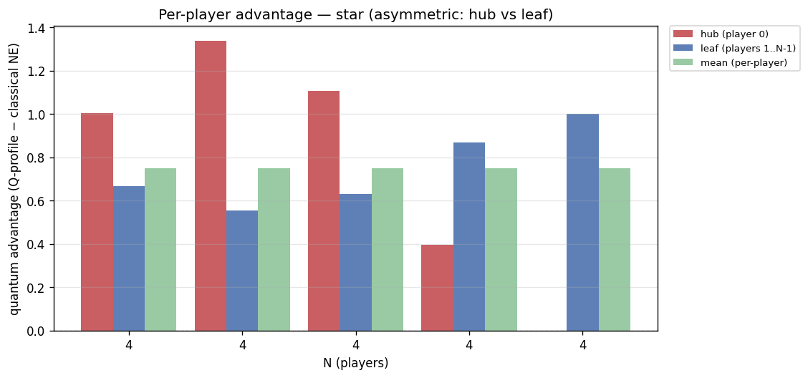
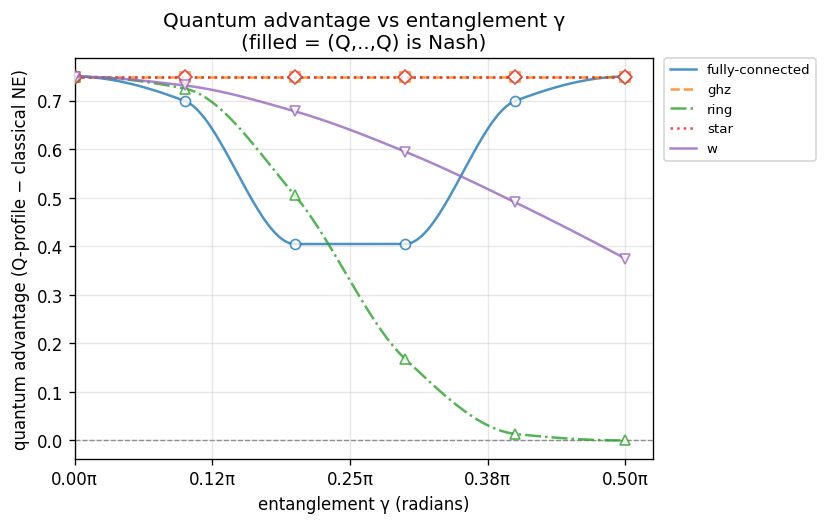
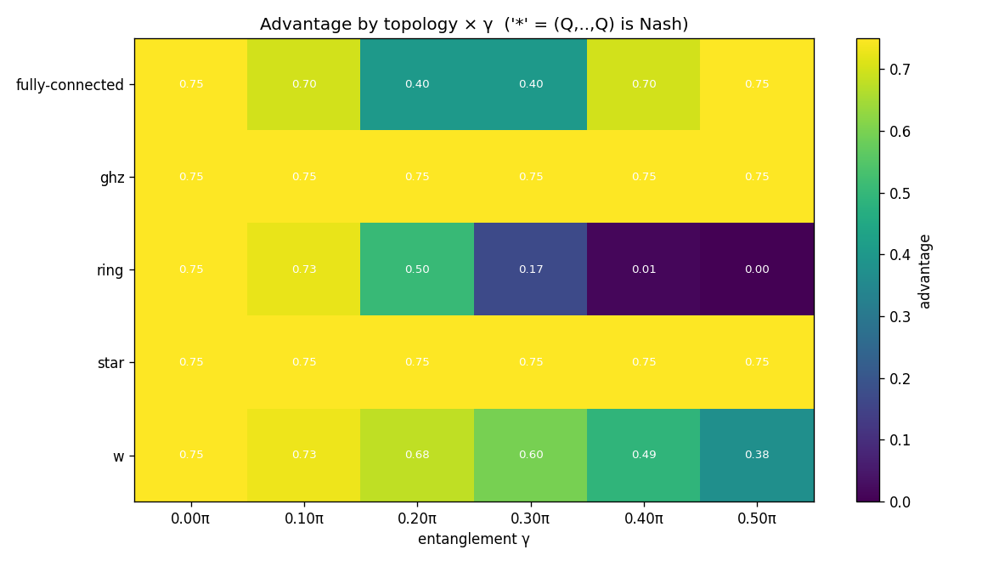

# Experiment report: gamma-sweep-N4

Quantum advantage vs entanglement γ at N=4 across ['fully-connected', 'ghz', 'ring', 'star', 'w']; γ swept 0π→0.5π (config.game.gamma)

_Generated: 2026-07-24T0405Z_

## Parameters used

```yaml
experiment:
  name: gamma-sweep-N4
  description: "Quantum advantage vs entanglement \u03B3 at N=4 across ['fully-connected',\
    \ 'ghz', 'ring', 'star', 'w']; \u03B3 swept 0\u03C0\u21920.5\u03C0 (config.game.gamma)"
generated_at: 2026-07-24T0405Z
output:
  formats:
  - md
  - json
  - csv
  - plots
cells:
- N: 4
  topology: fully-connected
  strategy_names:
  - D
  - H
  - Q
  V: 4.0
  C: 3.0
  gamma: 0.0
  gamma_label: "0\u03C0"
  strategy_mode: fixed
  noise_p: 0.0
- N: 4
  topology: fully-connected
  strategy_names:
  - D
  - H
  - Q
  V: 4.0
  C: 3.0
  gamma: 0.3141592653589793
  gamma_label: "0.1\u03C0"
  strategy_mode: fixed
  noise_p: 0.0
- N: 4
  topology: fully-connected
  strategy_names:
  - D
  - H
  - Q
  V: 4.0
  C: 3.0
  gamma: 0.6283185307179586
  gamma_label: "0.2\u03C0"
  strategy_mode: fixed
  noise_p: 0.0
- N: 4
  topology: fully-connected
  strategy_names:
  - D
  - H
  - Q
  V: 4.0
  C: 3.0
  gamma: 0.9424777960769379
  gamma_label: "0.3\u03C0"
  strategy_mode: fixed
  noise_p: 0.0
- N: 4
  topology: fully-connected
  strategy_names:
  - D
  - H
  - Q
  V: 4.0
  C: 3.0
  gamma: 1.2566370614359172
  gamma_label: "0.4\u03C0"
  strategy_mode: fixed
  noise_p: 0.0
- N: 4
  topology: fully-connected
  strategy_names:
  - D
  - H
  - Q
  V: 4.0
  C: 3.0
  gamma: 1.5707963267948966
  gamma_label: "0.5\u03C0"
  strategy_mode: fixed
  noise_p: 0.0
- N: 4
  topology: ghz
  strategy_names:
  - D
  - H
  - Q
  V: 4.0
  C: 3.0
  gamma: 0.0
  gamma_label: "0\u03C0"
  strategy_mode: fixed
  noise_p: 0.0
- N: 4
  topology: ghz
  strategy_names:
  - D
  - H
  - Q
  V: 4.0
  C: 3.0
  gamma: 0.3141592653589793
  gamma_label: "0.1\u03C0"
  strategy_mode: fixed
  noise_p: 0.0
- N: 4
  topology: ghz
  strategy_names:
  - D
  - H
  - Q
  V: 4.0
  C: 3.0
  gamma: 0.6283185307179586
  gamma_label: "0.2\u03C0"
  strategy_mode: fixed
  noise_p: 0.0
- N: 4
  topology: ghz
  strategy_names:
  - D
  - H
  - Q
  V: 4.0
  C: 3.0
  gamma: 0.9424777960769379
  gamma_label: "0.3\u03C0"
  strategy_mode: fixed
  noise_p: 0.0
- N: 4
  topology: ghz
  strategy_names:
  - D
  - H
  - Q
  V: 4.0
  C: 3.0
  gamma: 1.2566370614359172
  gamma_label: "0.4\u03C0"
  strategy_mode: fixed
  noise_p: 0.0
- N: 4
  topology: ghz
  strategy_names:
  - D
  - H
  - Q
  V: 4.0
  C: 3.0
  gamma: 1.5707963267948966
  gamma_label: "0.5\u03C0"
  strategy_mode: fixed
  noise_p: 0.0
- N: 4
  topology: ring
  strategy_names:
  - D
  - H
  - Q
  V: 4.0
  C: 3.0
  gamma: 0.0
  gamma_label: "0\u03C0"
  strategy_mode: fixed
  noise_p: 0.0
- N: 4
  topology: ring
  strategy_names:
  - D
  - H
  - Q
  V: 4.0
  C: 3.0
  gamma: 0.3141592653589793
  gamma_label: "0.1\u03C0"
  strategy_mode: fixed
  noise_p: 0.0
- N: 4
  topology: ring
  strategy_names:
  - D
  - H
  - Q
  V: 4.0
  C: 3.0
  gamma: 0.6283185307179586
  gamma_label: "0.2\u03C0"
  strategy_mode: fixed
  noise_p: 0.0
- N: 4
  topology: ring
  strategy_names:
  - D
  - H
  - Q
  V: 4.0
  C: 3.0
  gamma: 0.9424777960769379
  gamma_label: "0.3\u03C0"
  strategy_mode: fixed
  noise_p: 0.0
- N: 4
  topology: ring
  strategy_names:
  - D
  - H
  - Q
  V: 4.0
  C: 3.0
  gamma: 1.2566370614359172
  gamma_label: "0.4\u03C0"
  strategy_mode: fixed
  noise_p: 0.0
- N: 4
  topology: ring
  strategy_names:
  - D
  - H
  - Q
  V: 4.0
  C: 3.0
  gamma: 1.5707963267948966
  gamma_label: "0.5\u03C0"
  strategy_mode: fixed
  noise_p: 0.0
- N: 4
  topology: star
  strategy_names:
  - D
  - H
  - Q
  V: 4.0
  C: 3.0
  gamma: 0.0
  gamma_label: "0\u03C0"
  strategy_mode: fixed
  noise_p: 0.0
- N: 4
  topology: star
  strategy_names:
  - D
  - H
  - Q
  V: 4.0
  C: 3.0
  gamma: 0.3141592653589793
  gamma_label: "0.1\u03C0"
  strategy_mode: fixed
  noise_p: 0.0
- N: 4
  topology: star
  strategy_names:
  - D
  - H
  - Q
  V: 4.0
  C: 3.0
  gamma: 0.6283185307179586
  gamma_label: "0.2\u03C0"
  strategy_mode: fixed
  noise_p: 0.0
- N: 4
  topology: star
  strategy_names:
  - D
  - H
  - Q
  V: 4.0
  C: 3.0
  gamma: 0.9424777960769379
  gamma_label: "0.3\u03C0"
  strategy_mode: fixed
  noise_p: 0.0
- N: 4
  topology: star
  strategy_names:
  - D
  - H
  - Q
  V: 4.0
  C: 3.0
  gamma: 1.2566370614359172
  gamma_label: "0.4\u03C0"
  strategy_mode: fixed
  noise_p: 0.0
- N: 4
  topology: star
  strategy_names:
  - D
  - H
  - Q
  V: 4.0
  C: 3.0
  gamma: 1.5707963267948966
  gamma_label: "0.5\u03C0"
  strategy_mode: fixed
  noise_p: 0.0
- N: 4
  topology: w
  strategy_names:
  - D
  - H
  - Q
  V: 4.0
  C: 3.0
  gamma: 0.0
  gamma_label: "0\u03C0"
  strategy_mode: fixed
  noise_p: 0.0
- N: 4
  topology: w
  strategy_names:
  - D
  - H
  - Q
  V: 4.0
  C: 3.0
  gamma: 0.3141592653589793
  gamma_label: "0.1\u03C0"
  strategy_mode: fixed
  noise_p: 0.0
- N: 4
  topology: w
  strategy_names:
  - D
  - H
  - Q
  V: 4.0
  C: 3.0
  gamma: 0.6283185307179586
  gamma_label: "0.2\u03C0"
  strategy_mode: fixed
  noise_p: 0.0
- N: 4
  topology: w
  strategy_names:
  - D
  - H
  - Q
  V: 4.0
  C: 3.0
  gamma: 0.9424777960769379
  gamma_label: "0.3\u03C0"
  strategy_mode: fixed
  noise_p: 0.0
- N: 4
  topology: w
  strategy_names:
  - D
  - H
  - Q
  V: 4.0
  C: 3.0
  gamma: 1.2566370614359172
  gamma_label: "0.4\u03C0"
  strategy_mode: fixed
  noise_p: 0.0
- N: 4
  topology: w
  strategy_names:
  - D
  - H
  - Q
  V: 4.0
  C: 3.0
  gamma: 1.5707963267948966
  gamma_label: "0.5\u03C0"
  strategy_mode: fixed
  noise_p: 0.0
```

## Summary

| N | topology | V | C | gamma | noise_p | q_payoff | classical_ne | advantage | q_is_nash | symmetric | status |
|---|---|---|---|---|---|---|---|---|---|---|---|
| 4 | fully-connected | 4 | 3 | 0π | 0 | 1.000000 | 0.250000 | 0.750000 | **NO** | yes | ok |
| 4 | fully-connected | 4 | 3 | 0.1π | 0 | 0.949643 | 0.250000 | 0.699643 | **NO** | yes | ok |
| 4 | fully-connected | 4 | 3 | 0.2π | 0 | 0.654849 | 0.250000 | 0.404849 | **NO** | yes | ok |
| 4 | fully-connected | 4 | 3 | 0.3π | 0 | 0.654849 | 0.250000 | 0.404849 | **NO** | yes | ok |
| 4 | fully-connected | 4 | 3 | 0.4π | 0 | 0.949643 | 0.250000 | 0.699643 | **NO** | yes | ok |
| 4 | fully-connected | 4 | 3 | 0.5π | 0 | 1.000000 | 0.250000 | 0.750000 | **NO** | yes | ok |
| 4 | ghz | 4 | 3 | 0π | 0 | 1.000000 | 0.250000 | 0.750000 | **NO** | yes | ok |
| 4 | ghz | 4 | 3 | 0.1π | 0 | 1.000000 | 0.250000 | 0.750000 | **NO** | yes | ok |
| 4 | ghz | 4 | 3 | 0.2π | 0 | 1.000000 | 0.250000 | 0.750000 | **NO** | yes | ok |
| 4 | ghz | 4 | 3 | 0.3π | 0 | 1.000000 | 0.250000 | 0.750000 | **NO** | yes | ok |
| 4 | ghz | 4 | 3 | 0.4π | 0 | 1.000000 | 0.250000 | 0.750000 | **NO** | yes | ok |
| 4 | ghz | 4 | 3 | 0.5π | 0 | 1.000000 | 0.250000 | 0.750000 | **NO** | yes | ok |
| 4 | ring | 4 | 3 | 0π | 0 | 1.000000 | 0.250000 | 0.750000 | **NO** | yes | ok |
| 4 | ring | 4 | 3 | 0.1π | 0 | 0.975194 | 0.250000 | 0.725194 | **NO** | yes | ok |
| 4 | ring | 4 | 3 | 0.2π | 0 | 0.754939 | 0.250000 | 0.504939 | **NO** | yes | ok |
| 4 | ring | 4 | 3 | 0.3π | 0 | 0.418361 | 0.250000 | 0.168361 | **NO** | yes | ok |
| 4 | ring | 4 | 3 | 0.4π | 0 | 0.263616 | 0.250000 | 0.013616 | **NO** | yes | ok |
| 4 | ring | 4 | 3 | 0.5π | 0 | 0.250000 | 0.250000 | 0.000000 | **NO** | yes | ok |
| 4 | star | 4 | 3 | 0π | 0 | 1.000000 | 0.250000 | 0.750000 | **NO** | yes | ok |
| 4 | star | 4 | 3 | 0.1π | 0 | 1.000000 | 0.250000 | 0.750000 | **NO** | no | ok |
| 4 | star | 4 | 3 | 0.2π | 0 | 1.000000 | 0.250000 | 0.750000 | **NO** | no | ok |
| 4 | star | 4 | 3 | 0.3π | 0 | 1.000000 | 0.250000 | 0.750000 | **NO** | no | ok |
| 4 | star | 4 | 3 | 0.4π | 0 | 1.000000 | 0.250000 | 0.750000 | **NO** | no | ok |
| 4 | star | 4 | 3 | 0.5π | 0 | 1.000000 | 0.250000 | 0.750000 | **NO** | no | ok |
| 4 | w | 4 | 3 | 0π | 0 | 1.000000 | 0.250000 | 0.750000 | **NO** | yes | ok |
| 4 | w | 4 | 3 | 0.1π | 0 | 1.000000 | 0.268354 | 0.731646 | **NO** | yes | ok |
| 4 | w | 4 | 3 | 0.2π | 0 | 1.000000 | 0.321619 | 0.678381 | **NO** | yes | ok |
| 4 | w | 4 | 3 | 0.3π | 0 | 1.000000 | 0.404581 | 0.595419 | **NO** | yes | ok |
| 4 | w | 4 | 3 | 0.4π | 0 | 1.000000 | 0.509119 | 0.490881 | **NO** | yes | ok |
| 4 | w | 4 | 3 | 0.5π | 0 | 1.000000 | 0.625000 | 0.375000 | **NO** | yes | ok |

## Findings

- Evaluated **30** cells: 30 ran, 0 not-implemented, 0 errored.
- Quantum advantage > 0 in **29/30** computed cells.
- (Q,...,Q) is a pure Nash equilibrium in **0/30** computed cells.

**Cells with advantage <= 0 (RQ1 finding — investigate, do not paper over):**
  - N=4, ring, gamma=0.5π: advantage = 0.000000

**Cells where (Q,...,Q) is NOT Nash (RQ1 finding):**
  - N=4, fully-connected, gamma=0π
  - N=4, fully-connected, gamma=0.1π
  - N=4, fully-connected, gamma=0.2π
  - N=4, fully-connected, gamma=0.3π
  - N=4, fully-connected, gamma=0.4π
  - N=4, fully-connected, gamma=0.5π
  - N=4, ghz, gamma=0π
  - N=4, ghz, gamma=0.1π
  - N=4, ghz, gamma=0.2π
  - N=4, ghz, gamma=0.3π
  - N=4, ghz, gamma=0.4π
  - N=4, ghz, gamma=0.5π
  - N=4, ring, gamma=0π
  - N=4, ring, gamma=0.1π
  - N=4, ring, gamma=0.2π
  - N=4, ring, gamma=0.3π
  - N=4, ring, gamma=0.4π
  - N=4, ring, gamma=0.5π
  - N=4, star, gamma=0π
  - N=4, star, gamma=0.1π
  - N=4, star, gamma=0.2π
  - N=4, star, gamma=0.3π
  - N=4, star, gamma=0.4π
  - N=4, star, gamma=0.5π
  - N=4, w, gamma=0π
  - N=4, w, gamma=0.1π
  - N=4, w, gamma=0.2π
  - N=4, w, gamma=0.3π
  - N=4, w, gamma=0.4π
  - N=4, w, gamma=0.5π

**Entanglement (γ) thresholds** — smallest swept γ at which each series gains advantage / becomes a pure Nash equilibrium (the discovery: how much entanglement the quantum equilibrium needs):
  - fully-connected, N=4: advantage>0 from γ=0π; (Q,…,Q) never Nash in range
  - ghz, N=4: advantage>0 from γ=0π; (Q,…,Q) never Nash in range
  - ring, N=4: advantage>0 from γ=0π; (Q,…,Q) never Nash in range
  - star, N=4: advantage>0 from γ=0π; (Q,…,Q) never Nash in range
  - w, N=4: advantage>0 from γ=0π; (Q,…,Q) never Nash in range

## Plots





## Per-cell detail

### N=4 · fully-connected · gamma=0π (V=4, C=3)

- (Q,Q,Q,Q) mean per-player payoff: **1.000000**
- Classical NE mean payoff: **0.250000**
- Advantage (Q-profile − classical NE, mean): **0.750000**
- (Q,Q,Q,Q) is pure Nash: **False**
- Player-symmetric: **True**

Classical pure NE in {D,H}^N: (H,H,H,H)

All pure NE: (H,H,H,H)

Unilateral deviation table from (Q,...,Q):

| deviator | alt | dev payoff | Q payoff | Q dominates |
|---|---|---|---|---|
| player 0 | D | 1.000000 | 1.000000 | yes |
| player 0 | H | 4.000000 | 1.000000 | **NO — NASH VIOLATED** |
| player 1 | D | 1.000000 | 1.000000 | yes |
| player 1 | H | 4.000000 | 1.000000 | **NO — NASH VIOLATED** |
| player 2 | D | 1.000000 | 1.000000 | yes |
| player 2 | H | 4.000000 | 1.000000 | **NO — NASH VIOLATED** |
| player 3 | D | 1.000000 | 1.000000 | yes |
| player 3 | H | 4.000000 | 1.000000 | **NO — NASH VIOLATED** |

### N=4 · fully-connected · gamma=0.1π (V=4, C=3)

- (Q,Q,Q,Q) mean per-player payoff: **0.949643**
- Classical NE mean payoff: **0.250000**
- Advantage (Q-profile − classical NE, mean): **0.699643**
- (Q,Q,Q,Q) is pure Nash: **False**
- Player-symmetric: **True**

Classical pure NE in {D,H}^N: (H,H,H,H)

All pure NE: (H,H,H,H)

Unilateral deviation table from (Q,...,Q):

| deviator | alt | dev payoff | Q payoff | Q dominates |
|---|---|---|---|---|
| player 0 | D | 0.738208 | 0.949643 | yes |
| player 0 | H | 2.958634 | 0.949643 | **NO — NASH VIOLATED** |
| player 1 | D | 0.738208 | 0.949643 | yes |
| player 1 | H | 2.958634 | 0.949643 | **NO — NASH VIOLATED** |
| player 2 | D | 0.738208 | 0.949643 | yes |
| player 2 | H | 2.958634 | 0.949643 | **NO — NASH VIOLATED** |
| player 3 | D | 0.738208 | 0.949643 | yes |
| player 3 | H | 2.958634 | 0.949643 | **NO — NASH VIOLATED** |

### N=4 · fully-connected · gamma=0.2π (V=4, C=3)

- (Q,Q,Q,Q) mean per-player payoff: **0.654849**
- Classical NE mean payoff: **0.250000**
- Advantage (Q-profile − classical NE, mean): **0.404849**
- (Q,Q,Q,Q) is pure Nash: **False**
- Player-symmetric: **True**

Classical pure NE in {D,H}^N: (H,H,H,H)

All pure NE: (H,H,H,Q), (H,H,Q,H), (H,Q,H,H), (Q,H,H,H)

Unilateral deviation table from (Q,...,Q):

| deviator | alt | dev payoff | Q payoff | Q dominates |
|---|---|---|---|---|
| player 0 | D | 0.426267 | 0.654849 | yes |
| player 0 | H | 1.557067 | 0.654849 | **NO — NASH VIOLATED** |
| player 1 | D | 0.426267 | 0.654849 | yes |
| player 1 | H | 1.557067 | 0.654849 | **NO — NASH VIOLATED** |
| player 2 | D | 0.426267 | 0.654849 | yes |
| player 2 | H | 1.557067 | 0.654849 | **NO — NASH VIOLATED** |
| player 3 | D | 0.426267 | 0.654849 | yes |
| player 3 | H | 1.557067 | 0.654849 | **NO — NASH VIOLATED** |

### N=4 · fully-connected · gamma=0.3π (V=4, C=3)

- (Q,Q,Q,Q) mean per-player payoff: **0.654849**
- Classical NE mean payoff: **0.250000**
- Advantage (Q-profile − classical NE, mean): **0.404849**
- (Q,Q,Q,Q) is pure Nash: **False**
- Player-symmetric: **True**

Classical pure NE in {D,H}^N: (H,H,H,H)

All pure NE: (D,Q,Q,Q), (H,H,H,Q), (H,H,Q,H), (H,Q,H,H), (Q,D,Q,Q), (Q,H,H,H), (Q,Q,D,Q), (Q,Q,Q,D)

Unilateral deviation table from (Q,...,Q):

| deviator | alt | dev payoff | Q payoff | Q dominates |
|---|---|---|---|---|
| player 0 | D | 1.076486 | 0.654849 | **NO — NASH VIOLATED** |
| player 0 | H | 0.843877 | 0.654849 | **NO — NASH VIOLATED** |
| player 1 | D | 1.076486 | 0.654849 | **NO — NASH VIOLATED** |
| player 1 | H | 0.843877 | 0.654849 | **NO — NASH VIOLATED** |
| player 2 | D | 1.076486 | 0.654849 | **NO — NASH VIOLATED** |
| player 2 | H | 0.843877 | 0.654849 | **NO — NASH VIOLATED** |
| player 3 | D | 1.076486 | 0.654849 | **NO — NASH VIOLATED** |
| player 3 | H | 0.843877 | 0.654849 | **NO — NASH VIOLATED** |

### N=4 · fully-connected · gamma=0.4π (V=4, C=3)

- (Q,Q,Q,Q) mean per-player payoff: **0.949643**
- Classical NE mean payoff: **0.250000**
- Advantage (Q-profile − classical NE, mean): **0.699643**
- (Q,Q,Q,Q) is pure Nash: **False**
- Player-symmetric: **True**

Classical pure NE in {D,H}^N: (H,H,H,H)

All pure NE: (none found)

Unilateral deviation table from (Q,...,Q):

| deviator | alt | dev payoff | Q payoff | Q dominates |
|---|---|---|---|---|
| player 0 | D | 1.145150 | 0.949643 | **NO — NASH VIOLATED** |
| player 0 | H | 1.275409 | 0.949643 | **NO — NASH VIOLATED** |
| player 1 | D | 1.145150 | 0.949643 | **NO — NASH VIOLATED** |
| player 1 | H | 1.275409 | 0.949643 | **NO — NASH VIOLATED** |
| player 2 | D | 1.145150 | 0.949643 | **NO — NASH VIOLATED** |
| player 2 | H | 1.275409 | 0.949643 | **NO — NASH VIOLATED** |
| player 3 | D | 1.145150 | 0.949643 | **NO — NASH VIOLATED** |
| player 3 | H | 1.275409 | 0.949643 | **NO — NASH VIOLATED** |

### N=4 · fully-connected · gamma=0.5π (V=4, C=3)

- (Q,Q,Q,Q) mean per-player payoff: **1.000000**
- Classical NE mean payoff: **0.250000**
- Advantage (Q-profile − classical NE, mean): **0.750000**
- (Q,Q,Q,Q) is pure Nash: **False**
- Player-symmetric: **True**

Classical pure NE in {D,H}^N: (H,H,H,H)

All pure NE: (none found)

Unilateral deviation table from (Q,...,Q):

| deviator | alt | dev payoff | Q payoff | Q dominates |
|---|---|---|---|---|
| player 0 | D | 0.625000 | 1.000000 | yes |
| player 0 | H | 2.000000 | 1.000000 | **NO — NASH VIOLATED** |
| player 1 | D | 0.625000 | 1.000000 | yes |
| player 1 | H | 2.000000 | 1.000000 | **NO — NASH VIOLATED** |
| player 2 | D | 0.625000 | 1.000000 | yes |
| player 2 | H | 2.000000 | 1.000000 | **NO — NASH VIOLATED** |
| player 3 | D | 0.625000 | 1.000000 | yes |
| player 3 | H | 2.000000 | 1.000000 | **NO — NASH VIOLATED** |

### N=4 · ghz · gamma=0π (V=4, C=3)

- (Q,Q,Q,Q) mean per-player payoff: **1.000000**
- Classical NE mean payoff: **0.250000**
- Advantage (Q-profile − classical NE, mean): **0.750000**
- (Q,Q,Q,Q) is pure Nash: **False**
- Player-symmetric: **True**

Classical pure NE in {D,H}^N: (H,H,H,H)

All pure NE: (H,H,H,H)

Unilateral deviation table from (Q,...,Q):

| deviator | alt | dev payoff | Q payoff | Q dominates |
|---|---|---|---|---|
| player 0 | D | 1.000000 | 1.000000 | yes |
| player 0 | H | 4.000000 | 1.000000 | **NO — NASH VIOLATED** |
| player 1 | D | 1.000000 | 1.000000 | yes |
| player 1 | H | 4.000000 | 1.000000 | **NO — NASH VIOLATED** |
| player 2 | D | 1.000000 | 1.000000 | yes |
| player 2 | H | 4.000000 | 1.000000 | **NO — NASH VIOLATED** |
| player 3 | D | 1.000000 | 1.000000 | yes |
| player 3 | H | 4.000000 | 1.000000 | **NO — NASH VIOLATED** |

### N=4 · ghz · gamma=0.1π (V=4, C=3)

- (Q,Q,Q,Q) mean per-player payoff: **1.000000**
- Classical NE mean payoff: **0.250000**
- Advantage (Q-profile − classical NE, mean): **0.750000**
- (Q,Q,Q,Q) is pure Nash: **False**
- Player-symmetric: **True**

Classical pure NE in {D,H}^N: (H,H,H,H)

All pure NE: (H,H,H,H)

Unilateral deviation table from (Q,...,Q):

| deviator | alt | dev payoff | Q payoff | Q dominates |
|---|---|---|---|---|
| player 0 | D | 0.964191 | 1.000000 | yes |
| player 0 | H | 3.809017 | 1.000000 | **NO — NASH VIOLATED** |
| player 1 | D | 0.964191 | 1.000000 | yes |
| player 1 | H | 3.809017 | 1.000000 | **NO — NASH VIOLATED** |
| player 2 | D | 0.964191 | 1.000000 | yes |
| player 2 | H | 3.809017 | 1.000000 | **NO — NASH VIOLATED** |
| player 3 | D | 0.964191 | 1.000000 | yes |
| player 3 | H | 3.809017 | 1.000000 | **NO — NASH VIOLATED** |

### N=4 · ghz · gamma=0.2π (V=4, C=3)

- (Q,Q,Q,Q) mean per-player payoff: **1.000000**
- Classical NE mean payoff: **0.250000**
- Advantage (Q-profile − classical NE, mean): **0.750000**
- (Q,Q,Q,Q) is pure Nash: **False**
- Player-symmetric: **True**

Classical pure NE in {D,H}^N: (H,H,H,H)

All pure NE: (H,H,H,Q), (H,H,Q,H), (H,Q,H,H), (Q,H,H,H)

Unilateral deviation table from (Q,...,Q):

| deviator | alt | dev payoff | Q payoff | Q dominates |
|---|---|---|---|---|
| player 0 | D | 0.870441 | 1.000000 | yes |
| player 0 | H | 3.309017 | 1.000000 | **NO — NASH VIOLATED** |
| player 1 | D | 0.870441 | 1.000000 | yes |
| player 1 | H | 3.309017 | 1.000000 | **NO — NASH VIOLATED** |
| player 2 | D | 0.870441 | 1.000000 | yes |
| player 2 | H | 3.309017 | 1.000000 | **NO — NASH VIOLATED** |
| player 3 | D | 0.870441 | 1.000000 | yes |
| player 3 | H | 3.309017 | 1.000000 | **NO — NASH VIOLATED** |

### N=4 · ghz · gamma=0.3π (V=4, C=3)

- (Q,Q,Q,Q) mean per-player payoff: **1.000000**
- Classical NE mean payoff: **0.250000**
- Advantage (Q-profile − classical NE, mean): **0.750000**
- (Q,Q,Q,Q) is pure Nash: **False**
- Player-symmetric: **True**

Classical pure NE in {D,H}^N: (H,H,H,H)

All pure NE: (none found)

Unilateral deviation table from (Q,...,Q):

| deviator | alt | dev payoff | Q payoff | Q dominates |
|---|---|---|---|---|
| player 0 | D | 0.754559 | 1.000000 | yes |
| player 0 | H | 2.690983 | 1.000000 | **NO — NASH VIOLATED** |
| player 1 | D | 0.754559 | 1.000000 | yes |
| player 1 | H | 2.690983 | 1.000000 | **NO — NASH VIOLATED** |
| player 2 | D | 0.754559 | 1.000000 | yes |
| player 2 | H | 2.690983 | 1.000000 | **NO — NASH VIOLATED** |
| player 3 | D | 0.754559 | 1.000000 | yes |
| player 3 | H | 2.690983 | 1.000000 | **NO — NASH VIOLATED** |

### N=4 · ghz · gamma=0.4π (V=4, C=3)

- (Q,Q,Q,Q) mean per-player payoff: **1.000000**
- Classical NE mean payoff: **0.250000**
- Advantage (Q-profile − classical NE, mean): **0.750000**
- (Q,Q,Q,Q) is pure Nash: **False**
- Player-symmetric: **True**

Classical pure NE in {D,H}^N: (H,H,H,H)

All pure NE: (none found)

Unilateral deviation table from (Q,...,Q):

| deviator | alt | dev payoff | Q payoff | Q dominates |
|---|---|---|---|---|
| player 0 | D | 0.660809 | 1.000000 | yes |
| player 0 | H | 2.190983 | 1.000000 | **NO — NASH VIOLATED** |
| player 1 | D | 0.660809 | 1.000000 | yes |
| player 1 | H | 2.190983 | 1.000000 | **NO — NASH VIOLATED** |
| player 2 | D | 0.660809 | 1.000000 | yes |
| player 2 | H | 2.190983 | 1.000000 | **NO — NASH VIOLATED** |
| player 3 | D | 0.660809 | 1.000000 | yes |
| player 3 | H | 2.190983 | 1.000000 | **NO — NASH VIOLATED** |

### N=4 · ghz · gamma=0.5π (V=4, C=3)

- (Q,Q,Q,Q) mean per-player payoff: **1.000000**
- Classical NE mean payoff: **0.250000**
- Advantage (Q-profile − classical NE, mean): **0.750000**
- (Q,Q,Q,Q) is pure Nash: **False**
- Player-symmetric: **True**

Classical pure NE in {D,H}^N: (H,H,H,H)

All pure NE: (none found)

Unilateral deviation table from (Q,...,Q):

| deviator | alt | dev payoff | Q payoff | Q dominates |
|---|---|---|---|---|
| player 0 | D | 0.625000 | 1.000000 | yes |
| player 0 | H | 2.000000 | 1.000000 | **NO — NASH VIOLATED** |
| player 1 | D | 0.625000 | 1.000000 | yes |
| player 1 | H | 2.000000 | 1.000000 | **NO — NASH VIOLATED** |
| player 2 | D | 0.625000 | 1.000000 | yes |
| player 2 | H | 2.000000 | 1.000000 | **NO — NASH VIOLATED** |
| player 3 | D | 0.625000 | 1.000000 | yes |
| player 3 | H | 2.000000 | 1.000000 | **NO — NASH VIOLATED** |

### N=4 · ring · gamma=0π (V=4, C=3)

- (Q,Q,Q,Q) mean per-player payoff: **1.000000**
- Classical NE mean payoff: **0.250000**
- Advantage (Q-profile − classical NE, mean): **0.750000**
- (Q,Q,Q,Q) is pure Nash: **False**
- Player-symmetric: **True**

Classical pure NE in {D,H}^N: (H,H,H,H)

All pure NE: (H,H,H,H)

Unilateral deviation table from (Q,...,Q):

| deviator | alt | dev payoff | Q payoff | Q dominates |
|---|---|---|---|---|
| player 0 | D | 1.000000 | 1.000000 | yes |
| player 0 | H | 4.000000 | 1.000000 | **NO — NASH VIOLATED** |
| player 1 | D | 1.000000 | 1.000000 | yes |
| player 1 | H | 4.000000 | 1.000000 | **NO — NASH VIOLATED** |
| player 2 | D | 1.000000 | 1.000000 | yes |
| player 2 | H | 4.000000 | 1.000000 | **NO — NASH VIOLATED** |
| player 3 | D | 1.000000 | 1.000000 | yes |
| player 3 | H | 4.000000 | 1.000000 | **NO — NASH VIOLATED** |

### N=4 · ring · gamma=0.1π (V=4, C=3)

- (Q,Q,Q,Q) mean per-player payoff: **0.975194**
- Classical NE mean payoff: **0.250000**
- Advantage (Q-profile − classical NE, mean): **0.725194**
- (Q,Q,Q,Q) is pure Nash: **False**
- Player-symmetric: **True**

Classical pure NE in {D,H}^N: (H,H,H,H)

All pure NE: (H,H,H,H)

Unilateral deviation table from (Q,...,Q):

| deviator | alt | dev payoff | Q payoff | Q dominates |
|---|---|---|---|---|
| player 0 | D | 0.905783 | 0.975194 | yes |
| player 0 | H | 3.189320 | 0.975194 | **NO — NASH VIOLATED** |
| player 1 | D | 0.905783 | 0.975194 | yes |
| player 1 | H | 3.189320 | 0.975194 | **NO — NASH VIOLATED** |
| player 2 | D | 0.905783 | 0.975194 | yes |
| player 2 | H | 3.189320 | 0.975194 | **NO — NASH VIOLATED** |
| player 3 | D | 0.905783 | 0.975194 | yes |
| player 3 | H | 3.189320 | 0.975194 | **NO — NASH VIOLATED** |

### N=4 · ring · gamma=0.2π (V=4, C=3)

- (Q,Q,Q,Q) mean per-player payoff: **0.754939**
- Classical NE mean payoff: **0.250000**
- Advantage (Q-profile − classical NE, mean): **0.504939**
- (Q,Q,Q,Q) is pure Nash: **False**
- Player-symmetric: **True**

Classical pure NE in {D,H}^N: (H,H,H,H)

All pure NE: (H,H,H,Q), (H,H,Q,H), (H,Q,H,H), (Q,H,H,H)

Unilateral deviation table from (Q,...,Q):

| deviator | alt | dev payoff | Q payoff | Q dominates |
|---|---|---|---|---|
| player 0 | D | 0.711025 | 0.754939 | yes |
| player 0 | H | 1.688534 | 0.754939 | **NO — NASH VIOLATED** |
| player 1 | D | 0.711025 | 0.754939 | yes |
| player 1 | H | 1.688534 | 0.754939 | **NO — NASH VIOLATED** |
| player 2 | D | 0.711025 | 0.754939 | yes |
| player 2 | H | 1.688534 | 0.754939 | **NO — NASH VIOLATED** |
| player 3 | D | 0.711025 | 0.754939 | yes |
| player 3 | H | 1.688534 | 0.754939 | **NO — NASH VIOLATED** |

### N=4 · ring · gamma=0.3π (V=4, C=3)

- (Q,Q,Q,Q) mean per-player payoff: **0.418361**
- Classical NE mean payoff: **0.250000**
- Advantage (Q-profile − classical NE, mean): **0.168361**
- (Q,Q,Q,Q) is pure Nash: **False**
- Player-symmetric: **True**

Classical pure NE in {D,H}^N: (H,H,H,H)

All pure NE: (H,H,H,Q), (H,H,Q,H), (H,Q,H,H), (Q,H,H,H)

Unilateral deviation table from (Q,...,Q):

| deviator | alt | dev payoff | Q payoff | Q dominates |
|---|---|---|---|---|
| player 0 | D | 0.697244 | 0.418361 | **NO — NASH VIOLATED** |
| player 0 | H | 0.638805 | 0.418361 | **NO — NASH VIOLATED** |
| player 1 | D | 0.697244 | 0.418361 | **NO — NASH VIOLATED** |
| player 1 | H | 0.638805 | 0.418361 | **NO — NASH VIOLATED** |
| player 2 | D | 0.697244 | 0.418361 | **NO — NASH VIOLATED** |
| player 2 | H | 0.638805 | 0.418361 | **NO — NASH VIOLATED** |
| player 3 | D | 0.697244 | 0.418361 | **NO — NASH VIOLATED** |
| player 3 | H | 0.638805 | 0.418361 | **NO — NASH VIOLATED** |

### N=4 · ring · gamma=0.4π (V=4, C=3)

- (Q,Q,Q,Q) mean per-player payoff: **0.263616**
- Classical NE mean payoff: **0.250000**
- Advantage (Q-profile − classical NE, mean): **0.013616**
- (Q,Q,Q,Q) is pure Nash: **False**
- Player-symmetric: **True**

Classical pure NE in {D,H}^N: (H,H,H,H)

All pure NE: (H,H,H,H), (H,H,Q,Q), (H,Q,Q,H), (Q,H,H,Q), (Q,Q,H,H)

Unilateral deviation table from (Q,...,Q):

| deviator | alt | dev payoff | Q payoff | Q dominates |
|---|---|---|---|---|
| player 0 | D | 0.954503 | 0.263616 | **NO — NASH VIOLATED** |
| player 0 | H | 0.139591 | 0.263616 | yes |
| player 1 | D | 0.954503 | 0.263616 | **NO — NASH VIOLATED** |
| player 1 | H | 0.139591 | 0.263616 | yes |
| player 2 | D | 0.954503 | 0.263616 | **NO — NASH VIOLATED** |
| player 2 | H | 0.139591 | 0.263616 | yes |
| player 3 | D | 0.954503 | 0.263616 | **NO — NASH VIOLATED** |
| player 3 | H | 0.139591 | 0.263616 | yes |

### N=4 · ring · gamma=0.5π (V=4, C=3)

- (Q,Q,Q,Q) mean per-player payoff: **0.250000**
- Classical NE mean payoff: **0.250000**
- Advantage (Q-profile − classical NE, mean): **0.000000**
- (Q,Q,Q,Q) is pure Nash: **False**
- Player-symmetric: **True**

Classical pure NE in {D,H}^N: (H,H,H,H)

All pure NE: (H,H,H,H), (H,H,Q,Q), (H,Q,Q,H), (Q,H,H,Q), (Q,Q,H,H)

Unilateral deviation table from (Q,...,Q):

| deviator | alt | dev payoff | Q payoff | Q dominates |
|---|---|---|---|---|
| player 0 | D | 1.125000 | 0.250000 | **NO — NASH VIOLATED** |
| player 0 | H | 0.000000 | 0.250000 | yes |
| player 1 | D | 1.125000 | 0.250000 | **NO — NASH VIOLATED** |
| player 1 | H | 0.000000 | 0.250000 | yes |
| player 2 | D | 1.125000 | 0.250000 | **NO — NASH VIOLATED** |
| player 2 | H | 0.000000 | 0.250000 | yes |
| player 3 | D | 1.125000 | 0.250000 | **NO — NASH VIOLATED** |
| player 3 | H | 0.000000 | 0.250000 | yes |

### N=4 · star · gamma=0π (V=4, C=3)

- (Q,Q,Q,Q) mean per-player payoff: **1.000000**
- Classical NE mean payoff: **0.250000**
- Advantage (Q-profile − classical NE, mean): **0.750000**
- (Q,Q,Q,Q) is pure Nash: **False**
- Player-symmetric: **True**

Classical pure NE in {D,H}^N: (H,H,H,H)

All pure NE: (H,H,H,H)

Unilateral deviation table from (Q,...,Q):

| deviator | alt | dev payoff | Q payoff | Q dominates |
|---|---|---|---|---|
| player 0 | D | 1.000000 | 1.000000 | yes |
| player 0 | H | 4.000000 | 1.000000 | **NO — NASH VIOLATED** |
| player 1 | D | 1.000000 | 1.000000 | yes |
| player 1 | H | 4.000000 | 1.000000 | **NO — NASH VIOLATED** |
| player 2 | D | 1.000000 | 1.000000 | yes |
| player 2 | H | 4.000000 | 1.000000 | **NO — NASH VIOLATED** |
| player 3 | D | 1.000000 | 1.000000 | yes |
| player 3 | H | 4.000000 | 1.000000 | **NO — NASH VIOLATED** |

### N=4 · star · gamma=0.1π (V=4, C=3)

- (Q,Q,Q,Q) mean per-player payoff: **1.000000**
- Classical NE mean payoff: **0.250000**
- Advantage (Q-profile − classical NE, mean): **0.750000**
- (Q,Q,Q,Q) is pure Nash: **False**
- Player-symmetric: **False**

**Per-player breakdown (asymmetric topology):**

- Q payoff vector: [1.2523, 0.9159, 0.9159, 0.9159]
- Classical NE payoff vector: [0.2500, 0.2500, 0.2500, 0.2500]
- Advantage vector: [1.0023, 0.6659, 0.6659, 0.6659]

Classical pure NE in {D,H}^N: (H,H,H,H)

All pure NE: (H,H,H,H)

Unilateral deviation table from (Q,...,Q):

| deviator | alt | dev payoff | Q payoff | Q dominates |
|---|---|---|---|---|
| player 0 | D | 1.123292 | 1.252280 | yes |
| player 0 | H | 3.462655 | 1.252280 | **NO — NASH VIOLATED** |
| player 1 | D | 0.872421 | 0.915907 | yes |
| player 1 | H | 3.341992 | 0.915907 | **NO — NASH VIOLATED** |
| player 2 | D | 0.872421 | 0.915907 | yes |
| player 2 | H | 3.341992 | 0.915907 | **NO — NASH VIOLATED** |
| player 3 | D | 0.872421 | 0.915907 | yes |
| player 3 | H | 3.341992 | 0.915907 | **NO — NASH VIOLATED** |

### N=4 · star · gamma=0.2π (V=4, C=3)

- (Q,Q,Q,Q) mean per-player payoff: **1.000000**
- Classical NE mean payoff: **0.250000**
- Advantage (Q-profile − classical NE, mean): **0.750000**
- (Q,Q,Q,Q) is pure Nash: **False**
- Player-symmetric: **False**

**Per-player breakdown (asymmetric topology):**

- Q payoff vector: [1.5889, 0.8037, 0.8037, 0.8037]
- Classical NE payoff vector: [0.2500, 0.2500, 0.2500, 0.2500]
- Advantage vector: [1.3389, 0.5537, 0.5537, 0.5537]

Classical pure NE in {D,H}^N: (H,H,H,H)

All pure NE: (Q,H,H,H)

Unilateral deviation table from (Q,...,Q):

| deviator | alt | dev payoff | Q payoff | Q dominates |
|---|---|---|---|---|
| player 0 | D | 1.276731 | 1.588858 | yes |
| player 0 | H | 2.363269 | 1.588858 | **NO — NASH VIOLATED** |
| player 1 | D | 0.676474 | 0.803714 | yes |
| player 1 | H | 2.009683 | 0.803714 | **NO — NASH VIOLATED** |
| player 2 | D | 0.676474 | 0.803714 | yes |
| player 2 | H | 2.009683 | 0.803714 | **NO — NASH VIOLATED** |
| player 3 | D | 0.676474 | 0.803714 | yes |
| player 3 | H | 2.009683 | 0.803714 | **NO — NASH VIOLATED** |

### N=4 · star · gamma=0.3π (V=4, C=3)

- (Q,Q,Q,Q) mean per-player payoff: **1.000000**
- Classical NE mean payoff: **0.250000**
- Advantage (Q-profile − classical NE, mean): **0.750000**
- (Q,Q,Q,Q) is pure Nash: **False**
- Player-symmetric: **False**

**Per-player breakdown (asymmetric topology):**

- Q payoff vector: [1.3571, 0.8810, 0.8810, 0.8810]
- Classical NE payoff vector: [0.2500, 0.2500, 0.2500, 0.2500]
- Advantage vector: [1.1071, 0.6310, 0.6310, 0.6310]

Classical pure NE in {D,H}^N: (H,H,H,H)

All pure NE: (H,H,H,Q), (H,H,Q,H), (H,Q,H,H), (Q,H,H,H)

Unilateral deviation table from (Q,...,Q):

| deviator | alt | dev payoff | Q payoff | Q dominates |
|---|---|---|---|---|
| player 0 | D | 1.201904 | 1.357095 | yes |
| player 0 | H | 1.506095 | 1.357095 | **NO — NASH VIOLATED** |
| player 1 | D | 0.671524 | 0.880968 | yes |
| player 1 | H | 1.105924 | 0.880968 | **NO — NASH VIOLATED** |
| player 2 | D | 0.671524 | 0.880968 | yes |
| player 2 | H | 1.105924 | 0.880968 | **NO — NASH VIOLATED** |
| player 3 | D | 0.671524 | 0.880968 | yes |
| player 3 | H | 1.105924 | 0.880968 | **NO — NASH VIOLATED** |

### N=4 · star · gamma=0.4π (V=4, C=3)

- (Q,Q,Q,Q) mean per-player payoff: **1.000000**
- Classical NE mean payoff: **0.250000**
- Advantage (Q-profile − classical NE, mean): **0.750000**
- (Q,Q,Q,Q) is pure Nash: **False**
- Player-symmetric: **False**

**Per-player breakdown (asymmetric topology):**

- Q payoff vector: [0.6455, 1.1182, 1.1182, 1.1182]
- Classical NE payoff vector: [0.2500, 0.2500, 0.2500, 0.2500]
- Advantage vector: [0.3955, 0.8682, 0.8682, 0.8682]

Classical pure NE in {D,H}^N: (H,H,H,H)

All pure NE: (none found)

Unilateral deviation table from (Q,...,Q):

| deviator | alt | dev payoff | Q payoff | Q dominates |
|---|---|---|---|---|
| player 0 | D | 1.001590 | 0.645517 | **NO — NASH VIOLATED** |
| player 0 | H | 1.105481 | 0.645517 | **NO — NASH VIOLATED** |
| player 1 | D | 0.820596 | 1.118161 | yes |
| player 1 | H | 0.938234 | 1.118161 | yes |
| player 2 | D | 0.820596 | 1.118161 | yes |
| player 2 | H | 0.938234 | 1.118161 | yes |
| player 3 | D | 0.820596 | 1.118161 | yes |
| player 3 | H | 0.938234 | 1.118161 | yes |

### N=4 · star · gamma=0.5π (V=4, C=3)

- (Q,Q,Q,Q) mean per-player payoff: **1.000000**
- Classical NE mean payoff: **0.250000**
- Advantage (Q-profile − classical NE, mean): **0.750000**
- (Q,Q,Q,Q) is pure Nash: **False**
- Player-symmetric: **False**

**Per-player breakdown (asymmetric topology):**

- Q payoff vector: [0.2500, 1.2500, 1.2500, 1.2500]
- Classical NE payoff vector: [0.2500, 0.2500, 0.2500, 0.2500]
- Advantage vector: [0.0000, 1.0000, 1.0000, 1.0000]

Classical pure NE in {D,H}^N: (H,H,H,H)

All pure NE: (none found)

Unilateral deviation table from (Q,...,Q):

| deviator | alt | dev payoff | Q payoff | Q dominates |
|---|---|---|---|---|
| player 0 | D | 0.906250 | 0.250000 | **NO — NASH VIOLATED** |
| player 0 | H | 1.000000 | 0.250000 | **NO — NASH VIOLATED** |
| player 1 | D | 0.906250 | 1.250000 | yes |
| player 1 | H | 1.000000 | 1.250000 | yes |
| player 2 | D | 0.906250 | 1.250000 | yes |
| player 2 | H | 1.000000 | 1.250000 | yes |
| player 3 | D | 0.906250 | 1.250000 | yes |
| player 3 | H | 1.000000 | 1.250000 | yes |

### N=4 · w · gamma=0π (V=4, C=3)

- (Q,Q,Q,Q) mean per-player payoff: **1.000000**
- Classical NE mean payoff: **0.250000**
- Advantage (Q-profile − classical NE, mean): **0.750000**
- (Q,Q,Q,Q) is pure Nash: **False**
- Player-symmetric: **True**

Classical pure NE in {D,H}^N: (H,H,H,H)

All pure NE: (H,H,H,H)

Unilateral deviation table from (Q,...,Q):

| deviator | alt | dev payoff | Q payoff | Q dominates |
|---|---|---|---|---|
| player 0 | D | 1.000000 | 1.000000 | yes |
| player 0 | H | 4.000000 | 1.000000 | **NO — NASH VIOLATED** |
| player 1 | D | 1.000000 | 1.000000 | yes |
| player 1 | H | 4.000000 | 1.000000 | **NO — NASH VIOLATED** |
| player 2 | D | 1.000000 | 1.000000 | yes |
| player 2 | H | 4.000000 | 1.000000 | **NO — NASH VIOLATED** |
| player 3 | D | 1.000000 | 1.000000 | yes |
| player 3 | H | 4.000000 | 1.000000 | **NO — NASH VIOLATED** |

### N=4 · w · gamma=0.1π (V=4, C=3)

- (Q,Q,Q,Q) mean per-player payoff: **1.000000**
- Classical NE mean payoff: **0.268354**
- Advantage (Q-profile − classical NE, mean): **0.731646**
- (Q,Q,Q,Q) is pure Nash: **False**
- Player-symmetric: **True**

Classical pure NE in {D,H}^N: (H,H,H,H)

All pure NE: (H,H,H,H)

Unilateral deviation table from (Q,...,Q):

| deviator | alt | dev payoff | Q payoff | Q dominates |
|---|---|---|---|---|
| player 0 | D | 0.964640 | 1.000000 | yes |
| player 0 | H | 3.944939 | 1.000000 | **NO — NASH VIOLATED** |
| player 1 | D | 0.964640 | 1.000000 | yes |
| player 1 | H | 3.944939 | 1.000000 | **NO — NASH VIOLATED** |
| player 2 | D | 0.964640 | 1.000000 | yes |
| player 2 | H | 3.944939 | 1.000000 | **NO — NASH VIOLATED** |
| player 3 | D | 0.964640 | 1.000000 | yes |
| player 3 | H | 3.944939 | 1.000000 | **NO — NASH VIOLATED** |

### N=4 · w · gamma=0.2π (V=4, C=3)

- (Q,Q,Q,Q) mean per-player payoff: **1.000000**
- Classical NE mean payoff: **0.321619**
- Advantage (Q-profile − classical NE, mean): **0.678381**
- (Q,Q,Q,Q) is pure Nash: **False**
- Player-symmetric: **True**

Classical pure NE in {D,H}^N: (H,H,H,H)

All pure NE: (H,H,H,H)

Unilateral deviation table from (Q,...,Q):

| deviator | alt | dev payoff | Q payoff | Q dominates |
|---|---|---|---|---|
| player 0 | D | 0.877280 | 1.000000 | yes |
| player 0 | H | 3.785144 | 1.000000 | **NO — NASH VIOLATED** |
| player 1 | D | 0.877280 | 1.000000 | yes |
| player 1 | H | 3.785144 | 1.000000 | **NO — NASH VIOLATED** |
| player 2 | D | 0.877280 | 1.000000 | yes |
| player 2 | H | 3.785144 | 1.000000 | **NO — NASH VIOLATED** |
| player 3 | D | 0.877280 | 1.000000 | yes |
| player 3 | H | 3.785144 | 1.000000 | **NO — NASH VIOLATED** |

### N=4 · w · gamma=0.3π (V=4, C=3)

- (Q,Q,Q,Q) mean per-player payoff: **1.000000**
- Classical NE mean payoff: **0.404581**
- Advantage (Q-profile − classical NE, mean): **0.595419**
- (Q,Q,Q,Q) is pure Nash: **False**
- Player-symmetric: **True**

Classical pure NE in {D,H}^N: (H,H,H,H)

All pure NE: (H,H,H,H)

Unilateral deviation table from (Q,...,Q):

| deviator | alt | dev payoff | Q payoff | Q dominates |
|---|---|---|---|---|
| player 0 | D | 0.786420 | 1.000000 | yes |
| player 0 | H | 3.536258 | 1.000000 | **NO — NASH VIOLATED** |
| player 1 | D | 0.786420 | 1.000000 | yes |
| player 1 | H | 3.536258 | 1.000000 | **NO — NASH VIOLATED** |
| player 2 | D | 0.786420 | 1.000000 | yes |
| player 2 | H | 3.536258 | 1.000000 | **NO — NASH VIOLATED** |
| player 3 | D | 0.786420 | 1.000000 | yes |
| player 3 | H | 3.536258 | 1.000000 | **NO — NASH VIOLATED** |

### N=4 · w · gamma=0.4π (V=4, C=3)

- (Q,Q,Q,Q) mean per-player payoff: **1.000000**
- Classical NE mean payoff: **0.509119**
- Advantage (Q-profile − classical NE, mean): **0.490881**
- (Q,Q,Q,Q) is pure Nash: **False**
- Player-symmetric: **True**

Classical pure NE in {D,H}^N: (H,H,H,H)

All pure NE: (H,H,H,H)

Unilateral deviation table from (Q,...,Q):

| deviator | alt | dev payoff | Q payoff | Q dominates |
|---|---|---|---|---|
| player 0 | D | 0.750333 | 1.000000 | yes |
| player 0 | H | 3.222644 | 1.000000 | **NO — NASH VIOLATED** |
| player 1 | D | 0.750333 | 1.000000 | yes |
| player 1 | H | 3.222644 | 1.000000 | **NO — NASH VIOLATED** |
| player 2 | D | 0.750333 | 1.000000 | yes |
| player 2 | H | 3.222644 | 1.000000 | **NO — NASH VIOLATED** |
| player 3 | D | 0.750333 | 1.000000 | yes |
| player 3 | H | 3.222644 | 1.000000 | **NO — NASH VIOLATED** |

### N=4 · w · gamma=0.5π (V=4, C=3)

- (Q,Q,Q,Q) mean per-player payoff: **1.000000**
- Classical NE mean payoff: **0.625000**
- Advantage (Q-profile − classical NE, mean): **0.375000**
- (Q,Q,Q,Q) is pure Nash: **False**
- Player-symmetric: **True**

Classical pure NE in {D,H}^N: (H,H,H,H)

All pure NE: (H,H,H,H)

Unilateral deviation table from (Q,...,Q):

| deviator | alt | dev payoff | Q payoff | Q dominates |
|---|---|---|---|---|
| player 0 | D | 0.812500 | 1.000000 | yes |
| player 0 | H | 2.875000 | 1.000000 | **NO — NASH VIOLATED** |
| player 1 | D | 0.812500 | 1.000000 | yes |
| player 1 | H | 2.875000 | 1.000000 | **NO — NASH VIOLATED** |
| player 2 | D | 0.812500 | 1.000000 | yes |
| player 2 | H | 2.875000 | 1.000000 | **NO — NASH VIOLATED** |
| player 3 | D | 0.812500 | 1.000000 | yes |
| player 3 | H | 2.875000 | 1.000000 | **NO — NASH VIOLATED** |

## Data files

- `results.json` — full structured results
- `results.csv` — one row per cell
- `config.snapshot.yaml` — exact parameters used
