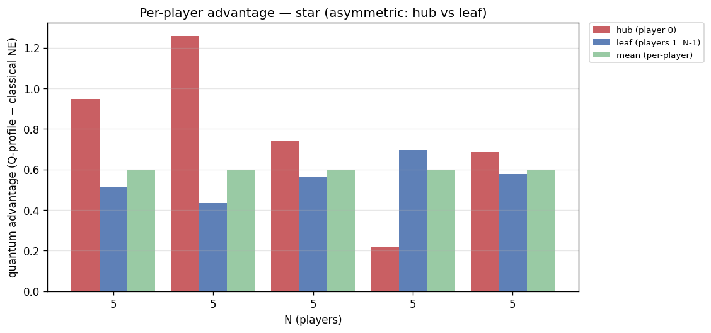
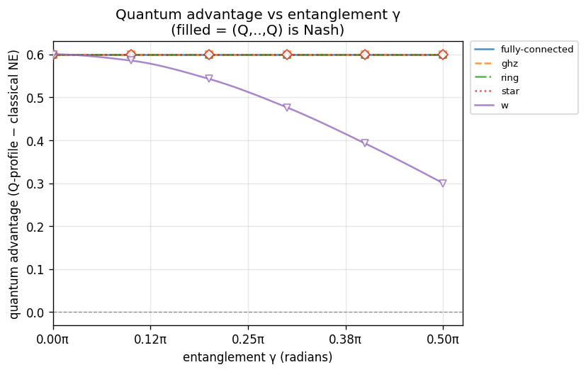
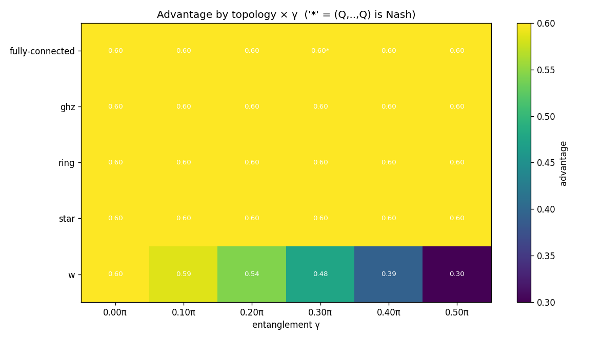

# Experiment report: gamma-sweep-N5

Quantum advantage vs entanglement γ at N=5 across ['fully-connected', 'ghz', 'ring', 'star', 'w']; γ swept 0π→0.5π (config.game.gamma)

_Generated: 2026-07-19T0821Z_

## Parameters used

```yaml
experiment:
  name: gamma-sweep-N5
  description: "Quantum advantage vs entanglement \u03B3 at N=5 across ['fully-connected',\
    \ 'ghz', 'ring', 'star', 'w']; \u03B3 swept 0\u03C0\u21920.5\u03C0 (config.game.gamma)"
generated_at: 2026-07-19T0821Z
output:
  formats:
  - md
  - json
  - csv
  - plots
cells:
- N: 5
  topology: fully-connected
  strategy_names:
  - D
  - H
  - Q
  V: 4.0
  C: 3.0
  gamma: 0.0
  gamma_label: "0\u03C0"
  strategy_mode: fixed
  noise_p: 0.0
- N: 5
  topology: fully-connected
  strategy_names:
  - D
  - H
  - Q
  V: 4.0
  C: 3.0
  gamma: 0.3141592653589793
  gamma_label: "0.1\u03C0"
  strategy_mode: fixed
  noise_p: 0.0
- N: 5
  topology: fully-connected
  strategy_names:
  - D
  - H
  - Q
  V: 4.0
  C: 3.0
  gamma: 0.6283185307179586
  gamma_label: "0.2\u03C0"
  strategy_mode: fixed
  noise_p: 0.0
- N: 5
  topology: fully-connected
  strategy_names:
  - D
  - H
  - Q
  V: 4.0
  C: 3.0
  gamma: 0.9424777960769379
  gamma_label: "0.3\u03C0"
  strategy_mode: fixed
  noise_p: 0.0
- N: 5
  topology: fully-connected
  strategy_names:
  - D
  - H
  - Q
  V: 4.0
  C: 3.0
  gamma: 1.2566370614359172
  gamma_label: "0.4\u03C0"
  strategy_mode: fixed
  noise_p: 0.0
- N: 5
  topology: fully-connected
  strategy_names:
  - D
  - H
  - Q
  V: 4.0
  C: 3.0
  gamma: 1.5707963267948966
  gamma_label: "0.5\u03C0"
  strategy_mode: fixed
  noise_p: 0.0
- N: 5
  topology: ghz
  strategy_names:
  - D
  - H
  - Q
  V: 4.0
  C: 3.0
  gamma: 0.0
  gamma_label: "0\u03C0"
  strategy_mode: fixed
  noise_p: 0.0
- N: 5
  topology: ghz
  strategy_names:
  - D
  - H
  - Q
  V: 4.0
  C: 3.0
  gamma: 0.3141592653589793
  gamma_label: "0.1\u03C0"
  strategy_mode: fixed
  noise_p: 0.0
- N: 5
  topology: ghz
  strategy_names:
  - D
  - H
  - Q
  V: 4.0
  C: 3.0
  gamma: 0.6283185307179586
  gamma_label: "0.2\u03C0"
  strategy_mode: fixed
  noise_p: 0.0
- N: 5
  topology: ghz
  strategy_names:
  - D
  - H
  - Q
  V: 4.0
  C: 3.0
  gamma: 0.9424777960769379
  gamma_label: "0.3\u03C0"
  strategy_mode: fixed
  noise_p: 0.0
- N: 5
  topology: ghz
  strategy_names:
  - D
  - H
  - Q
  V: 4.0
  C: 3.0
  gamma: 1.2566370614359172
  gamma_label: "0.4\u03C0"
  strategy_mode: fixed
  noise_p: 0.0
- N: 5
  topology: ghz
  strategy_names:
  - D
  - H
  - Q
  V: 4.0
  C: 3.0
  gamma: 1.5707963267948966
  gamma_label: "0.5\u03C0"
  strategy_mode: fixed
  noise_p: 0.0
- N: 5
  topology: ring
  strategy_names:
  - D
  - H
  - Q
  V: 4.0
  C: 3.0
  gamma: 0.0
  gamma_label: "0\u03C0"
  strategy_mode: fixed
  noise_p: 0.0
- N: 5
  topology: ring
  strategy_names:
  - D
  - H
  - Q
  V: 4.0
  C: 3.0
  gamma: 0.3141592653589793
  gamma_label: "0.1\u03C0"
  strategy_mode: fixed
  noise_p: 0.0
- N: 5
  topology: ring
  strategy_names:
  - D
  - H
  - Q
  V: 4.0
  C: 3.0
  gamma: 0.6283185307179586
  gamma_label: "0.2\u03C0"
  strategy_mode: fixed
  noise_p: 0.0
- N: 5
  topology: ring
  strategy_names:
  - D
  - H
  - Q
  V: 4.0
  C: 3.0
  gamma: 0.9424777960769379
  gamma_label: "0.3\u03C0"
  strategy_mode: fixed
  noise_p: 0.0
- N: 5
  topology: ring
  strategy_names:
  - D
  - H
  - Q
  V: 4.0
  C: 3.0
  gamma: 1.2566370614359172
  gamma_label: "0.4\u03C0"
  strategy_mode: fixed
  noise_p: 0.0
- N: 5
  topology: ring
  strategy_names:
  - D
  - H
  - Q
  V: 4.0
  C: 3.0
  gamma: 1.5707963267948966
  gamma_label: "0.5\u03C0"
  strategy_mode: fixed
  noise_p: 0.0
- N: 5
  topology: star
  strategy_names:
  - D
  - H
  - Q
  V: 4.0
  C: 3.0
  gamma: 0.0
  gamma_label: "0\u03C0"
  strategy_mode: fixed
  noise_p: 0.0
- N: 5
  topology: star
  strategy_names:
  - D
  - H
  - Q
  V: 4.0
  C: 3.0
  gamma: 0.3141592653589793
  gamma_label: "0.1\u03C0"
  strategy_mode: fixed
  noise_p: 0.0
- N: 5
  topology: star
  strategy_names:
  - D
  - H
  - Q
  V: 4.0
  C: 3.0
  gamma: 0.6283185307179586
  gamma_label: "0.2\u03C0"
  strategy_mode: fixed
  noise_p: 0.0
- N: 5
  topology: star
  strategy_names:
  - D
  - H
  - Q
  V: 4.0
  C: 3.0
  gamma: 0.9424777960769379
  gamma_label: "0.3\u03C0"
  strategy_mode: fixed
  noise_p: 0.0
- N: 5
  topology: star
  strategy_names:
  - D
  - H
  - Q
  V: 4.0
  C: 3.0
  gamma: 1.2566370614359172
  gamma_label: "0.4\u03C0"
  strategy_mode: fixed
  noise_p: 0.0
- N: 5
  topology: star
  strategy_names:
  - D
  - H
  - Q
  V: 4.0
  C: 3.0
  gamma: 1.5707963267948966
  gamma_label: "0.5\u03C0"
  strategy_mode: fixed
  noise_p: 0.0
- N: 5
  topology: w
  strategy_names:
  - D
  - H
  - Q
  V: 4.0
  C: 3.0
  gamma: 0.0
  gamma_label: "0\u03C0"
  strategy_mode: fixed
  noise_p: 0.0
- N: 5
  topology: w
  strategy_names:
  - D
  - H
  - Q
  V: 4.0
  C: 3.0
  gamma: 0.3141592653589793
  gamma_label: "0.1\u03C0"
  strategy_mode: fixed
  noise_p: 0.0
- N: 5
  topology: w
  strategy_names:
  - D
  - H
  - Q
  V: 4.0
  C: 3.0
  gamma: 0.6283185307179586
  gamma_label: "0.2\u03C0"
  strategy_mode: fixed
  noise_p: 0.0
- N: 5
  topology: w
  strategy_names:
  - D
  - H
  - Q
  V: 4.0
  C: 3.0
  gamma: 0.9424777960769379
  gamma_label: "0.3\u03C0"
  strategy_mode: fixed
  noise_p: 0.0
- N: 5
  topology: w
  strategy_names:
  - D
  - H
  - Q
  V: 4.0
  C: 3.0
  gamma: 1.2566370614359172
  gamma_label: "0.4\u03C0"
  strategy_mode: fixed
  noise_p: 0.0
- N: 5
  topology: w
  strategy_names:
  - D
  - H
  - Q
  V: 4.0
  C: 3.0
  gamma: 1.5707963267948966
  gamma_label: "0.5\u03C0"
  strategy_mode: fixed
  noise_p: 0.0
```

## Summary

| N | topology | V | C | gamma | noise_p | q_payoff | classical_ne | advantage | q_is_nash | symmetric | status |
|---|---|---|---|---|---|---|---|---|---|---|---|
| 5 | fully-connected | 4 | 3 | 0π | 0 | 0.800000 | 0.200000 | 0.600000 | **NO** | yes | ok |
| 5 | fully-connected | 4 | 3 | 0.1π | 0 | 0.800000 | 0.200000 | 0.600000 | **NO** | yes | ok |
| 5 | fully-connected | 4 | 3 | 0.2π | 0 | 0.800000 | 0.200000 | 0.600000 | **NO** | yes | ok |
| 5 | fully-connected | 4 | 3 | 0.3π | 0 | 0.800000 | 0.200000 | 0.600000 | yes | yes | ok |
| 5 | fully-connected | 4 | 3 | 0.4π | 0 | 0.800000 | 0.200000 | 0.600000 | **NO** | yes | ok |
| 5 | fully-connected | 4 | 3 | 0.5π | 0 | 0.800000 | 0.200000 | 0.600000 | **NO** | yes | ok |
| 5 | ghz | 4 | 3 | 0π | 0 | 0.800000 | 0.200000 | 0.600000 | **NO** | yes | ok |
| 5 | ghz | 4 | 3 | 0.1π | 0 | 0.800000 | 0.200000 | 0.600000 | **NO** | yes | ok |
| 5 | ghz | 4 | 3 | 0.2π | 0 | 0.800000 | 0.200000 | 0.600000 | **NO** | yes | ok |
| 5 | ghz | 4 | 3 | 0.3π | 0 | 0.800000 | 0.200000 | 0.600000 | **NO** | yes | ok |
| 5 | ghz | 4 | 3 | 0.4π | 0 | 0.800000 | 0.200000 | 0.600000 | **NO** | yes | ok |
| 5 | ghz | 4 | 3 | 0.5π | 0 | 0.800000 | 0.200000 | 0.600000 | **NO** | yes | ok |
| 5 | ring | 4 | 3 | 0π | 0 | 0.800000 | 0.200000 | 0.600000 | **NO** | yes | ok |
| 5 | ring | 4 | 3 | 0.1π | 0 | 0.800000 | 0.200000 | 0.600000 | **NO** | yes | ok |
| 5 | ring | 4 | 3 | 0.2π | 0 | 0.800000 | 0.200000 | 0.600000 | **NO** | yes | ok |
| 5 | ring | 4 | 3 | 0.3π | 0 | 0.800000 | 0.200000 | 0.600000 | **NO** | yes | ok |
| 5 | ring | 4 | 3 | 0.4π | 0 | 0.800000 | 0.200000 | 0.600000 | **NO** | yes | ok |
| 5 | ring | 4 | 3 | 0.5π | 0 | 0.800000 | 0.200000 | 0.600000 | **NO** | yes | ok |
| 5 | star | 4 | 3 | 0π | 0 | 0.800000 | 0.200000 | 0.600000 | **NO** | yes | ok |
| 5 | star | 4 | 3 | 0.1π | 0 | 0.800000 | 0.200000 | 0.600000 | **NO** | no | ok |
| 5 | star | 4 | 3 | 0.2π | 0 | 0.800000 | 0.200000 | 0.600000 | **NO** | no | ok |
| 5 | star | 4 | 3 | 0.3π | 0 | 0.800000 | 0.200000 | 0.600000 | **NO** | no | ok |
| 5 | star | 4 | 3 | 0.4π | 0 | 0.800000 | 0.200000 | 0.600000 | **NO** | no | ok |
| 5 | star | 4 | 3 | 0.5π | 0 | 0.800000 | 0.200000 | 0.600000 | **NO** | no | ok |
| 5 | w | 4 | 3 | 0π | 0 | 0.800000 | 0.200000 | 0.600000 | **NO** | yes | ok |
| 5 | w | 4 | 3 | 0.1π | 0 | 0.800000 | 0.214683 | 0.585317 | **NO** | yes | ok |
| 5 | w | 4 | 3 | 0.2π | 0 | 0.800000 | 0.257295 | 0.542705 | **NO** | yes | ok |
| 5 | w | 4 | 3 | 0.3π | 0 | 0.800000 | 0.323664 | 0.476336 | **NO** | yes | ok |
| 5 | w | 4 | 3 | 0.4π | 0 | 0.800000 | 0.407295 | 0.392705 | **NO** | yes | ok |
| 5 | w | 4 | 3 | 0.5π | 0 | 0.800000 | 0.500000 | 0.300000 | **NO** | yes | ok |

## Findings

- Evaluated **30** cells: 30 ran, 0 not-implemented, 0 errored.
- Quantum advantage > 0 in **30/30** computed cells.
- (Q,...,Q) is a pure Nash equilibrium in **1/30** computed cells.

**Cells where (Q,...,Q) is NOT Nash (RQ1 finding):**
  - N=5, fully-connected, gamma=0π
  - N=5, fully-connected, gamma=0.1π
  - N=5, fully-connected, gamma=0.2π
  - N=5, fully-connected, gamma=0.4π
  - N=5, fully-connected, gamma=0.5π
  - N=5, ghz, gamma=0π
  - N=5, ghz, gamma=0.1π
  - N=5, ghz, gamma=0.2π
  - N=5, ghz, gamma=0.3π
  - N=5, ghz, gamma=0.4π
  - N=5, ghz, gamma=0.5π
  - N=5, ring, gamma=0π
  - N=5, ring, gamma=0.1π
  - N=5, ring, gamma=0.2π
  - N=5, ring, gamma=0.3π
  - N=5, ring, gamma=0.4π
  - N=5, ring, gamma=0.5π
  - N=5, star, gamma=0π
  - N=5, star, gamma=0.1π
  - N=5, star, gamma=0.2π
  - N=5, star, gamma=0.3π
  - N=5, star, gamma=0.4π
  - N=5, star, gamma=0.5π
  - N=5, w, gamma=0π
  - N=5, w, gamma=0.1π
  - N=5, w, gamma=0.2π
  - N=5, w, gamma=0.3π
  - N=5, w, gamma=0.4π
  - N=5, w, gamma=0.5π

**Entanglement (γ) thresholds** — smallest swept γ at which each series gains advantage / becomes a pure Nash equilibrium (the discovery: how much entanglement the quantum equilibrium needs):
  - fully-connected, N=5: advantage>0 from γ=0π; (Q,…,Q) Nash from γ=0.3π
  - ghz, N=5: advantage>0 from γ=0π; (Q,…,Q) never Nash in range
  - ring, N=5: advantage>0 from γ=0π; (Q,…,Q) never Nash in range
  - star, N=5: advantage>0 from γ=0π; (Q,…,Q) never Nash in range
  - w, N=5: advantage>0 from γ=0π; (Q,…,Q) never Nash in range

## Plots





## Per-cell detail

### N=5 · fully-connected · gamma=0π (V=4, C=3)

- (Q,Q,Q,Q,Q) mean per-player payoff: **0.800000**
- Classical NE mean payoff: **0.200000**
- Advantage (Q-profile − classical NE, mean): **0.600000**
- (Q,Q,Q,Q,Q) is pure Nash: **False**
- Player-symmetric: **True**

Classical pure NE in {D,H}^N: (H,H,H,H,H)

All pure NE: (H,H,H,H,H)

Unilateral deviation table from (Q,...,Q):

| deviator | alt | dev payoff | Q payoff | Q dominates |
|---|---|---|---|---|
| player 0 | D | 0.800000 | 0.800000 | yes |
| player 0 | H | 4.000000 | 0.800000 | **NO — NASH VIOLATED** |
| player 1 | D | 0.800000 | 0.800000 | yes |
| player 1 | H | 4.000000 | 0.800000 | **NO — NASH VIOLATED** |
| player 2 | D | 0.800000 | 0.800000 | yes |
| player 2 | H | 4.000000 | 0.800000 | **NO — NASH VIOLATED** |
| player 3 | D | 0.800000 | 0.800000 | yes |
| player 3 | H | 4.000000 | 0.800000 | **NO — NASH VIOLATED** |
| player 4 | D | 0.800000 | 0.800000 | yes |
| player 4 | H | 4.000000 | 0.800000 | **NO — NASH VIOLATED** |

### N=5 · fully-connected · gamma=0.1π (V=4, C=3)

- (Q,Q,Q,Q,Q) mean per-player payoff: **0.800000**
- Classical NE mean payoff: **0.200000**
- Advantage (Q-profile − classical NE, mean): **0.600000**
- (Q,Q,Q,Q,Q) is pure Nash: **False**
- Player-symmetric: **True**

Classical pure NE in {D,H}^N: (H,H,H,H,H)

All pure NE: (H,H,H,H,H)

Unilateral deviation table from (Q,...,Q):

| deviator | alt | dev payoff | Q payoff | Q dominates |
|---|---|---|---|---|
| player 0 | D | 0.532110 | 0.800000 | yes |
| player 0 | H | 2.592303 | 0.800000 | **NO — NASH VIOLATED** |
| player 1 | D | 0.532110 | 0.800000 | yes |
| player 1 | H | 2.592303 | 0.800000 | **NO — NASH VIOLATED** |
| player 2 | D | 0.532110 | 0.800000 | yes |
| player 2 | H | 2.592303 | 0.800000 | **NO — NASH VIOLATED** |
| player 3 | D | 0.532110 | 0.800000 | yes |
| player 3 | H | 2.592303 | 0.800000 | **NO — NASH VIOLATED** |
| player 4 | D | 0.532110 | 0.800000 | yes |
| player 4 | H | 2.592303 | 0.800000 | **NO — NASH VIOLATED** |

### N=5 · fully-connected · gamma=0.2π (V=4, C=3)

- (Q,Q,Q,Q,Q) mean per-player payoff: **0.800000**
- Classical NE mean payoff: **0.200000**
- Advantage (Q-profile − classical NE, mean): **0.600000**
- (Q,Q,Q,Q,Q) is pure Nash: **False**
- Player-symmetric: **True**

Classical pure NE in {D,H}^N: (H,H,H,H,H)

All pure NE: (H,H,H,H,Q), (H,H,H,Q,H), (H,H,Q,H,H), (H,Q,H,H,H), (Q,H,H,H,H)

Unilateral deviation table from (Q,...,Q):

| deviator | alt | dev payoff | Q payoff | Q dominates |
|---|---|---|---|---|
| player 0 | D | 0.560868 | 0.800000 | yes |
| player 0 | H | 1.070342 | 0.800000 | **NO — NASH VIOLATED** |
| player 1 | D | 0.560868 | 0.800000 | yes |
| player 1 | H | 1.070342 | 0.800000 | **NO — NASH VIOLATED** |
| player 2 | D | 0.560868 | 0.800000 | yes |
| player 2 | H | 1.070342 | 0.800000 | **NO — NASH VIOLATED** |
| player 3 | D | 0.560868 | 0.800000 | yes |
| player 3 | H | 1.070342 | 0.800000 | **NO — NASH VIOLATED** |
| player 4 | D | 0.560868 | 0.800000 | yes |
| player 4 | H | 1.070342 | 0.800000 | **NO — NASH VIOLATED** |

### N=5 · fully-connected · gamma=0.3π (V=4, C=3)

- (Q,Q,Q,Q,Q) mean per-player payoff: **0.800000**
- Classical NE mean payoff: **0.200000**
- Advantage (Q-profile − classical NE, mean): **0.600000**
- (Q,Q,Q,Q,Q) is pure Nash: **True**
- Player-symmetric: **True**

Classical pure NE in {D,H}^N: (H,H,H,H,H)

All pure NE: (H,H,H,H,Q), (H,H,H,Q,H), (H,H,Q,H,H), (H,Q,H,H,H), (Q,H,H,H,H), (Q,Q,Q,Q,Q)

Unilateral deviation table from (Q,...,Q):

| deviator | alt | dev payoff | Q payoff | Q dominates |
|---|---|---|---|---|
| player 0 | D | 0.742774 | 0.800000 | yes |
| player 0 | H | 0.652153 | 0.800000 | yes |
| player 1 | D | 0.742774 | 0.800000 | yes |
| player 1 | H | 0.652153 | 0.800000 | yes |
| player 2 | D | 0.742774 | 0.800000 | yes |
| player 2 | H | 0.652153 | 0.800000 | yes |
| player 3 | D | 0.742774 | 0.800000 | yes |
| player 3 | H | 0.652153 | 0.800000 | yes |
| player 4 | D | 0.742774 | 0.800000 | yes |
| player 4 | H | 0.652153 | 0.800000 | yes |

### N=5 · fully-connected · gamma=0.4π (V=4, C=3)

- (Q,Q,Q,Q,Q) mean per-player payoff: **0.800000**
- Classical NE mean payoff: **0.200000**
- Advantage (Q-profile − classical NE, mean): **0.600000**
- (Q,Q,Q,Q,Q) is pure Nash: **False**
- Player-symmetric: **True**

Classical pure NE in {D,H}^N: (H,H,H,H,H)

All pure NE: (D,Q,Q,Q,Q), (Q,D,Q,Q,Q), (Q,Q,D,Q,Q), (Q,Q,Q,D,Q), (Q,Q,Q,Q,D)

Unilateral deviation table from (Q,...,Q):

| deviator | alt | dev payoff | Q payoff | Q dominates |
|---|---|---|---|---|
| player 0 | D | 1.039230 | 0.800000 | **NO — NASH VIOLATED** |
| player 0 | H | 0.258461 | 0.800000 | yes |
| player 1 | D | 1.039230 | 0.800000 | **NO — NASH VIOLATED** |
| player 1 | H | 0.258461 | 0.800000 | yes |
| player 2 | D | 1.039230 | 0.800000 | **NO — NASH VIOLATED** |
| player 2 | H | 0.258461 | 0.800000 | yes |
| player 3 | D | 1.039230 | 0.800000 | **NO — NASH VIOLATED** |
| player 3 | H | 0.258461 | 0.800000 | yes |
| player 4 | D | 1.039230 | 0.800000 | **NO — NASH VIOLATED** |
| player 4 | H | 0.258461 | 0.800000 | yes |

### N=5 · fully-connected · gamma=0.5π (V=4, C=3)

- (Q,Q,Q,Q,Q) mean per-player payoff: **0.800000**
- Classical NE mean payoff: **0.200000**
- Advantage (Q-profile − classical NE, mean): **0.600000**
- (Q,Q,Q,Q,Q) is pure Nash: **False**
- Player-symmetric: **True**

Classical pure NE in {D,H}^N: (H,H,H,H,H)

All pure NE: (none found)

Unilateral deviation table from (Q,...,Q):

| deviator | alt | dev payoff | Q payoff | Q dominates |
|---|---|---|---|---|
| player 0 | D | 0.750215 | 0.800000 | yes |
| player 0 | H | 1.145960 | 0.800000 | **NO — NASH VIOLATED** |
| player 1 | D | 0.750215 | 0.800000 | yes |
| player 1 | H | 1.145960 | 0.800000 | **NO — NASH VIOLATED** |
| player 2 | D | 0.750215 | 0.800000 | yes |
| player 2 | H | 1.145960 | 0.800000 | **NO — NASH VIOLATED** |
| player 3 | D | 0.750215 | 0.800000 | yes |
| player 3 | H | 1.145960 | 0.800000 | **NO — NASH VIOLATED** |
| player 4 | D | 0.750215 | 0.800000 | yes |
| player 4 | H | 1.145960 | 0.800000 | **NO — NASH VIOLATED** |

### N=5 · ghz · gamma=0π (V=4, C=3)

- (Q,Q,Q,Q,Q) mean per-player payoff: **0.800000**
- Classical NE mean payoff: **0.200000**
- Advantage (Q-profile − classical NE, mean): **0.600000**
- (Q,Q,Q,Q,Q) is pure Nash: **False**
- Player-symmetric: **True**

Classical pure NE in {D,H}^N: (H,H,H,H,H)

All pure NE: (H,H,H,H,H)

Unilateral deviation table from (Q,...,Q):

| deviator | alt | dev payoff | Q payoff | Q dominates |
|---|---|---|---|---|
| player 0 | D | 0.800000 | 0.800000 | yes |
| player 0 | H | 4.000000 | 0.800000 | **NO — NASH VIOLATED** |
| player 1 | D | 0.800000 | 0.800000 | yes |
| player 1 | H | 4.000000 | 0.800000 | **NO — NASH VIOLATED** |
| player 2 | D | 0.800000 | 0.800000 | yes |
| player 2 | H | 4.000000 | 0.800000 | **NO — NASH VIOLATED** |
| player 3 | D | 0.800000 | 0.800000 | yes |
| player 3 | H | 4.000000 | 0.800000 | **NO — NASH VIOLATED** |
| player 4 | D | 0.800000 | 0.800000 | yes |
| player 4 | H | 4.000000 | 0.800000 | **NO — NASH VIOLATED** |

### N=5 · ghz · gamma=0.1π (V=4, C=3)

- (Q,Q,Q,Q,Q) mean per-player payoff: **0.800000**
- Classical NE mean payoff: **0.200000**
- Advantage (Q-profile − classical NE, mean): **0.600000**
- (Q,Q,Q,Q,Q) is pure Nash: **False**
- Player-symmetric: **True**

Classical pure NE in {D,H}^N: (H,H,H,H,H)

All pure NE: (H,H,H,H,H)

Unilateral deviation table from (Q,...,Q):

| deviator | alt | dev payoff | Q payoff | Q dominates |
|---|---|---|---|---|
| player 0 | D | 0.780205 | 0.800000 | yes |
| player 0 | H | 3.868034 | 0.800000 | **NO — NASH VIOLATED** |
| player 1 | D | 0.780205 | 0.800000 | yes |
| player 1 | H | 3.868034 | 0.800000 | **NO — NASH VIOLATED** |
| player 2 | D | 0.780205 | 0.800000 | yes |
| player 2 | H | 3.868034 | 0.800000 | **NO — NASH VIOLATED** |
| player 3 | D | 0.780205 | 0.800000 | yes |
| player 3 | H | 3.868034 | 0.800000 | **NO — NASH VIOLATED** |
| player 4 | D | 0.780205 | 0.800000 | yes |
| player 4 | H | 3.868034 | 0.800000 | **NO — NASH VIOLATED** |

### N=5 · ghz · gamma=0.2π (V=4, C=3)

- (Q,Q,Q,Q,Q) mean per-player payoff: **0.800000**
- Classical NE mean payoff: **0.200000**
- Advantage (Q-profile − classical NE, mean): **0.600000**
- (Q,Q,Q,Q,Q) is pure Nash: **False**
- Player-symmetric: **True**

Classical pure NE in {D,H}^N: (H,H,H,H,H)

All pure NE: (H,H,H,H,Q), (H,H,H,Q,H), (H,H,Q,H,H), (H,Q,H,H,H), (Q,H,H,H,H)

Unilateral deviation table from (Q,...,Q):

| deviator | alt | dev payoff | Q payoff | Q dominates |
|---|---|---|---|---|
| player 0 | D | 0.728381 | 0.800000 | yes |
| player 0 | H | 3.522542 | 0.800000 | **NO — NASH VIOLATED** |
| player 1 | D | 0.728381 | 0.800000 | yes |
| player 1 | H | 3.522542 | 0.800000 | **NO — NASH VIOLATED** |
| player 2 | D | 0.728381 | 0.800000 | yes |
| player 2 | H | 3.522542 | 0.800000 | **NO — NASH VIOLATED** |
| player 3 | D | 0.728381 | 0.800000 | yes |
| player 3 | H | 3.522542 | 0.800000 | **NO — NASH VIOLATED** |
| player 4 | D | 0.728381 | 0.800000 | yes |
| player 4 | H | 3.522542 | 0.800000 | **NO — NASH VIOLATED** |

### N=5 · ghz · gamma=0.3π (V=4, C=3)

- (Q,Q,Q,Q,Q) mean per-player payoff: **0.800000**
- Classical NE mean payoff: **0.200000**
- Advantage (Q-profile − classical NE, mean): **0.600000**
- (Q,Q,Q,Q,Q) is pure Nash: **False**
- Player-symmetric: **True**

Classical pure NE in {D,H}^N: (H,H,H,H,H)

All pure NE: (H,H,Q,Q,Q), (H,Q,H,Q,Q), (H,Q,Q,H,Q), (H,Q,Q,Q,H), (Q,H,H,Q,Q), (Q,H,Q,H,Q), (Q,H,Q,Q,H), (Q,Q,H,H,Q), (Q,Q,H,Q,H), (Q,Q,Q,H,H)

Unilateral deviation table from (Q,...,Q):

| deviator | alt | dev payoff | Q payoff | Q dominates |
|---|---|---|---|---|
| player 0 | D | 0.664324 | 0.800000 | yes |
| player 0 | H | 3.095492 | 0.800000 | **NO — NASH VIOLATED** |
| player 1 | D | 0.664324 | 0.800000 | yes |
| player 1 | H | 3.095492 | 0.800000 | **NO — NASH VIOLATED** |
| player 2 | D | 0.664324 | 0.800000 | yes |
| player 2 | H | 3.095492 | 0.800000 | **NO — NASH VIOLATED** |
| player 3 | D | 0.664324 | 0.800000 | yes |
| player 3 | H | 3.095492 | 0.800000 | **NO — NASH VIOLATED** |
| player 4 | D | 0.664324 | 0.800000 | yes |
| player 4 | H | 3.095492 | 0.800000 | **NO — NASH VIOLATED** |

### N=5 · ghz · gamma=0.4π (V=4, C=3)

- (Q,Q,Q,Q,Q) mean per-player payoff: **0.800000**
- Classical NE mean payoff: **0.200000**
- Advantage (Q-profile − classical NE, mean): **0.600000**
- (Q,Q,Q,Q,Q) is pure Nash: **False**
- Player-symmetric: **True**

Classical pure NE in {D,H}^N: (H,H,H,H,H)

All pure NE: (D,H,Q,Q,Q), (D,Q,H,Q,Q), (D,Q,Q,H,Q), (D,Q,Q,Q,H), (H,D,Q,Q,Q), (H,Q,D,Q,Q), (H,Q,Q,D,Q), (H,Q,Q,Q,D), (Q,D,H,Q,Q), (Q,D,Q,H,Q), (Q,D,Q,Q,H), (Q,H,D,Q,Q), (Q,H,Q,D,Q), (Q,H,Q,Q,D), (Q,Q,D,H,Q), (Q,Q,D,Q,H), (Q,Q,H,D,Q), (Q,Q,H,Q,D), (Q,Q,Q,D,H), (Q,Q,Q,H,D)

Unilateral deviation table from (Q,...,Q):

| deviator | alt | dev payoff | Q payoff | Q dominates |
|---|---|---|---|---|
| player 0 | D | 0.612500 | 0.800000 | yes |
| player 0 | H | 2.750000 | 0.800000 | **NO — NASH VIOLATED** |
| player 1 | D | 0.612500 | 0.800000 | yes |
| player 1 | H | 2.750000 | 0.800000 | **NO — NASH VIOLATED** |
| player 2 | D | 0.612500 | 0.800000 | yes |
| player 2 | H | 2.750000 | 0.800000 | **NO — NASH VIOLATED** |
| player 3 | D | 0.612500 | 0.800000 | yes |
| player 3 | H | 2.750000 | 0.800000 | **NO — NASH VIOLATED** |
| player 4 | D | 0.612500 | 0.800000 | yes |
| player 4 | H | 2.750000 | 0.800000 | **NO — NASH VIOLATED** |

### N=5 · ghz · gamma=0.5π (V=4, C=3)

- (Q,Q,Q,Q,Q) mean per-player payoff: **0.800000**
- Classical NE mean payoff: **0.200000**
- Advantage (Q-profile − classical NE, mean): **0.600000**
- (Q,Q,Q,Q,Q) is pure Nash: **False**
- Player-symmetric: **True**

Classical pure NE in {D,H}^N: (H,H,H,H,H)

All pure NE: (none found)

Unilateral deviation table from (Q,...,Q):

| deviator | alt | dev payoff | Q payoff | Q dominates |
|---|---|---|---|---|
| player 0 | D | 0.592705 | 0.800000 | yes |
| player 0 | H | 2.618034 | 0.800000 | **NO — NASH VIOLATED** |
| player 1 | D | 0.592705 | 0.800000 | yes |
| player 1 | H | 2.618034 | 0.800000 | **NO — NASH VIOLATED** |
| player 2 | D | 0.592705 | 0.800000 | yes |
| player 2 | H | 2.618034 | 0.800000 | **NO — NASH VIOLATED** |
| player 3 | D | 0.592705 | 0.800000 | yes |
| player 3 | H | 2.618034 | 0.800000 | **NO — NASH VIOLATED** |
| player 4 | D | 0.592705 | 0.800000 | yes |
| player 4 | H | 2.618034 | 0.800000 | **NO — NASH VIOLATED** |

### N=5 · ring · gamma=0π (V=4, C=3)

- (Q,Q,Q,Q,Q) mean per-player payoff: **0.800000**
- Classical NE mean payoff: **0.200000**
- Advantage (Q-profile − classical NE, mean): **0.600000**
- (Q,Q,Q,Q,Q) is pure Nash: **False**
- Player-symmetric: **True**

Classical pure NE in {D,H}^N: (H,H,H,H,H)

All pure NE: (H,H,H,H,H)

Unilateral deviation table from (Q,...,Q):

| deviator | alt | dev payoff | Q payoff | Q dominates |
|---|---|---|---|---|
| player 0 | D | 0.800000 | 0.800000 | yes |
| player 0 | H | 4.000000 | 0.800000 | **NO — NASH VIOLATED** |
| player 1 | D | 0.800000 | 0.800000 | yes |
| player 1 | H | 4.000000 | 0.800000 | **NO — NASH VIOLATED** |
| player 2 | D | 0.800000 | 0.800000 | yes |
| player 2 | H | 4.000000 | 0.800000 | **NO — NASH VIOLATED** |
| player 3 | D | 0.800000 | 0.800000 | yes |
| player 3 | H | 4.000000 | 0.800000 | **NO — NASH VIOLATED** |
| player 4 | D | 0.800000 | 0.800000 | yes |
| player 4 | H | 4.000000 | 0.800000 | **NO — NASH VIOLATED** |

### N=5 · ring · gamma=0.1π (V=4, C=3)

- (Q,Q,Q,Q,Q) mean per-player payoff: **0.800000**
- Classical NE mean payoff: **0.200000**
- Advantage (Q-profile − classical NE, mean): **0.600000**
- (Q,Q,Q,Q,Q) is pure Nash: **False**
- Player-symmetric: **True**

Classical pure NE in {D,H}^N: (H,H,H,H,H)

All pure NE: (H,H,H,H,H)

Unilateral deviation table from (Q,...,Q):

| deviator | alt | dev payoff | Q payoff | Q dominates |
|---|---|---|---|---|
| player 0 | D | 0.689533 | 0.800000 | yes |
| player 0 | H | 3.141592 | 0.800000 | **NO — NASH VIOLATED** |
| player 1 | D | 0.689533 | 0.800000 | yes |
| player 1 | H | 3.141592 | 0.800000 | **NO — NASH VIOLATED** |
| player 2 | D | 0.689533 | 0.800000 | yes |
| player 2 | H | 3.141592 | 0.800000 | **NO — NASH VIOLATED** |
| player 3 | D | 0.689533 | 0.800000 | yes |
| player 3 | H | 3.141592 | 0.800000 | **NO — NASH VIOLATED** |
| player 4 | D | 0.689533 | 0.800000 | yes |
| player 4 | H | 3.141592 | 0.800000 | **NO — NASH VIOLATED** |

### N=5 · ring · gamma=0.2π (V=4, C=3)

- (Q,Q,Q,Q,Q) mean per-player payoff: **0.800000**
- Classical NE mean payoff: **0.200000**
- Advantage (Q-profile − classical NE, mean): **0.600000**
- (Q,Q,Q,Q,Q) is pure Nash: **False**
- Player-symmetric: **True**

Classical pure NE in {D,H}^N: (H,H,H,H,H)

All pure NE: (H,H,H,H,H)

Unilateral deviation table from (Q,...,Q):

| deviator | alt | dev payoff | Q payoff | Q dominates |
|---|---|---|---|---|
| player 0 | D | 0.557371 | 0.800000 | yes |
| player 0 | H | 1.661236 | 0.800000 | **NO — NASH VIOLATED** |
| player 1 | D | 0.557371 | 0.800000 | yes |
| player 1 | H | 1.661236 | 0.800000 | **NO — NASH VIOLATED** |
| player 2 | D | 0.557371 | 0.800000 | yes |
| player 2 | H | 1.661236 | 0.800000 | **NO — NASH VIOLATED** |
| player 3 | D | 0.557371 | 0.800000 | yes |
| player 3 | H | 1.661236 | 0.800000 | **NO — NASH VIOLATED** |
| player 4 | D | 0.557371 | 0.800000 | yes |
| player 4 | H | 1.661236 | 0.800000 | **NO — NASH VIOLATED** |

### N=5 · ring · gamma=0.3π (V=4, C=3)

- (Q,Q,Q,Q,Q) mean per-player payoff: **0.800000**
- Classical NE mean payoff: **0.200000**
- Advantage (Q-profile − classical NE, mean): **0.600000**
- (Q,Q,Q,Q,Q) is pure Nash: **False**
- Player-symmetric: **True**

Classical pure NE in {D,H}^N: (H,H,H,H,H)

All pure NE: (H,H,H,H,H)

Unilateral deviation table from (Q,...,Q):

| deviator | alt | dev payoff | Q payoff | Q dominates |
|---|---|---|---|---|
| player 0 | D | 0.634316 | 0.800000 | yes |
| player 0 | H | 0.950640 | 0.800000 | **NO — NASH VIOLATED** |
| player 1 | D | 0.634316 | 0.800000 | yes |
| player 1 | H | 0.950640 | 0.800000 | **NO — NASH VIOLATED** |
| player 2 | D | 0.634316 | 0.800000 | yes |
| player 2 | H | 0.950640 | 0.800000 | **NO — NASH VIOLATED** |
| player 3 | D | 0.634316 | 0.800000 | yes |
| player 3 | H | 0.950640 | 0.800000 | **NO — NASH VIOLATED** |
| player 4 | D | 0.634316 | 0.800000 | yes |
| player 4 | H | 0.950640 | 0.800000 | **NO — NASH VIOLATED** |

### N=5 · ring · gamma=0.4π (V=4, C=3)

- (Q,Q,Q,Q,Q) mean per-player payoff: **0.800000**
- Classical NE mean payoff: **0.200000**
- Advantage (Q-profile − classical NE, mean): **0.600000**
- (Q,Q,Q,Q,Q) is pure Nash: **False**
- Player-symmetric: **True**

Classical pure NE in {D,H}^N: (H,H,H,H,H)

All pure NE: (H,H,H,H,H)

Unilateral deviation table from (Q,...,Q):

| deviator | alt | dev payoff | Q payoff | Q dominates |
|---|---|---|---|---|
| player 0 | D | 0.821850 | 0.800000 | **NO — NASH VIOLATED** |
| player 0 | H | 1.002982 | 0.800000 | **NO — NASH VIOLATED** |
| player 1 | D | 0.821850 | 0.800000 | **NO — NASH VIOLATED** |
| player 1 | H | 1.002982 | 0.800000 | **NO — NASH VIOLATED** |
| player 2 | D | 0.821850 | 0.800000 | **NO — NASH VIOLATED** |
| player 2 | H | 1.002982 | 0.800000 | **NO — NASH VIOLATED** |
| player 3 | D | 0.821850 | 0.800000 | **NO — NASH VIOLATED** |
| player 3 | H | 1.002982 | 0.800000 | **NO — NASH VIOLATED** |
| player 4 | D | 0.821850 | 0.800000 | **NO — NASH VIOLATED** |
| player 4 | H | 1.002982 | 0.800000 | **NO — NASH VIOLATED** |

### N=5 · ring · gamma=0.5π (V=4, C=3)

- (Q,Q,Q,Q,Q) mean per-player payoff: **0.800000**
- Classical NE mean payoff: **0.200000**
- Advantage (Q-profile − classical NE, mean): **0.600000**
- (Q,Q,Q,Q,Q) is pure Nash: **False**
- Player-symmetric: **True**

Classical pure NE in {D,H}^N: (H,H,H,H,H)

All pure NE: (H,H,H,H,H)

Unilateral deviation table from (Q,...,Q):

| deviator | alt | dev payoff | Q payoff | Q dominates |
|---|---|---|---|---|
| player 0 | D | 0.895067 | 0.800000 | **NO — NASH VIOLATED** |
| player 0 | H | 1.161738 | 0.800000 | **NO — NASH VIOLATED** |
| player 1 | D | 0.895067 | 0.800000 | **NO — NASH VIOLATED** |
| player 1 | H | 1.161738 | 0.800000 | **NO — NASH VIOLATED** |
| player 2 | D | 0.895067 | 0.800000 | **NO — NASH VIOLATED** |
| player 2 | H | 1.161738 | 0.800000 | **NO — NASH VIOLATED** |
| player 3 | D | 0.895067 | 0.800000 | **NO — NASH VIOLATED** |
| player 3 | H | 1.161738 | 0.800000 | **NO — NASH VIOLATED** |
| player 4 | D | 0.895067 | 0.800000 | **NO — NASH VIOLATED** |
| player 4 | H | 1.161738 | 0.800000 | **NO — NASH VIOLATED** |

### N=5 · star · gamma=0π (V=4, C=3)

- (Q,Q,Q,Q,Q) mean per-player payoff: **0.800000**
- Classical NE mean payoff: **0.200000**
- Advantage (Q-profile − classical NE, mean): **0.600000**
- (Q,Q,Q,Q,Q) is pure Nash: **False**
- Player-symmetric: **True**

Classical pure NE in {D,H}^N: (H,H,H,H,H)

All pure NE: (H,H,H,H,H)

Unilateral deviation table from (Q,...,Q):

| deviator | alt | dev payoff | Q payoff | Q dominates |
|---|---|---|---|---|
| player 0 | D | 0.800000 | 0.800000 | yes |
| player 0 | H | 4.000000 | 0.800000 | **NO — NASH VIOLATED** |
| player 1 | D | 0.800000 | 0.800000 | yes |
| player 1 | H | 4.000000 | 0.800000 | **NO — NASH VIOLATED** |
| player 2 | D | 0.800000 | 0.800000 | yes |
| player 2 | H | 4.000000 | 0.800000 | **NO — NASH VIOLATED** |
| player 3 | D | 0.800000 | 0.800000 | yes |
| player 3 | H | 4.000000 | 0.800000 | **NO — NASH VIOLATED** |
| player 4 | D | 0.800000 | 0.800000 | yes |
| player 4 | H | 4.000000 | 0.800000 | **NO — NASH VIOLATED** |

### N=5 · star · gamma=0.1π (V=4, C=3)

- (Q,Q,Q,Q,Q) mean per-player payoff: **0.800000**
- Classical NE mean payoff: **0.200000**
- Advantage (Q-profile − classical NE, mean): **0.600000**
- (Q,Q,Q,Q,Q) is pure Nash: **False**
- Player-symmetric: **False**

**Per-player breakdown (asymmetric topology):**

- Q payoff vector: [1.1465, 0.7134, 0.7134, 0.7134, 0.7134]
- Classical NE payoff vector: [0.2000, 0.2000, 0.2000, 0.2000, 0.2000]
- Advantage vector: [0.9465, 0.5134, 0.5134, 0.5134, 0.5134]

Classical pure NE in {D,H}^N: (H,H,H,H,H)

All pure NE: (H,H,H,H,H)

Unilateral deviation table from (Q,...,Q):

| deviator | alt | dev payoff | Q payoff | Q dominates |
|---|---|---|---|---|
| player 0 | D | 0.938338 | 1.146535 | yes |
| player 0 | H | 3.505831 | 1.146535 | **NO — NASH VIOLATED** |
| player 1 | D | 0.655986 | 0.713366 | yes |
| player 1 | H | 3.257240 | 0.713366 | **NO — NASH VIOLATED** |
| player 2 | D | 0.655986 | 0.713366 | yes |
| player 2 | H | 3.257240 | 0.713366 | **NO — NASH VIOLATED** |
| player 3 | D | 0.655986 | 0.713366 | yes |
| player 3 | H | 3.257240 | 0.713366 | **NO — NASH VIOLATED** |
| player 4 | D | 0.655986 | 0.713366 | yes |
| player 4 | H | 3.257240 | 0.713366 | **NO — NASH VIOLATED** |

### N=5 · star · gamma=0.2π (V=4, C=3)

- (Q,Q,Q,Q,Q) mean per-player payoff: **0.800000**
- Classical NE mean payoff: **0.200000**
- Advantage (Q-profile − classical NE, mean): **0.600000**
- (Q,Q,Q,Q,Q) is pure Nash: **False**
- Player-symmetric: **False**

**Per-player breakdown (asymmetric topology):**

- Q payoff vector: [1.4593, 0.6352, 0.6352, 0.6352, 0.6352]
- Classical NE payoff vector: [0.2000, 0.2000, 0.2000, 0.2000, 0.2000]
- Advantage vector: [1.2593, 0.4352, 0.4352, 0.4352, 0.4352]

Classical pure NE in {D,H}^N: (H,H,H,H,H)

All pure NE: (Q,H,H,H,H)

Unilateral deviation table from (Q,...,Q):

| deviator | alt | dev payoff | Q payoff | Q dominates |
|---|---|---|---|---|
| player 0 | D | 1.139294 | 1.459348 | yes |
| player 0 | H | 2.494156 | 1.459348 | **NO — NASH VIOLATED** |
| player 1 | D | 0.468780 | 0.635163 | yes |
| player 1 | H | 1.992493 | 0.635163 | **NO — NASH VIOLATED** |
| player 2 | D | 0.468780 | 0.635163 | yes |
| player 2 | H | 1.992493 | 0.635163 | **NO — NASH VIOLATED** |
| player 3 | D | 0.468780 | 0.635163 | yes |
| player 3 | H | 1.992493 | 0.635163 | **NO — NASH VIOLATED** |
| player 4 | D | 0.468780 | 0.635163 | yes |
| player 4 | H | 1.992493 | 0.635163 | **NO — NASH VIOLATED** |

### N=5 · star · gamma=0.3π (V=4, C=3)

- (Q,Q,Q,Q,Q) mean per-player payoff: **0.800000**
- Classical NE mean payoff: **0.200000**
- Advantage (Q-profile − classical NE, mean): **0.600000**
- (Q,Q,Q,Q,Q) is pure Nash: **False**
- Player-symmetric: **False**

**Per-player breakdown (asymmetric topology):**

- Q payoff vector: [0.9433, 0.7642, 0.7642, 0.7642, 0.7642]
- Classical NE payoff vector: [0.2000, 0.2000, 0.2000, 0.2000, 0.2000]
- Advantage vector: [0.7433, 0.5642, 0.5642, 0.5642, 0.5642]

Classical pure NE in {D,H}^N: (H,H,H,H,H)

All pure NE: (H,H,H,H,Q), (H,H,H,Q,H), (H,H,Q,H,H), (H,Q,H,H,H), (Q,H,H,H,H)

Unilateral deviation table from (Q,...,Q):

| deviator | alt | dev payoff | Q payoff | Q dominates |
|---|---|---|---|---|
| player 0 | D | 1.161118 | 0.943272 | **NO — NASH VIOLATED** |
| player 0 | H | 1.680130 | 0.943272 | **NO — NASH VIOLATED** |
| player 1 | D | 0.493038 | 0.764182 | yes |
| player 1 | H | 1.464123 | 0.764182 | **NO — NASH VIOLATED** |
| player 2 | D | 0.493038 | 0.764182 | yes |
| player 2 | H | 1.464123 | 0.764182 | **NO — NASH VIOLATED** |
| player 3 | D | 0.493038 | 0.764182 | yes |
| player 3 | H | 1.464123 | 0.764182 | **NO — NASH VIOLATED** |
| player 4 | D | 0.493038 | 0.764182 | yes |
| player 4 | H | 1.464123 | 0.764182 | **NO — NASH VIOLATED** |

### N=5 · star · gamma=0.4π (V=4, C=3)

- (Q,Q,Q,Q,Q) mean per-player payoff: **0.800000**
- Classical NE mean payoff: **0.200000**
- Advantage (Q-profile − classical NE, mean): **0.600000**
- (Q,Q,Q,Q,Q) is pure Nash: **False**
- Player-symmetric: **False**

**Per-player breakdown (asymmetric topology):**

- Q payoff vector: [0.4173, 0.8957, 0.8957, 0.8957, 0.8957]
- Classical NE payoff vector: [0.2000, 0.2000, 0.2000, 0.2000, 0.2000]
- Advantage vector: [0.2173, 0.6957, 0.6957, 0.6957, 0.6957]

Classical pure NE in {D,H}^N: (H,H,H,H,H)

All pure NE: (H,H,H,H,Q), (H,H,H,Q,H), (H,H,Q,H,H), (H,Q,H,H,H)

Unilateral deviation table from (Q,...,Q):

| deviator | alt | dev payoff | Q payoff | Q dominates |
|---|---|---|---|---|
| player 0 | D | 1.075024 | 0.417349 | **NO — NASH VIOLATED** |
| player 0 | H | 1.264786 | 0.417349 | **NO — NASH VIOLATED** |
| player 1 | D | 0.587785 | 0.895663 | yes |
| player 1 | H | 1.451701 | 0.895663 | **NO — NASH VIOLATED** |
| player 2 | D | 0.587785 | 0.895663 | yes |
| player 2 | H | 1.451701 | 0.895663 | **NO — NASH VIOLATED** |
| player 3 | D | 0.587785 | 0.895663 | yes |
| player 3 | H | 1.451701 | 0.895663 | **NO — NASH VIOLATED** |
| player 4 | D | 0.587785 | 0.895663 | yes |
| player 4 | H | 1.451701 | 0.895663 | **NO — NASH VIOLATED** |

### N=5 · star · gamma=0.5π (V=4, C=3)

- (Q,Q,Q,Q,Q) mean per-player payoff: **0.800000**
- Classical NE mean payoff: **0.200000**
- Advantage (Q-profile − classical NE, mean): **0.600000**
- (Q,Q,Q,Q,Q) is pure Nash: **False**
- Player-symmetric: **False**

**Per-player breakdown (asymmetric topology):**

- Q payoff vector: [0.8864, 0.7784, 0.7784, 0.7784, 0.7784]
- Classical NE payoff vector: [0.2000, 0.2000, 0.2000, 0.2000, 0.2000]
- Advantage vector: [0.6864, 0.5784, 0.5784, 0.5784, 0.5784]

Classical pure NE in {D,H}^N: (H,H,H,H,H)

All pure NE: (H,H,H,H,Q), (H,H,H,Q,H), (H,H,Q,H,H), (H,Q,H,H,H), (Q,H,H,Q,Q), (Q,H,Q,H,Q), (Q,H,Q,Q,H), (Q,Q,H,H,Q), (Q,Q,H,Q,H), (Q,Q,Q,H,H)

Unilateral deviation table from (Q,...,Q):

| deviator | alt | dev payoff | Q payoff | Q dominates |
|---|---|---|---|---|
| player 0 | D | 1.029724 | 0.886373 | **NO — NASH VIOLATED** |
| player 0 | H | 1.145960 | 0.886373 | **NO — NASH VIOLATED** |
| player 1 | D | 0.587522 | 0.778407 | yes |
| player 1 | H | 1.331449 | 0.778407 | **NO — NASH VIOLATED** |
| player 2 | D | 0.587522 | 0.778407 | yes |
| player 2 | H | 1.331449 | 0.778407 | **NO — NASH VIOLATED** |
| player 3 | D | 0.587522 | 0.778407 | yes |
| player 3 | H | 1.331449 | 0.778407 | **NO — NASH VIOLATED** |
| player 4 | D | 0.587522 | 0.778407 | yes |
| player 4 | H | 1.331449 | 0.778407 | **NO — NASH VIOLATED** |

### N=5 · w · gamma=0π (V=4, C=3)

- (Q,Q,Q,Q,Q) mean per-player payoff: **0.800000**
- Classical NE mean payoff: **0.200000**
- Advantage (Q-profile − classical NE, mean): **0.600000**
- (Q,Q,Q,Q,Q) is pure Nash: **False**
- Player-symmetric: **True**

Classical pure NE in {D,H}^N: (H,H,H,H,H)

All pure NE: (H,H,H,H,H)

Unilateral deviation table from (Q,...,Q):

| deviator | alt | dev payoff | Q payoff | Q dominates |
|---|---|---|---|---|
| player 0 | D | 0.800000 | 0.800000 | yes |
| player 0 | H | 4.000000 | 0.800000 | **NO — NASH VIOLATED** |
| player 1 | D | 0.800000 | 0.800000 | yes |
| player 1 | H | 4.000000 | 0.800000 | **NO — NASH VIOLATED** |
| player 2 | D | 0.800000 | 0.800000 | yes |
| player 2 | H | 4.000000 | 0.800000 | **NO — NASH VIOLATED** |
| player 3 | D | 0.800000 | 0.800000 | yes |
| player 3 | H | 4.000000 | 0.800000 | **NO — NASH VIOLATED** |
| player 4 | D | 0.800000 | 0.800000 | yes |
| player 4 | H | 4.000000 | 0.800000 | **NO — NASH VIOLATED** |

### N=5 · w · gamma=0.1π (V=4, C=3)

- (Q,Q,Q,Q,Q) mean per-player payoff: **0.800000**
- Classical NE mean payoff: **0.214683**
- Advantage (Q-profile − classical NE, mean): **0.585317**
- (Q,Q,Q,Q,Q) is pure Nash: **False**
- Player-symmetric: **True**

Classical pure NE in {D,H}^N: (H,H,H,H,H)

All pure NE: (H,H,H,H,H)

Unilateral deviation table from (Q,...,Q):

| deviator | alt | dev payoff | Q payoff | Q dominates |
|---|---|---|---|---|
| player 0 | D | 0.779203 | 0.800000 | yes |
| player 0 | H | 3.945183 | 0.800000 | **NO — NASH VIOLATED** |
| player 1 | D | 0.779203 | 0.800000 | yes |
| player 1 | H | 3.945183 | 0.800000 | **NO — NASH VIOLATED** |
| player 2 | D | 0.779203 | 0.800000 | yes |
| player 2 | H | 3.945183 | 0.800000 | **NO — NASH VIOLATED** |
| player 3 | D | 0.779203 | 0.800000 | yes |
| player 3 | H | 3.945183 | 0.800000 | **NO — NASH VIOLATED** |
| player 4 | D | 0.779203 | 0.800000 | yes |
| player 4 | H | 3.945183 | 0.800000 | **NO — NASH VIOLATED** |

### N=5 · w · gamma=0.2π (V=4, C=3)

- (Q,Q,Q,Q,Q) mean per-player payoff: **0.800000**
- Classical NE mean payoff: **0.257295**
- Advantage (Q-profile − classical NE, mean): **0.542705**
- (Q,Q,Q,Q,Q) is pure Nash: **False**
- Player-symmetric: **True**

Classical pure NE in {D,H}^N: (H,H,H,H,H)

All pure NE: (H,H,H,H,H)

Unilateral deviation table from (Q,...,Q):

| deviator | alt | dev payoff | Q payoff | Q dominates |
|---|---|---|---|---|
| player 0 | D | 0.728446 | 0.800000 | yes |
| player 0 | H | 3.786099 | 0.800000 | **NO — NASH VIOLATED** |
| player 1 | D | 0.728446 | 0.800000 | yes |
| player 1 | H | 3.786099 | 0.800000 | **NO — NASH VIOLATED** |
| player 2 | D | 0.728446 | 0.800000 | yes |
| player 2 | H | 3.786099 | 0.800000 | **NO — NASH VIOLATED** |
| player 3 | D | 0.728446 | 0.800000 | yes |
| player 3 | H | 3.786099 | 0.800000 | **NO — NASH VIOLATED** |
| player 4 | D | 0.728446 | 0.800000 | yes |
| player 4 | H | 3.786099 | 0.800000 | **NO — NASH VIOLATED** |

### N=5 · w · gamma=0.3π (V=4, C=3)

- (Q,Q,Q,Q,Q) mean per-player payoff: **0.800000**
- Classical NE mean payoff: **0.323664**
- Advantage (Q-profile − classical NE, mean): **0.476336**
- (Q,Q,Q,Q,Q) is pure Nash: **False**
- Player-symmetric: **True**

Classical pure NE in {D,H}^N: (H,H,H,H,H)

All pure NE: (H,H,H,H,H)

Unilateral deviation table from (Q,...,Q):

| deviator | alt | dev payoff | Q payoff | Q dominates |
|---|---|---|---|---|
| player 0 | D | 0.677822 | 0.800000 | yes |
| player 0 | H | 3.538319 | 0.800000 | **NO — NASH VIOLATED** |
| player 1 | D | 0.677822 | 0.800000 | yes |
| player 1 | H | 3.538319 | 0.800000 | **NO — NASH VIOLATED** |
| player 2 | D | 0.677822 | 0.800000 | yes |
| player 2 | H | 3.538319 | 0.800000 | **NO — NASH VIOLATED** |
| player 3 | D | 0.677822 | 0.800000 | yes |
| player 3 | H | 3.538319 | 0.800000 | **NO — NASH VIOLATED** |
| player 4 | D | 0.677822 | 0.800000 | yes |
| player 4 | H | 3.538319 | 0.800000 | **NO — NASH VIOLATED** |

### N=5 · w · gamma=0.4π (V=4, C=3)

- (Q,Q,Q,Q,Q) mean per-player payoff: **0.800000**
- Classical NE mean payoff: **0.407295**
- Advantage (Q-profile − classical NE, mean): **0.392705**
- (Q,Q,Q,Q,Q) is pure Nash: **False**
- Player-symmetric: **True**

Classical pure NE in {D,H}^N: (H,H,H,H,H)

All pure NE: (H,H,H,H,H)

Unilateral deviation table from (Q,...,Q):

| deviator | alt | dev payoff | Q payoff | Q dominates |
|---|---|---|---|---|
| player 0 | D | 0.663344 | 0.800000 | yes |
| player 0 | H | 3.226099 | 0.800000 | **NO — NASH VIOLATED** |
| player 1 | D | 0.663344 | 0.800000 | yes |
| player 1 | H | 3.226099 | 0.800000 | **NO — NASH VIOLATED** |
| player 2 | D | 0.663344 | 0.800000 | yes |
| player 2 | H | 3.226099 | 0.800000 | **NO — NASH VIOLATED** |
| player 3 | D | 0.663344 | 0.800000 | yes |
| player 3 | H | 3.226099 | 0.800000 | **NO — NASH VIOLATED** |
| player 4 | D | 0.663344 | 0.800000 | yes |
| player 4 | H | 3.226099 | 0.800000 | **NO — NASH VIOLATED** |

### N=5 · w · gamma=0.5π (V=4, C=3)

- (Q,Q,Q,Q,Q) mean per-player payoff: **0.800000**
- Classical NE mean payoff: **0.500000**
- Advantage (Q-profile − classical NE, mean): **0.300000**
- (Q,Q,Q,Q,Q) is pure Nash: **False**
- Player-symmetric: **True**

Classical pure NE in {D,H}^N: (H,H,H,H,H)

All pure NE: (H,H,H,H,H)

Unilateral deviation table from (Q,...,Q):

| deviator | alt | dev payoff | Q payoff | Q dominates |
|---|---|---|---|---|
| player 0 | D | 0.711554 | 0.800000 | yes |
| player 0 | H | 2.880000 | 0.800000 | **NO — NASH VIOLATED** |
| player 1 | D | 0.711554 | 0.800000 | yes |
| player 1 | H | 2.880000 | 0.800000 | **NO — NASH VIOLATED** |
| player 2 | D | 0.711554 | 0.800000 | yes |
| player 2 | H | 2.880000 | 0.800000 | **NO — NASH VIOLATED** |
| player 3 | D | 0.711554 | 0.800000 | yes |
| player 3 | H | 2.880000 | 0.800000 | **NO — NASH VIOLATED** |
| player 4 | D | 0.711554 | 0.800000 | yes |
| player 4 | H | 2.880000 | 0.800000 | **NO — NASH VIOLATED** |

## Data files

- `results.json` — full structured results
- `results.csv` — one row per cell
- `config.snapshot.yaml` — exact parameters used
