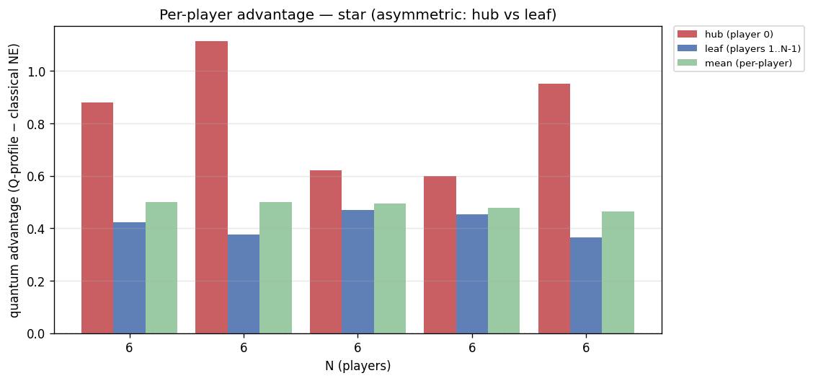
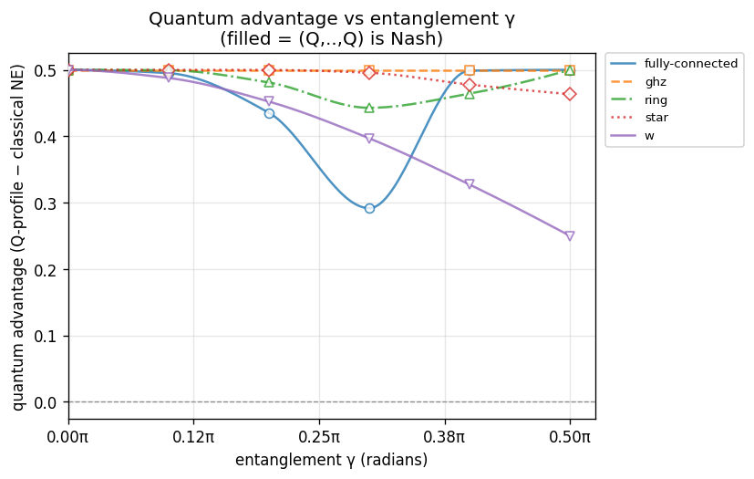
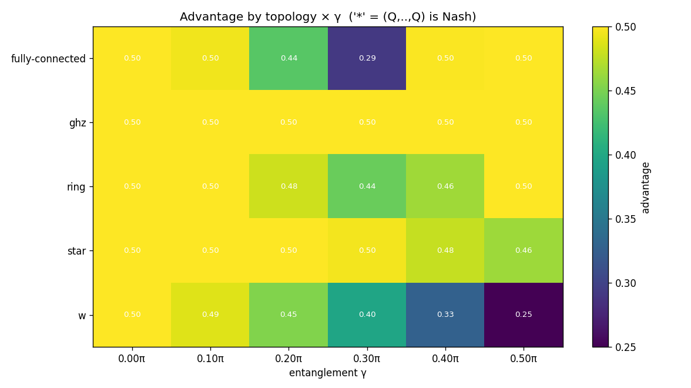

# Experiment report: gamma-sweep-N6

Quantum advantage vs entanglement γ at N=6 across ['fully-connected', 'ghz', 'ring', 'star', 'w']; γ swept 0π→0.5π (config.game.gamma)

_Generated: 2026-07-24T0406Z_

## Parameters used

```yaml
experiment:
  name: gamma-sweep-N6
  description: "Quantum advantage vs entanglement \u03B3 at N=6 across ['fully-connected',\
    \ 'ghz', 'ring', 'star', 'w']; \u03B3 swept 0\u03C0\u21920.5\u03C0 (config.game.gamma)"
generated_at: 2026-07-24T0406Z
output:
  formats:
  - md
  - json
  - csv
  - plots
cells:
- N: 6
  topology: fully-connected
  strategy_names:
  - D
  - H
  - Q
  V: 4.0
  C: 3.0
  gamma: 0.0
  gamma_label: "0\u03C0"
  strategy_mode: fixed
  noise_p: 0.0
- N: 6
  topology: fully-connected
  strategy_names:
  - D
  - H
  - Q
  V: 4.0
  C: 3.0
  gamma: 0.3141592653589793
  gamma_label: "0.1\u03C0"
  strategy_mode: fixed
  noise_p: 0.0
- N: 6
  topology: fully-connected
  strategy_names:
  - D
  - H
  - Q
  V: 4.0
  C: 3.0
  gamma: 0.6283185307179586
  gamma_label: "0.2\u03C0"
  strategy_mode: fixed
  noise_p: 0.0
- N: 6
  topology: fully-connected
  strategy_names:
  - D
  - H
  - Q
  V: 4.0
  C: 3.0
  gamma: 0.9424777960769379
  gamma_label: "0.3\u03C0"
  strategy_mode: fixed
  noise_p: 0.0
- N: 6
  topology: fully-connected
  strategy_names:
  - D
  - H
  - Q
  V: 4.0
  C: 3.0
  gamma: 1.2566370614359172
  gamma_label: "0.4\u03C0"
  strategy_mode: fixed
  noise_p: 0.0
- N: 6
  topology: fully-connected
  strategy_names:
  - D
  - H
  - Q
  V: 4.0
  C: 3.0
  gamma: 1.5707963267948966
  gamma_label: "0.5\u03C0"
  strategy_mode: fixed
  noise_p: 0.0
- N: 6
  topology: ghz
  strategy_names:
  - D
  - H
  - Q
  V: 4.0
  C: 3.0
  gamma: 0.0
  gamma_label: "0\u03C0"
  strategy_mode: fixed
  noise_p: 0.0
- N: 6
  topology: ghz
  strategy_names:
  - D
  - H
  - Q
  V: 4.0
  C: 3.0
  gamma: 0.3141592653589793
  gamma_label: "0.1\u03C0"
  strategy_mode: fixed
  noise_p: 0.0
- N: 6
  topology: ghz
  strategy_names:
  - D
  - H
  - Q
  V: 4.0
  C: 3.0
  gamma: 0.6283185307179586
  gamma_label: "0.2\u03C0"
  strategy_mode: fixed
  noise_p: 0.0
- N: 6
  topology: ghz
  strategy_names:
  - D
  - H
  - Q
  V: 4.0
  C: 3.0
  gamma: 0.9424777960769379
  gamma_label: "0.3\u03C0"
  strategy_mode: fixed
  noise_p: 0.0
- N: 6
  topology: ghz
  strategy_names:
  - D
  - H
  - Q
  V: 4.0
  C: 3.0
  gamma: 1.2566370614359172
  gamma_label: "0.4\u03C0"
  strategy_mode: fixed
  noise_p: 0.0
- N: 6
  topology: ghz
  strategy_names:
  - D
  - H
  - Q
  V: 4.0
  C: 3.0
  gamma: 1.5707963267948966
  gamma_label: "0.5\u03C0"
  strategy_mode: fixed
  noise_p: 0.0
- N: 6
  topology: ring
  strategy_names:
  - D
  - H
  - Q
  V: 4.0
  C: 3.0
  gamma: 0.0
  gamma_label: "0\u03C0"
  strategy_mode: fixed
  noise_p: 0.0
- N: 6
  topology: ring
  strategy_names:
  - D
  - H
  - Q
  V: 4.0
  C: 3.0
  gamma: 0.3141592653589793
  gamma_label: "0.1\u03C0"
  strategy_mode: fixed
  noise_p: 0.0
- N: 6
  topology: ring
  strategy_names:
  - D
  - H
  - Q
  V: 4.0
  C: 3.0
  gamma: 0.6283185307179586
  gamma_label: "0.2\u03C0"
  strategy_mode: fixed
  noise_p: 0.0
- N: 6
  topology: ring
  strategy_names:
  - D
  - H
  - Q
  V: 4.0
  C: 3.0
  gamma: 0.9424777960769379
  gamma_label: "0.3\u03C0"
  strategy_mode: fixed
  noise_p: 0.0
- N: 6
  topology: ring
  strategy_names:
  - D
  - H
  - Q
  V: 4.0
  C: 3.0
  gamma: 1.2566370614359172
  gamma_label: "0.4\u03C0"
  strategy_mode: fixed
  noise_p: 0.0
- N: 6
  topology: ring
  strategy_names:
  - D
  - H
  - Q
  V: 4.0
  C: 3.0
  gamma: 1.5707963267948966
  gamma_label: "0.5\u03C0"
  strategy_mode: fixed
  noise_p: 0.0
- N: 6
  topology: star
  strategy_names:
  - D
  - H
  - Q
  V: 4.0
  C: 3.0
  gamma: 0.0
  gamma_label: "0\u03C0"
  strategy_mode: fixed
  noise_p: 0.0
- N: 6
  topology: star
  strategy_names:
  - D
  - H
  - Q
  V: 4.0
  C: 3.0
  gamma: 0.3141592653589793
  gamma_label: "0.1\u03C0"
  strategy_mode: fixed
  noise_p: 0.0
- N: 6
  topology: star
  strategy_names:
  - D
  - H
  - Q
  V: 4.0
  C: 3.0
  gamma: 0.6283185307179586
  gamma_label: "0.2\u03C0"
  strategy_mode: fixed
  noise_p: 0.0
- N: 6
  topology: star
  strategy_names:
  - D
  - H
  - Q
  V: 4.0
  C: 3.0
  gamma: 0.9424777960769379
  gamma_label: "0.3\u03C0"
  strategy_mode: fixed
  noise_p: 0.0
- N: 6
  topology: star
  strategy_names:
  - D
  - H
  - Q
  V: 4.0
  C: 3.0
  gamma: 1.2566370614359172
  gamma_label: "0.4\u03C0"
  strategy_mode: fixed
  noise_p: 0.0
- N: 6
  topology: star
  strategy_names:
  - D
  - H
  - Q
  V: 4.0
  C: 3.0
  gamma: 1.5707963267948966
  gamma_label: "0.5\u03C0"
  strategy_mode: fixed
  noise_p: 0.0
- N: 6
  topology: w
  strategy_names:
  - D
  - H
  - Q
  V: 4.0
  C: 3.0
  gamma: 0.0
  gamma_label: "0\u03C0"
  strategy_mode: fixed
  noise_p: 0.0
- N: 6
  topology: w
  strategy_names:
  - D
  - H
  - Q
  V: 4.0
  C: 3.0
  gamma: 0.3141592653589793
  gamma_label: "0.1\u03C0"
  strategy_mode: fixed
  noise_p: 0.0
- N: 6
  topology: w
  strategy_names:
  - D
  - H
  - Q
  V: 4.0
  C: 3.0
  gamma: 0.6283185307179586
  gamma_label: "0.2\u03C0"
  strategy_mode: fixed
  noise_p: 0.0
- N: 6
  topology: w
  strategy_names:
  - D
  - H
  - Q
  V: 4.0
  C: 3.0
  gamma: 0.9424777960769379
  gamma_label: "0.3\u03C0"
  strategy_mode: fixed
  noise_p: 0.0
- N: 6
  topology: w
  strategy_names:
  - D
  - H
  - Q
  V: 4.0
  C: 3.0
  gamma: 1.2566370614359172
  gamma_label: "0.4\u03C0"
  strategy_mode: fixed
  noise_p: 0.0
- N: 6
  topology: w
  strategy_names:
  - D
  - H
  - Q
  V: 4.0
  C: 3.0
  gamma: 1.5707963267948966
  gamma_label: "0.5\u03C0"
  strategy_mode: fixed
  noise_p: 0.0
```

## Summary

| N | topology | V | C | gamma | noise_p | q_payoff | classical_ne | advantage | q_is_nash | symmetric | status |
|---|---|---|---|---|---|---|---|---|---|---|---|
| 6 | fully-connected | 4 | 3 | 0π | 0 | 0.666667 | 0.166667 | 0.500000 | **NO** | yes | ok |
| 6 | fully-connected | 4 | 3 | 0.1π | 0 | 0.661700 | 0.166667 | 0.495034 | **NO** | yes | ok |
| 6 | fully-connected | 4 | 3 | 0.2π | 0 | 0.602073 | 0.166667 | 0.435407 | **NO** | yes | ok |
| 6 | fully-connected | 4 | 3 | 0.3π | 0 | 0.458411 | 0.166667 | 0.291744 | **NO** | yes | ok |
| 6 | fully-connected | 4 | 3 | 0.4π | 0 | 0.665444 | 0.166667 | 0.498777 | **NO** | yes | ok |
| 6 | fully-connected | 4 | 3 | 0.5π | 0 | 0.666667 | 0.166667 | 0.500000 | **NO** | yes | ok |
| 6 | ghz | 4 | 3 | 0π | 0 | 0.666667 | 0.166667 | 0.500000 | **NO** | yes | ok |
| 6 | ghz | 4 | 3 | 0.1π | 0 | 0.666667 | 0.166667 | 0.500000 | **NO** | yes | ok |
| 6 | ghz | 4 | 3 | 0.2π | 0 | 0.666667 | 0.166667 | 0.500000 | **NO** | yes | ok |
| 6 | ghz | 4 | 3 | 0.3π | 0 | 0.666667 | 0.166667 | 0.500000 | **NO** | yes | ok |
| 6 | ghz | 4 | 3 | 0.4π | 0 | 0.666667 | 0.166667 | 0.500000 | **NO** | yes | ok |
| 6 | ghz | 4 | 3 | 0.5π | 0 | 0.666667 | 0.166667 | 0.500000 | **NO** | yes | ok |
| 6 | ring | 4 | 3 | 0π | 0 | 0.666667 | 0.166667 | 0.500000 | **NO** | yes | ok |
| 6 | ring | 4 | 3 | 0.1π | 0 | 0.666033 | 0.166667 | 0.499367 | **NO** | yes | ok |
| 6 | ring | 4 | 3 | 0.2π | 0 | 0.647657 | 0.166667 | 0.480990 | **NO** | yes | ok |
| 6 | ring | 4 | 3 | 0.3π | 0 | 0.609493 | 0.166667 | 0.442826 | **NO** | yes | ok |
| 6 | ring | 4 | 3 | 0.4π | 0 | 0.630959 | 0.166667 | 0.464293 | **NO** | yes | ok |
| 6 | ring | 4 | 3 | 0.5π | 0 | 0.666667 | 0.166667 | 0.500000 | **NO** | yes | ok |
| 6 | star | 4 | 3 | 0π | 0 | 0.666667 | 0.166667 | 0.500000 | **NO** | yes | ok |
| 6 | star | 4 | 3 | 0.1π | 0 | 0.666666 | 0.166667 | 0.500000 | **NO** | no | ok |
| 6 | star | 4 | 3 | 0.2π | 0 | 0.666486 | 0.166667 | 0.499820 | **NO** | no | ok |
| 6 | star | 4 | 3 | 0.3π | 0 | 0.662268 | 0.166667 | 0.495601 | **NO** | no | ok |
| 6 | star | 4 | 3 | 0.4π | 0 | 0.644495 | 0.166667 | 0.477829 | **NO** | no | ok |
| 6 | star | 4 | 3 | 0.5π | 0 | 0.630046 | 0.166667 | 0.463379 | **NO** | no | ok |
| 6 | w | 4 | 3 | 0π | 0 | 0.666667 | 0.166667 | 0.500000 | **NO** | yes | ok |
| 6 | w | 4 | 3 | 0.1π | 0 | 0.666667 | 0.178903 | 0.487764 | **NO** | yes | ok |
| 6 | w | 4 | 3 | 0.2π | 0 | 0.666667 | 0.214412 | 0.452254 | **NO** | yes | ok |
| 6 | w | 4 | 3 | 0.3π | 0 | 0.666667 | 0.269720 | 0.396946 | **NO** | yes | ok |
| 6 | w | 4 | 3 | 0.4π | 0 | 0.666667 | 0.339412 | 0.327254 | **NO** | yes | ok |
| 6 | w | 4 | 3 | 0.5π | 0 | 0.666667 | 0.416667 | 0.250000 | **NO** | yes | ok |

## Findings

- Evaluated **30** cells: 30 ran, 0 not-implemented, 0 errored.
- Quantum advantage > 0 in **30/30** computed cells.
- (Q,...,Q) is a pure Nash equilibrium in **0/30** computed cells.

**Cells where (Q,...,Q) is NOT Nash (RQ1 finding):**
  - N=6, fully-connected, gamma=0π
  - N=6, fully-connected, gamma=0.1π
  - N=6, fully-connected, gamma=0.2π
  - N=6, fully-connected, gamma=0.3π
  - N=6, fully-connected, gamma=0.4π
  - N=6, fully-connected, gamma=0.5π
  - N=6, ghz, gamma=0π
  - N=6, ghz, gamma=0.1π
  - N=6, ghz, gamma=0.2π
  - N=6, ghz, gamma=0.3π
  - N=6, ghz, gamma=0.4π
  - N=6, ghz, gamma=0.5π
  - N=6, ring, gamma=0π
  - N=6, ring, gamma=0.1π
  - N=6, ring, gamma=0.2π
  - N=6, ring, gamma=0.3π
  - N=6, ring, gamma=0.4π
  - N=6, ring, gamma=0.5π
  - N=6, star, gamma=0π
  - N=6, star, gamma=0.1π
  - N=6, star, gamma=0.2π
  - N=6, star, gamma=0.3π
  - N=6, star, gamma=0.4π
  - N=6, star, gamma=0.5π
  - N=6, w, gamma=0π
  - N=6, w, gamma=0.1π
  - N=6, w, gamma=0.2π
  - N=6, w, gamma=0.3π
  - N=6, w, gamma=0.4π
  - N=6, w, gamma=0.5π

**Entanglement (γ) thresholds** — smallest swept γ at which each series gains advantage / becomes a pure Nash equilibrium (the discovery: how much entanglement the quantum equilibrium needs):
  - fully-connected, N=6: advantage>0 from γ=0π; (Q,…,Q) never Nash in range
  - ghz, N=6: advantage>0 from γ=0π; (Q,…,Q) never Nash in range
  - ring, N=6: advantage>0 from γ=0π; (Q,…,Q) never Nash in range
  - star, N=6: advantage>0 from γ=0π; (Q,…,Q) never Nash in range
  - w, N=6: advantage>0 from γ=0π; (Q,…,Q) never Nash in range

## Plots





## Per-cell detail

### N=6 · fully-connected · gamma=0π (V=4, C=3)

- (Q,Q,Q,Q,Q,Q) mean per-player payoff: **0.666667**
- Classical NE mean payoff: **0.166667**
- Advantage (Q-profile − classical NE, mean): **0.500000**
- (Q,Q,Q,Q,Q,Q) is pure Nash: **False**
- Player-symmetric: **True**

Classical pure NE in {D,H}^N: (H,H,H,H,H,H)

All pure NE: (H,H,H,H,H,H)

Unilateral deviation table from (Q,...,Q):

| deviator | alt | dev payoff | Q payoff | Q dominates |
|---|---|---|---|---|
| player 0 | D | 0.666667 | 0.666667 | yes |
| player 0 | H | 4.000000 | 0.666667 | **NO — NASH VIOLATED** |
| player 1 | D | 0.666667 | 0.666667 | yes |
| player 1 | H | 4.000000 | 0.666667 | **NO — NASH VIOLATED** |
| player 2 | D | 0.666667 | 0.666667 | yes |
| player 2 | H | 4.000000 | 0.666667 | **NO — NASH VIOLATED** |
| player 3 | D | 0.666667 | 0.666667 | yes |
| player 3 | H | 4.000000 | 0.666667 | **NO — NASH VIOLATED** |
| player 4 | D | 0.666667 | 0.666667 | yes |
| player 4 | H | 4.000000 | 0.666667 | **NO — NASH VIOLATED** |
| player 5 | D | 0.666667 | 0.666667 | yes |
| player 5 | H | 4.000000 | 0.666667 | **NO — NASH VIOLATED** |

### N=6 · fully-connected · gamma=0.1π (V=4, C=3)

- (Q,Q,Q,Q,Q,Q) mean per-player payoff: **0.661700**
- Classical NE mean payoff: **0.166667**
- Advantage (Q-profile − classical NE, mean): **0.495034**
- (Q,Q,Q,Q,Q,Q) is pure Nash: **False**
- Player-symmetric: **True**

Classical pure NE in {D,H}^N: (H,H,H,H,H,H)

All pure NE: (H,H,H,H,H,H)

Unilateral deviation table from (Q,...,Q):

| deviator | alt | dev payoff | Q payoff | Q dominates |
|---|---|---|---|---|
| player 0 | D | 0.439513 | 0.661700 | yes |
| player 0 | H | 2.355412 | 0.661700 | **NO — NASH VIOLATED** |
| player 1 | D | 0.439513 | 0.661700 | yes |
| player 1 | H | 2.355412 | 0.661700 | **NO — NASH VIOLATED** |
| player 2 | D | 0.439513 | 0.661700 | yes |
| player 2 | H | 2.355412 | 0.661700 | **NO — NASH VIOLATED** |
| player 3 | D | 0.439513 | 0.661700 | yes |
| player 3 | H | 2.355412 | 0.661700 | **NO — NASH VIOLATED** |
| player 4 | D | 0.439513 | 0.661700 | yes |
| player 4 | H | 2.355412 | 0.661700 | **NO — NASH VIOLATED** |
| player 5 | D | 0.439513 | 0.661700 | yes |
| player 5 | H | 2.355412 | 0.661700 | **NO — NASH VIOLATED** |

### N=6 · fully-connected · gamma=0.2π (V=4, C=3)

- (Q,Q,Q,Q,Q,Q) mean per-player payoff: **0.602073**
- Classical NE mean payoff: **0.166667**
- Advantage (Q-profile − classical NE, mean): **0.435407**
- (Q,Q,Q,Q,Q,Q) is pure Nash: **False**
- Player-symmetric: **True**

Classical pure NE in {D,H}^N: (H,H,H,H,H,H)

All pure NE: (H,H,H,H,H,H)

Unilateral deviation table from (Q,...,Q):

| deviator | alt | dev payoff | Q payoff | Q dominates |
|---|---|---|---|---|
| player 0 | D | 0.529444 | 0.602073 | yes |
| player 0 | H | 0.772885 | 0.602073 | **NO — NASH VIOLATED** |
| player 1 | D | 0.529444 | 0.602073 | yes |
| player 1 | H | 0.772885 | 0.602073 | **NO — NASH VIOLATED** |
| player 2 | D | 0.529444 | 0.602073 | yes |
| player 2 | H | 0.772885 | 0.602073 | **NO — NASH VIOLATED** |
| player 3 | D | 0.529444 | 0.602073 | yes |
| player 3 | H | 0.772885 | 0.602073 | **NO — NASH VIOLATED** |
| player 4 | D | 0.529444 | 0.602073 | yes |
| player 4 | H | 0.772885 | 0.602073 | **NO — NASH VIOLATED** |
| player 5 | D | 0.529444 | 0.602073 | yes |
| player 5 | H | 0.772885 | 0.602073 | **NO — NASH VIOLATED** |

### N=6 · fully-connected · gamma=0.3π (V=4, C=3)

- (Q,Q,Q,Q,Q,Q) mean per-player payoff: **0.458411**
- Classical NE mean payoff: **0.166667**
- Advantage (Q-profile − classical NE, mean): **0.291744**
- (Q,Q,Q,Q,Q,Q) is pure Nash: **False**
- Player-symmetric: **True**

Classical pure NE in {D,H}^N: (H,H,H,H,H,H)

All pure NE: (H,H,H,H,H,Q), (H,H,H,H,Q,H), (H,H,H,Q,H,H), (H,H,Q,H,H,H), (H,Q,H,H,H,H), (Q,H,H,H,H,H)

Unilateral deviation table from (Q,...,Q):

| deviator | alt | dev payoff | Q payoff | Q dominates |
|---|---|---|---|---|
| player 0 | D | 0.731006 | 0.458411 | **NO — NASH VIOLATED** |
| player 0 | H | 0.382828 | 0.458411 | yes |
| player 1 | D | 0.731006 | 0.458411 | **NO — NASH VIOLATED** |
| player 1 | H | 0.382828 | 0.458411 | yes |
| player 2 | D | 0.731006 | 0.458411 | **NO — NASH VIOLATED** |
| player 2 | H | 0.382828 | 0.458411 | yes |
| player 3 | D | 0.731006 | 0.458411 | **NO — NASH VIOLATED** |
| player 3 | H | 0.382828 | 0.458411 | yes |
| player 4 | D | 0.731006 | 0.458411 | **NO — NASH VIOLATED** |
| player 4 | H | 0.382828 | 0.458411 | yes |
| player 5 | D | 0.731006 | 0.458411 | **NO — NASH VIOLATED** |
| player 5 | H | 0.382828 | 0.458411 | yes |

### N=6 · fully-connected · gamma=0.4π (V=4, C=3)

- (Q,Q,Q,Q,Q,Q) mean per-player payoff: **0.665444**
- Classical NE mean payoff: **0.166667**
- Advantage (Q-profile − classical NE, mean): **0.498777**
- (Q,Q,Q,Q,Q,Q) is pure Nash: **False**
- Player-symmetric: **True**

Classical pure NE in {D,H}^N: (H,H,H,H,H,H)

All pure NE: (none found)

Unilateral deviation table from (Q,...,Q):

| deviator | alt | dev payoff | Q payoff | Q dominates |
|---|---|---|---|---|
| player 0 | D | 0.582622 | 0.665444 | yes |
| player 0 | H | 1.369473 | 0.665444 | **NO — NASH VIOLATED** |
| player 1 | D | 0.582622 | 0.665444 | yes |
| player 1 | H | 1.369473 | 0.665444 | **NO — NASH VIOLATED** |
| player 2 | D | 0.582622 | 0.665444 | yes |
| player 2 | H | 1.369473 | 0.665444 | **NO — NASH VIOLATED** |
| player 3 | D | 0.582622 | 0.665444 | yes |
| player 3 | H | 1.369473 | 0.665444 | **NO — NASH VIOLATED** |
| player 4 | D | 0.582622 | 0.665444 | yes |
| player 4 | H | 1.369473 | 0.665444 | **NO — NASH VIOLATED** |
| player 5 | D | 0.582622 | 0.665444 | yes |
| player 5 | H | 1.369473 | 0.665444 | **NO — NASH VIOLATED** |

### N=6 · fully-connected · gamma=0.5π (V=4, C=3)

- (Q,Q,Q,Q,Q,Q) mean per-player payoff: **0.666667**
- Classical NE mean payoff: **0.166667**
- Advantage (Q-profile − classical NE, mean): **0.500000**
- (Q,Q,Q,Q,Q,Q) is pure Nash: **False**
- Player-symmetric: **True**

Classical pure NE in {D,H}^N: (H,H,H,H,H,H)

All pure NE: (none found)

Unilateral deviation table from (Q,...,Q):

| deviator | alt | dev payoff | Q payoff | Q dominates |
|---|---|---|---|---|
| player 0 | D | 0.541667 | 0.666667 | yes |
| player 0 | H | 3.000000 | 0.666667 | **NO — NASH VIOLATED** |
| player 1 | D | 0.541667 | 0.666667 | yes |
| player 1 | H | 3.000000 | 0.666667 | **NO — NASH VIOLATED** |
| player 2 | D | 0.541667 | 0.666667 | yes |
| player 2 | H | 3.000000 | 0.666667 | **NO — NASH VIOLATED** |
| player 3 | D | 0.541667 | 0.666667 | yes |
| player 3 | H | 3.000000 | 0.666667 | **NO — NASH VIOLATED** |
| player 4 | D | 0.541667 | 0.666667 | yes |
| player 4 | H | 3.000000 | 0.666667 | **NO — NASH VIOLATED** |
| player 5 | D | 0.541667 | 0.666667 | yes |
| player 5 | H | 3.000000 | 0.666667 | **NO — NASH VIOLATED** |

### N=6 · ghz · gamma=0π (V=4, C=3)

- (Q,Q,Q,Q,Q,Q) mean per-player payoff: **0.666667**
- Classical NE mean payoff: **0.166667**
- Advantage (Q-profile − classical NE, mean): **0.500000**
- (Q,Q,Q,Q,Q,Q) is pure Nash: **False**
- Player-symmetric: **True**

Classical pure NE in {D,H}^N: (H,H,H,H,H,H)

All pure NE: (H,H,H,H,H,H)

Unilateral deviation table from (Q,...,Q):

| deviator | alt | dev payoff | Q payoff | Q dominates |
|---|---|---|---|---|
| player 0 | D | 0.666667 | 0.666667 | yes |
| player 0 | H | 4.000000 | 0.666667 | **NO — NASH VIOLATED** |
| player 1 | D | 0.666667 | 0.666667 | yes |
| player 1 | H | 4.000000 | 0.666667 | **NO — NASH VIOLATED** |
| player 2 | D | 0.666667 | 0.666667 | yes |
| player 2 | H | 4.000000 | 0.666667 | **NO — NASH VIOLATED** |
| player 3 | D | 0.666667 | 0.666667 | yes |
| player 3 | H | 4.000000 | 0.666667 | **NO — NASH VIOLATED** |
| player 4 | D | 0.666667 | 0.666667 | yes |
| player 4 | H | 4.000000 | 0.666667 | **NO — NASH VIOLATED** |
| player 5 | D | 0.666667 | 0.666667 | yes |
| player 5 | H | 4.000000 | 0.666667 | **NO — NASH VIOLATED** |

### N=6 · ghz · gamma=0.1π (V=4, C=3)

- (Q,Q,Q,Q,Q,Q) mean per-player payoff: **0.666667**
- Classical NE mean payoff: **0.166667**
- Advantage (Q-profile − classical NE, mean): **0.500000**
- (Q,Q,Q,Q,Q,Q) is pure Nash: **False**
- Player-symmetric: **True**

Classical pure NE in {D,H}^N: (H,H,H,H,H,H)

All pure NE: (H,H,H,H,H,H)

Unilateral deviation table from (Q,...,Q):

| deviator | alt | dev payoff | Q payoff | Q dominates |
|---|---|---|---|---|
| player 0 | D | 0.654730 | 0.666667 | yes |
| player 0 | H | 3.904508 | 0.666667 | **NO — NASH VIOLATED** |
| player 1 | D | 0.654730 | 0.666667 | yes |
| player 1 | H | 3.904508 | 0.666667 | **NO — NASH VIOLATED** |
| player 2 | D | 0.654730 | 0.666667 | yes |
| player 2 | H | 3.904508 | 0.666667 | **NO — NASH VIOLATED** |
| player 3 | D | 0.654730 | 0.666667 | yes |
| player 3 | H | 3.904508 | 0.666667 | **NO — NASH VIOLATED** |
| player 4 | D | 0.654730 | 0.666667 | yes |
| player 4 | H | 3.904508 | 0.666667 | **NO — NASH VIOLATED** |
| player 5 | D | 0.654730 | 0.666667 | yes |
| player 5 | H | 3.904508 | 0.666667 | **NO — NASH VIOLATED** |

### N=6 · ghz · gamma=0.2π (V=4, C=3)

- (Q,Q,Q,Q,Q,Q) mean per-player payoff: **0.666667**
- Classical NE mean payoff: **0.166667**
- Advantage (Q-profile − classical NE, mean): **0.500000**
- (Q,Q,Q,Q,Q,Q) is pure Nash: **False**
- Player-symmetric: **True**

Classical pure NE in {D,H}^N: (H,H,H,H,H,H)

All pure NE: (H,H,H,H,H,Q), (H,H,H,H,Q,H), (H,H,H,Q,H,H), (H,H,Q,H,H,H), (H,Q,H,H,H,H), (Q,H,H,H,H,H)

Unilateral deviation table from (Q,...,Q):

| deviator | alt | dev payoff | Q payoff | Q dominates |
|---|---|---|---|---|
| player 0 | D | 0.623480 | 0.666667 | yes |
| player 0 | H | 3.654508 | 0.666667 | **NO — NASH VIOLATED** |
| player 1 | D | 0.623480 | 0.666667 | yes |
| player 1 | H | 3.654508 | 0.666667 | **NO — NASH VIOLATED** |
| player 2 | D | 0.623480 | 0.666667 | yes |
| player 2 | H | 3.654508 | 0.666667 | **NO — NASH VIOLATED** |
| player 3 | D | 0.623480 | 0.666667 | yes |
| player 3 | H | 3.654508 | 0.666667 | **NO — NASH VIOLATED** |
| player 4 | D | 0.623480 | 0.666667 | yes |
| player 4 | H | 3.654508 | 0.666667 | **NO — NASH VIOLATED** |
| player 5 | D | 0.623480 | 0.666667 | yes |
| player 5 | H | 3.654508 | 0.666667 | **NO — NASH VIOLATED** |

### N=6 · ghz · gamma=0.3π (V=4, C=3)

- (Q,Q,Q,Q,Q,Q) mean per-player payoff: **0.666667**
- Classical NE mean payoff: **0.166667**
- Advantage (Q-profile − classical NE, mean): **0.500000**
- (Q,Q,Q,Q,Q,Q) is pure Nash: **False**
- Player-symmetric: **True**

Classical pure NE in {D,H}^N: (H,H,H,H,H,H)

All pure NE: (none found)

Unilateral deviation table from (Q,...,Q):

| deviator | alt | dev payoff | Q payoff | Q dominates |
|---|---|---|---|---|
| player 0 | D | 0.584853 | 0.666667 | yes |
| player 0 | H | 3.345492 | 0.666667 | **NO — NASH VIOLATED** |
| player 1 | D | 0.584853 | 0.666667 | yes |
| player 1 | H | 3.345492 | 0.666667 | **NO — NASH VIOLATED** |
| player 2 | D | 0.584853 | 0.666667 | yes |
| player 2 | H | 3.345492 | 0.666667 | **NO — NASH VIOLATED** |
| player 3 | D | 0.584853 | 0.666667 | yes |
| player 3 | H | 3.345492 | 0.666667 | **NO — NASH VIOLATED** |
| player 4 | D | 0.584853 | 0.666667 | yes |
| player 4 | H | 3.345492 | 0.666667 | **NO — NASH VIOLATED** |
| player 5 | D | 0.584853 | 0.666667 | yes |
| player 5 | H | 3.345492 | 0.666667 | **NO — NASH VIOLATED** |

### N=6 · ghz · gamma=0.4π (V=4, C=3)

- (Q,Q,Q,Q,Q,Q) mean per-player payoff: **0.666667**
- Classical NE mean payoff: **0.166667**
- Advantage (Q-profile − classical NE, mean): **0.500000**
- (Q,Q,Q,Q,Q,Q) is pure Nash: **False**
- Player-symmetric: **True**

Classical pure NE in {D,H}^N: (H,H,H,H,H,H)

All pure NE: (D,D,H,Q,Q,Q), (D,D,Q,H,Q,Q), (D,D,Q,Q,H,Q), (D,D,Q,Q,Q,H), (D,H,D,Q,Q,Q), (D,H,Q,D,Q,Q), (D,H,Q,Q,D,Q), (D,H,Q,Q,Q,D), (D,Q,D,H,Q,Q), (D,Q,D,Q,H,Q), (D,Q,D,Q,Q,H), (D,Q,H,D,Q,Q), (D,Q,H,Q,D,Q), (D,Q,H,Q,Q,D), (D,Q,Q,D,H,Q), (D,Q,Q,D,Q,H), (D,Q,Q,H,D,Q), (D,Q,Q,H,Q,D), (D,Q,Q,Q,D,H), (D,Q,Q,Q,H,D), (H,D,D,Q,Q,Q), (H,D,Q,D,Q,Q), (H,D,Q,Q,D,Q), (H,D,Q,Q,Q,D), (H,Q,D,D,Q,Q), (H,Q,D,Q,D,Q), (H,Q,D,Q,Q,D), (H,Q,Q,D,D,Q), (H,Q,Q,D,Q,D), (H,Q,Q,Q,D,D), (Q,D,D,H,Q,Q), (Q,D,D,Q,H,Q), (Q,D,D,Q,Q,H), (Q,D,H,D,Q,Q), (Q,D,H,Q,D,Q), (Q,D,H,Q,Q,D), (Q,D,Q,D,H,Q), (Q,D,Q,D,Q,H), (Q,D,Q,H,D,Q), (Q,D,Q,H,Q,D), (Q,D,Q,Q,D,H), (Q,D,Q,Q,H,D), (Q,H,D,D,Q,Q), (Q,H,D,Q,D,Q), (Q,H,D,Q,Q,D), (Q,H,Q,D,D,Q), (Q,H,Q,D,Q,D), (Q,H,Q,Q,D,D), (Q,Q,D,D,H,Q), (Q,Q,D,D,Q,H), (Q,Q,D,H,D,Q), (Q,Q,D,H,Q,D), (Q,Q,D,Q,D,H), (Q,Q,D,Q,H,D), (Q,Q,H,D,D,Q), (Q,Q,H,D,Q,D), (Q,Q,H,Q,D,D), (Q,Q,Q,D,D,H), (Q,Q,Q,D,H,D), (Q,Q,Q,H,D,D)

Unilateral deviation table from (Q,...,Q):

| deviator | alt | dev payoff | Q payoff | Q dominates |
|---|---|---|---|---|
| player 0 | D | 0.553603 | 0.666667 | yes |
| player 0 | H | 3.095492 | 0.666667 | **NO — NASH VIOLATED** |
| player 1 | D | 0.553603 | 0.666667 | yes |
| player 1 | H | 3.095492 | 0.666667 | **NO — NASH VIOLATED** |
| player 2 | D | 0.553603 | 0.666667 | yes |
| player 2 | H | 3.095492 | 0.666667 | **NO — NASH VIOLATED** |
| player 3 | D | 0.553603 | 0.666667 | yes |
| player 3 | H | 3.095492 | 0.666667 | **NO — NASH VIOLATED** |
| player 4 | D | 0.553603 | 0.666667 | yes |
| player 4 | H | 3.095492 | 0.666667 | **NO — NASH VIOLATED** |
| player 5 | D | 0.553603 | 0.666667 | yes |
| player 5 | H | 3.095492 | 0.666667 | **NO — NASH VIOLATED** |

### N=6 · ghz · gamma=0.5π (V=4, C=3)

- (Q,Q,Q,Q,Q,Q) mean per-player payoff: **0.666667**
- Classical NE mean payoff: **0.166667**
- Advantage (Q-profile − classical NE, mean): **0.500000**
- (Q,Q,Q,Q,Q,Q) is pure Nash: **False**
- Player-symmetric: **True**

Classical pure NE in {D,H}^N: (H,H,H,H,H,H)

All pure NE: (none found)

Unilateral deviation table from (Q,...,Q):

| deviator | alt | dev payoff | Q payoff | Q dominates |
|---|---|---|---|---|
| player 0 | D | 0.541667 | 0.666667 | yes |
| player 0 | H | 3.000000 | 0.666667 | **NO — NASH VIOLATED** |
| player 1 | D | 0.541667 | 0.666667 | yes |
| player 1 | H | 3.000000 | 0.666667 | **NO — NASH VIOLATED** |
| player 2 | D | 0.541667 | 0.666667 | yes |
| player 2 | H | 3.000000 | 0.666667 | **NO — NASH VIOLATED** |
| player 3 | D | 0.541667 | 0.666667 | yes |
| player 3 | H | 3.000000 | 0.666667 | **NO — NASH VIOLATED** |
| player 4 | D | 0.541667 | 0.666667 | yes |
| player 4 | H | 3.000000 | 0.666667 | **NO — NASH VIOLATED** |
| player 5 | D | 0.541667 | 0.666667 | yes |
| player 5 | H | 3.000000 | 0.666667 | **NO — NASH VIOLATED** |

### N=6 · ring · gamma=0π (V=4, C=3)

- (Q,Q,Q,Q,Q,Q) mean per-player payoff: **0.666667**
- Classical NE mean payoff: **0.166667**
- Advantage (Q-profile − classical NE, mean): **0.500000**
- (Q,Q,Q,Q,Q,Q) is pure Nash: **False**
- Player-symmetric: **True**

Classical pure NE in {D,H}^N: (H,H,H,H,H,H)

All pure NE: (H,H,H,H,H,H)

Unilateral deviation table from (Q,...,Q):

| deviator | alt | dev payoff | Q payoff | Q dominates |
|---|---|---|---|---|
| player 0 | D | 0.666667 | 0.666667 | yes |
| player 0 | H | 4.000000 | 0.666667 | **NO — NASH VIOLATED** |
| player 1 | D | 0.666667 | 0.666667 | yes |
| player 1 | H | 4.000000 | 0.666667 | **NO — NASH VIOLATED** |
| player 2 | D | 0.666667 | 0.666667 | yes |
| player 2 | H | 4.000000 | 0.666667 | **NO — NASH VIOLATED** |
| player 3 | D | 0.666667 | 0.666667 | yes |
| player 3 | H | 4.000000 | 0.666667 | **NO — NASH VIOLATED** |
| player 4 | D | 0.666667 | 0.666667 | yes |
| player 4 | H | 4.000000 | 0.666667 | **NO — NASH VIOLATED** |
| player 5 | D | 0.666667 | 0.666667 | yes |
| player 5 | H | 4.000000 | 0.666667 | **NO — NASH VIOLATED** |

### N=6 · ring · gamma=0.1π (V=4, C=3)

- (Q,Q,Q,Q,Q,Q) mean per-player payoff: **0.666033**
- Classical NE mean payoff: **0.166667**
- Advantage (Q-profile − classical NE, mean): **0.499367**
- (Q,Q,Q,Q,Q,Q) is pure Nash: **False**
- Player-symmetric: **True**

Classical pure NE in {D,H}^N: (H,H,H,H,H,H)

All pure NE: (H,H,H,H,H,H)

Unilateral deviation table from (Q,...,Q):

| deviator | alt | dev payoff | Q payoff | Q dominates |
|---|---|---|---|---|
| player 0 | D | 0.557745 | 0.666033 | yes |
| player 0 | H | 3.160509 | 0.666033 | **NO — NASH VIOLATED** |
| player 1 | D | 0.557745 | 0.666033 | yes |
| player 1 | H | 3.160509 | 0.666033 | **NO — NASH VIOLATED** |
| player 2 | D | 0.557745 | 0.666033 | yes |
| player 2 | H | 3.160509 | 0.666033 | **NO — NASH VIOLATED** |
| player 3 | D | 0.557745 | 0.666033 | yes |
| player 3 | H | 3.160509 | 0.666033 | **NO — NASH VIOLATED** |
| player 4 | D | 0.557745 | 0.666033 | yes |
| player 4 | H | 3.160509 | 0.666033 | **NO — NASH VIOLATED** |
| player 5 | D | 0.557745 | 0.666033 | yes |
| player 5 | H | 3.160509 | 0.666033 | **NO — NASH VIOLATED** |

### N=6 · ring · gamma=0.2π (V=4, C=3)

- (Q,Q,Q,Q,Q,Q) mean per-player payoff: **0.647657**
- Classical NE mean payoff: **0.166667**
- Advantage (Q-profile − classical NE, mean): **0.480990**
- (Q,Q,Q,Q,Q,Q) is pure Nash: **False**
- Player-symmetric: **True**

Classical pure NE in {D,H}^N: (H,H,H,H,H,H)

All pure NE: (H,H,H,H,H,H)

Unilateral deviation table from (Q,...,Q):

| deviator | alt | dev payoff | Q payoff | Q dominates |
|---|---|---|---|---|
| player 0 | D | 0.410498 | 0.647657 | yes |
| player 0 | H | 1.841862 | 0.647657 | **NO — NASH VIOLATED** |
| player 1 | D | 0.410498 | 0.647657 | yes |
| player 1 | H | 1.841862 | 0.647657 | **NO — NASH VIOLATED** |
| player 2 | D | 0.410498 | 0.647657 | yes |
| player 2 | H | 1.841862 | 0.647657 | **NO — NASH VIOLATED** |
| player 3 | D | 0.410498 | 0.647657 | yes |
| player 3 | H | 1.841862 | 0.647657 | **NO — NASH VIOLATED** |
| player 4 | D | 0.410498 | 0.647657 | yes |
| player 4 | H | 1.841862 | 0.647657 | **NO — NASH VIOLATED** |
| player 5 | D | 0.410498 | 0.647657 | yes |
| player 5 | H | 1.841862 | 0.647657 | **NO — NASH VIOLATED** |

### N=6 · ring · gamma=0.3π (V=4, C=3)

- (Q,Q,Q,Q,Q,Q) mean per-player payoff: **0.609493**
- Classical NE mean payoff: **0.166667**
- Advantage (Q-profile − classical NE, mean): **0.442826**
- (Q,Q,Q,Q,Q,Q) is pure Nash: **False**
- Player-symmetric: **True**

Classical pure NE in {D,H}^N: (H,H,H,H,H,H)

All pure NE: (H,H,H,H,H,H)

Unilateral deviation table from (Q,...,Q):

| deviator | alt | dev payoff | Q payoff | Q dominates |
|---|---|---|---|---|
| player 0 | D | 0.432263 | 0.609493 | yes |
| player 0 | H | 1.331967 | 0.609493 | **NO — NASH VIOLATED** |
| player 1 | D | 0.432263 | 0.609493 | yes |
| player 1 | H | 1.331967 | 0.609493 | **NO — NASH VIOLATED** |
| player 2 | D | 0.432263 | 0.609493 | yes |
| player 2 | H | 1.331967 | 0.609493 | **NO — NASH VIOLATED** |
| player 3 | D | 0.432263 | 0.609493 | yes |
| player 3 | H | 1.331967 | 0.609493 | **NO — NASH VIOLATED** |
| player 4 | D | 0.432263 | 0.609493 | yes |
| player 4 | H | 1.331967 | 0.609493 | **NO — NASH VIOLATED** |
| player 5 | D | 0.432263 | 0.609493 | yes |
| player 5 | H | 1.331967 | 0.609493 | **NO — NASH VIOLATED** |

### N=6 · ring · gamma=0.4π (V=4, C=3)

- (Q,Q,Q,Q,Q,Q) mean per-player payoff: **0.630959**
- Classical NE mean payoff: **0.166667**
- Advantage (Q-profile − classical NE, mean): **0.464293**
- (Q,Q,Q,Q,Q,Q) is pure Nash: **False**
- Player-symmetric: **True**

Classical pure NE in {D,H}^N: (H,H,H,H,H,H)

All pure NE: (H,H,H,H,H,H)

Unilateral deviation table from (Q,...,Q):

| deviator | alt | dev payoff | Q payoff | Q dominates |
|---|---|---|---|---|
| player 0 | D | 0.622207 | 0.630959 | yes |
| player 0 | H | 1.377925 | 0.630959 | **NO — NASH VIOLATED** |
| player 1 | D | 0.622207 | 0.630959 | yes |
| player 1 | H | 1.377925 | 0.630959 | **NO — NASH VIOLATED** |
| player 2 | D | 0.622207 | 0.630959 | yes |
| player 2 | H | 1.377925 | 0.630959 | **NO — NASH VIOLATED** |
| player 3 | D | 0.622207 | 0.630959 | yes |
| player 3 | H | 1.377925 | 0.630959 | **NO — NASH VIOLATED** |
| player 4 | D | 0.622207 | 0.630959 | yes |
| player 4 | H | 1.377925 | 0.630959 | **NO — NASH VIOLATED** |
| player 5 | D | 0.622207 | 0.630959 | yes |
| player 5 | H | 1.377925 | 0.630959 | **NO — NASH VIOLATED** |

### N=6 · ring · gamma=0.5π (V=4, C=3)

- (Q,Q,Q,Q,Q,Q) mean per-player payoff: **0.666667**
- Classical NE mean payoff: **0.166667**
- Advantage (Q-profile − classical NE, mean): **0.500000**
- (Q,Q,Q,Q,Q,Q) is pure Nash: **False**
- Player-symmetric: **True**

Classical pure NE in {D,H}^N: (H,H,H,H,H,H)

All pure NE: (H,H,H,H,H,H)

Unilateral deviation table from (Q,...,Q):

| deviator | alt | dev payoff | Q payoff | Q dominates |
|---|---|---|---|---|
| player 0 | D | 0.750000 | 0.666667 | **NO — NASH VIOLATED** |
| player 0 | H | 1.445833 | 0.666667 | **NO — NASH VIOLATED** |
| player 1 | D | 0.750000 | 0.666667 | **NO — NASH VIOLATED** |
| player 1 | H | 1.445833 | 0.666667 | **NO — NASH VIOLATED** |
| player 2 | D | 0.750000 | 0.666667 | **NO — NASH VIOLATED** |
| player 2 | H | 1.445833 | 0.666667 | **NO — NASH VIOLATED** |
| player 3 | D | 0.750000 | 0.666667 | **NO — NASH VIOLATED** |
| player 3 | H | 1.445833 | 0.666667 | **NO — NASH VIOLATED** |
| player 4 | D | 0.750000 | 0.666667 | **NO — NASH VIOLATED** |
| player 4 | H | 1.445833 | 0.666667 | **NO — NASH VIOLATED** |
| player 5 | D | 0.750000 | 0.666667 | **NO — NASH VIOLATED** |
| player 5 | H | 1.445833 | 0.666667 | **NO — NASH VIOLATED** |

### N=6 · star · gamma=0π (V=4, C=3)

- (Q,Q,Q,Q,Q,Q) mean per-player payoff: **0.666667**
- Classical NE mean payoff: **0.166667**
- Advantage (Q-profile − classical NE, mean): **0.500000**
- (Q,Q,Q,Q,Q,Q) is pure Nash: **False**
- Player-symmetric: **True**

Classical pure NE in {D,H}^N: (H,H,H,H,H,H)

All pure NE: (H,H,H,H,H,H)

Unilateral deviation table from (Q,...,Q):

| deviator | alt | dev payoff | Q payoff | Q dominates |
|---|---|---|---|---|
| player 0 | D | 0.666667 | 0.666667 | yes |
| player 0 | H | 4.000000 | 0.666667 | **NO — NASH VIOLATED** |
| player 1 | D | 0.666667 | 0.666667 | yes |
| player 1 | H | 4.000000 | 0.666667 | **NO — NASH VIOLATED** |
| player 2 | D | 0.666667 | 0.666667 | yes |
| player 2 | H | 4.000000 | 0.666667 | **NO — NASH VIOLATED** |
| player 3 | D | 0.666667 | 0.666667 | yes |
| player 3 | H | 4.000000 | 0.666667 | **NO — NASH VIOLATED** |
| player 4 | D | 0.666667 | 0.666667 | yes |
| player 4 | H | 4.000000 | 0.666667 | **NO — NASH VIOLATED** |
| player 5 | D | 0.666667 | 0.666667 | yes |
| player 5 | H | 4.000000 | 0.666667 | **NO — NASH VIOLATED** |

### N=6 · star · gamma=0.1π (V=4, C=3)

- (Q,Q,Q,Q,Q,Q) mean per-player payoff: **0.666666**
- Classical NE mean payoff: **0.166667**
- Advantage (Q-profile − classical NE, mean): **0.500000**
- (Q,Q,Q,Q,Q,Q) is pure Nash: **False**
- Player-symmetric: **False**

**Per-player breakdown (asymmetric topology):**

- Q payoff vector: [1.0463, 0.5907, 0.5907, 0.5907, 0.5907, 0.5907]
- Classical NE payoff vector: [0.1667, 0.1667, 0.1667, 0.1667, 0.1667, 0.1667]
- Advantage vector: [0.8796, 0.4241, 0.4241, 0.4241, 0.4241, 0.4241]

Classical pure NE in {D,H}^N: (H,H,H,H,H,H)

All pure NE: (H,H,H,H,H,H)

Unilateral deviation table from (Q,...,Q):

| deviator | alt | dev payoff | Q payoff | Q dominates |
|---|---|---|---|---|
| player 0 | D | 0.807665 | 1.046297 | yes |
| player 0 | H | 3.551870 | 1.046297 | **NO — NASH VIOLATED** |
| player 1 | D | 0.535025 | 0.590740 | yes |
| player 1 | H | 3.253218 | 0.590740 | **NO — NASH VIOLATED** |
| player 2 | D | 0.535025 | 0.590740 | yes |
| player 2 | H | 3.253218 | 0.590740 | **NO — NASH VIOLATED** |
| player 3 | D | 0.535025 | 0.590740 | yes |
| player 3 | H | 3.253218 | 0.590740 | **NO — NASH VIOLATED** |
| player 4 | D | 0.535025 | 0.590740 | yes |
| player 4 | H | 3.253218 | 0.590740 | **NO — NASH VIOLATED** |
| player 5 | D | 0.535025 | 0.590740 | yes |
| player 5 | H | 3.253218 | 0.590740 | **NO — NASH VIOLATED** |

### N=6 · star · gamma=0.2π (V=4, C=3)

- (Q,Q,Q,Q,Q,Q) mean per-player payoff: **0.666486**
- Classical NE mean payoff: **0.166667**
- Advantage (Q-profile − classical NE, mean): **0.499820**
- (Q,Q,Q,Q,Q,Q) is pure Nash: **False**
- Player-symmetric: **False**

**Per-player breakdown (asymmetric topology):**

- Q payoff vector: [1.2811, 0.5436, 0.5436, 0.5436, 0.5436, 0.5436]
- Classical NE payoff vector: [0.1667, 0.1667, 0.1667, 0.1667, 0.1667, 0.1667]
- Advantage vector: [1.1144, 0.3769, 0.3769, 0.3769, 0.3769, 0.3769]

Classical pure NE in {D,H}^N: (H,H,H,H,H,H)

All pure NE: (H,H,H,H,H,H)

Unilateral deviation table from (Q,...,Q):

| deviator | alt | dev payoff | Q payoff | Q dominates |
|---|---|---|---|---|
| player 0 | D | 1.031560 | 1.281050 | yes |
| player 0 | H | 2.622334 | 1.281050 | **NO — NASH VIOLATED** |
| player 1 | D | 0.386779 | 0.543574 | yes |
| player 1 | H | 2.169561 | 0.543574 | **NO — NASH VIOLATED** |
| player 2 | D | 0.386779 | 0.543574 | yes |
| player 2 | H | 2.169561 | 0.543574 | **NO — NASH VIOLATED** |
| player 3 | D | 0.386779 | 0.543574 | yes |
| player 3 | H | 2.169561 | 0.543574 | **NO — NASH VIOLATED** |
| player 4 | D | 0.386779 | 0.543574 | yes |
| player 4 | H | 2.169561 | 0.543574 | **NO — NASH VIOLATED** |
| player 5 | D | 0.386779 | 0.543574 | yes |
| player 5 | H | 2.169561 | 0.543574 | **NO — NASH VIOLATED** |

### N=6 · star · gamma=0.3π (V=4, C=3)

- (Q,Q,Q,Q,Q,Q) mean per-player payoff: **0.662268**
- Classical NE mean payoff: **0.166667**
- Advantage (Q-profile − classical NE, mean): **0.495601**
- (Q,Q,Q,Q,Q,Q) is pure Nash: **False**
- Player-symmetric: **False**

**Per-player breakdown (asymmetric topology):**

- Q payoff vector: [0.7889, 0.6369, 0.6369, 0.6369, 0.6369, 0.6369]
- Classical NE payoff vector: [0.1667, 0.1667, 0.1667, 0.1667, 0.1667, 0.1667]
- Advantage vector: [0.6223, 0.4703, 0.4703, 0.4703, 0.4703, 0.4703]

Classical pure NE in {D,H}^N: (H,H,H,H,H,H)

All pure NE: (Q,H,H,H,H,H)

Unilateral deviation table from (Q,...,Q):

| deviator | alt | dev payoff | Q payoff | Q dominates |
|---|---|---|---|---|
| player 0 | D | 1.104178 | 0.788944 | **NO — NASH VIOLATED** |
| player 0 | H | 1.848297 | 0.788944 | **NO — NASH VIOLATED** |
| player 1 | D | 0.397672 | 0.636933 | yes |
| player 1 | H | 1.864055 | 0.636933 | **NO — NASH VIOLATED** |
| player 2 | D | 0.397672 | 0.636933 | yes |
| player 2 | H | 1.864055 | 0.636933 | **NO — NASH VIOLATED** |
| player 3 | D | 0.397672 | 0.636933 | yes |
| player 3 | H | 1.864055 | 0.636933 | **NO — NASH VIOLATED** |
| player 4 | D | 0.397672 | 0.636933 | yes |
| player 4 | H | 1.864055 | 0.636933 | **NO — NASH VIOLATED** |
| player 5 | D | 0.397672 | 0.636933 | yes |
| player 5 | H | 1.864055 | 0.636933 | **NO — NASH VIOLATED** |

### N=6 · star · gamma=0.4π (V=4, C=3)

- (Q,Q,Q,Q,Q,Q) mean per-player payoff: **0.644495**
- Classical NE mean payoff: **0.166667**
- Advantage (Q-profile − classical NE, mean): **0.477829**
- (Q,Q,Q,Q,Q,Q) is pure Nash: **False**
- Player-symmetric: **False**

**Per-player breakdown (asymmetric topology):**

- Q payoff vector: [0.7661, 0.6202, 0.6202, 0.6202, 0.6202, 0.6202]
- Classical NE payoff vector: [0.1667, 0.1667, 0.1667, 0.1667, 0.1667, 0.1667]
- Advantage vector: [0.5994, 0.4535, 0.4535, 0.4535, 0.4535, 0.4535]

Classical pure NE in {D,H}^N: (H,H,H,H,H,H)

All pure NE: (H,H,H,H,H,Q), (H,H,H,H,Q,H), (H,H,H,Q,H,H), (H,H,Q,H,H,H), (H,Q,H,H,H,H), (Q,H,H,H,H,H)

Unilateral deviation table from (Q,...,Q):

| deviator | alt | dev payoff | Q payoff | Q dominates |
|---|---|---|---|---|
| player 0 | D | 1.065400 | 0.766072 | **NO — NASH VIOLATED** |
| player 0 | H | 1.434286 | 0.766072 | **NO — NASH VIOLATED** |
| player 1 | D | 0.393551 | 0.620180 | yes |
| player 1 | H | 1.757258 | 0.620180 | **NO — NASH VIOLATED** |
| player 2 | D | 0.393551 | 0.620180 | yes |
| player 2 | H | 1.757258 | 0.620180 | **NO — NASH VIOLATED** |
| player 3 | D | 0.393551 | 0.620180 | yes |
| player 3 | H | 1.757258 | 0.620180 | **NO — NASH VIOLATED** |
| player 4 | D | 0.393551 | 0.620180 | yes |
| player 4 | H | 1.757258 | 0.620180 | **NO — NASH VIOLATED** |
| player 5 | D | 0.393551 | 0.620180 | yes |
| player 5 | H | 1.757258 | 0.620180 | **NO — NASH VIOLATED** |

### N=6 · star · gamma=0.5π (V=4, C=3)

- (Q,Q,Q,Q,Q,Q) mean per-player payoff: **0.630046**
- Classical NE mean payoff: **0.166667**
- Advantage (Q-profile − classical NE, mean): **0.463379**
- (Q,Q,Q,Q,Q,Q) is pure Nash: **False**
- Player-symmetric: **False**

**Per-player breakdown (asymmetric topology):**

- Q payoff vector: [1.1183, 0.5324, 0.5324, 0.5324, 0.5324, 0.5324]
- Classical NE payoff vector: [0.1667, 0.1667, 0.1667, 0.1667, 0.1667, 0.1667]
- Advantage vector: [0.9517, 0.3657, 0.3657, 0.3657, 0.3657, 0.3657]

Classical pure NE in {D,H}^N: (H,H,H,H,H,H)

All pure NE: (H,H,H,H,H,Q), (H,H,H,H,Q,H), (H,H,H,Q,H,H), (H,H,Q,H,H,H), (H,Q,H,H,H,H), (Q,H,H,H,H,H)

Unilateral deviation table from (Q,...,Q):

| deviator | alt | dev payoff | Q payoff | Q dominates |
|---|---|---|---|---|
| player 0 | D | 1.037272 | 1.118327 | yes |
| player 0 | H | 1.312500 | 1.118327 | **NO — NASH VIOLATED** |
| player 1 | D | 0.354980 | 0.532389 | yes |
| player 1 | H | 1.612500 | 0.532389 | **NO — NASH VIOLATED** |
| player 2 | D | 0.354980 | 0.532389 | yes |
| player 2 | H | 1.612500 | 0.532389 | **NO — NASH VIOLATED** |
| player 3 | D | 0.354980 | 0.532389 | yes |
| player 3 | H | 1.612500 | 0.532389 | **NO — NASH VIOLATED** |
| player 4 | D | 0.354980 | 0.532389 | yes |
| player 4 | H | 1.612500 | 0.532389 | **NO — NASH VIOLATED** |
| player 5 | D | 0.354980 | 0.532389 | yes |
| player 5 | H | 1.612500 | 0.532389 | **NO — NASH VIOLATED** |

### N=6 · w · gamma=0π (V=4, C=3)

- (Q,Q,Q,Q,Q,Q) mean per-player payoff: **0.666667**
- Classical NE mean payoff: **0.166667**
- Advantage (Q-profile − classical NE, mean): **0.500000**
- (Q,Q,Q,Q,Q,Q) is pure Nash: **False**
- Player-symmetric: **True**

Classical pure NE in {D,H}^N: (H,H,H,H,H,H)

All pure NE: (H,H,H,H,H,H)

Unilateral deviation table from (Q,...,Q):

| deviator | alt | dev payoff | Q payoff | Q dominates |
|---|---|---|---|---|
| player 0 | D | 0.666667 | 0.666667 | yes |
| player 0 | H | 4.000000 | 0.666667 | **NO — NASH VIOLATED** |
| player 1 | D | 0.666667 | 0.666667 | yes |
| player 1 | H | 4.000000 | 0.666667 | **NO — NASH VIOLATED** |
| player 2 | D | 0.666667 | 0.666667 | yes |
| player 2 | H | 4.000000 | 0.666667 | **NO — NASH VIOLATED** |
| player 3 | D | 0.666667 | 0.666667 | yes |
| player 3 | H | 4.000000 | 0.666667 | **NO — NASH VIOLATED** |
| player 4 | D | 0.666667 | 0.666667 | yes |
| player 4 | H | 4.000000 | 0.666667 | **NO — NASH VIOLATED** |
| player 5 | D | 0.666667 | 0.666667 | yes |
| player 5 | H | 4.000000 | 0.666667 | **NO — NASH VIOLATED** |

### N=6 · w · gamma=0.1π (V=4, C=3)

- (Q,Q,Q,Q,Q,Q) mean per-player payoff: **0.666667**
- Classical NE mean payoff: **0.178903**
- Advantage (Q-profile − classical NE, mean): **0.487764**
- (Q,Q,Q,Q,Q,Q) is pure Nash: **False**
- Player-symmetric: **True**

Classical pure NE in {D,H}^N: (H,H,H,H,H,H)

All pure NE: (H,H,H,H,H,H)

Unilateral deviation table from (Q,...,Q):

| deviator | alt | dev payoff | Q payoff | Q dominates |
|---|---|---|---|---|
| player 0 | D | 0.653626 | 0.666667 | yes |
| player 0 | H | 3.945618 | 0.666667 | **NO — NASH VIOLATED** |
| player 1 | D | 0.653626 | 0.666667 | yes |
| player 1 | H | 3.945618 | 0.666667 | **NO — NASH VIOLATED** |
| player 2 | D | 0.653626 | 0.666667 | yes |
| player 2 | H | 3.945618 | 0.666667 | **NO — NASH VIOLATED** |
| player 3 | D | 0.653626 | 0.666667 | yes |
| player 3 | H | 3.945618 | 0.666667 | **NO — NASH VIOLATED** |
| player 4 | D | 0.653626 | 0.666667 | yes |
| player 4 | H | 3.945618 | 0.666667 | **NO — NASH VIOLATED** |
| player 5 | D | 0.653626 | 0.666667 | yes |
| player 5 | H | 3.945618 | 0.666667 | **NO — NASH VIOLATED** |

### N=6 · w · gamma=0.2π (V=4, C=3)

- (Q,Q,Q,Q,Q,Q) mean per-player payoff: **0.666667**
- Classical NE mean payoff: **0.214412**
- Advantage (Q-profile − classical NE, mean): **0.452254**
- (Q,Q,Q,Q,Q,Q) is pure Nash: **False**
- Player-symmetric: **True**

Classical pure NE in {D,H}^N: (H,H,H,H,H,H)

All pure NE: (H,H,H,H,H,H)

Unilateral deviation table from (Q,...,Q):

| deviator | alt | dev payoff | Q payoff | Q dominates |
|---|---|---|---|---|
| player 0 | D | 0.622059 | 0.666667 | yes |
| player 0 | H | 3.787797 | 0.666667 | **NO — NASH VIOLATED** |
| player 1 | D | 0.622059 | 0.666667 | yes |
| player 1 | H | 3.787797 | 0.666667 | **NO — NASH VIOLATED** |
| player 2 | D | 0.622059 | 0.666667 | yes |
| player 2 | H | 3.787797 | 0.666667 | **NO — NASH VIOLATED** |
| player 3 | D | 0.622059 | 0.666667 | yes |
| player 3 | H | 3.787797 | 0.666667 | **NO — NASH VIOLATED** |
| player 4 | D | 0.622059 | 0.666667 | yes |
| player 4 | H | 3.787797 | 0.666667 | **NO — NASH VIOLATED** |
| player 5 | D | 0.622059 | 0.666667 | yes |
| player 5 | H | 3.787797 | 0.666667 | **NO — NASH VIOLATED** |

### N=6 · w · gamma=0.3π (V=4, C=3)

- (Q,Q,Q,Q,Q,Q) mean per-player payoff: **0.666667**
- Classical NE mean payoff: **0.269720**
- Advantage (Q-profile − classical NE, mean): **0.396946**
- (Q,Q,Q,Q,Q,Q) is pure Nash: **False**
- Player-symmetric: **True**

Classical pure NE in {D,H}^N: (H,H,H,H,H,H)

All pure NE: (H,H,H,H,H,H)

Unilateral deviation table from (Q,...,Q):

| deviator | alt | dev payoff | Q payoff | Q dominates |
|---|---|---|---|---|
| player 0 | D | 0.591496 | 0.666667 | yes |
| player 0 | H | 3.541984 | 0.666667 | **NO — NASH VIOLATED** |
| player 1 | D | 0.591496 | 0.666667 | yes |
| player 1 | H | 3.541984 | 0.666667 | **NO — NASH VIOLATED** |
| player 2 | D | 0.591496 | 0.666667 | yes |
| player 2 | H | 3.541984 | 0.666667 | **NO — NASH VIOLATED** |
| player 3 | D | 0.591496 | 0.666667 | yes |
| player 3 | H | 3.541984 | 0.666667 | **NO — NASH VIOLATED** |
| player 4 | D | 0.591496 | 0.666667 | yes |
| player 4 | H | 3.541984 | 0.666667 | **NO — NASH VIOLATED** |
| player 5 | D | 0.591496 | 0.666667 | yes |
| player 5 | H | 3.541984 | 0.666667 | **NO — NASH VIOLATED** |

### N=6 · w · gamma=0.4π (V=4, C=3)

- (Q,Q,Q,Q,Q,Q) mean per-player payoff: **0.666667**
- Classical NE mean payoff: **0.339412**
- Advantage (Q-profile − classical NE, mean): **0.327254**
- (Q,Q,Q,Q,Q,Q) is pure Nash: **False**
- Player-symmetric: **True**

Classical pure NE in {D,H}^N: (H,H,H,H,H,H)

All pure NE: (H,H,H,H,H,H)

Unilateral deviation table from (Q,...,Q):

| deviator | alt | dev payoff | Q payoff | Q dominates |
|---|---|---|---|---|
| player 0 | D | 0.585250 | 0.666667 | yes |
| player 0 | H | 3.232241 | 0.666667 | **NO — NASH VIOLATED** |
| player 1 | D | 0.585250 | 0.666667 | yes |
| player 1 | H | 3.232241 | 0.666667 | **NO — NASH VIOLATED** |
| player 2 | D | 0.585250 | 0.666667 | yes |
| player 2 | H | 3.232241 | 0.666667 | **NO — NASH VIOLATED** |
| player 3 | D | 0.585250 | 0.666667 | yes |
| player 3 | H | 3.232241 | 0.666667 | **NO — NASH VIOLATED** |
| player 4 | D | 0.585250 | 0.666667 | yes |
| player 4 | H | 3.232241 | 0.666667 | **NO — NASH VIOLATED** |
| player 5 | D | 0.585250 | 0.666667 | yes |
| player 5 | H | 3.232241 | 0.666667 | **NO — NASH VIOLATED** |

### N=6 · w · gamma=0.5π (V=4, C=3)

- (Q,Q,Q,Q,Q,Q) mean per-player payoff: **0.666667**
- Classical NE mean payoff: **0.416667**
- Advantage (Q-profile − classical NE, mean): **0.250000**
- (Q,Q,Q,Q,Q,Q) is pure Nash: **False**
- Player-symmetric: **True**

Classical pure NE in {D,H}^N: (H,H,H,H,H,H)

All pure NE: (H,H,H,H,H,H)

Unilateral deviation table from (Q,...,Q):

| deviator | alt | dev payoff | Q payoff | Q dominates |
|---|---|---|---|---|
| player 0 | D | 0.620370 | 0.666667 | yes |
| player 0 | H | 2.888889 | 0.666667 | **NO — NASH VIOLATED** |
| player 1 | D | 0.620370 | 0.666667 | yes |
| player 1 | H | 2.888889 | 0.666667 | **NO — NASH VIOLATED** |
| player 2 | D | 0.620370 | 0.666667 | yes |
| player 2 | H | 2.888889 | 0.666667 | **NO — NASH VIOLATED** |
| player 3 | D | 0.620370 | 0.666667 | yes |
| player 3 | H | 2.888889 | 0.666667 | **NO — NASH VIOLATED** |
| player 4 | D | 0.620370 | 0.666667 | yes |
| player 4 | H | 2.888889 | 0.666667 | **NO — NASH VIOLATED** |
| player 5 | D | 0.620370 | 0.666667 | yes |
| player 5 | H | 2.888889 | 0.666667 | **NO — NASH VIOLATED** |

## Data files

- `results.json` — full structured results
- `results.csv` — one row per cell
- `config.snapshot.yaml` — exact parameters used
