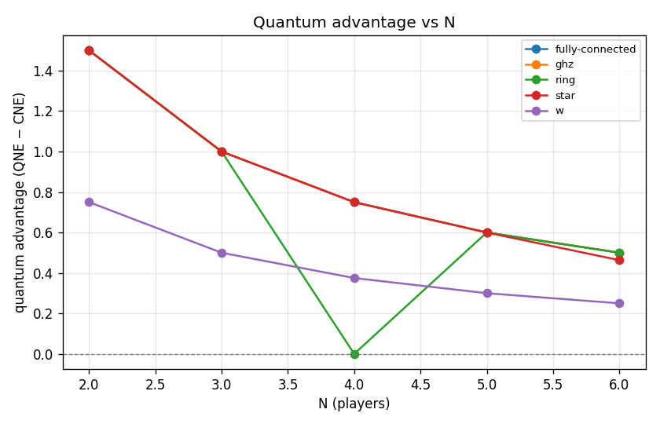
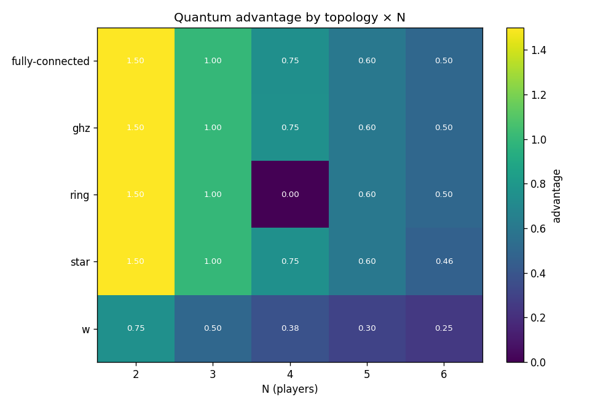

# Experiment report: n-scaling-advantage

Quantum advantage across N and entanglement topologies (RQ1/RQ2)

_Generated: 2026-06-18T0930Z_

## Parameters used

```yaml
experiment:
  name: n-scaling-advantage
  description: Quantum advantage across N and entanglement topologies (RQ1/RQ2)
generated_at: 2026-06-18T0930Z
output:
  formats:
  - md
  - json
  - csv
  - plots
cells:
- N: 2
  topology: ghz
  strategy_names:
  - D
  - H
  - Q
  V: 4.0
  C: 3.0
  gamma: 1.5707963267948966
  gamma_label: pi/2
- N: 2
  topology: ring
  strategy_names:
  - D
  - H
  - Q
  V: 4.0
  C: 3.0
  gamma: 1.5707963267948966
  gamma_label: pi/2
- N: 2
  topology: star
  strategy_names:
  - D
  - H
  - Q
  V: 4.0
  C: 3.0
  gamma: 1.5707963267948966
  gamma_label: pi/2
- N: 2
  topology: fully-connected
  strategy_names:
  - D
  - H
  - Q
  V: 4.0
  C: 3.0
  gamma: 1.5707963267948966
  gamma_label: pi/2
- N: 2
  topology: w
  strategy_names:
  - D
  - H
  - Q
  V: 4.0
  C: 3.0
  gamma: 1.5707963267948966
  gamma_label: pi/2
- N: 3
  topology: ghz
  strategy_names:
  - D
  - H
  - Q
  V: 4.0
  C: 3.0
  gamma: 1.5707963267948966
  gamma_label: pi/2
- N: 3
  topology: ring
  strategy_names:
  - D
  - H
  - Q
  V: 4.0
  C: 3.0
  gamma: 1.5707963267948966
  gamma_label: pi/2
- N: 3
  topology: star
  strategy_names:
  - D
  - H
  - Q
  V: 4.0
  C: 3.0
  gamma: 1.5707963267948966
  gamma_label: pi/2
- N: 3
  topology: fully-connected
  strategy_names:
  - D
  - H
  - Q
  V: 4.0
  C: 3.0
  gamma: 1.5707963267948966
  gamma_label: pi/2
- N: 3
  topology: w
  strategy_names:
  - D
  - H
  - Q
  V: 4.0
  C: 3.0
  gamma: 1.5707963267948966
  gamma_label: pi/2
- N: 4
  topology: ghz
  strategy_names:
  - D
  - H
  - Q
  V: 4.0
  C: 3.0
  gamma: 1.5707963267948966
  gamma_label: pi/2
- N: 4
  topology: ring
  strategy_names:
  - D
  - H
  - Q
  V: 4.0
  C: 3.0
  gamma: 1.5707963267948966
  gamma_label: pi/2
- N: 4
  topology: star
  strategy_names:
  - D
  - H
  - Q
  V: 4.0
  C: 3.0
  gamma: 1.5707963267948966
  gamma_label: pi/2
- N: 4
  topology: fully-connected
  strategy_names:
  - D
  - H
  - Q
  V: 4.0
  C: 3.0
  gamma: 1.5707963267948966
  gamma_label: pi/2
- N: 4
  topology: w
  strategy_names:
  - D
  - H
  - Q
  V: 4.0
  C: 3.0
  gamma: 1.5707963267948966
  gamma_label: pi/2
- N: 5
  topology: ghz
  strategy_names:
  - D
  - H
  - Q
  V: 4.0
  C: 3.0
  gamma: 1.5707963267948966
  gamma_label: pi/2
- N: 5
  topology: ring
  strategy_names:
  - D
  - H
  - Q
  V: 4.0
  C: 3.0
  gamma: 1.5707963267948966
  gamma_label: pi/2
- N: 5
  topology: star
  strategy_names:
  - D
  - H
  - Q
  V: 4.0
  C: 3.0
  gamma: 1.5707963267948966
  gamma_label: pi/2
- N: 5
  topology: fully-connected
  strategy_names:
  - D
  - H
  - Q
  V: 4.0
  C: 3.0
  gamma: 1.5707963267948966
  gamma_label: pi/2
- N: 5
  topology: w
  strategy_names:
  - D
  - H
  - Q
  V: 4.0
  C: 3.0
  gamma: 1.5707963267948966
  gamma_label: pi/2
- N: 6
  topology: ghz
  strategy_names:
  - D
  - H
  - Q
  V: 4.0
  C: 3.0
  gamma: 1.5707963267948966
  gamma_label: pi/2
- N: 6
  topology: ring
  strategy_names:
  - D
  - H
  - Q
  V: 4.0
  C: 3.0
  gamma: 1.5707963267948966
  gamma_label: pi/2
- N: 6
  topology: star
  strategy_names:
  - D
  - H
  - Q
  V: 4.0
  C: 3.0
  gamma: 1.5707963267948966
  gamma_label: pi/2
- N: 6
  topology: fully-connected
  strategy_names:
  - D
  - H
  - Q
  V: 4.0
  C: 3.0
  gamma: 1.5707963267948966
  gamma_label: pi/2
- N: 6
  topology: w
  strategy_names:
  - D
  - H
  - Q
  V: 4.0
  C: 3.0
  gamma: 1.5707963267948966
  gamma_label: pi/2
```

## Summary

| N | topology | V | C | gamma | q_payoff | classical_ne | advantage | q_is_nash | symmetric | status |
|---|---|---|---|---|---|---|---|---|---|---|
| 2 | ghz | 4 | 3 | pi/2 | 2.000000 | 0.500000 | 1.500000 | yes | yes | ok |
| 2 | ring | 4 | 3 | pi/2 | 2.000000 | 0.500000 | 1.500000 | yes | yes | ok |
| 2 | star | 4 | 3 | pi/2 | 2.000000 | 0.500000 | 1.500000 | yes | yes | ok |
| 2 | fully-connected | 4 | 3 | pi/2 | 2.000000 | 0.500000 | 1.500000 | yes | yes | ok |
| 2 | w | 4 | 3 | pi/2 | 2.000000 | 1.250000 | 0.750000 | **NO** | yes | ok |
| 3 | ghz | 4 | 3 | pi/2 | 1.333333 | 0.333333 | 1.000000 | yes | yes | ok |
| 3 | ring | 4 | 3 | pi/2 | 1.333333 | 0.333333 | 1.000000 | yes | yes | ok |
| 3 | star | 4 | 3 | pi/2 | 1.333333 | 0.333333 | 1.000000 | **NO** | yes | ok |
| 3 | fully-connected | 4 | 3 | pi/2 | 1.333333 | 0.333333 | 1.000000 | yes | yes | ok |
| 3 | w | 4 | 3 | pi/2 | 1.333333 | 0.833333 | 0.500000 | **NO** | yes | ok |
| 4 | ghz | 4 | 3 | pi/2 | 1.000000 | 0.250000 | 0.750000 | **NO** | yes | ok |
| 4 | ring | 4 | 3 | pi/2 | 0.250000 | 0.250000 | 0.000000 | **NO** | yes | ok |
| 4 | star | 4 | 3 | pi/2 | 1.000000 | 0.250000 | 0.750000 | **NO** | no | ok |
| 4 | fully-connected | 4 | 3 | pi/2 | 1.000000 | 0.250000 | 0.750000 | **NO** | yes | ok |
| 4 | w | 4 | 3 | pi/2 | 1.000000 | 0.625000 | 0.375000 | **NO** | yes | ok |
| 5 | ghz | 4 | 3 | pi/2 | 0.800000 | 0.200000 | 0.600000 | **NO** | yes | ok |
| 5 | ring | 4 | 3 | pi/2 | 0.800000 | 0.200000 | 0.600000 | **NO** | yes | ok |
| 5 | star | 4 | 3 | pi/2 | 0.800000 | 0.200000 | 0.600000 | **NO** | no | ok |
| 5 | fully-connected | 4 | 3 | pi/2 | 0.800000 | 0.200000 | 0.600000 | **NO** | yes | ok |
| 5 | w | 4 | 3 | pi/2 | 0.800000 | 0.500000 | 0.300000 | **NO** | yes | ok |
| 6 | ghz | 4 | 3 | pi/2 | 0.666667 | 0.166667 | 0.500000 | **NO** | yes | ok |
| 6 | ring | 4 | 3 | pi/2 | 0.666667 | 0.166667 | 0.500000 | **NO** | yes | ok |
| 6 | star | 4 | 3 | pi/2 | 0.630046 | 0.166667 | 0.463379 | **NO** | no | ok |
| 6 | fully-connected | 4 | 3 | pi/2 | 0.666667 | 0.166667 | 0.500000 | **NO** | yes | ok |
| 6 | w | 4 | 3 | pi/2 | 0.666667 | 0.416667 | 0.250000 | **NO** | yes | ok |

## Findings

- Evaluated **25** cells: 25 ran, 0 not-implemented, 0 errored.
- Quantum advantage > 0 in **24/25** computed cells.
- (Q,...,Q) is a pure Nash equilibrium in **7/25** computed cells.

**Cells with advantage <= 0 (RQ1 finding — investigate, do not paper over):**
  - N=4, ring, gamma=pi/2: advantage = 0.000000

**Cells where (Q,...,Q) is NOT Nash (RQ1 finding):**
  - N=2, w, gamma=pi/2
  - N=3, star, gamma=pi/2
  - N=3, w, gamma=pi/2
  - N=4, ghz, gamma=pi/2
  - N=4, ring, gamma=pi/2
  - N=4, star, gamma=pi/2
  - N=4, fully-connected, gamma=pi/2
  - N=4, w, gamma=pi/2
  - N=5, ghz, gamma=pi/2
  - N=5, ring, gamma=pi/2
  - N=5, star, gamma=pi/2
  - N=5, fully-connected, gamma=pi/2
  - N=5, w, gamma=pi/2
  - N=6, ghz, gamma=pi/2
  - N=6, ring, gamma=pi/2
  - N=6, star, gamma=pi/2
  - N=6, fully-connected, gamma=pi/2
  - N=6, w, gamma=pi/2

## Plots




## Per-cell detail

### N=2 · ghz · gamma=pi/2 (V=4, C=3)

- (Q,Q) mean per-player payoff: **2.000000**
- Classical NE mean payoff: **0.500000**
- Advantage (QNE − CNE, mean): **1.500000**
- (Q,Q) is pure Nash: **True**
- Player-symmetric: **True**

Classical pure NE in {D,H}^N: (H,H)

All pure NE: (Q,Q)

Unilateral deviation table from (Q,...,Q):

| deviator | alt | dev payoff | Q payoff | Q dominates |
|---|---|---|---|---|
| player 0 | D | 0.500000 | 2.000000 | yes |
| player 0 | H | 0.000000 | 2.000000 | yes |
| player 1 | D | 0.500000 | 2.000000 | yes |
| player 1 | H | 0.000000 | 2.000000 | yes |

### N=2 · ring · gamma=pi/2 (V=4, C=3)

- (Q,Q) mean per-player payoff: **2.000000**
- Classical NE mean payoff: **0.500000**
- Advantage (QNE − CNE, mean): **1.500000**
- (Q,Q) is pure Nash: **True**
- Player-symmetric: **True**

Classical pure NE in {D,H}^N: (H,H)

All pure NE: (Q,Q)

Unilateral deviation table from (Q,...,Q):

| deviator | alt | dev payoff | Q payoff | Q dominates |
|---|---|---|---|---|
| player 0 | D | 0.500000 | 2.000000 | yes |
| player 0 | H | 0.000000 | 2.000000 | yes |
| player 1 | D | 0.500000 | 2.000000 | yes |
| player 1 | H | 0.000000 | 2.000000 | yes |

### N=2 · star · gamma=pi/2 (V=4, C=3)

- (Q,Q) mean per-player payoff: **2.000000**
- Classical NE mean payoff: **0.500000**
- Advantage (QNE − CNE, mean): **1.500000**
- (Q,Q) is pure Nash: **True**
- Player-symmetric: **True**

Classical pure NE in {D,H}^N: (H,H)

All pure NE: (Q,Q)

Unilateral deviation table from (Q,...,Q):

| deviator | alt | dev payoff | Q payoff | Q dominates |
|---|---|---|---|---|
| player 0 | D | 0.500000 | 2.000000 | yes |
| player 0 | H | 0.000000 | 2.000000 | yes |
| player 1 | D | 0.500000 | 2.000000 | yes |
| player 1 | H | 0.000000 | 2.000000 | yes |

### N=2 · fully-connected · gamma=pi/2 (V=4, C=3)

- (Q,Q) mean per-player payoff: **2.000000**
- Classical NE mean payoff: **0.500000**
- Advantage (QNE − CNE, mean): **1.500000**
- (Q,Q) is pure Nash: **True**
- Player-symmetric: **True**

Classical pure NE in {D,H}^N: (H,H)

All pure NE: (Q,Q)

Unilateral deviation table from (Q,...,Q):

| deviator | alt | dev payoff | Q payoff | Q dominates |
|---|---|---|---|---|
| player 0 | D | 0.500000 | 2.000000 | yes |
| player 0 | H | 0.000000 | 2.000000 | yes |
| player 1 | D | 0.500000 | 2.000000 | yes |
| player 1 | H | 0.000000 | 2.000000 | yes |

### N=2 · w · gamma=pi/2 (V=4, C=3)

- (Q,Q) mean per-player payoff: **2.000000**
- Classical NE mean payoff: **1.250000**
- Advantage (QNE − CNE, mean): **0.750000**
- (Q,Q) is pure Nash: **False**
- Player-symmetric: **True**

Classical pure NE in {D,H}^N: (H,H)

All pure NE: (H,H)

Unilateral deviation table from (Q,...,Q):

| deviator | alt | dev payoff | Q payoff | Q dominates |
|---|---|---|---|---|
| player 0 | D | 1.000000 | 2.000000 | yes |
| player 0 | H | 2.625000 | 2.000000 | **NO — NASH VIOLATED** |
| player 1 | D | 1.000000 | 2.000000 | yes |
| player 1 | H | 2.625000 | 2.000000 | **NO — NASH VIOLATED** |

### N=3 · ghz · gamma=pi/2 (V=4, C=3)

- (Q,Q,Q) mean per-player payoff: **1.333333**
- Classical NE mean payoff: **0.333333**
- Advantage (QNE − CNE, mean): **1.000000**
- (Q,Q,Q) is pure Nash: **True**
- Player-symmetric: **True**

Classical pure NE in {D,H}^N: (H,H,H)

All pure NE: (Q,Q,Q)

Unilateral deviation table from (Q,...,Q):

| deviator | alt | dev payoff | Q payoff | Q dominates |
|---|---|---|---|---|
| player 0 | D | 0.583333 | 1.333333 | yes |
| player 0 | H | 1.000000 | 1.333333 | yes |
| player 1 | D | 0.583333 | 1.333333 | yes |
| player 1 | H | 1.000000 | 1.333333 | yes |
| player 2 | D | 0.583333 | 1.333333 | yes |
| player 2 | H | 1.000000 | 1.333333 | yes |

### N=3 · ring · gamma=pi/2 (V=4, C=3)

- (Q,Q,Q) mean per-player payoff: **1.333333**
- Classical NE mean payoff: **0.333333**
- Advantage (QNE − CNE, mean): **1.000000**
- (Q,Q,Q) is pure Nash: **True**
- Player-symmetric: **True**

Classical pure NE in {D,H}^N: (H,H,H)

All pure NE: (Q,Q,Q)

Unilateral deviation table from (Q,...,Q):

| deviator | alt | dev payoff | Q payoff | Q dominates |
|---|---|---|---|---|
| player 0 | D | 0.833333 | 1.333333 | yes |
| player 0 | H | 0.437500 | 1.333333 | yes |
| player 1 | D | 0.833333 | 1.333333 | yes |
| player 1 | H | 0.437500 | 1.333333 | yes |
| player 2 | D | 0.833333 | 1.333333 | yes |
| player 2 | H | 0.437500 | 1.333333 | yes |

### N=3 · star · gamma=pi/2 (V=4, C=3)

- (Q,Q,Q) mean per-player payoff: **1.333333**
- Classical NE mean payoff: **0.333333**
- Advantage (QNE − CNE, mean): **1.000000**
- (Q,Q,Q) is pure Nash: **False**
- Player-symmetric: **True**

Classical pure NE in {D,H}^N: (H,H,H)

All pure NE: (none found)

Unilateral deviation table from (Q,...,Q):

| deviator | alt | dev payoff | Q payoff | Q dominates |
|---|---|---|---|---|
| player 0 | D | 0.833333 | 1.333333 | yes |
| player 0 | H | 0.437500 | 1.333333 | yes |
| player 1 | D | 1.583333 | 1.333333 | **NO — NASH VIOLATED** |
| player 1 | H | 0.312500 | 1.333333 | yes |
| player 2 | D | 1.583333 | 1.333333 | **NO — NASH VIOLATED** |
| player 2 | H | 0.312500 | 1.333333 | yes |

### N=3 · fully-connected · gamma=pi/2 (V=4, C=3)

- (Q,Q,Q) mean per-player payoff: **1.333333**
- Classical NE mean payoff: **0.333333**
- Advantage (QNE − CNE, mean): **1.000000**
- (Q,Q,Q) is pure Nash: **True**
- Player-symmetric: **True**

Classical pure NE in {D,H}^N: (H,H,H)

All pure NE: (Q,Q,Q)

Unilateral deviation table from (Q,...,Q):

| deviator | alt | dev payoff | Q payoff | Q dominates |
|---|---|---|---|---|
| player 0 | D | 0.833333 | 1.333333 | yes |
| player 0 | H | 0.437500 | 1.333333 | yes |
| player 1 | D | 0.833333 | 1.333333 | yes |
| player 1 | H | 0.437500 | 1.333333 | yes |
| player 2 | D | 0.833333 | 1.333333 | yes |
| player 2 | H | 0.437500 | 1.333333 | yes |

### N=3 · w · gamma=pi/2 (V=4, C=3)

- (Q,Q,Q) mean per-player payoff: **1.333333**
- Classical NE mean payoff: **0.833333**
- Advantage (QNE − CNE, mean): **0.500000**
- (Q,Q,Q) is pure Nash: **False**
- Player-symmetric: **True**

Classical pure NE in {D,H}^N: (H,H,H)

All pure NE: (H,H,H)

Unilateral deviation table from (Q,...,Q):

| deviator | alt | dev payoff | Q payoff | Q dominates |
|---|---|---|---|---|
| player 0 | D | 0.888889 | 1.333333 | yes |
| player 0 | H | 2.888889 | 1.333333 | **NO — NASH VIOLATED** |
| player 1 | D | 0.888889 | 1.333333 | yes |
| player 1 | H | 2.888889 | 1.333333 | **NO — NASH VIOLATED** |
| player 2 | D | 0.888889 | 1.333333 | yes |
| player 2 | H | 2.888889 | 1.333333 | **NO — NASH VIOLATED** |

### N=4 · ghz · gamma=pi/2 (V=4, C=3)

- (Q,Q,Q,Q) mean per-player payoff: **1.000000**
- Classical NE mean payoff: **0.250000**
- Advantage (QNE − CNE, mean): **0.750000**
- (Q,Q,Q,Q) is pure Nash: **False**
- Player-symmetric: **True**

Classical pure NE in {D,H}^N: (H,H,H,H)

All pure NE: (none found)

Unilateral deviation table from (Q,...,Q):

| deviator | alt | dev payoff | Q payoff | Q dominates |
|---|---|---|---|---|
| player 0 | D | 0.625000 | 1.000000 | yes |
| player 0 | H | 2.000000 | 1.000000 | **NO — NASH VIOLATED** |
| player 1 | D | 0.625000 | 1.000000 | yes |
| player 1 | H | 2.000000 | 1.000000 | **NO — NASH VIOLATED** |
| player 2 | D | 0.625000 | 1.000000 | yes |
| player 2 | H | 2.000000 | 1.000000 | **NO — NASH VIOLATED** |
| player 3 | D | 0.625000 | 1.000000 | yes |
| player 3 | H | 2.000000 | 1.000000 | **NO — NASH VIOLATED** |

### N=4 · ring · gamma=pi/2 (V=4, C=3)

- (Q,Q,Q,Q) mean per-player payoff: **0.250000**
- Classical NE mean payoff: **0.250000**
- Advantage (QNE − CNE, mean): **0.000000**
- (Q,Q,Q,Q) is pure Nash: **False**
- Player-symmetric: **True**

Classical pure NE in {D,H}^N: (H,H,H,H)

All pure NE: (H,H,H,H), (H,H,Q,Q), (H,Q,Q,H), (Q,H,H,Q), (Q,Q,H,H)

Unilateral deviation table from (Q,...,Q):

| deviator | alt | dev payoff | Q payoff | Q dominates |
|---|---|---|---|---|
| player 0 | D | 1.125000 | 0.250000 | **NO — NASH VIOLATED** |
| player 0 | H | 0.000000 | 0.250000 | yes |
| player 1 | D | 1.125000 | 0.250000 | **NO — NASH VIOLATED** |
| player 1 | H | 0.000000 | 0.250000 | yes |
| player 2 | D | 1.125000 | 0.250000 | **NO — NASH VIOLATED** |
| player 2 | H | 0.000000 | 0.250000 | yes |
| player 3 | D | 1.125000 | 0.250000 | **NO — NASH VIOLATED** |
| player 3 | H | 0.000000 | 0.250000 | yes |

### N=4 · star · gamma=pi/2 (V=4, C=3)

- (Q,Q,Q,Q) mean per-player payoff: **1.000000**
- Classical NE mean payoff: **0.250000**
- Advantage (QNE − CNE, mean): **0.750000**
- (Q,Q,Q,Q) is pure Nash: **False**
- Player-symmetric: **False**

**Per-player breakdown (asymmetric topology):**

- Q payoff vector: [0.2500, 1.2500, 1.2500, 1.2500]
- Classical NE payoff vector: [0.2500, 0.2500, 0.2500, 0.2500]
- Advantage vector: [0.0000, 1.0000, 1.0000, 1.0000]

Classical pure NE in {D,H}^N: (H,H,H,H)

All pure NE: (none found)

Unilateral deviation table from (Q,...,Q):

| deviator | alt | dev payoff | Q payoff | Q dominates |
|---|---|---|---|---|
| player 0 | D | 0.906250 | 0.250000 | **NO — NASH VIOLATED** |
| player 0 | H | 1.000000 | 0.250000 | **NO — NASH VIOLATED** |
| player 1 | D | 0.906250 | 1.250000 | yes |
| player 1 | H | 1.000000 | 1.250000 | yes |
| player 2 | D | 0.906250 | 1.250000 | yes |
| player 2 | H | 1.000000 | 1.250000 | yes |
| player 3 | D | 0.906250 | 1.250000 | yes |
| player 3 | H | 1.000000 | 1.250000 | yes |

### N=4 · fully-connected · gamma=pi/2 (V=4, C=3)

- (Q,Q,Q,Q) mean per-player payoff: **1.000000**
- Classical NE mean payoff: **0.250000**
- Advantage (QNE − CNE, mean): **0.750000**
- (Q,Q,Q,Q) is pure Nash: **False**
- Player-symmetric: **True**

Classical pure NE in {D,H}^N: (H,H,H,H)

All pure NE: (none found)

Unilateral deviation table from (Q,...,Q):

| deviator | alt | dev payoff | Q payoff | Q dominates |
|---|---|---|---|---|
| player 0 | D | 0.625000 | 1.000000 | yes |
| player 0 | H | 2.000000 | 1.000000 | **NO — NASH VIOLATED** |
| player 1 | D | 0.625000 | 1.000000 | yes |
| player 1 | H | 2.000000 | 1.000000 | **NO — NASH VIOLATED** |
| player 2 | D | 0.625000 | 1.000000 | yes |
| player 2 | H | 2.000000 | 1.000000 | **NO — NASH VIOLATED** |
| player 3 | D | 0.625000 | 1.000000 | yes |
| player 3 | H | 2.000000 | 1.000000 | **NO — NASH VIOLATED** |

### N=4 · w · gamma=pi/2 (V=4, C=3)

- (Q,Q,Q,Q) mean per-player payoff: **1.000000**
- Classical NE mean payoff: **0.625000**
- Advantage (QNE − CNE, mean): **0.375000**
- (Q,Q,Q,Q) is pure Nash: **False**
- Player-symmetric: **True**

Classical pure NE in {D,H}^N: (H,H,H,H)

All pure NE: (H,H,H,H)

Unilateral deviation table from (Q,...,Q):

| deviator | alt | dev payoff | Q payoff | Q dominates |
|---|---|---|---|---|
| player 0 | D | 0.812500 | 1.000000 | yes |
| player 0 | H | 2.875000 | 1.000000 | **NO — NASH VIOLATED** |
| player 1 | D | 0.812500 | 1.000000 | yes |
| player 1 | H | 2.875000 | 1.000000 | **NO — NASH VIOLATED** |
| player 2 | D | 0.812500 | 1.000000 | yes |
| player 2 | H | 2.875000 | 1.000000 | **NO — NASH VIOLATED** |
| player 3 | D | 0.812500 | 1.000000 | yes |
| player 3 | H | 2.875000 | 1.000000 | **NO — NASH VIOLATED** |

### N=5 · ghz · gamma=pi/2 (V=4, C=3)

- (Q,Q,Q,Q,Q) mean per-player payoff: **0.800000**
- Classical NE mean payoff: **0.200000**
- Advantage (QNE − CNE, mean): **0.600000**
- (Q,Q,Q,Q,Q) is pure Nash: **False**
- Player-symmetric: **True**

Classical pure NE in {D,H}^N: (H,H,H,H,H)

All pure NE: (none found)

Unilateral deviation table from (Q,...,Q):

| deviator | alt | dev payoff | Q payoff | Q dominates |
|---|---|---|---|---|
| player 0 | D | 0.592705 | 0.800000 | yes |
| player 0 | H | 2.618034 | 0.800000 | **NO — NASH VIOLATED** |
| player 1 | D | 0.592705 | 0.800000 | yes |
| player 1 | H | 2.618034 | 0.800000 | **NO — NASH VIOLATED** |
| player 2 | D | 0.592705 | 0.800000 | yes |
| player 2 | H | 2.618034 | 0.800000 | **NO — NASH VIOLATED** |
| player 3 | D | 0.592705 | 0.800000 | yes |
| player 3 | H | 2.618034 | 0.800000 | **NO — NASH VIOLATED** |
| player 4 | D | 0.592705 | 0.800000 | yes |
| player 4 | H | 2.618034 | 0.800000 | **NO — NASH VIOLATED** |

### N=5 · ring · gamma=pi/2 (V=4, C=3)

- (Q,Q,Q,Q,Q) mean per-player payoff: **0.800000**
- Classical NE mean payoff: **0.200000**
- Advantage (QNE − CNE, mean): **0.600000**
- (Q,Q,Q,Q,Q) is pure Nash: **False**
- Player-symmetric: **True**

Classical pure NE in {D,H}^N: (H,H,H,H,H)

All pure NE: (H,H,H,H,H)

Unilateral deviation table from (Q,...,Q):

| deviator | alt | dev payoff | Q payoff | Q dominates |
|---|---|---|---|---|
| player 0 | D | 0.895067 | 0.800000 | **NO — NASH VIOLATED** |
| player 0 | H | 1.161738 | 0.800000 | **NO — NASH VIOLATED** |
| player 1 | D | 0.895067 | 0.800000 | **NO — NASH VIOLATED** |
| player 1 | H | 1.161738 | 0.800000 | **NO — NASH VIOLATED** |
| player 2 | D | 0.895067 | 0.800000 | **NO — NASH VIOLATED** |
| player 2 | H | 1.161738 | 0.800000 | **NO — NASH VIOLATED** |
| player 3 | D | 0.895067 | 0.800000 | **NO — NASH VIOLATED** |
| player 3 | H | 1.161738 | 0.800000 | **NO — NASH VIOLATED** |
| player 4 | D | 0.895067 | 0.800000 | **NO — NASH VIOLATED** |
| player 4 | H | 1.161738 | 0.800000 | **NO — NASH VIOLATED** |

### N=5 · star · gamma=pi/2 (V=4, C=3)

- (Q,Q,Q,Q,Q) mean per-player payoff: **0.800000**
- Classical NE mean payoff: **0.200000**
- Advantage (QNE − CNE, mean): **0.600000**
- (Q,Q,Q,Q,Q) is pure Nash: **False**
- Player-symmetric: **False**

**Per-player breakdown (asymmetric topology):**

- Q payoff vector: [0.8864, 0.7784, 0.7784, 0.7784, 0.7784]
- Classical NE payoff vector: [0.2000, 0.2000, 0.2000, 0.2000, 0.2000]
- Advantage vector: [0.6864, 0.5784, 0.5784, 0.5784, 0.5784]

Classical pure NE in {D,H}^N: (H,H,H,H,H)

All pure NE: (H,H,H,H,Q), (H,H,H,Q,H), (H,H,Q,H,H), (H,Q,H,H,H), (Q,H,H,Q,Q), (Q,H,Q,H,Q), (Q,H,Q,Q,H), (Q,Q,H,H,Q), (Q,Q,H,Q,H), (Q,Q,Q,H,H)

Unilateral deviation table from (Q,...,Q):

| deviator | alt | dev payoff | Q payoff | Q dominates |
|---|---|---|---|---|
| player 0 | D | 1.029724 | 0.886373 | **NO — NASH VIOLATED** |
| player 0 | H | 1.145960 | 0.886373 | **NO — NASH VIOLATED** |
| player 1 | D | 0.587522 | 0.778407 | yes |
| player 1 | H | 1.331449 | 0.778407 | **NO — NASH VIOLATED** |
| player 2 | D | 0.587522 | 0.778407 | yes |
| player 2 | H | 1.331449 | 0.778407 | **NO — NASH VIOLATED** |
| player 3 | D | 0.587522 | 0.778407 | yes |
| player 3 | H | 1.331449 | 0.778407 | **NO — NASH VIOLATED** |
| player 4 | D | 0.587522 | 0.778407 | yes |
| player 4 | H | 1.331449 | 0.778407 | **NO — NASH VIOLATED** |

### N=5 · fully-connected · gamma=pi/2 (V=4, C=3)

- (Q,Q,Q,Q,Q) mean per-player payoff: **0.800000**
- Classical NE mean payoff: **0.200000**
- Advantage (QNE − CNE, mean): **0.600000**
- (Q,Q,Q,Q,Q) is pure Nash: **False**
- Player-symmetric: **True**

Classical pure NE in {D,H}^N: (H,H,H,H,H)

All pure NE: (none found)

Unilateral deviation table from (Q,...,Q):

| deviator | alt | dev payoff | Q payoff | Q dominates |
|---|---|---|---|---|
| player 0 | D | 0.750215 | 0.800000 | yes |
| player 0 | H | 1.145960 | 0.800000 | **NO — NASH VIOLATED** |
| player 1 | D | 0.750215 | 0.800000 | yes |
| player 1 | H | 1.145960 | 0.800000 | **NO — NASH VIOLATED** |
| player 2 | D | 0.750215 | 0.800000 | yes |
| player 2 | H | 1.145960 | 0.800000 | **NO — NASH VIOLATED** |
| player 3 | D | 0.750215 | 0.800000 | yes |
| player 3 | H | 1.145960 | 0.800000 | **NO — NASH VIOLATED** |
| player 4 | D | 0.750215 | 0.800000 | yes |
| player 4 | H | 1.145960 | 0.800000 | **NO — NASH VIOLATED** |

### N=5 · w · gamma=pi/2 (V=4, C=3)

- (Q,Q,Q,Q,Q) mean per-player payoff: **0.800000**
- Classical NE mean payoff: **0.500000**
- Advantage (QNE − CNE, mean): **0.300000**
- (Q,Q,Q,Q,Q) is pure Nash: **False**
- Player-symmetric: **True**

Classical pure NE in {D,H}^N: (H,H,H,H,H)

All pure NE: (H,H,H,H,H)

Unilateral deviation table from (Q,...,Q):

| deviator | alt | dev payoff | Q payoff | Q dominates |
|---|---|---|---|---|
| player 0 | D | 0.711554 | 0.800000 | yes |
| player 0 | H | 2.880000 | 0.800000 | **NO — NASH VIOLATED** |
| player 1 | D | 0.711554 | 0.800000 | yes |
| player 1 | H | 2.880000 | 0.800000 | **NO — NASH VIOLATED** |
| player 2 | D | 0.711554 | 0.800000 | yes |
| player 2 | H | 2.880000 | 0.800000 | **NO — NASH VIOLATED** |
| player 3 | D | 0.711554 | 0.800000 | yes |
| player 3 | H | 2.880000 | 0.800000 | **NO — NASH VIOLATED** |
| player 4 | D | 0.711554 | 0.800000 | yes |
| player 4 | H | 2.880000 | 0.800000 | **NO — NASH VIOLATED** |

### N=6 · ghz · gamma=pi/2 (V=4, C=3)

- (Q,Q,Q,Q,Q,Q) mean per-player payoff: **0.666667**
- Classical NE mean payoff: **0.166667**
- Advantage (QNE − CNE, mean): **0.500000**
- (Q,Q,Q,Q,Q,Q) is pure Nash: **False**
- Player-symmetric: **True**

Classical pure NE in {D,H}^N: (H,H,H,H,H,H)

All pure NE: (none found)

Unilateral deviation table from (Q,...,Q):

| deviator | alt | dev payoff | Q payoff | Q dominates |
|---|---|---|---|---|
| player 0 | D | 0.541667 | 0.666667 | yes |
| player 0 | H | 3.000000 | 0.666667 | **NO — NASH VIOLATED** |
| player 1 | D | 0.541667 | 0.666667 | yes |
| player 1 | H | 3.000000 | 0.666667 | **NO — NASH VIOLATED** |
| player 2 | D | 0.541667 | 0.666667 | yes |
| player 2 | H | 3.000000 | 0.666667 | **NO — NASH VIOLATED** |
| player 3 | D | 0.541667 | 0.666667 | yes |
| player 3 | H | 3.000000 | 0.666667 | **NO — NASH VIOLATED** |
| player 4 | D | 0.541667 | 0.666667 | yes |
| player 4 | H | 3.000000 | 0.666667 | **NO — NASH VIOLATED** |
| player 5 | D | 0.541667 | 0.666667 | yes |
| player 5 | H | 3.000000 | 0.666667 | **NO — NASH VIOLATED** |

### N=6 · ring · gamma=pi/2 (V=4, C=3)

- (Q,Q,Q,Q,Q,Q) mean per-player payoff: **0.666667**
- Classical NE mean payoff: **0.166667**
- Advantage (QNE − CNE, mean): **0.500000**
- (Q,Q,Q,Q,Q,Q) is pure Nash: **False**
- Player-symmetric: **True**

Classical pure NE in {D,H}^N: (H,H,H,H,H,H)

All pure NE: (H,H,H,H,H,H)

Unilateral deviation table from (Q,...,Q):

| deviator | alt | dev payoff | Q payoff | Q dominates |
|---|---|---|---|---|
| player 0 | D | 0.750000 | 0.666667 | **NO — NASH VIOLATED** |
| player 0 | H | 1.445833 | 0.666667 | **NO — NASH VIOLATED** |
| player 1 | D | 0.750000 | 0.666667 | **NO — NASH VIOLATED** |
| player 1 | H | 1.445833 | 0.666667 | **NO — NASH VIOLATED** |
| player 2 | D | 0.750000 | 0.666667 | **NO — NASH VIOLATED** |
| player 2 | H | 1.445833 | 0.666667 | **NO — NASH VIOLATED** |
| player 3 | D | 0.750000 | 0.666667 | **NO — NASH VIOLATED** |
| player 3 | H | 1.445833 | 0.666667 | **NO — NASH VIOLATED** |
| player 4 | D | 0.750000 | 0.666667 | **NO — NASH VIOLATED** |
| player 4 | H | 1.445833 | 0.666667 | **NO — NASH VIOLATED** |
| player 5 | D | 0.750000 | 0.666667 | **NO — NASH VIOLATED** |
| player 5 | H | 1.445833 | 0.666667 | **NO — NASH VIOLATED** |

### N=6 · star · gamma=pi/2 (V=4, C=3)

- (Q,Q,Q,Q,Q,Q) mean per-player payoff: **0.630046**
- Classical NE mean payoff: **0.166667**
- Advantage (QNE − CNE, mean): **0.463379**
- (Q,Q,Q,Q,Q,Q) is pure Nash: **False**
- Player-symmetric: **False**

**Per-player breakdown (asymmetric topology):**

- Q payoff vector: [1.1183, 0.5324, 0.5324, 0.5324, 0.5324, 0.5324]
- Classical NE payoff vector: [0.1667, 0.1667, 0.1667, 0.1667, 0.1667, 0.1667]
- Advantage vector: [0.9517, 0.3657, 0.3657, 0.3657, 0.3657, 0.3657]

Classical pure NE in {D,H}^N: (H,H,H,H,H,H)

All pure NE: (H,H,H,H,H,Q), (H,H,H,H,Q,H), (H,H,H,Q,H,H), (H,H,Q,H,H,H), (H,Q,H,H,H,H), (Q,H,H,H,H,H)

Unilateral deviation table from (Q,...,Q):

| deviator | alt | dev payoff | Q payoff | Q dominates |
|---|---|---|---|---|
| player 0 | D | 1.037272 | 1.118327 | yes |
| player 0 | H | 1.312500 | 1.118327 | **NO — NASH VIOLATED** |
| player 1 | D | 0.354980 | 0.532389 | yes |
| player 1 | H | 1.612500 | 0.532389 | **NO — NASH VIOLATED** |
| player 2 | D | 0.354980 | 0.532389 | yes |
| player 2 | H | 1.612500 | 0.532389 | **NO — NASH VIOLATED** |
| player 3 | D | 0.354980 | 0.532389 | yes |
| player 3 | H | 1.612500 | 0.532389 | **NO — NASH VIOLATED** |
| player 4 | D | 0.354980 | 0.532389 | yes |
| player 4 | H | 1.612500 | 0.532389 | **NO — NASH VIOLATED** |
| player 5 | D | 0.354980 | 0.532389 | yes |
| player 5 | H | 1.612500 | 0.532389 | **NO — NASH VIOLATED** |

### N=6 · fully-connected · gamma=pi/2 (V=4, C=3)

- (Q,Q,Q,Q,Q,Q) mean per-player payoff: **0.666667**
- Classical NE mean payoff: **0.166667**
- Advantage (QNE − CNE, mean): **0.500000**
- (Q,Q,Q,Q,Q,Q) is pure Nash: **False**
- Player-symmetric: **True**

Classical pure NE in {D,H}^N: (H,H,H,H,H,H)

All pure NE: (none found)

Unilateral deviation table from (Q,...,Q):

| deviator | alt | dev payoff | Q payoff | Q dominates |
|---|---|---|---|---|
| player 0 | D | 0.541667 | 0.666667 | yes |
| player 0 | H | 3.000000 | 0.666667 | **NO — NASH VIOLATED** |
| player 1 | D | 0.541667 | 0.666667 | yes |
| player 1 | H | 3.000000 | 0.666667 | **NO — NASH VIOLATED** |
| player 2 | D | 0.541667 | 0.666667 | yes |
| player 2 | H | 3.000000 | 0.666667 | **NO — NASH VIOLATED** |
| player 3 | D | 0.541667 | 0.666667 | yes |
| player 3 | H | 3.000000 | 0.666667 | **NO — NASH VIOLATED** |
| player 4 | D | 0.541667 | 0.666667 | yes |
| player 4 | H | 3.000000 | 0.666667 | **NO — NASH VIOLATED** |
| player 5 | D | 0.541667 | 0.666667 | yes |
| player 5 | H | 3.000000 | 0.666667 | **NO — NASH VIOLATED** |

### N=6 · w · gamma=pi/2 (V=4, C=3)

- (Q,Q,Q,Q,Q,Q) mean per-player payoff: **0.666667**
- Classical NE mean payoff: **0.416667**
- Advantage (QNE − CNE, mean): **0.250000**
- (Q,Q,Q,Q,Q,Q) is pure Nash: **False**
- Player-symmetric: **True**

Classical pure NE in {D,H}^N: (H,H,H,H,H,H)

All pure NE: (H,H,H,H,H,H)

Unilateral deviation table from (Q,...,Q):

| deviator | alt | dev payoff | Q payoff | Q dominates |
|---|---|---|---|---|
| player 0 | D | 0.620370 | 0.666667 | yes |
| player 0 | H | 2.888889 | 0.666667 | **NO — NASH VIOLATED** |
| player 1 | D | 0.620370 | 0.666667 | yes |
| player 1 | H | 2.888889 | 0.666667 | **NO — NASH VIOLATED** |
| player 2 | D | 0.620370 | 0.666667 | yes |
| player 2 | H | 2.888889 | 0.666667 | **NO — NASH VIOLATED** |
| player 3 | D | 0.620370 | 0.666667 | yes |
| player 3 | H | 2.888889 | 0.666667 | **NO — NASH VIOLATED** |
| player 4 | D | 0.620370 | 0.666667 | yes |
| player 4 | H | 2.888889 | 0.666667 | **NO — NASH VIOLATED** |
| player 5 | D | 0.620370 | 0.666667 | yes |
| player 5 | H | 2.888889 | 0.666667 | **NO — NASH VIOLATED** |

## Data files

- `results.json` — full structured results
- `results.csv` — one row per cell
- `config.snapshot.yaml` — exact parameters used
