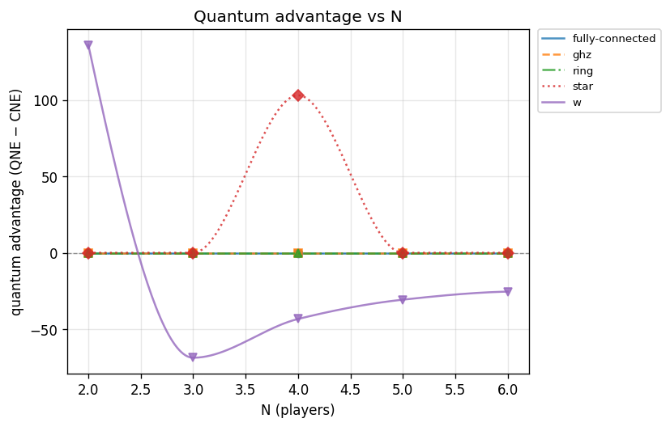
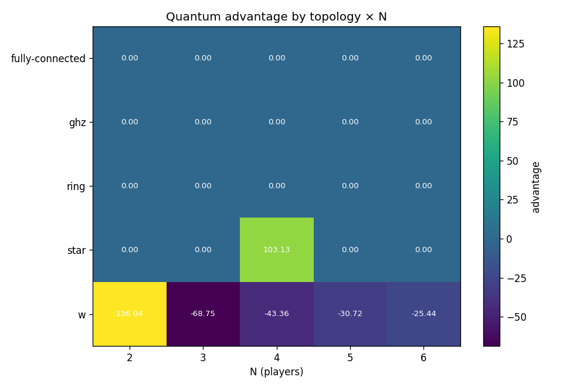
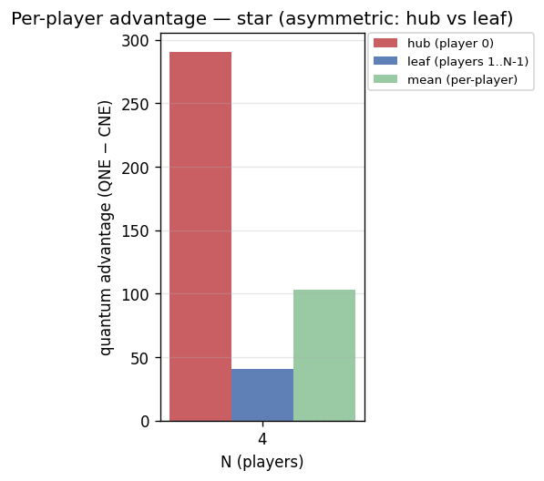

# Experiment report: n-scaling-advantage

Quantum advantage across N and entanglement topologies (RQ1/RQ2)

_Generated: 2026-07-16T0736Z_

## Parameters used

```yaml
experiment:
  name: n-scaling-advantage
  description: Quantum advantage across N and entanglement topologies (RQ1/RQ2)
generated_at: 2026-07-16T0736Z
output:
  formats:
  - md
  - plots
cells:
- N: 2
  topology: ghz
  strategy_names:
  - D
  - H
  - Q
  V: 1000.0
  C: 550.0
  gamma: 1.5707963267948966
  gamma_label: pi/2
  strategy_mode: nash
  noise_p: 0.0
- N: 2
  topology: ring
  strategy_names:
  - D
  - H
  - Q
  V: 1000.0
  C: 550.0
  gamma: 1.5707963267948966
  gamma_label: pi/2
  strategy_mode: nash
  noise_p: 0.0
- N: 2
  topology: star
  strategy_names:
  - D
  - H
  - Q
  V: 1000.0
  C: 550.0
  gamma: 1.5707963267948966
  gamma_label: pi/2
  strategy_mode: nash
  noise_p: 0.0
- N: 2
  topology: fully-connected
  strategy_names:
  - D
  - H
  - Q
  V: 1000.0
  C: 550.0
  gamma: 1.5707963267948966
  gamma_label: pi/2
  strategy_mode: nash
  noise_p: 0.0
- N: 2
  topology: w
  strategy_names:
  - D
  - H
  - Q
  V: 1000.0
  C: 550.0
  gamma: 1.5707963267948966
  gamma_label: pi/2
  strategy_mode: nash
  noise_p: 0.0
- N: 3
  topology: ghz
  strategy_names:
  - D
  - H
  - Q
  V: 1000.0
  C: 550.0
  gamma: 1.5707963267948966
  gamma_label: pi/2
  strategy_mode: nash
  noise_p: 0.0
- N: 3
  topology: ring
  strategy_names:
  - D
  - H
  - Q
  V: 1000.0
  C: 550.0
  gamma: 1.5707963267948966
  gamma_label: pi/2
  strategy_mode: nash
  noise_p: 0.0
- N: 3
  topology: star
  strategy_names:
  - D
  - H
  - Q
  V: 1000.0
  C: 550.0
  gamma: 1.5707963267948966
  gamma_label: pi/2
  strategy_mode: nash
  noise_p: 0.0
- N: 3
  topology: fully-connected
  strategy_names:
  - D
  - H
  - Q
  V: 1000.0
  C: 550.0
  gamma: 1.5707963267948966
  gamma_label: pi/2
  strategy_mode: nash
  noise_p: 0.0
- N: 3
  topology: w
  strategy_names:
  - D
  - H
  - Q
  V: 1000.0
  C: 550.0
  gamma: 1.5707963267948966
  gamma_label: pi/2
  strategy_mode: nash
  noise_p: 0.0
- N: 4
  topology: ghz
  strategy_names:
  - D
  - H
  - Q
  V: 1000.0
  C: 550.0
  gamma: 1.5707963267948966
  gamma_label: pi/2
  strategy_mode: nash
  noise_p: 0.0
- N: 4
  topology: ring
  strategy_names:
  - D
  - H
  - Q
  V: 1000.0
  C: 550.0
  gamma: 1.5707963267948966
  gamma_label: pi/2
  strategy_mode: nash
  noise_p: 0.0
- N: 4
  topology: star
  strategy_names:
  - D
  - H
  - Q
  V: 1000.0
  C: 550.0
  gamma: 1.5707963267948966
  gamma_label: pi/2
  strategy_mode: nash
  noise_p: 0.0
- N: 4
  topology: fully-connected
  strategy_names:
  - D
  - H
  - Q
  V: 1000.0
  C: 550.0
  gamma: 1.5707963267948966
  gamma_label: pi/2
  strategy_mode: nash
  noise_p: 0.0
- N: 4
  topology: w
  strategy_names:
  - D
  - H
  - Q
  V: 1000.0
  C: 550.0
  gamma: 1.5707963267948966
  gamma_label: pi/2
  strategy_mode: nash
  noise_p: 0.0
- N: 5
  topology: ghz
  strategy_names:
  - D
  - H
  - Q
  V: 1000.0
  C: 550.0
  gamma: 1.5707963267948966
  gamma_label: pi/2
  strategy_mode: nash
  noise_p: 0.0
- N: 5
  topology: ring
  strategy_names:
  - D
  - H
  - Q
  V: 1000.0
  C: 550.0
  gamma: 1.5707963267948966
  gamma_label: pi/2
  strategy_mode: nash
  noise_p: 0.0
- N: 5
  topology: star
  strategy_names:
  - D
  - H
  - Q
  V: 1000.0
  C: 550.0
  gamma: 1.5707963267948966
  gamma_label: pi/2
  strategy_mode: nash
  noise_p: 0.0
- N: 5
  topology: fully-connected
  strategy_names:
  - D
  - H
  - Q
  V: 1000.0
  C: 550.0
  gamma: 1.5707963267948966
  gamma_label: pi/2
  strategy_mode: nash
  noise_p: 0.0
- N: 5
  topology: w
  strategy_names:
  - D
  - H
  - Q
  V: 1000.0
  C: 550.0
  gamma: 1.5707963267948966
  gamma_label: pi/2
  strategy_mode: nash
  noise_p: 0.0
- N: 6
  topology: ghz
  strategy_names:
  - D
  - H
  - Q
  V: 1000.0
  C: 550.0
  gamma: 1.5707963267948966
  gamma_label: pi/2
  strategy_mode: nash
  noise_p: 0.0
- N: 6
  topology: ring
  strategy_names:
  - D
  - H
  - Q
  V: 1000.0
  C: 550.0
  gamma: 1.5707963267948966
  gamma_label: pi/2
  strategy_mode: nash
  noise_p: 0.0
- N: 6
  topology: star
  strategy_names:
  - D
  - H
  - Q
  V: 1000.0
  C: 550.0
  gamma: 1.5707963267948966
  gamma_label: pi/2
  strategy_mode: nash
  noise_p: 0.0
- N: 6
  topology: fully-connected
  strategy_names:
  - D
  - H
  - Q
  V: 1000.0
  C: 550.0
  gamma: 1.5707963267948966
  gamma_label: pi/2
  strategy_mode: nash
  noise_p: 0.0
- N: 6
  topology: w
  strategy_names:
  - D
  - H
  - Q
  V: 1000.0
  C: 550.0
  gamma: 1.5707963267948966
  gamma_label: pi/2
  strategy_mode: nash
  noise_p: 0.0
```

## Summary

| N | topology | V | C | gamma | noise_p | q_payoff | classical_ne | advantage | q_is_nash | symmetric | status |
|---|---|---|---|---|---|---|---|---|---|---|---|
| 2 | ghz | 1000 | 550 | pi/2 | 0 | 225.000000 | 225.000000 | 0.000000 † | yes | yes | ok |
| 2 | ring | 1000 | 550 | pi/2 | 0 | 225.000000 | 225.000000 | 0.000000 † | yes | yes | ok |
| 2 | star | 1000 | 550 | pi/2 | 0 | 225.000000 | 225.000000 | 0.000000 † | yes | yes | ok |
| 2 | fully-connected | 1000 | 550 | pi/2 | 0 | 225.000000 | 225.000000 | 0.000000 † | yes | yes | ok |
| 2 | w | 1000 | 550 | pi/2 | 0 | 498.541676 | 362.500000 | 136.041676 † | **NO** | yes | ok |
| 3 | ghz | 1000 | 550 | pi/2 | 0 | 150.000000 | 150.000000 | 0.000000 † | **NO** | yes | ok |
| 3 | ring | 1000 | 550 | pi/2 | 0 | 150.000000 | 150.000000 | 0.000000 † | yes | yes | ok |
| 3 | star | 1000 | 550 | pi/2 | 0 | 150.000000 | 150.000000 | 0.000000 † | yes | yes | ok |
| 3 | fully-connected | 1000 | 550 | pi/2 | 0 | 150.000000 | 150.000000 | 0.000000 † | yes | yes | ok |
| 3 | w | 1000 | 550 | pi/2 | 0 | 172.918446 | 241.666667 | -68.748220 † | yes | yes | ok |
| 4 | ghz | 1000 | 550 | pi/2 | 0 | 112.500000 | 112.500000 | 0.000000 † | **NO** | yes | ok |
| 4 | ring | 1000 | 550 | pi/2 | 0 | 112.500000 | 112.500000 | 0.000000 † | **NO** | yes | ok |
| 4 | star | 1000 | 550 | pi/2 | 0 | 215.625000 | 112.500000 | 103.125000 † | **NO** | no | ok |
| 4 | fully-connected | 1000 | 550 | pi/2 | 0 | 112.500000 | 112.500000 | 0.000000 † | **NO** | yes | ok |
| 4 | w | 1000 | 550 | pi/2 | 0 | 137.888082 | 181.250000 | -43.361918 † | yes | yes | ok |
| 5 | ghz | 1000 | 550 | pi/2 | 0 | 90.000000 | 90.000000 | 0.000000 † | **NO** | yes | ok |
| 5 | ring | 1000 | 550 | pi/2 | 0 | 90.000000 | 90.000000 | 0.000000 † | **NO** | yes | ok |
| 5 | star | 1000 | 550 | pi/2 | 0 | 90.000000 | 90.000000 | 0.000000 † | **NO** | yes | ok |
| 5 | fully-connected | 1000 | 550 | pi/2 | 0 | 90.000000 | 90.000000 | 0.000000 † | **NO** | yes | ok |
| 5 | w | 1000 | 550 | pi/2 | 0 | 114.283637 | 145.000000 | -30.716363 † | yes | yes | ok |
| 6 | ghz | 1000 | 550 | pi/2 | 0 | 75.000000 | 75.000000 | 0.000000 † | **NO** | yes | ok |
| 6 | ring | 1000 | 550 | pi/2 | 0 | 75.000000 | 75.000000 | 0.000000 † | **NO** | yes | ok |
| 6 | star | 1000 | 550 | pi/2 | 0 | 75.000000 | 75.000000 | 0.000000 † | **NO** | yes | ok |
| 6 | fully-connected | 1000 | 550 | pi/2 | 0 | 75.000000 | 75.000000 | 0.000000 † | **NO** | yes | ok |
| 6 | w | 1000 | 550 | pi/2 | 0 | 95.396712 | 120.833333 | -25.436621 † | yes | yes | ok |

† nash candidate is **not a certified equilibrium** (nash_gap > tol or did not converge): the advantage shown is the payoff at a non-equilibrium / transient strategy, **not a stable advantage**. For asymmetric topologies (e.g. star) the mean also hides per-player spread — see the per-cell breakdown.

## Findings

- Evaluated **25** cells: 25 ran, 0 not-implemented, 0 errored.
- Quantum advantage > 0 in **21/25** computed cells.
- (Q,...,Q) is a pure Nash equilibrium in **11/25** computed cells.

**Nash mode — certified vs candidate.** A self-enforcing equilibrium may not exist (Benjamin–Hayden); only certified cells are stable results.
  - **Certified Nash** (0/25): none
  - **Non-equilibrium candidates** (25/25): their reported advantage is a transient payoff, not a stable advantage (includes any asymmetric-topology means).

**Cells with advantage <= 0 (RQ1 finding — investigate, do not paper over):**
  - N=3, w, gamma=pi/2: advantage = -68.748220
  - N=4, w, gamma=pi/2: advantage = -43.361918
  - N=5, w, gamma=pi/2: advantage = -30.716363
  - N=6, w, gamma=pi/2: advantage = -25.436621

**Cells where (Q,...,Q) is NOT Nash (RQ1 finding):**
  - N=2, w, gamma=pi/2
  - N=3, ghz, gamma=pi/2
  - N=4, ghz, gamma=pi/2
  - N=4, ring, gamma=pi/2
  - N=4, star, gamma=pi/2
  - N=4, fully-connected, gamma=pi/2
  - N=5, ghz, gamma=pi/2
  - N=5, ring, gamma=pi/2
  - N=5, star, gamma=pi/2
  - N=5, fully-connected, gamma=pi/2
  - N=6, ghz, gamma=pi/2
  - N=6, ring, gamma=pi/2
  - N=6, star, gamma=pi/2
  - N=6, fully-connected, gamma=pi/2

## Plots





## Per-cell detail

### N=2 · ghz · gamma=pi/2 (V=1000, C=550)

- (Q,Q) mean per-player payoff: **225.000000**
- Classical NE mean payoff: **225.000000**
- Advantage (QNE − CNE, mean): **0.000000**
- (Q,Q) is pure Nash: **True**
- Player-symmetric: **True**

**Topology-optimized quantum strategy (nash mode):**

- Q := U(θ=3.141593, α=-0.468375, β=-3.141593)  (vs GHZ-fixed U(0, π/2, π/2))
- Symmetric payoff/player: **225.000000**
- Nash gap (max unilateral gain): **7.75e+02** → is Nash: **False**
- Optimizer converged: **False**

Classical pure NE in {D,H}^N: (H,H)

All pure NE: (H,H), (H,Q), (Q,H), (Q,Q)

Unilateral deviation table from (Q,...,Q):

| deviator | alt | dev payoff | Q payoff | Q dominates |
|---|---|---|---|---|
| player 0 | D | 0.000000 | 225.000000 | yes |
| player 0 | H | 225.000000 | 225.000000 | yes |
| player 1 | D | 0.000000 | 225.000000 | yes |
| player 1 | H | 225.000000 | 225.000000 | yes |

### N=2 · ring · gamma=pi/2 (V=1000, C=550)

- (Q,Q) mean per-player payoff: **225.000000**
- Classical NE mean payoff: **225.000000**
- Advantage (QNE − CNE, mean): **0.000000**
- (Q,Q) is pure Nash: **True**
- Player-symmetric: **True**

**Topology-optimized quantum strategy (nash mode):**

- Q := U(θ=3.141593, α=-0.468375, β=-3.141593)  (vs GHZ-fixed U(0, π/2, π/2))
- Symmetric payoff/player: **225.000000**
- Nash gap (max unilateral gain): **7.75e+02** → is Nash: **False**
- Optimizer converged: **False**

Classical pure NE in {D,H}^N: (H,H)

All pure NE: (H,H), (H,Q), (Q,H), (Q,Q)

Unilateral deviation table from (Q,...,Q):

| deviator | alt | dev payoff | Q payoff | Q dominates |
|---|---|---|---|---|
| player 0 | D | 0.000000 | 225.000000 | yes |
| player 0 | H | 225.000000 | 225.000000 | yes |
| player 1 | D | 0.000000 | 225.000000 | yes |
| player 1 | H | 225.000000 | 225.000000 | yes |

### N=2 · star · gamma=pi/2 (V=1000, C=550)

- (Q,Q) mean per-player payoff: **225.000000**
- Classical NE mean payoff: **225.000000**
- Advantage (QNE − CNE, mean): **0.000000**
- (Q,Q) is pure Nash: **True**
- Player-symmetric: **True**

**Topology-optimized quantum strategy (nash mode):** _(symmetric-strategy caveat: topology is not vertex-transitive, so this is a constrained sub-optimum)_

- Q := U(θ=3.141593, α=-0.468375, β=-3.141593)  (vs GHZ-fixed U(0, π/2, π/2))
- Symmetric payoff/player: **225.000000**
- Nash gap (max unilateral gain): **7.75e+02** → is Nash: **False**
- Optimizer converged: **False**

Classical pure NE in {D,H}^N: (H,H)

All pure NE: (H,H), (H,Q), (Q,H), (Q,Q)

Unilateral deviation table from (Q,...,Q):

| deviator | alt | dev payoff | Q payoff | Q dominates |
|---|---|---|---|---|
| player 0 | D | 0.000000 | 225.000000 | yes |
| player 0 | H | 225.000000 | 225.000000 | yes |
| player 1 | D | 0.000000 | 225.000000 | yes |
| player 1 | H | 225.000000 | 225.000000 | yes |

### N=2 · fully-connected · gamma=pi/2 (V=1000, C=550)

- (Q,Q) mean per-player payoff: **225.000000**
- Classical NE mean payoff: **225.000000**
- Advantage (QNE − CNE, mean): **0.000000**
- (Q,Q) is pure Nash: **True**
- Player-symmetric: **True**

**Topology-optimized quantum strategy (nash mode):**

- Q := U(θ=3.141593, α=-0.468375, β=-3.141593)  (vs GHZ-fixed U(0, π/2, π/2))
- Symmetric payoff/player: **225.000000**
- Nash gap (max unilateral gain): **7.75e+02** → is Nash: **False**
- Optimizer converged: **False**

Classical pure NE in {D,H}^N: (H,H)

All pure NE: (H,H), (H,Q), (Q,H), (Q,Q)

Unilateral deviation table from (Q,...,Q):

| deviator | alt | dev payoff | Q payoff | Q dominates |
|---|---|---|---|---|
| player 0 | D | 0.000000 | 225.000000 | yes |
| player 0 | H | 225.000000 | 225.000000 | yes |
| player 1 | D | 0.000000 | 225.000000 | yes |
| player 1 | H | 225.000000 | 225.000000 | yes |

### N=2 · w · gamma=pi/2 (V=1000, C=550)

- (Q,Q) mean per-player payoff: **498.541676**
- Classical NE mean payoff: **362.500000**
- Advantage (QNE − CNE, mean): **136.041676**
- (Q,Q) is pure Nash: **False**
- Player-symmetric: **True**

**Topology-optimized quantum strategy (nash mode):**

- Q := U(θ=6.143877, α=-1.602308, β=1.680332)  (vs GHZ-fixed U(0, π/2, π/2))
- Symmetric payoff/player: **498.541676**
- Nash gap (max unilateral gain): **3.37e+02** → is Nash: **False**
- Optimizer converged: **False**

Classical pure NE in {D,H}^N: (H,H)

All pure NE: (H,H)

Unilateral deviation table from (Q,...,Q):

| deviator | alt | dev payoff | Q payoff | Q dominates |
|---|---|---|---|---|
| player 0 | D | 237.444015 | 498.541676 | yes |
| player 0 | H | 642.434658 | 498.541676 | **NO — NASH VIOLATED** |
| player 1 | D | 237.444015 | 498.541676 | yes |
| player 1 | H | 642.434658 | 498.541676 | **NO — NASH VIOLATED** |

### N=3 · ghz · gamma=pi/2 (V=1000, C=550)

- (Q,Q,Q) mean per-player payoff: **150.000000**
- Classical NE mean payoff: **150.000000**
- Advantage (QNE − CNE, mean): **0.000000**
- (Q,Q,Q) is pure Nash: **False**
- Player-symmetric: **True**

**Topology-optimized quantum strategy (nash mode):**

- Q := U(θ=-0.000000, α=2.617994, β=0.099883)  (vs GHZ-fixed U(0, π/3, π/3))
- Symmetric payoff/player: **150.000000**
- Nash gap (max unilateral gain): **8.50e+02** → is Nash: **False**
- Optimizer converged: **True**

Classical pure NE in {D,H}^N: (H,H,H)

All pure NE: (H,Q,Q), (Q,H,Q), (Q,Q,H)

Unilateral deviation table from (Q,...,Q):

| deviator | alt | dev payoff | Q payoff | Q dominates |
|---|---|---|---|---|
| player 0 | D | 195.833326 | 150.000000 | **NO — NASH VIOLATED** |
| player 0 | H | 249.999959 | 150.000000 | **NO — NASH VIOLATED** |
| player 1 | D | 195.833326 | 150.000000 | **NO — NASH VIOLATED** |
| player 1 | H | 249.999959 | 150.000000 | **NO — NASH VIOLATED** |
| player 2 | D | 195.833326 | 150.000000 | **NO — NASH VIOLATED** |
| player 2 | H | 249.999959 | 150.000000 | **NO — NASH VIOLATED** |

### N=3 · ring · gamma=pi/2 (V=1000, C=550)

- (Q,Q,Q) mean per-player payoff: **150.000000**
- Classical NE mean payoff: **150.000000**
- Advantage (QNE − CNE, mean): **0.000000**
- (Q,Q,Q) is pure Nash: **True**
- Player-symmetric: **True**

**Topology-optimized quantum strategy (nash mode):**

- Q := U(θ=3.141593, α=0.000125, β=0.000000)  (vs GHZ-fixed U(0, π/3, π/3))
- Symmetric payoff/player: **150.000000**
- Nash gap (max unilateral gain): **8.50e+02** → is Nash: **False**
- Optimizer converged: **True**

Classical pure NE in {D,H}^N: (H,H,H)

All pure NE: (H,H,H), (H,H,Q), (H,Q,H), (H,Q,Q), (Q,H,H), (Q,H,Q), (Q,Q,H), (Q,Q,Q)

Unilateral deviation table from (Q,...,Q):

| deviator | alt | dev payoff | Q payoff | Q dominates |
|---|---|---|---|---|
| player 0 | D | 0.000000 | 150.000000 | yes |
| player 0 | H | 150.000000 | 150.000000 | yes |
| player 1 | D | 0.000000 | 150.000000 | yes |
| player 1 | H | 150.000000 | 150.000000 | yes |
| player 2 | D | 0.000000 | 150.000000 | yes |
| player 2 | H | 150.000000 | 150.000000 | yes |

### N=3 · star · gamma=pi/2 (V=1000, C=550)

- (Q,Q,Q) mean per-player payoff: **150.000000**
- Classical NE mean payoff: **150.000000**
- Advantage (QNE − CNE, mean): **0.000000**
- (Q,Q,Q) is pure Nash: **True**
- Player-symmetric: **True**

**Topology-optimized quantum strategy (nash mode):** _(symmetric-strategy caveat: topology is not vertex-transitive, so this is a constrained sub-optimum)_

- Q := U(θ=-3.141593, α=-0.063983, β=-3.141593)  (vs GHZ-fixed U(0, π/3, π/3))
- Symmetric payoff/player: **150.000000**
- Nash gap (max unilateral gain): **8.50e+02** → is Nash: **False**
- Optimizer converged: **True**

Classical pure NE in {D,H}^N: (H,H,H)

All pure NE: (H,H,H), (H,H,Q), (H,Q,H), (H,Q,Q), (Q,H,H), (Q,H,Q), (Q,Q,H), (Q,Q,Q)

Unilateral deviation table from (Q,...,Q):

| deviator | alt | dev payoff | Q payoff | Q dominates |
|---|---|---|---|---|
| player 0 | D | 0.000000 | 150.000000 | yes |
| player 0 | H | 150.000000 | 150.000000 | yes |
| player 1 | D | 0.000000 | 150.000000 | yes |
| player 1 | H | 150.000000 | 150.000000 | yes |
| player 2 | D | 0.000000 | 150.000000 | yes |
| player 2 | H | 150.000000 | 150.000000 | yes |

### N=3 · fully-connected · gamma=pi/2 (V=1000, C=550)

- (Q,Q,Q) mean per-player payoff: **150.000000**
- Classical NE mean payoff: **150.000000**
- Advantage (QNE − CNE, mean): **0.000000**
- (Q,Q,Q) is pure Nash: **True**
- Player-symmetric: **True**

**Topology-optimized quantum strategy (nash mode):**

- Q := U(θ=3.141593, α=0.000125, β=0.000000)  (vs GHZ-fixed U(0, π/3, π/3))
- Symmetric payoff/player: **150.000000**
- Nash gap (max unilateral gain): **8.50e+02** → is Nash: **False**
- Optimizer converged: **True**

Classical pure NE in {D,H}^N: (H,H,H)

All pure NE: (H,H,H), (H,H,Q), (H,Q,H), (H,Q,Q), (Q,H,H), (Q,H,Q), (Q,Q,H), (Q,Q,Q)

Unilateral deviation table from (Q,...,Q):

| deviator | alt | dev payoff | Q payoff | Q dominates |
|---|---|---|---|---|
| player 0 | D | 0.000000 | 150.000000 | yes |
| player 0 | H | 150.000000 | 150.000000 | yes |
| player 1 | D | 0.000000 | 150.000000 | yes |
| player 1 | H | 150.000000 | 150.000000 | yes |
| player 2 | D | 0.000000 | 150.000000 | yes |
| player 2 | H | 150.000000 | 150.000000 | yes |

### N=3 · w · gamma=pi/2 (V=1000, C=550)

- (Q,Q,Q) mean per-player payoff: **172.918446**
- Classical NE mean payoff: **241.666667**
- Advantage (QNE − CNE, mean): **-68.748220**
- (Q,Q,Q) is pure Nash: **True**
- Player-symmetric: **True**

**Topology-optimized quantum strategy (nash mode):**

- Q := U(θ=2.603170, α=-0.458865, β=-0.375465)  (vs GHZ-fixed U(0, π/3, π/3))
- Symmetric payoff/player: **172.918446**
- Nash gap (max unilateral gain): **3.02e+01** → is Nash: **False**
- Optimizer converged: **False**

Classical pure NE in {D,H}^N: (H,H,H)

All pure NE: (Q,Q,Q)

Unilateral deviation table from (Q,...,Q):

| deviator | alt | dev payoff | Q payoff | Q dominates |
|---|---|---|---|---|
| player 0 | D | 74.240073 | 172.918446 | yes |
| player 0 | H | 156.002676 | 172.918446 | yes |
| player 1 | D | 74.240073 | 172.918446 | yes |
| player 1 | H | 156.002676 | 172.918446 | yes |
| player 2 | D | 74.240073 | 172.918446 | yes |
| player 2 | H | 156.002676 | 172.918446 | yes |

### N=4 · ghz · gamma=pi/2 (V=1000, C=550)

- (Q,Q,Q,Q) mean per-player payoff: **112.500000**
- Classical NE mean payoff: **112.500000**
- Advantage (QNE − CNE, mean): **0.000000**
- (Q,Q,Q,Q) is pure Nash: **False**
- Player-symmetric: **True**

**Topology-optimized quantum strategy (nash mode):**

- Q := U(θ=3.141593, α=1.294028, β=1.570796)  (vs GHZ-fixed U(0, π/4, π/4))
- Symmetric payoff/player: **112.500000**
- Nash gap (max unilateral gain): **8.87e+02** → is Nash: **False**
- Optimizer converged: **False**

Classical pure NE in {D,H}^N: (H,H,H,H)

All pure NE: (none found)

Unilateral deviation table from (Q,...,Q):

| deviator | alt | dev payoff | Q payoff | Q dominates |
|---|---|---|---|---|
| player 0 | D | 1000.000000 | 112.500000 | **NO — NASH VIOLATED** |
| player 0 | H | 250.000000 | 112.500000 | **NO — NASH VIOLATED** |
| player 1 | D | 1000.000000 | 112.500000 | **NO — NASH VIOLATED** |
| player 1 | H | 250.000000 | 112.500000 | **NO — NASH VIOLATED** |
| player 2 | D | 1000.000000 | 112.500000 | **NO — NASH VIOLATED** |
| player 2 | H | 250.000000 | 112.500000 | **NO — NASH VIOLATED** |
| player 3 | D | 1000.000000 | 112.500000 | **NO — NASH VIOLATED** |
| player 3 | H | 250.000000 | 112.500000 | **NO — NASH VIOLATED** |

### N=4 · ring · gamma=pi/2 (V=1000, C=550)

- (Q,Q,Q,Q) mean per-player payoff: **112.500000**
- Classical NE mean payoff: **112.500000**
- Advantage (QNE − CNE, mean): **0.000000**
- (Q,Q,Q,Q) is pure Nash: **False**
- Player-symmetric: **True**

**Topology-optimized quantum strategy (nash mode):**

- Q := U(θ=-0.000000, α=-0.785398, β=-4.814669)  (vs GHZ-fixed U(0, π/4, π/4))
- Symmetric payoff/player: **112.500000**
- Nash gap (max unilateral gain): **3.87e+02** → is Nash: **False**
- Optimizer converged: **True**

Classical pure NE in {D,H}^N: (H,H,H,H)

All pure NE: (H,H,H,H), (H,H,Q,Q), (H,Q,Q,H), (Q,H,H,Q), (Q,Q,H,H)

Unilateral deviation table from (Q,...,Q):

| deviator | alt | dev payoff | Q payoff | Q dominates |
|---|---|---|---|---|
| player 0 | D | 306.250015 | 112.500000 | **NO — NASH VIOLATED** |
| player 0 | H | 0.000000 | 112.500000 | yes |
| player 1 | D | 306.250015 | 112.500000 | **NO — NASH VIOLATED** |
| player 1 | H | 0.000000 | 112.500000 | yes |
| player 2 | D | 306.250015 | 112.500000 | **NO — NASH VIOLATED** |
| player 2 | H | 0.000000 | 112.500000 | yes |
| player 3 | D | 306.250015 | 112.500000 | **NO — NASH VIOLATED** |
| player 3 | H | 0.000000 | 112.500000 | yes |

### N=4 · star · gamma=pi/2 (V=1000, C=550)

- (Q,Q,Q,Q) mean per-player payoff: **215.625000**
- Classical NE mean payoff: **112.500000**
- Advantage (QNE − CNE, mean): **103.125000**
- (Q,Q,Q,Q) is pure Nash: **False**
- Player-symmetric: **False**

**Topology-optimized quantum strategy (nash mode):** _(symmetric-strategy caveat: topology is not vertex-transitive, so this is a constrained sub-optimum)_

- Q := U(θ=3.141593, α=-1.880032, β=-2.356194)  (vs GHZ-fixed U(0, π/4, π/4))
- Symmetric payoff/player: **215.625000**
- Nash gap (max unilateral gain): **1.80e+02** → is Nash: **False**
- Optimizer converged: **False**

**Per-player breakdown (asymmetric topology):**

- Q payoff vector: [403.1250, 153.1250, 153.1250, 153.1250]
- Classical NE payoff vector: [112.5000, 112.5000, 112.5000, 112.5000]
- Advantage vector: [290.6250, 40.6250, 40.6250, 40.6250]

Classical pure NE in {D,H}^N: (H,H,H,H)

All pure NE: (none found)

Unilateral deviation table from (Q,...,Q):

| deviator | alt | dev payoff | Q payoff | Q dominates |
|---|---|---|---|---|
| player 0 | D | 250.000006 | 403.125000 | yes |
| player 0 | H | 232.812505 | 403.125000 | yes |
| player 1 | D | 250.000002 | 153.125000 | **NO — NASH VIOLATED** |
| player 1 | H | 232.812497 | 153.125000 | **NO — NASH VIOLATED** |
| player 2 | D | 250.000002 | 153.125000 | **NO — NASH VIOLATED** |
| player 2 | H | 232.812497 | 153.125000 | **NO — NASH VIOLATED** |
| player 3 | D | 250.000002 | 153.125000 | **NO — NASH VIOLATED** |
| player 3 | H | 232.812497 | 153.125000 | **NO — NASH VIOLATED** |

### N=4 · fully-connected · gamma=pi/2 (V=1000, C=550)

- (Q,Q,Q,Q) mean per-player payoff: **112.500000**
- Classical NE mean payoff: **112.500000**
- Advantage (QNE − CNE, mean): **0.000000**
- (Q,Q,Q,Q) is pure Nash: **False**
- Player-symmetric: **True**

**Topology-optimized quantum strategy (nash mode):**

- Q := U(θ=3.141593, α=2.623809, β=0.785398)  (vs GHZ-fixed U(0, π/4, π/4))
- Symmetric payoff/player: **112.500000**
- Nash gap (max unilateral gain): **8.87e+02** → is Nash: **False**
- Optimizer converged: **False**

Classical pure NE in {D,H}^N: (H,H,H,H)

All pure NE: (none found)

Unilateral deviation table from (Q,...,Q):

| deviator | alt | dev payoff | Q payoff | Q dominates |
|---|---|---|---|---|
| player 0 | D | 500.000277 | 112.500000 | **NO — NASH VIOLATED** |
| player 0 | H | 181.250038 | 112.500000 | **NO — NASH VIOLATED** |
| player 1 | D | 500.000277 | 112.500000 | **NO — NASH VIOLATED** |
| player 1 | H | 181.250038 | 112.500000 | **NO — NASH VIOLATED** |
| player 2 | D | 500.000277 | 112.500000 | **NO — NASH VIOLATED** |
| player 2 | H | 181.250038 | 112.500000 | **NO — NASH VIOLATED** |
| player 3 | D | 500.000277 | 112.500000 | **NO — NASH VIOLATED** |
| player 3 | H | 181.250038 | 112.500000 | **NO — NASH VIOLATED** |

### N=4 · w · gamma=pi/2 (V=1000, C=550)

- (Q,Q,Q,Q) mean per-player payoff: **137.888082**
- Classical NE mean payoff: **181.250000**
- Advantage (QNE − CNE, mean): **-43.361918**
- (Q,Q,Q,Q) is pure Nash: **True**
- Player-symmetric: **True**

**Topology-optimized quantum strategy (nash mode):**

- Q := U(θ=2.783386, α=-1.509821, β=-1.517155)  (vs GHZ-fixed U(0, π/4, π/4))
- Symmetric payoff/player: **137.888082**
- Nash gap (max unilateral gain): **9.59e-01** → is Nash: **False**
- Optimizer converged: **False**

Classical pure NE in {D,H}^N: (H,H,H,H)

All pure NE: (Q,Q,Q,Q)

Unilateral deviation table from (Q,...,Q):

| deviator | alt | dev payoff | Q payoff | Q dominates |
|---|---|---|---|---|
| player 0 | D | 21.301503 | 137.888082 | yes |
| player 0 | H | 134.934731 | 137.888082 | yes |
| player 1 | D | 21.301503 | 137.888082 | yes |
| player 1 | H | 134.934731 | 137.888082 | yes |
| player 2 | D | 21.301503 | 137.888082 | yes |
| player 2 | H | 134.934731 | 137.888082 | yes |
| player 3 | D | 21.301503 | 137.888082 | yes |
| player 3 | H | 134.934731 | 137.888082 | yes |

### N=5 · ghz · gamma=pi/2 (V=1000, C=550)

- (Q,Q,Q,Q,Q) mean per-player payoff: **90.000000**
- Classical NE mean payoff: **90.000000**
- Advantage (QNE − CNE, mean): **0.000000**
- (Q,Q,Q,Q,Q) is pure Nash: **False**
- Player-symmetric: **True**

**Topology-optimized quantum strategy (nash mode):**

- Q := U(θ=-0.000000, α=2.199115, β=1.216963)  (vs GHZ-fixed U(0, π/5, π/5))
- Symmetric payoff/player: **90.000000**
- Nash gap (max unilateral gain): **9.10e+02** → is Nash: **False**
- Optimizer converged: **True**

Classical pure NE in {D,H}^N: (H,H,H,H,H)

All pure NE: (none found)

Unilateral deviation table from (Q,...,Q):

| deviator | alt | dev payoff | Q payoff | Q dominates |
|---|---|---|---|---|
| player 0 | D | 161.995914 | 90.000000 | **NO — NASH VIOLATED** |
| player 0 | H | 654.508311 | 90.000000 | **NO — NASH VIOLATED** |
| player 1 | D | 161.995914 | 90.000000 | **NO — NASH VIOLATED** |
| player 1 | H | 654.508311 | 90.000000 | **NO — NASH VIOLATED** |
| player 2 | D | 161.995914 | 90.000000 | **NO — NASH VIOLATED** |
| player 2 | H | 654.508311 | 90.000000 | **NO — NASH VIOLATED** |
| player 3 | D | 161.995914 | 90.000000 | **NO — NASH VIOLATED** |
| player 3 | H | 654.508311 | 90.000000 | **NO — NASH VIOLATED** |
| player 4 | D | 161.995914 | 90.000000 | **NO — NASH VIOLATED** |
| player 4 | H | 654.508311 | 90.000000 | **NO — NASH VIOLATED** |

### N=5 · ring · gamma=pi/2 (V=1000, C=550)

- (Q,Q,Q,Q,Q) mean per-player payoff: **90.000000**
- Classical NE mean payoff: **90.000000**
- Advantage (QNE − CNE, mean): **0.000000**
- (Q,Q,Q,Q,Q) is pure Nash: **False**
- Player-symmetric: **True**

**Topology-optimized quantum strategy (nash mode):**

- Q := U(θ=3.141593, α=-305.840959, β=-54.977871)  (vs GHZ-fixed U(0, π/5, π/5))
- Symmetric payoff/player: **90.000000**
- Nash gap (max unilateral gain): **2.43e+02** → is Nash: **False**
- Optimizer converged: **True**

Classical pure NE in {D,H}^N: (H,H,H,H,H)

All pure NE: (none found)

Unilateral deviation table from (Q,...,Q):

| deviator | alt | dev payoff | Q payoff | Q dominates |
|---|---|---|---|---|
| player 0 | D | 0.000000 | 90.000000 | yes |
| player 0 | H | 333.333333 | 90.000000 | **NO — NASH VIOLATED** |
| player 1 | D | 0.000000 | 90.000000 | yes |
| player 1 | H | 333.333333 | 90.000000 | **NO — NASH VIOLATED** |
| player 2 | D | 0.000000 | 90.000000 | yes |
| player 2 | H | 333.333333 | 90.000000 | **NO — NASH VIOLATED** |
| player 3 | D | 0.000000 | 90.000000 | yes |
| player 3 | H | 333.333333 | 90.000000 | **NO — NASH VIOLATED** |
| player 4 | D | 0.000000 | 90.000000 | yes |
| player 4 | H | 333.333333 | 90.000000 | **NO — NASH VIOLATED** |

### N=5 · star · gamma=pi/2 (V=1000, C=550)

- (Q,Q,Q,Q,Q) mean per-player payoff: **90.000000**
- Classical NE mean payoff: **90.000000**
- Advantage (QNE − CNE, mean): **0.000000**
- (Q,Q,Q,Q,Q) is pure Nash: **False**
- Player-symmetric: **True**

**Topology-optimized quantum strategy (nash mode):** _(symmetric-strategy caveat: topology is not vertex-transitive, so this is a constrained sub-optimum)_

- Q := U(θ=3.141593, α=-1.648752, β=-1.570796)  (vs GHZ-fixed U(0, π/5, π/5))
- Symmetric payoff/player: **90.000000**
- Nash gap (max unilateral gain): **9.10e+02** → is Nash: **False**
- Optimizer converged: **True**

Classical pure NE in {D,H}^N: (H,H,H,H,H)

All pure NE: (none found)

Unilateral deviation table from (Q,...,Q):

| deviator | alt | dev payoff | Q payoff | Q dominates |
|---|---|---|---|---|
| player 0 | D | 200.000000 | 90.000000 | **NO — NASH VIOLATED** |
| player 0 | H | 1000.000000 | 90.000000 | **NO — NASH VIOLATED** |
| player 1 | D | 250.000000 | 90.000000 | **NO — NASH VIOLATED** |
| player 1 | H | 0.000000 | 90.000000 | yes |
| player 2 | D | 250.000000 | 90.000000 | **NO — NASH VIOLATED** |
| player 2 | H | 0.000000 | 90.000000 | yes |
| player 3 | D | 250.000000 | 90.000000 | **NO — NASH VIOLATED** |
| player 3 | H | 0.000000 | 90.000000 | yes |
| player 4 | D | 250.000000 | 90.000000 | **NO — NASH VIOLATED** |
| player 4 | H | 0.000000 | 90.000000 | yes |

### N=5 · fully-connected · gamma=pi/2 (V=1000, C=550)

- (Q,Q,Q,Q,Q) mean per-player payoff: **90.000000**
- Classical NE mean payoff: **90.000000**
- Advantage (QNE − CNE, mean): **0.000000**
- (Q,Q,Q,Q,Q) is pure Nash: **False**
- Player-symmetric: **True**

**Topology-optimized quantum strategy (nash mode):**

- Q := U(θ=3.141593, α=2.791425, β=-1.570796)  (vs GHZ-fixed U(0, π/5, π/5))
- Symmetric payoff/player: **90.000000**
- Nash gap (max unilateral gain): **9.10e+02** → is Nash: **False**
- Optimizer converged: **True**

Classical pure NE in {D,H}^N: (H,H,H,H,H)

All pure NE: (none found)

Unilateral deviation table from (Q,...,Q):

| deviator | alt | dev payoff | Q payoff | Q dominates |
|---|---|---|---|---|
| player 0 | D | 200.000000 | 90.000000 | **NO — NASH VIOLATED** |
| player 0 | H | 1000.000000 | 90.000000 | **NO — NASH VIOLATED** |
| player 1 | D | 200.000000 | 90.000000 | **NO — NASH VIOLATED** |
| player 1 | H | 1000.000000 | 90.000000 | **NO — NASH VIOLATED** |
| player 2 | D | 200.000000 | 90.000000 | **NO — NASH VIOLATED** |
| player 2 | H | 1000.000000 | 90.000000 | **NO — NASH VIOLATED** |
| player 3 | D | 200.000000 | 90.000000 | **NO — NASH VIOLATED** |
| player 3 | H | 1000.000000 | 90.000000 | **NO — NASH VIOLATED** |
| player 4 | D | 200.000000 | 90.000000 | **NO — NASH VIOLATED** |
| player 4 | H | 1000.000000 | 90.000000 | **NO — NASH VIOLATED** |

### N=5 · w · gamma=pi/2 (V=1000, C=550)

- (Q,Q,Q,Q,Q) mean per-player payoff: **114.283637**
- Classical NE mean payoff: **145.000000**
- Advantage (QNE − CNE, mean): **-30.716363**
- (Q,Q,Q,Q,Q) is pure Nash: **True**
- Player-symmetric: **True**

**Topology-optimized quantum strategy (nash mode):**

- Q := U(θ=2.867160, α=-146.126141, β=-146.136489)  (vs GHZ-fixed U(0, π/5, π/5))
- Symmetric payoff/player: **114.283637**
- Nash gap (max unilateral gain): **1.21e-02** → is Nash: **False**
- Optimizer converged: **False**

Classical pure NE in {D,H}^N: (H,H,H,H,H)

All pure NE: (Q,Q,Q,Q,Q)

Unilateral deviation table from (Q,...,Q):

| deviator | alt | dev payoff | Q payoff | Q dominates |
|---|---|---|---|---|
| player 0 | D | 10.318874 | 114.283637 | yes |
| player 0 | H | 112.314528 | 114.283637 | yes |
| player 1 | D | 10.318874 | 114.283637 | yes |
| player 1 | H | 112.314528 | 114.283637 | yes |
| player 2 | D | 10.318874 | 114.283637 | yes |
| player 2 | H | 112.314528 | 114.283637 | yes |
| player 3 | D | 10.318874 | 114.283637 | yes |
| player 3 | H | 112.314528 | 114.283637 | yes |
| player 4 | D | 10.318874 | 114.283637 | yes |
| player 4 | H | 112.314528 | 114.283637 | yes |

### N=6 · ghz · gamma=pi/2 (V=1000, C=550)

- (Q,Q,Q,Q,Q,Q) mean per-player payoff: **75.000000**
- Classical NE mean payoff: **75.000000**
- Advantage (QNE − CNE, mean): **0.000000**
- (Q,Q,Q,Q,Q,Q) is pure Nash: **False**
- Player-symmetric: **True**

**Topology-optimized quantum strategy (nash mode):**

- Q := U(θ=3.141593, α=-5.231031, β=1.047198)  (vs GHZ-fixed U(0, π/6, π/6))
- Symmetric payoff/player: **75.000000**
- Nash gap (max unilateral gain): **9.25e+02** → is Nash: **False**
- Optimizer converged: **False**

Classical pure NE in {D,H}^N: (H,H,H,H,H,H)

All pure NE: (none found)

Unilateral deviation table from (Q,...,Q):

| deviator | alt | dev payoff | Q payoff | Q dominates |
|---|---|---|---|---|
| player 0 | D | 749.997510 | 75.000000 | **NO — NASH VIOLATED** |
| player 0 | H | 143.749772 | 75.000000 | **NO — NASH VIOLATED** |
| player 1 | D | 749.997510 | 75.000000 | **NO — NASH VIOLATED** |
| player 1 | H | 143.749772 | 75.000000 | **NO — NASH VIOLATED** |
| player 2 | D | 749.997510 | 75.000000 | **NO — NASH VIOLATED** |
| player 2 | H | 143.749772 | 75.000000 | **NO — NASH VIOLATED** |
| player 3 | D | 749.997510 | 75.000000 | **NO — NASH VIOLATED** |
| player 3 | H | 143.749772 | 75.000000 | **NO — NASH VIOLATED** |
| player 4 | D | 749.997510 | 75.000000 | **NO — NASH VIOLATED** |
| player 4 | H | 143.749772 | 75.000000 | **NO — NASH VIOLATED** |
| player 5 | D | 749.997510 | 75.000000 | **NO — NASH VIOLATED** |
| player 5 | H | 143.749772 | 75.000000 | **NO — NASH VIOLATED** |

### N=6 · ring · gamma=pi/2 (V=1000, C=550)

- (Q,Q,Q,Q,Q,Q) mean per-player payoff: **75.000000**
- Classical NE mean payoff: **75.000000**
- Advantage (QNE − CNE, mean): **0.000000**
- (Q,Q,Q,Q,Q,Q) is pure Nash: **False**
- Player-symmetric: **True**

**Topology-optimized quantum strategy (nash mode):**

- Q := U(θ=3.141593, α=-1.444699, β=-1.570796)  (vs GHZ-fixed U(0, π/6, π/6))
- Symmetric payoff/player: **75.000000**
- Nash gap (max unilateral gain): **1.75e+02** → is Nash: **False**
- Optimizer converged: **True**

Classical pure NE in {D,H}^N: (H,H,H,H,H,H)

All pure NE: (none found)

Unilateral deviation table from (Q,...,Q):

| deviator | alt | dev payoff | Q payoff | Q dominates |
|---|---|---|---|---|
| player 0 | D | 0.000000 | 75.000000 | yes |
| player 0 | H | 250.000000 | 75.000000 | **NO — NASH VIOLATED** |
| player 1 | D | 0.000000 | 75.000000 | yes |
| player 1 | H | 250.000000 | 75.000000 | **NO — NASH VIOLATED** |
| player 2 | D | 0.000000 | 75.000000 | yes |
| player 2 | H | 250.000000 | 75.000000 | **NO — NASH VIOLATED** |
| player 3 | D | 0.000000 | 75.000000 | yes |
| player 3 | H | 250.000000 | 75.000000 | **NO — NASH VIOLATED** |
| player 4 | D | 0.000000 | 75.000000 | yes |
| player 4 | H | 250.000000 | 75.000000 | **NO — NASH VIOLATED** |
| player 5 | D | 0.000000 | 75.000000 | yes |
| player 5 | H | 250.000000 | 75.000000 | **NO — NASH VIOLATED** |

### N=6 · star · gamma=pi/2 (V=1000, C=550)

- (Q,Q,Q,Q,Q,Q) mean per-player payoff: **75.000000**
- Classical NE mean payoff: **75.000000**
- Advantage (QNE − CNE, mean): **0.000000**
- (Q,Q,Q,Q,Q,Q) is pure Nash: **False**
- Player-symmetric: **True**

**Topology-optimized quantum strategy (nash mode):** _(symmetric-strategy caveat: topology is not vertex-transitive, so this is a constrained sub-optimum)_

- Q := U(θ=3.141593, α=-1.688972, β=-1.570796)  (vs GHZ-fixed U(0, π/6, π/6))
- Symmetric payoff/player: **75.000000**
- Nash gap (max unilateral gain): **9.25e+02** → is Nash: **False**
- Optimizer converged: **False**

Classical pure NE in {D,H}^N: (H,H,H,H,H,H)

All pure NE: (none found)

Unilateral deviation table from (Q,...,Q):

| deviator | alt | dev payoff | Q payoff | Q dominates |
|---|---|---|---|---|
| player 0 | D | 1000.000000 | 75.000000 | **NO — NASH VIOLATED** |
| player 0 | H | 166.666667 | 75.000000 | **NO — NASH VIOLATED** |
| player 1 | D | 200.000000 | 75.000000 | **NO — NASH VIOLATED** |
| player 1 | H | 0.000000 | 75.000000 | yes |
| player 2 | D | 200.000000 | 75.000000 | **NO — NASH VIOLATED** |
| player 2 | H | 0.000000 | 75.000000 | yes |
| player 3 | D | 200.000000 | 75.000000 | **NO — NASH VIOLATED** |
| player 3 | H | 0.000000 | 75.000000 | yes |
| player 4 | D | 200.000000 | 75.000000 | **NO — NASH VIOLATED** |
| player 4 | H | 0.000000 | 75.000000 | yes |
| player 5 | D | 200.000000 | 75.000000 | **NO — NASH VIOLATED** |
| player 5 | H | 0.000000 | 75.000000 | yes |

### N=6 · fully-connected · gamma=pi/2 (V=1000, C=550)

- (Q,Q,Q,Q,Q,Q) mean per-player payoff: **75.000000**
- Classical NE mean payoff: **75.000000**
- Advantage (QNE − CNE, mean): **0.000000**
- (Q,Q,Q,Q,Q,Q) is pure Nash: **False**
- Player-symmetric: **True**

**Topology-optimized quantum strategy (nash mode):**

- Q := U(θ=3.141593, α=5.612990, β=1.047197)  (vs GHZ-fixed U(0, π/6, π/6))
- Symmetric payoff/player: **75.000000**
- Nash gap (max unilateral gain): **9.25e+02** → is Nash: **False**
- Optimizer converged: **False**

Classical pure NE in {D,H}^N: (H,H,H,H,H,H)

All pure NE: (none found)

Unilateral deviation table from (Q,...,Q):

| deviator | alt | dev payoff | Q payoff | Q dominates |
|---|---|---|---|---|
| player 0 | D | 750.001578 | 75.000000 | **NO — NASH VIOLATED** |
| player 0 | H | 143.750145 | 75.000000 | **NO — NASH VIOLATED** |
| player 1 | D | 750.001578 | 75.000000 | **NO — NASH VIOLATED** |
| player 1 | H | 143.750145 | 75.000000 | **NO — NASH VIOLATED** |
| player 2 | D | 750.001578 | 75.000000 | **NO — NASH VIOLATED** |
| player 2 | H | 143.750145 | 75.000000 | **NO — NASH VIOLATED** |
| player 3 | D | 750.001578 | 75.000000 | **NO — NASH VIOLATED** |
| player 3 | H | 143.750145 | 75.000000 | **NO — NASH VIOLATED** |
| player 4 | D | 750.001578 | 75.000000 | **NO — NASH VIOLATED** |
| player 4 | H | 143.750145 | 75.000000 | **NO — NASH VIOLATED** |
| player 5 | D | 750.001578 | 75.000000 | **NO — NASH VIOLATED** |
| player 5 | H | 143.750145 | 75.000000 | **NO — NASH VIOLATED** |

### N=6 · w · gamma=pi/2 (V=1000, C=550)

- (Q,Q,Q,Q,Q,Q) mean per-player payoff: **95.396712**
- Classical NE mean payoff: **120.833333**
- Advantage (QNE − CNE, mean): **-25.436621**
- (Q,Q,Q,Q,Q,Q) is pure Nash: **True**
- Player-symmetric: **True**

**Topology-optimized quantum strategy (nash mode):**

- Q := U(θ=2.892625, α=-149.539821, β=-149.553102)  (vs GHZ-fixed U(0, π/6, π/6))
- Symmetric payoff/player: **95.396712**
- Nash gap (max unilateral gain): **7.30e-04** → is Nash: **False**
- Optimizer converged: **False**

Classical pure NE in {D,H}^N: (H,H,H,H,H,H)

All pure NE: (Q,Q,Q,Q,Q,Q)

Unilateral deviation table from (Q,...,Q):

| deviator | alt | dev payoff | Q payoff | Q dominates |
|---|---|---|---|---|
| player 0 | D | 7.040885 | 95.396712 | yes |
| player 0 | H | 94.014377 | 95.396712 | yes |
| player 1 | D | 7.040885 | 95.396712 | yes |
| player 1 | H | 94.014377 | 95.396712 | yes |
| player 2 | D | 7.040885 | 95.396712 | yes |
| player 2 | H | 94.014377 | 95.396712 | yes |
| player 3 | D | 7.040885 | 95.396712 | yes |
| player 3 | H | 94.014377 | 95.396712 | yes |
| player 4 | D | 7.040885 | 95.396712 | yes |
| player 4 | H | 94.014377 | 95.396712 | yes |
| player 5 | D | 7.040885 | 95.396712 | yes |
| player 5 | H | 94.014377 | 95.396712 | yes |

## Data files

- `results.json` — full structured results
- `results.csv` — one row per cell
- `config.snapshot.yaml` — exact parameters used
