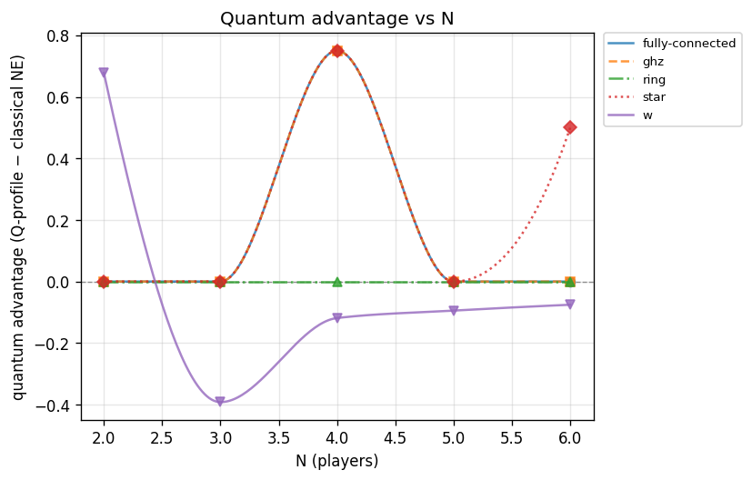
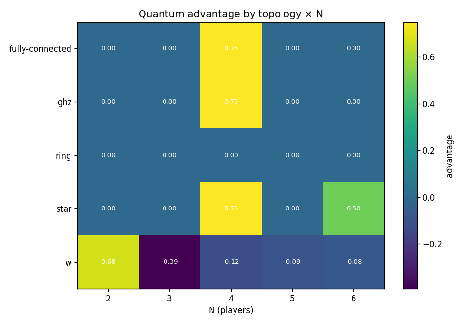

# Experiment report: n-scaling-advantage

Quantum advantage across N and entanglement topologies (RQ1/RQ2)

_Generated: 2026-07-20T1800Z_

## Parameters used

```yaml
experiment:
  name: n-scaling-advantage
  description: Quantum advantage across N and entanglement topologies (RQ1/RQ2)
generated_at: 2026-07-20T1800Z
output:
  formats:
  - md
  - plots
cells:
- N: 2
  topology: ghz
  strategy_names:
  - D
  - H
  - Q
  V: 4.0
  C: 3.0
  gamma: 1.5707963267948966
  gamma_label: pi/2
  strategy_mode: nash
  noise_p: 0.0
- N: 2
  topology: ring
  strategy_names:
  - D
  - H
  - Q
  V: 4.0
  C: 3.0
  gamma: 1.5707963267948966
  gamma_label: pi/2
  strategy_mode: nash
  noise_p: 0.0
- N: 2
  topology: star
  strategy_names:
  - D
  - H
  - Q
  V: 4.0
  C: 3.0
  gamma: 1.5707963267948966
  gamma_label: pi/2
  strategy_mode: nash
  noise_p: 0.0
- N: 2
  topology: fully-connected
  strategy_names:
  - D
  - H
  - Q
  V: 4.0
  C: 3.0
  gamma: 1.5707963267948966
  gamma_label: pi/2
  strategy_mode: nash
  noise_p: 0.0
- N: 2
  topology: w
  strategy_names:
  - D
  - H
  - Q
  V: 4.0
  C: 3.0
  gamma: 1.5707963267948966
  gamma_label: pi/2
  strategy_mode: nash
  noise_p: 0.0
- N: 3
  topology: ghz
  strategy_names:
  - D
  - H
  - Q
  V: 4.0
  C: 3.0
  gamma: 1.5707963267948966
  gamma_label: pi/2
  strategy_mode: nash
  noise_p: 0.0
- N: 3
  topology: ring
  strategy_names:
  - D
  - H
  - Q
  V: 4.0
  C: 3.0
  gamma: 1.5707963267948966
  gamma_label: pi/2
  strategy_mode: nash
  noise_p: 0.0
- N: 3
  topology: star
  strategy_names:
  - D
  - H
  - Q
  V: 4.0
  C: 3.0
  gamma: 1.5707963267948966
  gamma_label: pi/2
  strategy_mode: nash
  noise_p: 0.0
- N: 3
  topology: fully-connected
  strategy_names:
  - D
  - H
  - Q
  V: 4.0
  C: 3.0
  gamma: 1.5707963267948966
  gamma_label: pi/2
  strategy_mode: nash
  noise_p: 0.0
- N: 3
  topology: w
  strategy_names:
  - D
  - H
  - Q
  V: 4.0
  C: 3.0
  gamma: 1.5707963267948966
  gamma_label: pi/2
  strategy_mode: nash
  noise_p: 0.0
- N: 4
  topology: ghz
  strategy_names:
  - D
  - H
  - Q
  V: 4.0
  C: 3.0
  gamma: 1.5707963267948966
  gamma_label: pi/2
  strategy_mode: nash
  noise_p: 0.0
- N: 4
  topology: ring
  strategy_names:
  - D
  - H
  - Q
  V: 4.0
  C: 3.0
  gamma: 1.5707963267948966
  gamma_label: pi/2
  strategy_mode: nash
  noise_p: 0.0
- N: 4
  topology: star
  strategy_names:
  - D
  - H
  - Q
  V: 4.0
  C: 3.0
  gamma: 1.5707963267948966
  gamma_label: pi/2
  strategy_mode: nash
  noise_p: 0.0
- N: 4
  topology: fully-connected
  strategy_names:
  - D
  - H
  - Q
  V: 4.0
  C: 3.0
  gamma: 1.5707963267948966
  gamma_label: pi/2
  strategy_mode: nash
  noise_p: 0.0
- N: 4
  topology: w
  strategy_names:
  - D
  - H
  - Q
  V: 4.0
  C: 3.0
  gamma: 1.5707963267948966
  gamma_label: pi/2
  strategy_mode: nash
  noise_p: 0.0
- N: 5
  topology: ghz
  strategy_names:
  - D
  - H
  - Q
  V: 4.0
  C: 3.0
  gamma: 1.5707963267948966
  gamma_label: pi/2
  strategy_mode: nash
  noise_p: 0.0
- N: 5
  topology: ring
  strategy_names:
  - D
  - H
  - Q
  V: 4.0
  C: 3.0
  gamma: 1.5707963267948966
  gamma_label: pi/2
  strategy_mode: nash
  noise_p: 0.0
- N: 5
  topology: star
  strategy_names:
  - D
  - H
  - Q
  V: 4.0
  C: 3.0
  gamma: 1.5707963267948966
  gamma_label: pi/2
  strategy_mode: nash
  noise_p: 0.0
- N: 5
  topology: fully-connected
  strategy_names:
  - D
  - H
  - Q
  V: 4.0
  C: 3.0
  gamma: 1.5707963267948966
  gamma_label: pi/2
  strategy_mode: nash
  noise_p: 0.0
- N: 5
  topology: w
  strategy_names:
  - D
  - H
  - Q
  V: 4.0
  C: 3.0
  gamma: 1.5707963267948966
  gamma_label: pi/2
  strategy_mode: nash
  noise_p: 0.0
- N: 6
  topology: ghz
  strategy_names:
  - D
  - H
  - Q
  V: 4.0
  C: 3.0
  gamma: 1.5707963267948966
  gamma_label: pi/2
  strategy_mode: nash
  noise_p: 0.0
- N: 6
  topology: ring
  strategy_names:
  - D
  - H
  - Q
  V: 4.0
  C: 3.0
  gamma: 1.5707963267948966
  gamma_label: pi/2
  strategy_mode: nash
  noise_p: 0.0
- N: 6
  topology: star
  strategy_names:
  - D
  - H
  - Q
  V: 4.0
  C: 3.0
  gamma: 1.5707963267948966
  gamma_label: pi/2
  strategy_mode: nash
  noise_p: 0.0
- N: 6
  topology: fully-connected
  strategy_names:
  - D
  - H
  - Q
  V: 4.0
  C: 3.0
  gamma: 1.5707963267948966
  gamma_label: pi/2
  strategy_mode: nash
  noise_p: 0.0
- N: 6
  topology: w
  strategy_names:
  - D
  - H
  - Q
  V: 4.0
  C: 3.0
  gamma: 1.5707963267948966
  gamma_label: pi/2
  strategy_mode: nash
  noise_p: 0.0
```

## Summary

| N | topology | V | C | gamma | noise_p | q_payoff | classical_ne | advantage | q_is_nash | symmetric | status |
|---|---|---|---|---|---|---|---|---|---|---|---|
| 2 | ghz | 4 | 3 | pi/2 | 0 | 0.500000 | 0.500000 | 0.000000 † | yes | yes | ok |
| 2 | ring | 4 | 3 | pi/2 | 0 | 0.500000 | 0.500000 | 0.000000 † | yes | yes | ok |
| 2 | star | 4 | 3 | pi/2 | 0 | 0.500000 | 0.500000 | 0.000000 † | yes | yes | ok |
| 2 | fully-connected | 4 | 3 | pi/2 | 0 | 0.500000 | 0.500000 | 0.000000 † | yes | yes | ok |
| 2 | w | 4 | 3 | pi/2 | 0 | 1.928075 | 1.250000 | 0.678075 † | **NO** | yes | ok |
| 3 | ghz | 4 | 3 | pi/2 | 0 | 0.333333 | 0.333333 | 0.000000 † | **NO** | yes | ok |
| 3 | ring | 4 | 3 | pi/2 | 0 | 0.333333 | 0.333333 | 0.000000 † | yes | yes | ok |
| 3 | star | 4 | 3 | pi/2 | 0 | 0.333333 | 0.333333 | 0.000000 † | yes | yes | ok |
| 3 | fully-connected | 4 | 3 | pi/2 | 0 | 0.333333 | 0.333333 | 0.000000 † | yes | yes | ok |
| 3 | w | 4 | 3 | pi/2 | 0 | 0.441525 | 0.833333 | -0.391808 † | yes | yes | ok |
| 4 | ghz | 4 | 3 | pi/2 | 0 | 1.000000 | 0.250000 | 0.750000 † | yes | yes | ok |
| 4 | ring | 4 | 3 | pi/2 | 0 | 0.250000 | 0.250000 | 0.000000 † | **NO** | yes | ok |
| 4 | star | 4 | 3 | pi/2 | 0 | 1.000000 | 0.250000 | 0.750000 † | **NO** | yes | ok |
| 4 | fully-connected | 4 | 3 | pi/2 | 0 | 1.000000 | 0.250000 | 0.750000 † | yes | yes | ok |
| 4 | w | 4 | 3 | pi/2 | 0 | 0.506388 | 0.625000 | -0.118612 † | yes | yes | ok |
| 5 | ghz | 4 | 3 | pi/2 | 0 | 0.200000 | 0.200000 | 0.000000 † | **NO** | yes | ok |
| 5 | ring | 4 | 3 | pi/2 | 0 | 0.200000 | 0.200000 | 0.000000 † | **NO** | yes | ok |
| 5 | star | 4 | 3 | pi/2 | 0 | 0.200000 | 0.200000 | 0.000000 † | **NO** | yes | ok |
| 5 | fully-connected | 4 | 3 | pi/2 | 0 | 0.200000 | 0.200000 | 0.000000 † | yes | yes | ok |
| 5 | w | 4 | 3 | pi/2 | 0 | 0.405545 | 0.500000 | -0.094455 † | **NO** | yes | ok |
| 6 | ghz | 4 | 3 | pi/2 | 0 | 0.166667 | 0.166667 | 0.000000 † | **NO** | yes | ok |
| 6 | ring | 4 | 3 | pi/2 | 0 | 0.166667 | 0.166667 | 0.000000 † | yes | yes | ok |
| 6 | star | 4 | 3 | pi/2 | 0 | 0.666667 | 0.166667 | 0.500000 † | **NO** | yes | ok |
| 6 | fully-connected | 4 | 3 | pi/2 | 0 | 0.166667 | 0.166667 | 0.000000 † | **NO** | yes | ok |
| 6 | w | 4 | 3 | pi/2 | 0 | 0.341246 | 0.416667 | -0.075421 † | yes | yes | ok |

† nash candidate is **not a certified equilibrium** (nash_gap > tol or did not converge): the advantage shown is the payoff at a non-equilibrium / transient strategy, **not a stable advantage**. For asymmetric topologies (e.g. star) the mean also hides per-player spread — see the per-cell breakdown.

## Findings

- Evaluated **25** cells: 25 ran, 0 not-implemented, 0 errored.
- Quantum advantage > 0 in **21/25** computed cells.
- (Q,...,Q) is a pure Nash equilibrium in **14/25** computed cells.

**Nash mode — certified vs candidate.** A self-enforcing equilibrium may not exist (Benjamin–Hayden); only certified cells are stable results.
  - **Certified Nash** (0/25): none
  - **Non-equilibrium candidates** (25/25): their reported advantage is a transient payoff, not a stable advantage (includes any asymmetric-topology means).

**Cells with advantage <= 0 (RQ1 finding — investigate, do not paper over):**
  - N=3, w, gamma=pi/2: advantage = -0.391808
  - N=4, w, gamma=pi/2: advantage = -0.118612
  - N=5, w, gamma=pi/2: advantage = -0.094455
  - N=6, w, gamma=pi/2: advantage = -0.075421

**Cells where (Q,...,Q) is NOT Nash (RQ1 finding):**
  - N=2, w, gamma=pi/2
  - N=3, ghz, gamma=pi/2
  - N=4, ring, gamma=pi/2
  - N=4, star, gamma=pi/2
  - N=5, ghz, gamma=pi/2
  - N=5, ring, gamma=pi/2
  - N=5, star, gamma=pi/2
  - N=5, w, gamma=pi/2
  - N=6, ghz, gamma=pi/2
  - N=6, star, gamma=pi/2
  - N=6, fully-connected, gamma=pi/2

## Plots




## Per-cell detail

### N=2 · ghz · gamma=pi/2 (V=4, C=3)

- (Q,Q) mean per-player payoff: **0.500000**
- Classical NE mean payoff: **0.500000**
- Advantage (Q-profile − classical NE, mean): **0.000000**
- (Q,Q) is pure Nash: **True**
- Player-symmetric: **True**

**Topology-optimized quantum strategy (nash mode):**

- Q := U(θ=3.141593, α=-0.047714, β=-0.000000)  (vs GHZ-fixed U(0, π/2, π/2))
- Symmetric payoff/player: **0.500000**
- Nash gap (max unilateral gain): **3.50e+00** → is Nash: **False**
- Optimizer converged: **False**

Classical pure NE in {D,H}^N: (H,H)

All pure NE: (H,H), (H,Q), (Q,H), (Q,Q)

Unilateral deviation table from (Q,...,Q):

| deviator | alt | dev payoff | Q payoff | Q dominates |
|---|---|---|---|---|
| player 0 | D | 0.000000 | 0.500000 | yes |
| player 0 | H | 0.500000 | 0.500000 | yes |
| player 1 | D | 0.000000 | 0.500000 | yes |
| player 1 | H | 0.500000 | 0.500000 | yes |

### N=2 · ring · gamma=pi/2 (V=4, C=3)

- (Q,Q) mean per-player payoff: **0.500000**
- Classical NE mean payoff: **0.500000**
- Advantage (Q-profile − classical NE, mean): **0.000000**
- (Q,Q) is pure Nash: **True**
- Player-symmetric: **True**

**Topology-optimized quantum strategy (nash mode):**

- Q := U(θ=3.141593, α=-0.047714, β=-0.000000)  (vs GHZ-fixed U(0, π/2, π/2))
- Symmetric payoff/player: **0.500000**
- Nash gap (max unilateral gain): **3.50e+00** → is Nash: **False**
- Optimizer converged: **False**

Classical pure NE in {D,H}^N: (H,H)

All pure NE: (H,H), (H,Q), (Q,H), (Q,Q)

Unilateral deviation table from (Q,...,Q):

| deviator | alt | dev payoff | Q payoff | Q dominates |
|---|---|---|---|---|
| player 0 | D | 0.000000 | 0.500000 | yes |
| player 0 | H | 0.500000 | 0.500000 | yes |
| player 1 | D | 0.000000 | 0.500000 | yes |
| player 1 | H | 0.500000 | 0.500000 | yes |

### N=2 · star · gamma=pi/2 (V=4, C=3)

- (Q,Q) mean per-player payoff: **0.500000**
- Classical NE mean payoff: **0.500000**
- Advantage (Q-profile − classical NE, mean): **0.000000**
- (Q,Q) is pure Nash: **True**
- Player-symmetric: **True**

**Topology-optimized quantum strategy (nash mode):** _(symmetric-strategy caveat: topology is not vertex-transitive, so this is a constrained sub-optimum)_

- Q := U(θ=3.141593, α=-0.047714, β=-0.000000)  (vs GHZ-fixed U(0, π/2, π/2))
- Symmetric payoff/player: **0.500000**
- Nash gap (max unilateral gain): **3.50e+00** → is Nash: **False**
- Optimizer converged: **False**

Classical pure NE in {D,H}^N: (H,H)

All pure NE: (H,H), (H,Q), (Q,H), (Q,Q)

Unilateral deviation table from (Q,...,Q):

| deviator | alt | dev payoff | Q payoff | Q dominates |
|---|---|---|---|---|
| player 0 | D | 0.000000 | 0.500000 | yes |
| player 0 | H | 0.500000 | 0.500000 | yes |
| player 1 | D | 0.000000 | 0.500000 | yes |
| player 1 | H | 0.500000 | 0.500000 | yes |

### N=2 · fully-connected · gamma=pi/2 (V=4, C=3)

- (Q,Q) mean per-player payoff: **0.500000**
- Classical NE mean payoff: **0.500000**
- Advantage (Q-profile − classical NE, mean): **0.000000**
- (Q,Q) is pure Nash: **True**
- Player-symmetric: **True**

**Topology-optimized quantum strategy (nash mode):**

- Q := U(θ=3.141593, α=-0.047714, β=-0.000000)  (vs GHZ-fixed U(0, π/2, π/2))
- Symmetric payoff/player: **0.500000**
- Nash gap (max unilateral gain): **3.50e+00** → is Nash: **False**
- Optimizer converged: **False**

Classical pure NE in {D,H}^N: (H,H)

All pure NE: (H,H), (H,Q), (Q,H), (Q,Q)

Unilateral deviation table from (Q,...,Q):

| deviator | alt | dev payoff | Q payoff | Q dominates |
|---|---|---|---|---|
| player 0 | D | 0.000000 | 0.500000 | yes |
| player 0 | H | 0.500000 | 0.500000 | yes |
| player 1 | D | 0.000000 | 0.500000 | yes |
| player 1 | H | 0.500000 | 0.500000 | yes |

### N=2 · w · gamma=pi/2 (V=4, C=3)

- (Q,Q) mean per-player payoff: **1.928075**
- Classical NE mean payoff: **1.250000**
- Advantage (Q-profile − classical NE, mean): **0.678075**
- (Q,Q) is pure Nash: **False**
- Player-symmetric: **True**

**Topology-optimized quantum strategy (nash mode):**

- Q := U(θ=5.839575, α=-0.239199, β=1.380979)  (vs GHZ-fixed U(0, π/2, π/2))
- Symmetric payoff/player: **1.928075**
- Nash gap (max unilateral gain): **1.77e+00** → is Nash: **False**
- Optimizer converged: **False**

Classical pure NE in {D,H}^N: (H,H)

All pure NE: (H,H)

Unilateral deviation table from (Q,...,Q):

| deviator | alt | dev payoff | Q payoff | Q dominates |
|---|---|---|---|---|
| player 0 | D | 1.907156 | 1.928075 | yes |
| player 0 | H | 2.796162 | 1.928075 | **NO — NASH VIOLATED** |
| player 1 | D | 1.907156 | 1.928075 | yes |
| player 1 | H | 2.796162 | 1.928075 | **NO — NASH VIOLATED** |

### N=3 · ghz · gamma=pi/2 (V=4, C=3)

- (Q,Q,Q) mean per-player payoff: **0.333333**
- Classical NE mean payoff: **0.333333**
- Advantage (Q-profile − classical NE, mean): **0.000000**
- (Q,Q,Q) is pure Nash: **False**
- Player-symmetric: **True**

**Topology-optimized quantum strategy (nash mode):**

- Q := U(θ=-0.000000, α=1.570796, β=-0.529295)  (vs GHZ-fixed U(0, π/3, π/3))
- Symmetric payoff/player: **0.333333**
- Nash gap (max unilateral gain): **3.67e+00** → is Nash: **False**
- Optimizer converged: **True**

Classical pure NE in {D,H}^N: (H,H,H)

All pure NE: (none found)

Unilateral deviation table from (Q,...,Q):

| deviator | alt | dev payoff | Q payoff | Q dominates |
|---|---|---|---|---|
| player 0 | D | 1.333333 | 0.333333 | **NO — NASH VIOLATED** |
| player 0 | H | 4.000000 | 0.333333 | **NO — NASH VIOLATED** |
| player 1 | D | 1.333333 | 0.333333 | **NO — NASH VIOLATED** |
| player 1 | H | 4.000000 | 0.333333 | **NO — NASH VIOLATED** |
| player 2 | D | 1.333333 | 0.333333 | **NO — NASH VIOLATED** |
| player 2 | H | 4.000000 | 0.333333 | **NO — NASH VIOLATED** |

### N=3 · ring · gamma=pi/2 (V=4, C=3)

- (Q,Q,Q) mean per-player payoff: **0.333333**
- Classical NE mean payoff: **0.333333**
- Advantage (Q-profile − classical NE, mean): **0.000000**
- (Q,Q,Q) is pure Nash: **True**
- Player-symmetric: **True**

**Topology-optimized quantum strategy (nash mode):**

- Q := U(θ=3.141593, α=2.433592, β=0.000000)  (vs GHZ-fixed U(0, π/3, π/3))
- Symmetric payoff/player: **0.333333**
- Nash gap (max unilateral gain): **3.67e+00** → is Nash: **False**
- Optimizer converged: **True**

Classical pure NE in {D,H}^N: (H,H,H)

All pure NE: (H,H,H), (H,H,Q), (H,Q,H), (H,Q,Q), (Q,H,H), (Q,H,Q), (Q,Q,H), (Q,Q,Q)

Unilateral deviation table from (Q,...,Q):

| deviator | alt | dev payoff | Q payoff | Q dominates |
|---|---|---|---|---|
| player 0 | D | 0.000000 | 0.333333 | yes |
| player 0 | H | 0.333333 | 0.333333 | yes |
| player 1 | D | 0.000000 | 0.333333 | yes |
| player 1 | H | 0.333333 | 0.333333 | yes |
| player 2 | D | 0.000000 | 0.333333 | yes |
| player 2 | H | 0.333333 | 0.333333 | yes |

### N=3 · star · gamma=pi/2 (V=4, C=3)

- (Q,Q,Q) mean per-player payoff: **0.333333**
- Classical NE mean payoff: **0.333333**
- Advantage (Q-profile − classical NE, mean): **0.000000**
- (Q,Q,Q) is pure Nash: **True**
- Player-symmetric: **True**

**Topology-optimized quantum strategy (nash mode):** _(symmetric-strategy caveat: topology is not vertex-transitive, so this is a constrained sub-optimum)_

- Q := U(θ=3.141593, α=0.000021, β=0.000000)  (vs GHZ-fixed U(0, π/3, π/3))
- Symmetric payoff/player: **0.333333**
- Nash gap (max unilateral gain): **3.67e+00** → is Nash: **False**
- Optimizer converged: **True**

Classical pure NE in {D,H}^N: (H,H,H)

All pure NE: (H,H,H), (H,H,Q), (H,Q,H), (H,Q,Q), (Q,H,H), (Q,H,Q), (Q,Q,H), (Q,Q,Q)

Unilateral deviation table from (Q,...,Q):

| deviator | alt | dev payoff | Q payoff | Q dominates |
|---|---|---|---|---|
| player 0 | D | 0.000000 | 0.333333 | yes |
| player 0 | H | 0.333333 | 0.333333 | yes |
| player 1 | D | 0.000000 | 0.333333 | yes |
| player 1 | H | 0.333333 | 0.333333 | yes |
| player 2 | D | 0.000000 | 0.333333 | yes |
| player 2 | H | 0.333333 | 0.333333 | yes |

### N=3 · fully-connected · gamma=pi/2 (V=4, C=3)

- (Q,Q,Q) mean per-player payoff: **0.333333**
- Classical NE mean payoff: **0.333333**
- Advantage (Q-profile − classical NE, mean): **0.000000**
- (Q,Q,Q) is pure Nash: **True**
- Player-symmetric: **True**

**Topology-optimized quantum strategy (nash mode):**

- Q := U(θ=3.141593, α=2.433592, β=0.000000)  (vs GHZ-fixed U(0, π/3, π/3))
- Symmetric payoff/player: **0.333333**
- Nash gap (max unilateral gain): **3.67e+00** → is Nash: **False**
- Optimizer converged: **True**

Classical pure NE in {D,H}^N: (H,H,H)

All pure NE: (H,H,H), (H,H,Q), (H,Q,H), (H,Q,Q), (Q,H,H), (Q,H,Q), (Q,Q,H), (Q,Q,Q)

Unilateral deviation table from (Q,...,Q):

| deviator | alt | dev payoff | Q payoff | Q dominates |
|---|---|---|---|---|
| player 0 | D | 0.000000 | 0.333333 | yes |
| player 0 | H | 0.333333 | 0.333333 | yes |
| player 1 | D | 0.000000 | 0.333333 | yes |
| player 1 | H | 0.333333 | 0.333333 | yes |
| player 2 | D | 0.000000 | 0.333333 | yes |
| player 2 | H | 0.333333 | 0.333333 | yes |

### N=3 · w · gamma=pi/2 (V=4, C=3)

- (Q,Q,Q) mean per-player payoff: **0.441525**
- Classical NE mean payoff: **0.833333**
- Advantage (Q-profile − classical NE, mean): **-0.391808**
- (Q,Q,Q) is pure Nash: **True**
- Player-symmetric: **True**

**Topology-optimized quantum strategy (nash mode):**

- Q := U(θ=2.553472, α=-1.048883, β=-0.967537)  (vs GHZ-fixed U(0, π/3, π/3))
- Symmetric payoff/player: **0.441525**
- Nash gap (max unilateral gain): **1.20e-01** → is Nash: **False**
- Optimizer converged: **False**

Classical pure NE in {D,H}^N: (H,H,H)

All pure NE: (Q,Q,Q)

Unilateral deviation table from (Q,...,Q):

| deviator | alt | dev payoff | Q payoff | Q dominates |
|---|---|---|---|---|
| player 0 | D | 0.205667 | 0.441525 | yes |
| player 0 | H | 0.400948 | 0.441525 | yes |
| player 1 | D | 0.205667 | 0.441525 | yes |
| player 1 | H | 0.400948 | 0.441525 | yes |
| player 2 | D | 0.205667 | 0.441525 | yes |
| player 2 | H | 0.400948 | 0.441525 | yes |

### N=4 · ghz · gamma=pi/2 (V=4, C=3)

- (Q,Q,Q,Q) mean per-player payoff: **1.000000**
- Classical NE mean payoff: **0.250000**
- Advantage (Q-profile − classical NE, mean): **0.750000**
- (Q,Q,Q,Q) is pure Nash: **True**
- Player-symmetric: **True**

**Topology-optimized quantum strategy (nash mode):**

- Q := U(θ=0.000000, α=1.570796, β=-0.508028)  (vs GHZ-fixed U(0, π/4, π/4))
- Symmetric payoff/player: **1.000000**
- Nash gap (max unilateral gain): **3.00e+00** → is Nash: **False**
- Optimizer converged: **False**

Classical pure NE in {D,H}^N: (H,H,H,H)

All pure NE: (Q,Q,Q,Q)

Unilateral deviation table from (Q,...,Q):

| deviator | alt | dev payoff | Q payoff | Q dominates |
|---|---|---|---|---|
| player 0 | D | 0.250000 | 1.000000 | yes |
| player 0 | H | 0.000000 | 1.000000 | yes |
| player 1 | D | 0.250000 | 1.000000 | yes |
| player 1 | H | 0.000000 | 1.000000 | yes |
| player 2 | D | 0.250000 | 1.000000 | yes |
| player 2 | H | 0.000000 | 1.000000 | yes |
| player 3 | D | 0.250000 | 1.000000 | yes |
| player 3 | H | 0.000000 | 1.000000 | yes |

### N=4 · ring · gamma=pi/2 (V=4, C=3)

- (Q,Q,Q,Q) mean per-player payoff: **0.250000**
- Classical NE mean payoff: **0.250000**
- Advantage (Q-profile − classical NE, mean): **0.000000**
- (Q,Q,Q,Q) is pure Nash: **False**
- Player-symmetric: **True**

**Topology-optimized quantum strategy (nash mode):**

- Q := U(θ=-0.000000, α=-0.785398, β=-0.278071)  (vs GHZ-fixed U(0, π/4, π/4))
- Symmetric payoff/player: **0.250000**
- Nash gap (max unilateral gain): **1.75e+00** → is Nash: **False**
- Optimizer converged: **True**

Classical pure NE in {D,H}^N: (H,H,H,H)

All pure NE: (H,H,H,H), (H,H,Q,Q), (H,Q,Q,H), (Q,H,H,Q), (Q,Q,H,H)

Unilateral deviation table from (Q,...,Q):

| deviator | alt | dev payoff | Q payoff | Q dominates |
|---|---|---|---|---|
| player 0 | D | 1.125000 | 0.250000 | **NO — NASH VIOLATED** |
| player 0 | H | 0.000000 | 0.250000 | yes |
| player 1 | D | 1.125000 | 0.250000 | **NO — NASH VIOLATED** |
| player 1 | H | 0.000000 | 0.250000 | yes |
| player 2 | D | 1.125000 | 0.250000 | **NO — NASH VIOLATED** |
| player 2 | H | 0.000000 | 0.250000 | yes |
| player 3 | D | 1.125000 | 0.250000 | **NO — NASH VIOLATED** |
| player 3 | H | 0.000000 | 0.250000 | yes |

### N=4 · star · gamma=pi/2 (V=4, C=3)

- (Q,Q,Q,Q) mean per-player payoff: **1.000000**
- Classical NE mean payoff: **0.250000**
- Advantage (Q-profile − classical NE, mean): **0.750000**
- (Q,Q,Q,Q) is pure Nash: **False**
- Player-symmetric: **True**

**Topology-optimized quantum strategy (nash mode):** _(symmetric-strategy caveat: topology is not vertex-transitive, so this is a constrained sub-optimum)_

- Q := U(θ=-0.000000, α=-1.570796, β=1.578075)  (vs GHZ-fixed U(0, π/4, π/4))
- Symmetric payoff/player: **1.000000**
- Nash gap (max unilateral gain): **3.00e+00** → is Nash: **False**
- Optimizer converged: **False**

Classical pure NE in {D,H}^N: (H,H,H,H)

All pure NE: (none found)

Unilateral deviation table from (Q,...,Q):

| deviator | alt | dev payoff | Q payoff | Q dominates |
|---|---|---|---|---|
| player 0 | D | 0.250000 | 1.000000 | yes |
| player 0 | H | 0.000000 | 1.000000 | yes |
| player 1 | D | 2.000000 | 1.000000 | **NO — NASH VIOLATED** |
| player 1 | H | 0.000000 | 1.000000 | yes |
| player 2 | D | 2.000000 | 1.000000 | **NO — NASH VIOLATED** |
| player 2 | H | 0.000000 | 1.000000 | yes |
| player 3 | D | 2.000000 | 1.000000 | **NO — NASH VIOLATED** |
| player 3 | H | 0.000000 | 1.000000 | yes |

### N=4 · fully-connected · gamma=pi/2 (V=4, C=3)

- (Q,Q,Q,Q) mean per-player payoff: **1.000000**
- Classical NE mean payoff: **0.250000**
- Advantage (Q-profile − classical NE, mean): **0.750000**
- (Q,Q,Q,Q) is pure Nash: **True**
- Player-symmetric: **True**

**Topology-optimized quantum strategy (nash mode):**

- Q := U(θ=0.000000, α=-1.570796, β=1.578078)  (vs GHZ-fixed U(0, π/4, π/4))
- Symmetric payoff/player: **1.000000**
- Nash gap (max unilateral gain): **3.00e+00** → is Nash: **False**
- Optimizer converged: **False**

Classical pure NE in {D,H}^N: (H,H,H,H)

All pure NE: (Q,Q,Q,Q)

Unilateral deviation table from (Q,...,Q):

| deviator | alt | dev payoff | Q payoff | Q dominates |
|---|---|---|---|---|
| player 0 | D | 0.250000 | 1.000000 | yes |
| player 0 | H | 0.000000 | 1.000000 | yes |
| player 1 | D | 0.250000 | 1.000000 | yes |
| player 1 | H | 0.000000 | 1.000000 | yes |
| player 2 | D | 0.250000 | 1.000000 | yes |
| player 2 | H | 0.000000 | 1.000000 | yes |
| player 3 | D | 0.250000 | 1.000000 | yes |
| player 3 | H | 0.000000 | 1.000000 | yes |

### N=4 · w · gamma=pi/2 (V=4, C=3)

- (Q,Q,Q,Q) mean per-player payoff: **0.506388**
- Classical NE mean payoff: **0.625000**
- Advantage (Q-profile − classical NE, mean): **-0.118612**
- (Q,Q,Q,Q) is pure Nash: **True**
- Player-symmetric: **True**

**Topology-optimized quantum strategy (nash mode):**

- Q := U(θ=2.958909, α=-0.909666, β=-1.374745)  (vs GHZ-fixed U(0, π/4, π/4))
- Symmetric payoff/player: **0.506388**
- Nash gap (max unilateral gain): **2.99e-03** → is Nash: **False**
- Optimizer converged: **False**

Classical pure NE in {D,H}^N: (H,H,H,H)

All pure NE: (Q,Q,Q,Q)

Unilateral deviation table from (Q,...,Q):

| deviator | alt | dev payoff | Q payoff | Q dominates |
|---|---|---|---|---|
| player 0 | D | 0.042529 | 0.506388 | yes |
| player 0 | H | 0.505701 | 0.506388 | yes |
| player 1 | D | 0.042529 | 0.506388 | yes |
| player 1 | H | 0.505701 | 0.506388 | yes |
| player 2 | D | 0.042529 | 0.506388 | yes |
| player 2 | H | 0.505701 | 0.506388 | yes |
| player 3 | D | 0.042529 | 0.506388 | yes |
| player 3 | H | 0.505701 | 0.506388 | yes |

### N=5 · ghz · gamma=pi/2 (V=4, C=3)

- (Q,Q,Q,Q,Q) mean per-player payoff: **0.200000**
- Classical NE mean payoff: **0.200000**
- Advantage (Q-profile − classical NE, mean): **0.000000**
- (Q,Q,Q,Q,Q) is pure Nash: **False**
- Player-symmetric: **True**

**Topology-optimized quantum strategy (nash mode):**

- Q := U(θ=0.000000, α=2.199115, β=1.216964)  (vs GHZ-fixed U(0, π/5, π/5))
- Symmetric payoff/player: **0.200000**
- Nash gap (max unilateral gain): **3.80e+00** → is Nash: **False**
- Optimizer converged: **True**

Classical pure NE in {D,H}^N: (H,H,H,H,H)

All pure NE: (none found)

Unilateral deviation table from (Q,...,Q):

| deviator | alt | dev payoff | Q payoff | Q dominates |
|---|---|---|---|---|
| player 0 | D | 0.592705 | 0.200000 | **NO — NASH VIOLATED** |
| player 0 | H | 2.618033 | 0.200000 | **NO — NASH VIOLATED** |
| player 1 | D | 0.592705 | 0.200000 | **NO — NASH VIOLATED** |
| player 1 | H | 2.618033 | 0.200000 | **NO — NASH VIOLATED** |
| player 2 | D | 0.592705 | 0.200000 | **NO — NASH VIOLATED** |
| player 2 | H | 2.618033 | 0.200000 | **NO — NASH VIOLATED** |
| player 3 | D | 0.592705 | 0.200000 | **NO — NASH VIOLATED** |
| player 3 | H | 2.618033 | 0.200000 | **NO — NASH VIOLATED** |
| player 4 | D | 0.592705 | 0.200000 | **NO — NASH VIOLATED** |
| player 4 | H | 2.618033 | 0.200000 | **NO — NASH VIOLATED** |

### N=5 · ring · gamma=pi/2 (V=4, C=3)

- (Q,Q,Q,Q,Q) mean per-player payoff: **0.200000**
- Classical NE mean payoff: **0.200000**
- Advantage (Q-profile − classical NE, mean): **0.000000**
- (Q,Q,Q,Q,Q) is pure Nash: **False**
- Player-symmetric: **True**

**Topology-optimized quantum strategy (nash mode):**

- Q := U(θ=3.141593, α=0.005216, β=-1.570796)  (vs GHZ-fixed U(0, π/5, π/5))
- Symmetric payoff/player: **0.200000**
- Nash gap (max unilateral gain): **1.13e+00** → is Nash: **False**
- Optimizer converged: **True**

Classical pure NE in {D,H}^N: (H,H,H,H,H)

All pure NE: (none found)

Unilateral deviation table from (Q,...,Q):

| deviator | alt | dev payoff | Q payoff | Q dominates |
|---|---|---|---|---|
| player 0 | D | 0.000000 | 0.200000 | yes |
| player 0 | H | 1.333333 | 0.200000 | **NO — NASH VIOLATED** |
| player 1 | D | 0.000000 | 0.200000 | yes |
| player 1 | H | 1.333333 | 0.200000 | **NO — NASH VIOLATED** |
| player 2 | D | 0.000000 | 0.200000 | yes |
| player 2 | H | 1.333333 | 0.200000 | **NO — NASH VIOLATED** |
| player 3 | D | 0.000000 | 0.200000 | yes |
| player 3 | H | 1.333333 | 0.200000 | **NO — NASH VIOLATED** |
| player 4 | D | 0.000000 | 0.200000 | yes |
| player 4 | H | 1.333333 | 0.200000 | **NO — NASH VIOLATED** |

### N=5 · star · gamma=pi/2 (V=4, C=3)

- (Q,Q,Q,Q,Q) mean per-player payoff: **0.200000**
- Classical NE mean payoff: **0.200000**
- Advantage (Q-profile − classical NE, mean): **0.000000**
- (Q,Q,Q,Q,Q) is pure Nash: **False**
- Player-symmetric: **True**

**Topology-optimized quantum strategy (nash mode):** _(symmetric-strategy caveat: topology is not vertex-transitive, so this is a constrained sub-optimum)_

- Q := U(θ=3.141593, α=-1.649530, β=-1.570796)  (vs GHZ-fixed U(0, π/5, π/5))
- Symmetric payoff/player: **0.200000**
- Nash gap (max unilateral gain): **3.80e+00** → is Nash: **False**
- Optimizer converged: **True**

Classical pure NE in {D,H}^N: (H,H,H,H,H)

All pure NE: (none found)

Unilateral deviation table from (Q,...,Q):

| deviator | alt | dev payoff | Q payoff | Q dominates |
|---|---|---|---|---|
| player 0 | D | 0.800000 | 0.200000 | **NO — NASH VIOLATED** |
| player 0 | H | 4.000000 | 0.200000 | **NO — NASH VIOLATED** |
| player 1 | D | 1.000000 | 0.200000 | **NO — NASH VIOLATED** |
| player 1 | H | 0.000000 | 0.200000 | yes |
| player 2 | D | 1.000000 | 0.200000 | **NO — NASH VIOLATED** |
| player 2 | H | 0.000000 | 0.200000 | yes |
| player 3 | D | 1.000000 | 0.200000 | **NO — NASH VIOLATED** |
| player 3 | H | 0.000000 | 0.200000 | yes |
| player 4 | D | 1.000000 | 0.200000 | **NO — NASH VIOLATED** |
| player 4 | H | 0.000000 | 0.200000 | yes |

### N=5 · fully-connected · gamma=pi/2 (V=4, C=3)

- (Q,Q,Q,Q,Q) mean per-player payoff: **0.200000**
- Classical NE mean payoff: **0.200000**
- Advantage (Q-profile − classical NE, mean): **0.000000**
- (Q,Q,Q,Q,Q) is pure Nash: **True**
- Player-symmetric: **True**

**Topology-optimized quantum strategy (nash mode):**

- Q := U(θ=3.141593, α=-0.530633, β=-0.000000)  (vs GHZ-fixed U(0, π/5, π/5))
- Symmetric payoff/player: **0.200000**
- Nash gap (max unilateral gain): **3.80e+00** → is Nash: **False**
- Optimizer converged: **False**

Classical pure NE in {D,H}^N: (H,H,H,H,H)

All pure NE: (H,H,H,H,H), (H,H,H,H,Q), (H,H,H,Q,H), (H,H,H,Q,Q), (H,H,Q,H,H), (H,H,Q,H,Q), (H,H,Q,Q,H), (H,H,Q,Q,Q), (H,Q,H,H,H), (H,Q,H,H,Q), (H,Q,H,Q,H), (H,Q,H,Q,Q), (H,Q,Q,H,H), (H,Q,Q,H,Q), (H,Q,Q,Q,H), (H,Q,Q,Q,Q), (Q,H,H,H,H), (Q,H,H,H,Q), (Q,H,H,Q,H), (Q,H,H,Q,Q), (Q,H,Q,H,H), (Q,H,Q,H,Q), (Q,H,Q,Q,H), (Q,H,Q,Q,Q), (Q,Q,H,H,H), (Q,Q,H,H,Q), (Q,Q,H,Q,H), (Q,Q,H,Q,Q), (Q,Q,Q,H,H), (Q,Q,Q,H,Q), (Q,Q,Q,Q,H), (Q,Q,Q,Q,Q)

Unilateral deviation table from (Q,...,Q):

| deviator | alt | dev payoff | Q payoff | Q dominates |
|---|---|---|---|---|
| player 0 | D | 0.000000 | 0.200000 | yes |
| player 0 | H | 0.200000 | 0.200000 | yes |
| player 1 | D | 0.000000 | 0.200000 | yes |
| player 1 | H | 0.200000 | 0.200000 | yes |
| player 2 | D | 0.000000 | 0.200000 | yes |
| player 2 | H | 0.200000 | 0.200000 | yes |
| player 3 | D | 0.000000 | 0.200000 | yes |
| player 3 | H | 0.200000 | 0.200000 | yes |
| player 4 | D | 0.000000 | 0.200000 | yes |
| player 4 | H | 0.200000 | 0.200000 | yes |

### N=5 · w · gamma=pi/2 (V=4, C=3)

- (Q,Q,Q,Q,Q) mean per-player payoff: **0.405545**
- Classical NE mean payoff: **0.500000**
- Advantage (Q-profile − classical NE, mean): **-0.094455**
- (Q,Q,Q,Q,Q) is pure Nash: **False**
- Player-symmetric: **True**

**Topology-optimized quantum strategy (nash mode):**

- Q := U(θ=2.971465, α=-0.139548, β=-0.679953)  (vs GHZ-fixed U(0, π/5, π/5))
- Symmetric payoff/player: **0.405545**
- Nash gap (max unilateral gain): **2.43e-03** → is Nash: **False**
- Optimizer converged: **False**

Classical pure NE in {D,H}^N: (H,H,H,H,H)

All pure NE: (H,Q,Q,Q,Q), (Q,H,Q,Q,Q), (Q,Q,H,Q,Q), (Q,Q,Q,H,Q), (Q,Q,Q,Q,H)

Unilateral deviation table from (Q,...,Q):

| deviator | alt | dev payoff | Q payoff | Q dominates |
|---|---|---|---|---|
| player 0 | D | 0.022411 | 0.405545 | yes |
| player 0 | H | 0.405602 | 0.405545 | **NO — NASH VIOLATED** |
| player 1 | D | 0.022411 | 0.405545 | yes |
| player 1 | H | 0.405602 | 0.405545 | **NO — NASH VIOLATED** |
| player 2 | D | 0.022411 | 0.405545 | yes |
| player 2 | H | 0.405602 | 0.405545 | **NO — NASH VIOLATED** |
| player 3 | D | 0.022411 | 0.405545 | yes |
| player 3 | H | 0.405602 | 0.405545 | **NO — NASH VIOLATED** |
| player 4 | D | 0.022411 | 0.405545 | yes |
| player 4 | H | 0.405602 | 0.405545 | **NO — NASH VIOLATED** |

### N=6 · ghz · gamma=pi/2 (V=4, C=3)

- (Q,Q,Q,Q,Q,Q) mean per-player payoff: **0.166667**
- Classical NE mean payoff: **0.166667**
- Advantage (Q-profile − classical NE, mean): **0.000000**
- (Q,Q,Q,Q,Q,Q) is pure Nash: **False**
- Player-symmetric: **True**

**Topology-optimized quantum strategy (nash mode):**

- Q := U(θ=3.141593, α=-4.800406, β=1.047198)  (vs GHZ-fixed U(0, π/6, π/6))
- Symmetric payoff/player: **0.166667**
- Nash gap (max unilateral gain): **3.83e+00** → is Nash: **False**
- Optimizer converged: **False**

Classical pure NE in {D,H}^N: (H,H,H,H,H,H)

All pure NE: (none found)

Unilateral deviation table from (Q,...,Q):

| deviator | alt | dev payoff | Q payoff | Q dominates |
|---|---|---|---|---|
| player 0 | D | 2.999997 | 0.166667 | **NO — NASH VIOLATED** |
| player 0 | H | 0.541666 | 0.166667 | **NO — NASH VIOLATED** |
| player 1 | D | 2.999997 | 0.166667 | **NO — NASH VIOLATED** |
| player 1 | H | 0.541666 | 0.166667 | **NO — NASH VIOLATED** |
| player 2 | D | 2.999997 | 0.166667 | **NO — NASH VIOLATED** |
| player 2 | H | 0.541666 | 0.166667 | **NO — NASH VIOLATED** |
| player 3 | D | 2.999997 | 0.166667 | **NO — NASH VIOLATED** |
| player 3 | H | 0.541666 | 0.166667 | **NO — NASH VIOLATED** |
| player 4 | D | 2.999997 | 0.166667 | **NO — NASH VIOLATED** |
| player 4 | H | 0.541666 | 0.166667 | **NO — NASH VIOLATED** |
| player 5 | D | 2.999997 | 0.166667 | **NO — NASH VIOLATED** |
| player 5 | H | 0.541666 | 0.166667 | **NO — NASH VIOLATED** |

### N=6 · ring · gamma=pi/2 (V=4, C=3)

- (Q,Q,Q,Q,Q,Q) mean per-player payoff: **0.166667**
- Classical NE mean payoff: **0.166667**
- Advantage (Q-profile − classical NE, mean): **0.000000**
- (Q,Q,Q,Q,Q,Q) is pure Nash: **True**
- Player-symmetric: **True**

**Topology-optimized quantum strategy (nash mode):**

- Q := U(θ=3.141593, α=0.000125, β=0.000000)  (vs GHZ-fixed U(0, π/6, π/6))
- Symmetric payoff/player: **0.166667**
- Nash gap (max unilateral gain): **8.33e-01** → is Nash: **False**
- Optimizer converged: **False**

Classical pure NE in {D,H}^N: (H,H,H,H,H,H)

All pure NE: (H,H,H,H,H,H), (H,H,H,H,H,Q), (H,H,H,H,Q,H), (H,H,H,H,Q,Q), (H,H,H,Q,H,H), (H,H,H,Q,H,Q), (H,H,H,Q,Q,H), (H,H,H,Q,Q,Q), (H,H,Q,H,H,H), (H,H,Q,H,H,Q), (H,H,Q,H,Q,H), (H,H,Q,H,Q,Q), (H,H,Q,Q,H,H), (H,H,Q,Q,H,Q), (H,H,Q,Q,Q,H), (H,H,Q,Q,Q,Q), (H,Q,H,H,H,H), (H,Q,H,H,H,Q), (H,Q,H,H,Q,H), (H,Q,H,H,Q,Q), (H,Q,H,Q,H,H), (H,Q,H,Q,H,Q), (H,Q,H,Q,Q,H), (H,Q,H,Q,Q,Q), (H,Q,Q,H,H,H), (H,Q,Q,H,H,Q), (H,Q,Q,H,Q,H), (H,Q,Q,H,Q,Q), (H,Q,Q,Q,H,H), (H,Q,Q,Q,H,Q), (H,Q,Q,Q,Q,H), (H,Q,Q,Q,Q,Q), (Q,H,H,H,H,H), (Q,H,H,H,H,Q), (Q,H,H,H,Q,H), (Q,H,H,H,Q,Q), (Q,H,H,Q,H,H), (Q,H,H,Q,H,Q), (Q,H,H,Q,Q,H), (Q,H,H,Q,Q,Q), (Q,H,Q,H,H,H), (Q,H,Q,H,H,Q), (Q,H,Q,H,Q,H), (Q,H,Q,H,Q,Q), (Q,H,Q,Q,H,H), (Q,H,Q,Q,H,Q), (Q,H,Q,Q,Q,H), (Q,H,Q,Q,Q,Q), (Q,Q,H,H,H,H), (Q,Q,H,H,H,Q), (Q,Q,H,H,Q,H), (Q,Q,H,H,Q,Q), (Q,Q,H,Q,H,H), (Q,Q,H,Q,H,Q), (Q,Q,H,Q,Q,H), (Q,Q,H,Q,Q,Q), (Q,Q,Q,H,H,H), (Q,Q,Q,H,H,Q), (Q,Q,Q,H,Q,H), (Q,Q,Q,H,Q,Q), (Q,Q,Q,Q,H,H), (Q,Q,Q,Q,H,Q), (Q,Q,Q,Q,Q,H), (Q,Q,Q,Q,Q,Q)

Unilateral deviation table from (Q,...,Q):

| deviator | alt | dev payoff | Q payoff | Q dominates |
|---|---|---|---|---|
| player 0 | D | 0.000000 | 0.166667 | yes |
| player 0 | H | 0.166667 | 0.166667 | yes |
| player 1 | D | 0.000000 | 0.166667 | yes |
| player 1 | H | 0.166667 | 0.166667 | yes |
| player 2 | D | 0.000000 | 0.166667 | yes |
| player 2 | H | 0.166667 | 0.166667 | yes |
| player 3 | D | 0.000000 | 0.166667 | yes |
| player 3 | H | 0.166667 | 0.166667 | yes |
| player 4 | D | 0.000000 | 0.166667 | yes |
| player 4 | H | 0.166667 | 0.166667 | yes |
| player 5 | D | 0.000000 | 0.166667 | yes |
| player 5 | H | 0.166667 | 0.166667 | yes |

### N=6 · star · gamma=pi/2 (V=4, C=3)

- (Q,Q,Q,Q,Q,Q) mean per-player payoff: **0.666667**
- Classical NE mean payoff: **0.166667**
- Advantage (Q-profile − classical NE, mean): **0.500000**
- (Q,Q,Q,Q,Q,Q) is pure Nash: **False**
- Player-symmetric: **True**

**Topology-optimized quantum strategy (nash mode):** _(symmetric-strategy caveat: topology is not vertex-transitive, so this is a constrained sub-optimum)_

- Q := U(θ=-0.000000, α=1.570796, β=1.577348)  (vs GHZ-fixed U(0, π/6, π/6))
- Symmetric payoff/player: **0.666667**
- Nash gap (max unilateral gain): **3.33e+00** → is Nash: **False**
- Optimizer converged: **False**

Classical pure NE in {D,H}^N: (H,H,H,H,H,H)

All pure NE: (none found)

Unilateral deviation table from (Q,...,Q):

| deviator | alt | dev payoff | Q payoff | Q dominates |
|---|---|---|---|---|
| player 0 | D | 0.166667 | 0.666667 | yes |
| player 0 | H | 0.000000 | 0.666667 | yes |
| player 1 | D | 2.000000 | 0.666667 | **NO — NASH VIOLATED** |
| player 1 | H | 0.000000 | 0.666667 | yes |
| player 2 | D | 2.000000 | 0.666667 | **NO — NASH VIOLATED** |
| player 2 | H | 0.000000 | 0.666667 | yes |
| player 3 | D | 2.000000 | 0.666667 | **NO — NASH VIOLATED** |
| player 3 | H | 0.000000 | 0.666667 | yes |
| player 4 | D | 2.000000 | 0.666667 | **NO — NASH VIOLATED** |
| player 4 | H | 0.000000 | 0.666667 | yes |
| player 5 | D | 2.000000 | 0.666667 | **NO — NASH VIOLATED** |
| player 5 | H | 0.000000 | 0.666667 | yes |

### N=6 · fully-connected · gamma=pi/2 (V=4, C=3)

- (Q,Q,Q,Q,Q,Q) mean per-player payoff: **0.166667**
- Classical NE mean payoff: **0.166667**
- Advantage (Q-profile − classical NE, mean): **0.000000**
- (Q,Q,Q,Q,Q,Q) is pure Nash: **False**
- Player-symmetric: **True**

**Topology-optimized quantum strategy (nash mode):**

- Q := U(θ=3.141593, α=-4.800406, β=1.047197)  (vs GHZ-fixed U(0, π/6, π/6))
- Symmetric payoff/player: **0.166667**
- Nash gap (max unilateral gain): **3.83e+00** → is Nash: **False**
- Optimizer converged: **False**

Classical pure NE in {D,H}^N: (H,H,H,H,H,H)

All pure NE: (none found)

Unilateral deviation table from (Q,...,Q):

| deviator | alt | dev payoff | Q payoff | Q dominates |
|---|---|---|---|---|
| player 0 | D | 3.000003 | 0.166667 | **NO — NASH VIOLATED** |
| player 0 | H | 0.541667 | 0.166667 | **NO — NASH VIOLATED** |
| player 1 | D | 3.000003 | 0.166667 | **NO — NASH VIOLATED** |
| player 1 | H | 0.541667 | 0.166667 | **NO — NASH VIOLATED** |
| player 2 | D | 3.000003 | 0.166667 | **NO — NASH VIOLATED** |
| player 2 | H | 0.541667 | 0.166667 | **NO — NASH VIOLATED** |
| player 3 | D | 3.000003 | 0.166667 | **NO — NASH VIOLATED** |
| player 3 | H | 0.541667 | 0.166667 | **NO — NASH VIOLATED** |
| player 4 | D | 3.000003 | 0.166667 | **NO — NASH VIOLATED** |
| player 4 | H | 0.541667 | 0.166667 | **NO — NASH VIOLATED** |
| player 5 | D | 3.000003 | 0.166667 | **NO — NASH VIOLATED** |
| player 5 | H | 0.541667 | 0.166667 | **NO — NASH VIOLATED** |

### N=6 · w · gamma=pi/2 (V=4, C=3)

- (Q,Q,Q,Q,Q,Q) mean per-player payoff: **0.341246**
- Classical NE mean payoff: **0.416667**
- Advantage (Q-profile − classical NE, mean): **-0.075421**
- (Q,Q,Q,Q,Q,Q) is pure Nash: **True**
- Player-symmetric: **True**

**Topology-optimized quantum strategy (nash mode):**

- Q := U(θ=3.005370, α=-441.463033, β=-441.841585)  (vs GHZ-fixed U(0, π/6, π/6))
- Symmetric payoff/player: **0.341246**
- Nash gap (max unilateral gain): **6.65e-04** → is Nash: **False**
- Optimizer converged: **False**

Classical pure NE in {D,H}^N: (H,H,H,H,H,H)

All pure NE: (Q,Q,Q,Q,Q,Q)

Unilateral deviation table from (Q,...,Q):

| deviator | alt | dev payoff | Q payoff | Q dominates |
|---|---|---|---|---|
| player 0 | D | 0.015104 | 0.341246 | yes |
| player 0 | H | 0.340488 | 0.341246 | yes |
| player 1 | D | 0.015104 | 0.341246 | yes |
| player 1 | H | 0.340488 | 0.341246 | yes |
| player 2 | D | 0.015104 | 0.341246 | yes |
| player 2 | H | 0.340488 | 0.341246 | yes |
| player 3 | D | 0.015104 | 0.341246 | yes |
| player 3 | H | 0.340488 | 0.341246 | yes |
| player 4 | D | 0.015104 | 0.341246 | yes |
| player 4 | H | 0.340488 | 0.341246 | yes |
| player 5 | D | 0.015104 | 0.341246 | yes |
| player 5 | H | 0.340488 | 0.341246 | yes |

## Data files

- `results.json` — full structured results
- `results.csv` — one row per cell
- `config.snapshot.yaml` — exact parameters used
