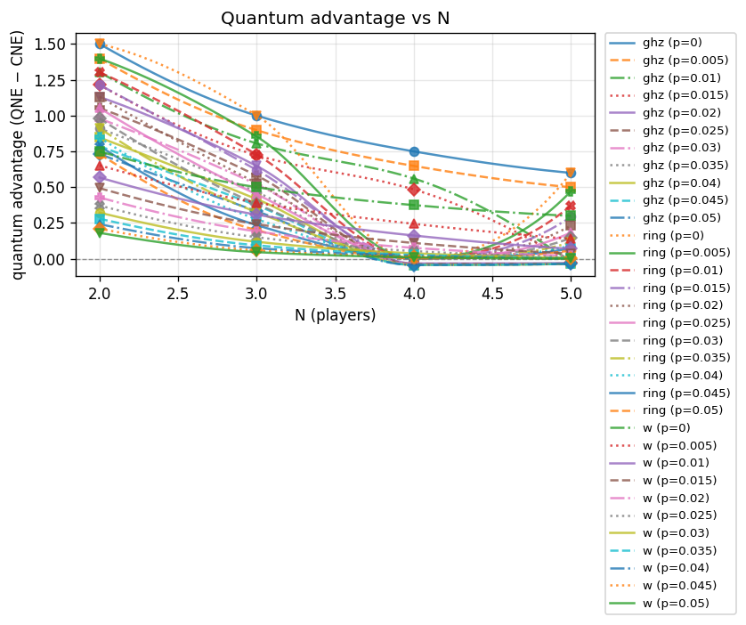
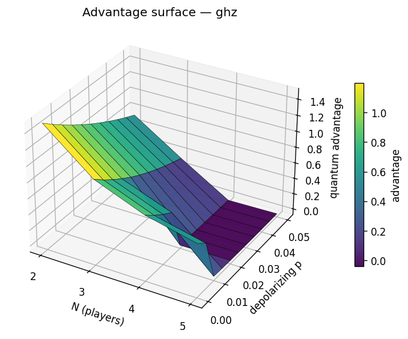
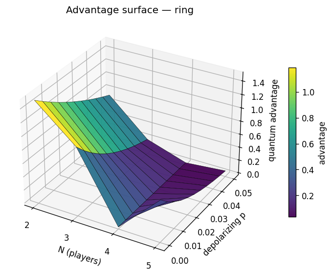
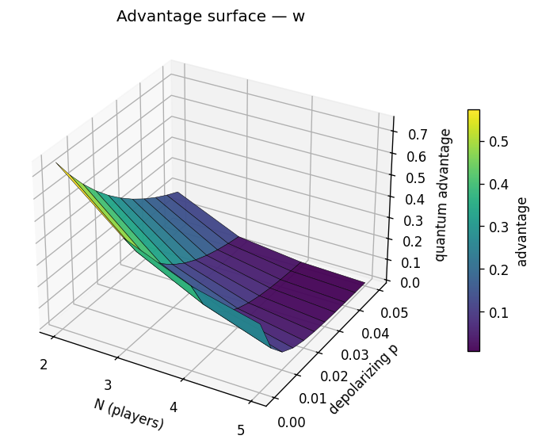

# Experiment report: noise-robustness

RQ3: quantum advantage under a depolarizing channel (p on u, p on cx in the pinned {u, cx} basis) for GHZ / W / ring, N = 2..5, V=4, C=3, gamma=pi/2. All entanglers exact gate-level circuits (W via the T8 conjugation construction).

_Generated: 2026-07-03T0213Z_

## Parameters used

```yaml
experiment:
  name: noise-robustness
  description: 'RQ3: quantum advantage under a depolarizing channel (p on u, p on
    cx in the pinned {u, cx} basis) for GHZ / W / ring, N = 2..5, V=4, C=3, gamma=pi/2.
    All entanglers exact gate-level circuits (W via the T8 conjugation construction).'
generated_at: 2026-07-03T0213Z
output:
  formats:
  - md
  - json
  - csv
  - plots
cells:
- N: 2
  topology: ghz
  strategy_names:
  - D
  - H
  - Q
  V: 4.0
  C: 3.0
  gamma: 1.5707963267948966
  gamma_label: pi/2
  strategy_mode: fixed
  noise_p: 0.0
- N: 2
  topology: ghz
  strategy_names:
  - D
  - H
  - Q
  V: 4.0
  C: 3.0
  gamma: 1.5707963267948966
  gamma_label: pi/2
  strategy_mode: fixed
  noise_p: 0.005
- N: 2
  topology: ghz
  strategy_names:
  - D
  - H
  - Q
  V: 4.0
  C: 3.0
  gamma: 1.5707963267948966
  gamma_label: pi/2
  strategy_mode: fixed
  noise_p: 0.01
- N: 2
  topology: ghz
  strategy_names:
  - D
  - H
  - Q
  V: 4.0
  C: 3.0
  gamma: 1.5707963267948966
  gamma_label: pi/2
  strategy_mode: fixed
  noise_p: 0.015
- N: 2
  topology: ghz
  strategy_names:
  - D
  - H
  - Q
  V: 4.0
  C: 3.0
  gamma: 1.5707963267948966
  gamma_label: pi/2
  strategy_mode: fixed
  noise_p: 0.02
- N: 2
  topology: ghz
  strategy_names:
  - D
  - H
  - Q
  V: 4.0
  C: 3.0
  gamma: 1.5707963267948966
  gamma_label: pi/2
  strategy_mode: fixed
  noise_p: 0.025
- N: 2
  topology: ghz
  strategy_names:
  - D
  - H
  - Q
  V: 4.0
  C: 3.0
  gamma: 1.5707963267948966
  gamma_label: pi/2
  strategy_mode: fixed
  noise_p: 0.03
- N: 2
  topology: ghz
  strategy_names:
  - D
  - H
  - Q
  V: 4.0
  C: 3.0
  gamma: 1.5707963267948966
  gamma_label: pi/2
  strategy_mode: fixed
  noise_p: 0.035
- N: 2
  topology: ghz
  strategy_names:
  - D
  - H
  - Q
  V: 4.0
  C: 3.0
  gamma: 1.5707963267948966
  gamma_label: pi/2
  strategy_mode: fixed
  noise_p: 0.04
- N: 2
  topology: ghz
  strategy_names:
  - D
  - H
  - Q
  V: 4.0
  C: 3.0
  gamma: 1.5707963267948966
  gamma_label: pi/2
  strategy_mode: fixed
  noise_p: 0.045
- N: 2
  topology: ghz
  strategy_names:
  - D
  - H
  - Q
  V: 4.0
  C: 3.0
  gamma: 1.5707963267948966
  gamma_label: pi/2
  strategy_mode: fixed
  noise_p: 0.05
- N: 2
  topology: w
  strategy_names:
  - D
  - H
  - Q
  V: 4.0
  C: 3.0
  gamma: 1.5707963267948966
  gamma_label: pi/2
  strategy_mode: fixed
  noise_p: 0.0
- N: 2
  topology: w
  strategy_names:
  - D
  - H
  - Q
  V: 4.0
  C: 3.0
  gamma: 1.5707963267948966
  gamma_label: pi/2
  strategy_mode: fixed
  noise_p: 0.005
- N: 2
  topology: w
  strategy_names:
  - D
  - H
  - Q
  V: 4.0
  C: 3.0
  gamma: 1.5707963267948966
  gamma_label: pi/2
  strategy_mode: fixed
  noise_p: 0.01
- N: 2
  topology: w
  strategy_names:
  - D
  - H
  - Q
  V: 4.0
  C: 3.0
  gamma: 1.5707963267948966
  gamma_label: pi/2
  strategy_mode: fixed
  noise_p: 0.015
- N: 2
  topology: w
  strategy_names:
  - D
  - H
  - Q
  V: 4.0
  C: 3.0
  gamma: 1.5707963267948966
  gamma_label: pi/2
  strategy_mode: fixed
  noise_p: 0.02
- N: 2
  topology: w
  strategy_names:
  - D
  - H
  - Q
  V: 4.0
  C: 3.0
  gamma: 1.5707963267948966
  gamma_label: pi/2
  strategy_mode: fixed
  noise_p: 0.025
- N: 2
  topology: w
  strategy_names:
  - D
  - H
  - Q
  V: 4.0
  C: 3.0
  gamma: 1.5707963267948966
  gamma_label: pi/2
  strategy_mode: fixed
  noise_p: 0.03
- N: 2
  topology: w
  strategy_names:
  - D
  - H
  - Q
  V: 4.0
  C: 3.0
  gamma: 1.5707963267948966
  gamma_label: pi/2
  strategy_mode: fixed
  noise_p: 0.035
- N: 2
  topology: w
  strategy_names:
  - D
  - H
  - Q
  V: 4.0
  C: 3.0
  gamma: 1.5707963267948966
  gamma_label: pi/2
  strategy_mode: fixed
  noise_p: 0.04
- N: 2
  topology: w
  strategy_names:
  - D
  - H
  - Q
  V: 4.0
  C: 3.0
  gamma: 1.5707963267948966
  gamma_label: pi/2
  strategy_mode: fixed
  noise_p: 0.045
- N: 2
  topology: w
  strategy_names:
  - D
  - H
  - Q
  V: 4.0
  C: 3.0
  gamma: 1.5707963267948966
  gamma_label: pi/2
  strategy_mode: fixed
  noise_p: 0.05
- N: 2
  topology: ring
  strategy_names:
  - D
  - H
  - Q
  V: 4.0
  C: 3.0
  gamma: 1.5707963267948966
  gamma_label: pi/2
  strategy_mode: fixed
  noise_p: 0.0
- N: 2
  topology: ring
  strategy_names:
  - D
  - H
  - Q
  V: 4.0
  C: 3.0
  gamma: 1.5707963267948966
  gamma_label: pi/2
  strategy_mode: fixed
  noise_p: 0.005
- N: 2
  topology: ring
  strategy_names:
  - D
  - H
  - Q
  V: 4.0
  C: 3.0
  gamma: 1.5707963267948966
  gamma_label: pi/2
  strategy_mode: fixed
  noise_p: 0.01
- N: 2
  topology: ring
  strategy_names:
  - D
  - H
  - Q
  V: 4.0
  C: 3.0
  gamma: 1.5707963267948966
  gamma_label: pi/2
  strategy_mode: fixed
  noise_p: 0.015
- N: 2
  topology: ring
  strategy_names:
  - D
  - H
  - Q
  V: 4.0
  C: 3.0
  gamma: 1.5707963267948966
  gamma_label: pi/2
  strategy_mode: fixed
  noise_p: 0.02
- N: 2
  topology: ring
  strategy_names:
  - D
  - H
  - Q
  V: 4.0
  C: 3.0
  gamma: 1.5707963267948966
  gamma_label: pi/2
  strategy_mode: fixed
  noise_p: 0.025
- N: 2
  topology: ring
  strategy_names:
  - D
  - H
  - Q
  V: 4.0
  C: 3.0
  gamma: 1.5707963267948966
  gamma_label: pi/2
  strategy_mode: fixed
  noise_p: 0.03
- N: 2
  topology: ring
  strategy_names:
  - D
  - H
  - Q
  V: 4.0
  C: 3.0
  gamma: 1.5707963267948966
  gamma_label: pi/2
  strategy_mode: fixed
  noise_p: 0.035
- N: 2
  topology: ring
  strategy_names:
  - D
  - H
  - Q
  V: 4.0
  C: 3.0
  gamma: 1.5707963267948966
  gamma_label: pi/2
  strategy_mode: fixed
  noise_p: 0.04
- N: 2
  topology: ring
  strategy_names:
  - D
  - H
  - Q
  V: 4.0
  C: 3.0
  gamma: 1.5707963267948966
  gamma_label: pi/2
  strategy_mode: fixed
  noise_p: 0.045
- N: 2
  topology: ring
  strategy_names:
  - D
  - H
  - Q
  V: 4.0
  C: 3.0
  gamma: 1.5707963267948966
  gamma_label: pi/2
  strategy_mode: fixed
  noise_p: 0.05
- N: 3
  topology: ghz
  strategy_names:
  - D
  - H
  - Q
  V: 4.0
  C: 3.0
  gamma: 1.5707963267948966
  gamma_label: pi/2
  strategy_mode: fixed
  noise_p: 0.0
- N: 3
  topology: ghz
  strategy_names:
  - D
  - H
  - Q
  V: 4.0
  C: 3.0
  gamma: 1.5707963267948966
  gamma_label: pi/2
  strategy_mode: fixed
  noise_p: 0.005
- N: 3
  topology: ghz
  strategy_names:
  - D
  - H
  - Q
  V: 4.0
  C: 3.0
  gamma: 1.5707963267948966
  gamma_label: pi/2
  strategy_mode: fixed
  noise_p: 0.01
- N: 3
  topology: ghz
  strategy_names:
  - D
  - H
  - Q
  V: 4.0
  C: 3.0
  gamma: 1.5707963267948966
  gamma_label: pi/2
  strategy_mode: fixed
  noise_p: 0.015
- N: 3
  topology: ghz
  strategy_names:
  - D
  - H
  - Q
  V: 4.0
  C: 3.0
  gamma: 1.5707963267948966
  gamma_label: pi/2
  strategy_mode: fixed
  noise_p: 0.02
- N: 3
  topology: ghz
  strategy_names:
  - D
  - H
  - Q
  V: 4.0
  C: 3.0
  gamma: 1.5707963267948966
  gamma_label: pi/2
  strategy_mode: fixed
  noise_p: 0.025
- N: 3
  topology: ghz
  strategy_names:
  - D
  - H
  - Q
  V: 4.0
  C: 3.0
  gamma: 1.5707963267948966
  gamma_label: pi/2
  strategy_mode: fixed
  noise_p: 0.03
- N: 3
  topology: ghz
  strategy_names:
  - D
  - H
  - Q
  V: 4.0
  C: 3.0
  gamma: 1.5707963267948966
  gamma_label: pi/2
  strategy_mode: fixed
  noise_p: 0.035
- N: 3
  topology: ghz
  strategy_names:
  - D
  - H
  - Q
  V: 4.0
  C: 3.0
  gamma: 1.5707963267948966
  gamma_label: pi/2
  strategy_mode: fixed
  noise_p: 0.04
- N: 3
  topology: ghz
  strategy_names:
  - D
  - H
  - Q
  V: 4.0
  C: 3.0
  gamma: 1.5707963267948966
  gamma_label: pi/2
  strategy_mode: fixed
  noise_p: 0.045
- N: 3
  topology: ghz
  strategy_names:
  - D
  - H
  - Q
  V: 4.0
  C: 3.0
  gamma: 1.5707963267948966
  gamma_label: pi/2
  strategy_mode: fixed
  noise_p: 0.05
- N: 3
  topology: w
  strategy_names:
  - D
  - H
  - Q
  V: 4.0
  C: 3.0
  gamma: 1.5707963267948966
  gamma_label: pi/2
  strategy_mode: fixed
  noise_p: 0.0
- N: 3
  topology: w
  strategy_names:
  - D
  - H
  - Q
  V: 4.0
  C: 3.0
  gamma: 1.5707963267948966
  gamma_label: pi/2
  strategy_mode: fixed
  noise_p: 0.005
- N: 3
  topology: w
  strategy_names:
  - D
  - H
  - Q
  V: 4.0
  C: 3.0
  gamma: 1.5707963267948966
  gamma_label: pi/2
  strategy_mode: fixed
  noise_p: 0.01
- N: 3
  topology: w
  strategy_names:
  - D
  - H
  - Q
  V: 4.0
  C: 3.0
  gamma: 1.5707963267948966
  gamma_label: pi/2
  strategy_mode: fixed
  noise_p: 0.015
- N: 3
  topology: w
  strategy_names:
  - D
  - H
  - Q
  V: 4.0
  C: 3.0
  gamma: 1.5707963267948966
  gamma_label: pi/2
  strategy_mode: fixed
  noise_p: 0.02
- N: 3
  topology: w
  strategy_names:
  - D
  - H
  - Q
  V: 4.0
  C: 3.0
  gamma: 1.5707963267948966
  gamma_label: pi/2
  strategy_mode: fixed
  noise_p: 0.025
- N: 3
  topology: w
  strategy_names:
  - D
  - H
  - Q
  V: 4.0
  C: 3.0
  gamma: 1.5707963267948966
  gamma_label: pi/2
  strategy_mode: fixed
  noise_p: 0.03
- N: 3
  topology: w
  strategy_names:
  - D
  - H
  - Q
  V: 4.0
  C: 3.0
  gamma: 1.5707963267948966
  gamma_label: pi/2
  strategy_mode: fixed
  noise_p: 0.035
- N: 3
  topology: w
  strategy_names:
  - D
  - H
  - Q
  V: 4.0
  C: 3.0
  gamma: 1.5707963267948966
  gamma_label: pi/2
  strategy_mode: fixed
  noise_p: 0.04
- N: 3
  topology: w
  strategy_names:
  - D
  - H
  - Q
  V: 4.0
  C: 3.0
  gamma: 1.5707963267948966
  gamma_label: pi/2
  strategy_mode: fixed
  noise_p: 0.045
- N: 3
  topology: w
  strategy_names:
  - D
  - H
  - Q
  V: 4.0
  C: 3.0
  gamma: 1.5707963267948966
  gamma_label: pi/2
  strategy_mode: fixed
  noise_p: 0.05
- N: 3
  topology: ring
  strategy_names:
  - D
  - H
  - Q
  V: 4.0
  C: 3.0
  gamma: 1.5707963267948966
  gamma_label: pi/2
  strategy_mode: fixed
  noise_p: 0.0
- N: 3
  topology: ring
  strategy_names:
  - D
  - H
  - Q
  V: 4.0
  C: 3.0
  gamma: 1.5707963267948966
  gamma_label: pi/2
  strategy_mode: fixed
  noise_p: 0.005
- N: 3
  topology: ring
  strategy_names:
  - D
  - H
  - Q
  V: 4.0
  C: 3.0
  gamma: 1.5707963267948966
  gamma_label: pi/2
  strategy_mode: fixed
  noise_p: 0.01
- N: 3
  topology: ring
  strategy_names:
  - D
  - H
  - Q
  V: 4.0
  C: 3.0
  gamma: 1.5707963267948966
  gamma_label: pi/2
  strategy_mode: fixed
  noise_p: 0.015
- N: 3
  topology: ring
  strategy_names:
  - D
  - H
  - Q
  V: 4.0
  C: 3.0
  gamma: 1.5707963267948966
  gamma_label: pi/2
  strategy_mode: fixed
  noise_p: 0.02
- N: 3
  topology: ring
  strategy_names:
  - D
  - H
  - Q
  V: 4.0
  C: 3.0
  gamma: 1.5707963267948966
  gamma_label: pi/2
  strategy_mode: fixed
  noise_p: 0.025
- N: 3
  topology: ring
  strategy_names:
  - D
  - H
  - Q
  V: 4.0
  C: 3.0
  gamma: 1.5707963267948966
  gamma_label: pi/2
  strategy_mode: fixed
  noise_p: 0.03
- N: 3
  topology: ring
  strategy_names:
  - D
  - H
  - Q
  V: 4.0
  C: 3.0
  gamma: 1.5707963267948966
  gamma_label: pi/2
  strategy_mode: fixed
  noise_p: 0.035
- N: 3
  topology: ring
  strategy_names:
  - D
  - H
  - Q
  V: 4.0
  C: 3.0
  gamma: 1.5707963267948966
  gamma_label: pi/2
  strategy_mode: fixed
  noise_p: 0.04
- N: 3
  topology: ring
  strategy_names:
  - D
  - H
  - Q
  V: 4.0
  C: 3.0
  gamma: 1.5707963267948966
  gamma_label: pi/2
  strategy_mode: fixed
  noise_p: 0.045
- N: 3
  topology: ring
  strategy_names:
  - D
  - H
  - Q
  V: 4.0
  C: 3.0
  gamma: 1.5707963267948966
  gamma_label: pi/2
  strategy_mode: fixed
  noise_p: 0.05
- N: 4
  topology: ghz
  strategy_names:
  - D
  - H
  - Q
  V: 4.0
  C: 3.0
  gamma: 1.5707963267948966
  gamma_label: pi/2
  strategy_mode: fixed
  noise_p: 0.0
- N: 4
  topology: ghz
  strategy_names:
  - D
  - H
  - Q
  V: 4.0
  C: 3.0
  gamma: 1.5707963267948966
  gamma_label: pi/2
  strategy_mode: fixed
  noise_p: 0.005
- N: 4
  topology: ghz
  strategy_names:
  - D
  - H
  - Q
  V: 4.0
  C: 3.0
  gamma: 1.5707963267948966
  gamma_label: pi/2
  strategy_mode: fixed
  noise_p: 0.01
- N: 4
  topology: ghz
  strategy_names:
  - D
  - H
  - Q
  V: 4.0
  C: 3.0
  gamma: 1.5707963267948966
  gamma_label: pi/2
  strategy_mode: fixed
  noise_p: 0.015
- N: 4
  topology: ghz
  strategy_names:
  - D
  - H
  - Q
  V: 4.0
  C: 3.0
  gamma: 1.5707963267948966
  gamma_label: pi/2
  strategy_mode: fixed
  noise_p: 0.02
- N: 4
  topology: ghz
  strategy_names:
  - D
  - H
  - Q
  V: 4.0
  C: 3.0
  gamma: 1.5707963267948966
  gamma_label: pi/2
  strategy_mode: fixed
  noise_p: 0.025
- N: 4
  topology: ghz
  strategy_names:
  - D
  - H
  - Q
  V: 4.0
  C: 3.0
  gamma: 1.5707963267948966
  gamma_label: pi/2
  strategy_mode: fixed
  noise_p: 0.03
- N: 4
  topology: ghz
  strategy_names:
  - D
  - H
  - Q
  V: 4.0
  C: 3.0
  gamma: 1.5707963267948966
  gamma_label: pi/2
  strategy_mode: fixed
  noise_p: 0.035
- N: 4
  topology: ghz
  strategy_names:
  - D
  - H
  - Q
  V: 4.0
  C: 3.0
  gamma: 1.5707963267948966
  gamma_label: pi/2
  strategy_mode: fixed
  noise_p: 0.04
- N: 4
  topology: ghz
  strategy_names:
  - D
  - H
  - Q
  V: 4.0
  C: 3.0
  gamma: 1.5707963267948966
  gamma_label: pi/2
  strategy_mode: fixed
  noise_p: 0.045
- N: 4
  topology: ghz
  strategy_names:
  - D
  - H
  - Q
  V: 4.0
  C: 3.0
  gamma: 1.5707963267948966
  gamma_label: pi/2
  strategy_mode: fixed
  noise_p: 0.05
- N: 4
  topology: w
  strategy_names:
  - D
  - H
  - Q
  V: 4.0
  C: 3.0
  gamma: 1.5707963267948966
  gamma_label: pi/2
  strategy_mode: fixed
  noise_p: 0.0
- N: 4
  topology: w
  strategy_names:
  - D
  - H
  - Q
  V: 4.0
  C: 3.0
  gamma: 1.5707963267948966
  gamma_label: pi/2
  strategy_mode: fixed
  noise_p: 0.005
- N: 4
  topology: w
  strategy_names:
  - D
  - H
  - Q
  V: 4.0
  C: 3.0
  gamma: 1.5707963267948966
  gamma_label: pi/2
  strategy_mode: fixed
  noise_p: 0.01
- N: 4
  topology: w
  strategy_names:
  - D
  - H
  - Q
  V: 4.0
  C: 3.0
  gamma: 1.5707963267948966
  gamma_label: pi/2
  strategy_mode: fixed
  noise_p: 0.015
- N: 4
  topology: w
  strategy_names:
  - D
  - H
  - Q
  V: 4.0
  C: 3.0
  gamma: 1.5707963267948966
  gamma_label: pi/2
  strategy_mode: fixed
  noise_p: 0.02
- N: 4
  topology: w
  strategy_names:
  - D
  - H
  - Q
  V: 4.0
  C: 3.0
  gamma: 1.5707963267948966
  gamma_label: pi/2
  strategy_mode: fixed
  noise_p: 0.025
- N: 4
  topology: w
  strategy_names:
  - D
  - H
  - Q
  V: 4.0
  C: 3.0
  gamma: 1.5707963267948966
  gamma_label: pi/2
  strategy_mode: fixed
  noise_p: 0.03
- N: 4
  topology: w
  strategy_names:
  - D
  - H
  - Q
  V: 4.0
  C: 3.0
  gamma: 1.5707963267948966
  gamma_label: pi/2
  strategy_mode: fixed
  noise_p: 0.035
- N: 4
  topology: w
  strategy_names:
  - D
  - H
  - Q
  V: 4.0
  C: 3.0
  gamma: 1.5707963267948966
  gamma_label: pi/2
  strategy_mode: fixed
  noise_p: 0.04
- N: 4
  topology: w
  strategy_names:
  - D
  - H
  - Q
  V: 4.0
  C: 3.0
  gamma: 1.5707963267948966
  gamma_label: pi/2
  strategy_mode: fixed
  noise_p: 0.045
- N: 4
  topology: w
  strategy_names:
  - D
  - H
  - Q
  V: 4.0
  C: 3.0
  gamma: 1.5707963267948966
  gamma_label: pi/2
  strategy_mode: fixed
  noise_p: 0.05
- N: 4
  topology: ring
  strategy_names:
  - D
  - H
  - Q
  V: 4.0
  C: 3.0
  gamma: 1.5707963267948966
  gamma_label: pi/2
  strategy_mode: fixed
  noise_p: 0.0
- N: 4
  topology: ring
  strategy_names:
  - D
  - H
  - Q
  V: 4.0
  C: 3.0
  gamma: 1.5707963267948966
  gamma_label: pi/2
  strategy_mode: fixed
  noise_p: 0.005
- N: 4
  topology: ring
  strategy_names:
  - D
  - H
  - Q
  V: 4.0
  C: 3.0
  gamma: 1.5707963267948966
  gamma_label: pi/2
  strategy_mode: fixed
  noise_p: 0.01
- N: 4
  topology: ring
  strategy_names:
  - D
  - H
  - Q
  V: 4.0
  C: 3.0
  gamma: 1.5707963267948966
  gamma_label: pi/2
  strategy_mode: fixed
  noise_p: 0.015
- N: 4
  topology: ring
  strategy_names:
  - D
  - H
  - Q
  V: 4.0
  C: 3.0
  gamma: 1.5707963267948966
  gamma_label: pi/2
  strategy_mode: fixed
  noise_p: 0.02
- N: 4
  topology: ring
  strategy_names:
  - D
  - H
  - Q
  V: 4.0
  C: 3.0
  gamma: 1.5707963267948966
  gamma_label: pi/2
  strategy_mode: fixed
  noise_p: 0.025
- N: 4
  topology: ring
  strategy_names:
  - D
  - H
  - Q
  V: 4.0
  C: 3.0
  gamma: 1.5707963267948966
  gamma_label: pi/2
  strategy_mode: fixed
  noise_p: 0.03
- N: 4
  topology: ring
  strategy_names:
  - D
  - H
  - Q
  V: 4.0
  C: 3.0
  gamma: 1.5707963267948966
  gamma_label: pi/2
  strategy_mode: fixed
  noise_p: 0.035
- N: 4
  topology: ring
  strategy_names:
  - D
  - H
  - Q
  V: 4.0
  C: 3.0
  gamma: 1.5707963267948966
  gamma_label: pi/2
  strategy_mode: fixed
  noise_p: 0.04
- N: 4
  topology: ring
  strategy_names:
  - D
  - H
  - Q
  V: 4.0
  C: 3.0
  gamma: 1.5707963267948966
  gamma_label: pi/2
  strategy_mode: fixed
  noise_p: 0.045
- N: 4
  topology: ring
  strategy_names:
  - D
  - H
  - Q
  V: 4.0
  C: 3.0
  gamma: 1.5707963267948966
  gamma_label: pi/2
  strategy_mode: fixed
  noise_p: 0.05
- N: 5
  topology: ghz
  strategy_names:
  - D
  - H
  - Q
  V: 4.0
  C: 3.0
  gamma: 1.5707963267948966
  gamma_label: pi/2
  strategy_mode: fixed
  noise_p: 0.0
- N: 5
  topology: ghz
  strategy_names:
  - D
  - H
  - Q
  V: 4.0
  C: 3.0
  gamma: 1.5707963267948966
  gamma_label: pi/2
  strategy_mode: fixed
  noise_p: 0.005
- N: 5
  topology: ghz
  strategy_names:
  - D
  - H
  - Q
  V: 4.0
  C: 3.0
  gamma: 1.5707963267948966
  gamma_label: pi/2
  strategy_mode: fixed
  noise_p: 0.01
- N: 5
  topology: ghz
  strategy_names:
  - D
  - H
  - Q
  V: 4.0
  C: 3.0
  gamma: 1.5707963267948966
  gamma_label: pi/2
  strategy_mode: fixed
  noise_p: 0.015
- N: 5
  topology: ghz
  strategy_names:
  - D
  - H
  - Q
  V: 4.0
  C: 3.0
  gamma: 1.5707963267948966
  gamma_label: pi/2
  strategy_mode: fixed
  noise_p: 0.02
- N: 5
  topology: ghz
  strategy_names:
  - D
  - H
  - Q
  V: 4.0
  C: 3.0
  gamma: 1.5707963267948966
  gamma_label: pi/2
  strategy_mode: fixed
  noise_p: 0.025
- N: 5
  topology: ghz
  strategy_names:
  - D
  - H
  - Q
  V: 4.0
  C: 3.0
  gamma: 1.5707963267948966
  gamma_label: pi/2
  strategy_mode: fixed
  noise_p: 0.03
- N: 5
  topology: ghz
  strategy_names:
  - D
  - H
  - Q
  V: 4.0
  C: 3.0
  gamma: 1.5707963267948966
  gamma_label: pi/2
  strategy_mode: fixed
  noise_p: 0.035
- N: 5
  topology: ghz
  strategy_names:
  - D
  - H
  - Q
  V: 4.0
  C: 3.0
  gamma: 1.5707963267948966
  gamma_label: pi/2
  strategy_mode: fixed
  noise_p: 0.04
- N: 5
  topology: ghz
  strategy_names:
  - D
  - H
  - Q
  V: 4.0
  C: 3.0
  gamma: 1.5707963267948966
  gamma_label: pi/2
  strategy_mode: fixed
  noise_p: 0.045
- N: 5
  topology: ghz
  strategy_names:
  - D
  - H
  - Q
  V: 4.0
  C: 3.0
  gamma: 1.5707963267948966
  gamma_label: pi/2
  strategy_mode: fixed
  noise_p: 0.05
- N: 5
  topology: w
  strategy_names:
  - D
  - H
  - Q
  V: 4.0
  C: 3.0
  gamma: 1.5707963267948966
  gamma_label: pi/2
  strategy_mode: fixed
  noise_p: 0.0
- N: 5
  topology: w
  strategy_names:
  - D
  - H
  - Q
  V: 4.0
  C: 3.0
  gamma: 1.5707963267948966
  gamma_label: pi/2
  strategy_mode: fixed
  noise_p: 0.005
- N: 5
  topology: w
  strategy_names:
  - D
  - H
  - Q
  V: 4.0
  C: 3.0
  gamma: 1.5707963267948966
  gamma_label: pi/2
  strategy_mode: fixed
  noise_p: 0.01
- N: 5
  topology: w
  strategy_names:
  - D
  - H
  - Q
  V: 4.0
  C: 3.0
  gamma: 1.5707963267948966
  gamma_label: pi/2
  strategy_mode: fixed
  noise_p: 0.015
- N: 5
  topology: w
  strategy_names:
  - D
  - H
  - Q
  V: 4.0
  C: 3.0
  gamma: 1.5707963267948966
  gamma_label: pi/2
  strategy_mode: fixed
  noise_p: 0.02
- N: 5
  topology: w
  strategy_names:
  - D
  - H
  - Q
  V: 4.0
  C: 3.0
  gamma: 1.5707963267948966
  gamma_label: pi/2
  strategy_mode: fixed
  noise_p: 0.025
- N: 5
  topology: w
  strategy_names:
  - D
  - H
  - Q
  V: 4.0
  C: 3.0
  gamma: 1.5707963267948966
  gamma_label: pi/2
  strategy_mode: fixed
  noise_p: 0.03
- N: 5
  topology: w
  strategy_names:
  - D
  - H
  - Q
  V: 4.0
  C: 3.0
  gamma: 1.5707963267948966
  gamma_label: pi/2
  strategy_mode: fixed
  noise_p: 0.035
- N: 5
  topology: w
  strategy_names:
  - D
  - H
  - Q
  V: 4.0
  C: 3.0
  gamma: 1.5707963267948966
  gamma_label: pi/2
  strategy_mode: fixed
  noise_p: 0.04
- N: 5
  topology: w
  strategy_names:
  - D
  - H
  - Q
  V: 4.0
  C: 3.0
  gamma: 1.5707963267948966
  gamma_label: pi/2
  strategy_mode: fixed
  noise_p: 0.045
- N: 5
  topology: w
  strategy_names:
  - D
  - H
  - Q
  V: 4.0
  C: 3.0
  gamma: 1.5707963267948966
  gamma_label: pi/2
  strategy_mode: fixed
  noise_p: 0.05
- N: 5
  topology: ring
  strategy_names:
  - D
  - H
  - Q
  V: 4.0
  C: 3.0
  gamma: 1.5707963267948966
  gamma_label: pi/2
  strategy_mode: fixed
  noise_p: 0.0
- N: 5
  topology: ring
  strategy_names:
  - D
  - H
  - Q
  V: 4.0
  C: 3.0
  gamma: 1.5707963267948966
  gamma_label: pi/2
  strategy_mode: fixed
  noise_p: 0.005
- N: 5
  topology: ring
  strategy_names:
  - D
  - H
  - Q
  V: 4.0
  C: 3.0
  gamma: 1.5707963267948966
  gamma_label: pi/2
  strategy_mode: fixed
  noise_p: 0.01
- N: 5
  topology: ring
  strategy_names:
  - D
  - H
  - Q
  V: 4.0
  C: 3.0
  gamma: 1.5707963267948966
  gamma_label: pi/2
  strategy_mode: fixed
  noise_p: 0.015
- N: 5
  topology: ring
  strategy_names:
  - D
  - H
  - Q
  V: 4.0
  C: 3.0
  gamma: 1.5707963267948966
  gamma_label: pi/2
  strategy_mode: fixed
  noise_p: 0.02
- N: 5
  topology: ring
  strategy_names:
  - D
  - H
  - Q
  V: 4.0
  C: 3.0
  gamma: 1.5707963267948966
  gamma_label: pi/2
  strategy_mode: fixed
  noise_p: 0.025
- N: 5
  topology: ring
  strategy_names:
  - D
  - H
  - Q
  V: 4.0
  C: 3.0
  gamma: 1.5707963267948966
  gamma_label: pi/2
  strategy_mode: fixed
  noise_p: 0.03
- N: 5
  topology: ring
  strategy_names:
  - D
  - H
  - Q
  V: 4.0
  C: 3.0
  gamma: 1.5707963267948966
  gamma_label: pi/2
  strategy_mode: fixed
  noise_p: 0.035
- N: 5
  topology: ring
  strategy_names:
  - D
  - H
  - Q
  V: 4.0
  C: 3.0
  gamma: 1.5707963267948966
  gamma_label: pi/2
  strategy_mode: fixed
  noise_p: 0.04
- N: 5
  topology: ring
  strategy_names:
  - D
  - H
  - Q
  V: 4.0
  C: 3.0
  gamma: 1.5707963267948966
  gamma_label: pi/2
  strategy_mode: fixed
  noise_p: 0.045
- N: 5
  topology: ring
  strategy_names:
  - D
  - H
  - Q
  V: 4.0
  C: 3.0
  gamma: 1.5707963267948966
  gamma_label: pi/2
  strategy_mode: fixed
  noise_p: 0.05
```

## Summary

| N | topology | V | C | gamma | noise_p | q_payoff | classical_ne | advantage | q_is_nash | symmetric | status |
|---|---|---|---|---|---|---|---|---|---|---|---|
| 2 | ghz | 4 | 3 | pi/2 | 0 | 2.000000 | 0.500000 | 1.500000 | yes | yes | ok |
| 2 | ghz | 4 | 3 | pi/2 | 0.005 | 1.974586 | 0.576241 | 1.398345 | yes | yes | ok |
| 2 | ghz | 4 | 3 | pi/2 | 0.01 | 1.950780 | 0.647661 | 1.303119 | yes | yes | ok |
| 2 | ghz | 4 | 3 | pi/2 | 0.015 | 1.928486 | 0.714542 | 1.213944 | yes | yes | ok |
| 2 | ghz | 4 | 3 | pi/2 | 0.02 | 1.907616 | 0.777153 | 1.130463 | yes | yes | ok |
| 2 | ghz | 4 | 3 | pi/2 | 0.025 | 1.888085 | 0.835745 | 1.052340 | yes | yes | ok |
| 2 | ghz | 4 | 3 | pi/2 | 0.03 | 1.869814 | 0.890559 | 0.979254 | yes | yes | ok |
| 2 | ghz | 4 | 3 | pi/2 | 0.035 | 1.852727 | 0.941820 | 0.910906 | yes | yes | ok |
| 2 | ghz | 4 | 3 | pi/2 | 0.04 | 1.836752 | 0.989743 | 0.847010 | yes | yes | ok |
| 2 | ghz | 4 | 3 | pi/2 | 0.045 | 1.821824 | 1.034527 | 0.787297 | yes | yes | ok |
| 2 | ghz | 4 | 3 | pi/2 | 0.05 | 1.807878 | 1.076366 | 0.731512 | yes | yes | ok |
| 2 | w | 4 | 3 | pi/2 | 0 | 2.000000 | 1.250000 | 0.750000 | **NO** | yes | ok |
| 2 | w | 4 | 3 | pi/2 | 0.005 | 1.952514 | 1.299887 | 0.652627 | **NO** | no | ok |
| 2 | w | 4 | 3 | pi/2 | 0.01 | 1.910814 | 1.343281 | 0.567533 | **NO** | no | ok |
| 2 | w | 4 | 3 | pi/2 | 0.015 | 1.874222 | 1.381007 | 0.493216 | **NO** | no | ok |
| 2 | w | 4 | 3 | pi/2 | 0.02 | 1.842139 | 1.413789 | 0.428350 | **NO** | no | ok |
| 2 | w | 4 | 3 | pi/2 | 0.025 | 1.814031 | 1.442260 | 0.371771 | **NO** | no | ok |
| 2 | w | 4 | 3 | pi/2 | 0.03 | 1.789424 | 1.466975 | 0.322450 | **NO** | no | ok |
| 2 | w | 4 | 3 | pi/2 | 0.035 | 1.767901 | 1.488417 | 0.279484 | **NO** | no | ok |
| 2 | w | 4 | 3 | pi/2 | 0.04 | 1.749090 | 1.507012 | 0.242078 | **NO** | no | ok |
| 2 | w | 4 | 3 | pi/2 | 0.045 | 1.732662 | 1.523128 | 0.209535 | **NO** | no | ok |
| 2 | w | 4 | 3 | pi/2 | 0.05 | 1.718329 | 1.537088 | 0.181240 | **NO** | no | ok |
| 2 | ring | 4 | 3 | pi/2 | 0 | 2.000000 | 0.500000 | 1.500000 | yes | yes | ok |
| 2 | ring | 4 | 3 | pi/2 | 0.005 | 1.974586 | 0.576241 | 1.398345 | yes | yes | ok |
| 2 | ring | 4 | 3 | pi/2 | 0.01 | 1.950780 | 0.647661 | 1.303119 | yes | yes | ok |
| 2 | ring | 4 | 3 | pi/2 | 0.015 | 1.928486 | 0.714542 | 1.213944 | yes | yes | ok |
| 2 | ring | 4 | 3 | pi/2 | 0.02 | 1.907616 | 0.777153 | 1.130463 | yes | yes | ok |
| 2 | ring | 4 | 3 | pi/2 | 0.025 | 1.888085 | 0.835745 | 1.052340 | yes | yes | ok |
| 2 | ring | 4 | 3 | pi/2 | 0.03 | 1.869814 | 0.890559 | 0.979254 | yes | yes | ok |
| 2 | ring | 4 | 3 | pi/2 | 0.035 | 1.852727 | 0.941820 | 0.910906 | yes | yes | ok |
| 2 | ring | 4 | 3 | pi/2 | 0.04 | 1.836752 | 0.989743 | 0.847010 | yes | yes | ok |
| 2 | ring | 4 | 3 | pi/2 | 0.045 | 1.821824 | 1.034527 | 0.787297 | yes | yes | ok |
| 2 | ring | 4 | 3 | pi/2 | 0.05 | 1.807878 | 1.076366 | 0.731512 | yes | yes | ok |
| 3 | ghz | 4 | 3 | pi/2 | 0 | 1.333333 | 0.333333 | 1.000000 | yes | yes | ok |
| 3 | ghz | 4 | 3 | pi/2 | 0.005 | 1.312297 | 0.414429 | 0.897868 | yes | no | ok |
| 3 | ghz | 4 | 3 | pi/2 | 0.01 | 1.293970 | 0.488181 | 0.805789 | yes | no | ok |
| 3 | ghz | 4 | 3 | pi/2 | 0.015 | 1.278050 | 0.555238 | 0.722812 | yes | no | ok |
| 3 | ghz | 4 | 3 | pi/2 | 0.02 | 1.264263 | 0.616193 | 0.648070 | yes | no | ok |
| 3 | ghz | 4 | 3 | pi/2 | 0.025 | 1.252366 | 0.671590 | 0.580776 | yes | no | ok |
| 3 | ghz | 4 | 3 | pi/2 | 0.03 | 1.242139 | 0.721922 | 0.520217 | yes | no | ok |
| 3 | ghz | 4 | 3 | pi/2 | 0.035 | 1.233386 | 0.767644 | 0.465742 | yes | no | ok |
| 3 | ghz | 4 | 3 | pi/2 | 0.04 | 1.225931 | 0.809166 | 0.416765 | yes | no | ok |
| 3 | ghz | 4 | 3 | pi/2 | 0.045 | 1.219616 | 0.846866 | 0.372750 | **NO** | no | ok |
| 3 | ghz | 4 | 3 | pi/2 | 0.05 | 1.214302 | 0.881087 | 0.333215 | **NO** | no | ok |
| 3 | w | 4 | 3 | pi/2 | 0 | 1.333333 | 0.833333 | 0.500000 | **NO** | yes | ok |
| 3 | w | 4 | 3 | pi/2 | 0.005 | 1.319962 | 0.927737 | 0.392225 | **NO** | no | ok |
| 3 | w | 4 | 3 | pi/2 | 0.01 | 1.306316 | 0.998092 | 0.308223 | **NO** | no | ok |
| 3 | w | 4 | 3 | pi/2 | 0.015 | 1.293180 | 1.050600 | 0.242580 | **NO** | no | ok |
| 3 | w | 4 | 3 | pi/2 | 0.02 | 1.281009 | 1.089841 | 0.191168 | **NO** | no | ok |
| 3 | w | 4 | 3 | pi/2 | 0.025 | 1.270029 | 1.119207 | 0.150822 | **NO** | no | ok |
| 3 | w | 4 | 3 | pi/2 | 0.03 | 1.260318 | 1.141212 | 0.119106 | **NO** | no | ok |
| 3 | w | 4 | 3 | pi/2 | 0.035 | 1.251860 | 1.157723 | 0.094137 | **NO** | no | ok |
| 3 | w | 4 | 3 | pi/2 | 0.04 | 1.244583 | 1.170127 | 0.074456 | **NO** | no | ok |
| 3 | w | 4 | 3 | pi/2 | 0.045 | 1.238383 | 1.179458 | 0.058925 | **NO** | no | ok |
| 3 | w | 4 | 3 | pi/2 | 0.05 | 1.233142 | 1.186485 | 0.046657 | **NO** | no | ok |
| 3 | ring | 4 | 3 | pi/2 | 0 | 1.333333 | 0.333333 | 1.000000 | yes | yes | ok |
| 3 | ring | 4 | 3 | pi/2 | 0.005 | 1.315229 | 0.461853 | 0.853376 | yes | no | ok |
| 3 | ring | 4 | 3 | pi/2 | 0.01 | 1.299708 | 0.571856 | 0.727852 | yes | no | ok |
| 3 | ring | 4 | 3 | pi/2 | 0.015 | 1.286408 | 0.665956 | 0.620451 | yes | no | ok |
| 3 | ring | 4 | 3 | pi/2 | 0.02 | 1.275016 | 0.746405 | 0.528610 | yes | no | ok |
| 3 | ring | 4 | 3 | pi/2 | 0.025 | 1.265262 | 0.815144 | 0.450118 | yes | no | ok |
| 3 | ring | 4 | 3 | pi/2 | 0.03 | 1.256916 | 0.873843 | 0.383073 | yes | no | ok |
| 3 | ring | 4 | 3 | pi/2 | 0.035 | 1.249776 | 0.923939 | 0.325837 | yes | no | ok |
| 3 | ring | 4 | 3 | pi/2 | 0.04 | 1.243672 | 0.966669 | 0.277003 | yes | no | ok |
| 3 | ring | 4 | 3 | pi/2 | 0.045 | 1.238454 | 1.003094 | 0.235360 | yes | no | ok |
| 3 | ring | 4 | 3 | pi/2 | 0.05 | 1.233997 | 1.034127 | 0.199870 | yes | no | ok |
| 4 | ghz | 4 | 3 | pi/2 | 0 | 1.000000 | 0.250000 | 0.750000 | **NO** | yes | ok |
| 4 | ghz | 4 | 3 | pi/2 | 0.005 | 0.981314 | 0.332747 | 0.648568 | **NO** | no | ok |
| 4 | ghz | 4 | 3 | pi/2 | 0.01 | 0.966116 | 0.405610 | 0.560507 | **NO** | no | ok |
| 4 | ghz | 4 | 3 | pi/2 | 0.015 | 0.953881 | 0.469779 | 0.484101 | **NO** | no | ok |
| 4 | ghz | 4 | 3 | pi/2 | 0.02 | 0.944152 | 0.976333 | -0.032182 | **NO** | no | ok |
| 4 | ghz | 4 | 3 | pi/2 | 0.025 | 0.936536 | 0.972772 | -0.036235 | **NO** | no | ok |
| 4 | ghz | 4 | 3 | pi/2 | 0.03 | 0.930695 | 0.969853 | -0.039157 | **NO** | no | ok |
| 4 | ghz | 4 | 3 | pi/2 | 0.035 | 0.926337 | 0.967466 | -0.041129 | **NO** | no | ok |
| 4 | ghz | 4 | 3 | pi/2 | 0.04 | 0.923212 | 0.965519 | -0.042307 | **NO** | no | ok |
| 4 | ghz | 4 | 3 | pi/2 | 0.045 | 0.921105 | 0.963934 | -0.042829 | **NO** | no | ok |
| 4 | ghz | 4 | 3 | pi/2 | 0.05 | 0.919833 | 0.962644 | -0.042811 | **NO** | no | ok |
| 4 | w | 4 | 3 | pi/2 | 0 | 1.000000 | 0.625000 | 0.375000 | **NO** | yes | ok |
| 4 | w | 4 | 3 | pi/2 | 0.005 | 0.996854 | 0.752805 | 0.244049 | **NO** | no | ok |
| 4 | w | 4 | 3 | pi/2 | 0.01 | 0.991572 | 0.828997 | 0.162575 | **NO** | no | ok |
| 4 | w | 4 | 3 | pi/2 | 0.015 | 0.985630 | 0.875036 | 0.110594 | **NO** | no | ok |
| 4 | w | 4 | 3 | pi/2 | 0.02 | 0.979861 | 0.903252 | 0.076610 | **NO** | no | ok |
| 4 | w | 4 | 3 | pi/2 | 0.025 | 0.974680 | 0.920800 | 0.053879 | **NO** | no | ok |
| 4 | w | 4 | 3 | pi/2 | 0.03 | 0.970243 | 0.931878 | 0.038365 | **NO** | no | ok |
| 4 | w | 4 | 3 | pi/2 | 0.035 | 0.966564 | 0.938974 | 0.027590 | **NO** | no | ok |
| 4 | w | 4 | 3 | pi/2 | 0.04 | 0.963582 | 0.943585 | 0.019997 | **NO** | no | ok |
| 4 | w | 4 | 3 | pi/2 | 0.045 | 0.961205 | 0.946622 | 0.014583 | **NO** | no | ok |
| 4 | w | 4 | 3 | pi/2 | 0.05 | 0.959334 | 0.948648 | 0.010686 | **NO** | no | ok |
| 4 | ring | 4 | 3 | pi/2 | 0 | 0.250000 | 0.250000 | 0.000000 | **NO** | yes | ok |
| 4 | ring | 4 | 3 | pi/2 | 0.005 | 0.376895 | 0.376688 | 0.000207 | **NO** | no | ok |
| 4 | ring | 4 | 3 | pi/2 | 0.01 | 0.481231 | 0.480534 | 0.000697 | **NO** | no | ok |
| 4 | ring | 4 | 3 | pi/2 | 0.015 | 0.566955 | 0.565637 | 0.001318 | **NO** | no | ok |
| 4 | ring | 4 | 3 | pi/2 | 0.02 | 0.637337 | 0.635368 | 0.001970 | **NO** | no | ok |
| 4 | ring | 4 | 3 | pi/2 | 0.025 | 0.695081 | 0.692495 | 0.002586 | **NO** | no | ok |
| 4 | ring | 4 | 3 | pi/2 | 0.03 | 0.742420 | 0.739293 | 0.003127 | **NO** | no | ok |
| 4 | ring | 4 | 3 | pi/2 | 0.035 | 0.781201 | 0.777628 | 0.003573 | **NO** | no | ok |
| 4 | ring | 4 | 3 | pi/2 | 0.04 | 0.812948 | 0.809031 | 0.003917 | **NO** | no | ok |
| 4 | ring | 4 | 3 | pi/2 | 0.045 | 0.838917 | 0.834759 | 0.004158 | **NO** | no | ok |
| 4 | ring | 4 | 3 | pi/2 | 0.05 | 0.860145 | 0.855841 | 0.004304 | **NO** | no | ok |
| 5 | ghz | 4 | 3 | pi/2 | 0 | 0.800000 | 0.200000 | 0.600000 | **NO** | yes | ok |
| 5 | ghz | 4 | 3 | pi/2 | 0.005 | 0.782889 | 0.283165 | 0.499724 | **NO** | no | ok |
| 5 | ghz | 4 | 3 | pi/2 | 0.01 | 0.769944 | 0.789418 | -0.019474 | **NO** | no | ok |
| 5 | ghz | 4 | 3 | pi/2 | 0.015 | 0.760363 | 0.786037 | -0.025673 | **NO** | no | ok |
| 5 | ghz | 4 | 3 | pi/2 | 0.02 | 0.753486 | 0.783459 | -0.029973 | **NO** | no | ok |
| 5 | ghz | 4 | 3 | pi/2 | 0.025 | 0.748765 | 0.781571 | -0.032806 | **NO** | no | ok |
| 5 | ghz | 4 | 3 | pi/2 | 0.03 | 0.745753 | 0.780225 | -0.034472 | **NO** | no | ok |
| 5 | ghz | 4 | 3 | pi/2 | 0.035 | 0.744080 | 0.779298 | -0.035218 | **NO** | no | ok |
| 5 | ghz | 4 | 3 | pi/2 | 0.04 | 0.743446 | 0.778694 | -0.035248 | **NO** | no | ok |
| 5 | ghz | 4 | 3 | pi/2 | 0.045 | 0.743607 | 0.778334 | -0.034727 | **NO** | no | ok |
| 5 | ghz | 4 | 3 | pi/2 | 0.05 | 0.744364 | 0.778158 | -0.033793 | **NO** | no | ok |
| 5 | w | 4 | 3 | pi/2 | 0 | 0.800000 | 0.500000 | 0.300000 | **NO** | yes | ok |
| 5 | w | 4 | 3 | pi/2 | 0.005 | 0.797866 | 0.658778 | 0.139088 | **NO** | no | ok |
| 5 | w | 4 | 3 | pi/2 | 0.01 | 0.794659 | 0.724907 | 0.069752 | **NO** | no | ok |
| 5 | w | 4 | 3 | pi/2 | 0.015 | 0.791350 | 0.753786 | 0.037564 | **NO** | no | ok |
| 5 | w | 4 | 3 | pi/2 | 0.02 | 0.788507 | 0.767084 | 0.021423 | **NO** | no | ok |
| 5 | w | 4 | 3 | pi/2 | 0.025 | 0.786301 | 0.773556 | 0.012745 | **NO** | no | ok |
| 5 | w | 4 | 3 | pi/2 | 0.03 | 0.784692 | 0.776881 | 0.007812 | **NO** | no | ok |
| 5 | w | 4 | 3 | pi/2 | 0.035 | 0.783564 | 0.778676 | 0.004888 | **NO** | no | ok |
| 5 | w | 4 | 3 | pi/2 | 0.04 | 0.782793 | 0.779688 | 0.003105 | **NO** | no | ok |
| 5 | w | 4 | 3 | pi/2 | 0.045 | 0.782275 | 0.780280 | 0.001994 | **NO** | no | ok |
| 5 | w | 4 | 3 | pi/2 | 0.05 | 0.781929 | 0.780636 | 0.001293 | **NO** | no | ok |
| 5 | ring | 4 | 3 | pi/2 | 0 | 0.800000 | 0.200000 | 0.600000 | **NO** | yes | ok |
| 5 | ring | 4 | 3 | pi/2 | 0.005 | 0.796221 | 0.323823 | 0.472398 | **NO** | no | ok |
| 5 | ring | 4 | 3 | pi/2 | 0.01 | 0.793244 | 0.420919 | 0.372324 | **NO** | no | ok |
| 5 | ring | 4 | 3 | pi/2 | 0.015 | 0.790893 | 0.497089 | 0.293804 | **NO** | no | ok |
| 5 | ring | 4 | 3 | pi/2 | 0.02 | 0.789031 | 0.556873 | 0.232158 | **NO** | no | ok |
| 5 | ring | 4 | 3 | pi/2 | 0.025 | 0.787553 | 0.603827 | 0.183726 | **NO** | no | ok |
| 5 | ring | 4 | 3 | pi/2 | 0.03 | 0.786376 | 0.640734 | 0.145642 | **NO** | no | ok |
| 5 | ring | 4 | 3 | pi/2 | 0.035 | 0.785434 | 0.669771 | 0.115664 | **NO** | no | ok |
| 5 | ring | 4 | 3 | pi/2 | 0.04 | 0.784679 | 0.692640 | 0.092039 | **NO** | no | ok |
| 5 | ring | 4 | 3 | pi/2 | 0.045 | 0.784071 | 0.710675 | 0.073396 | **NO** | no | ok |
| 5 | ring | 4 | 3 | pi/2 | 0.05 | 0.783579 | 0.724917 | 0.058662 | **NO** | no | ok |

## Findings

- Evaluated **132** cells: 132 ran, 0 not-implemented, 0 errored.
- Quantum advantage > 0 in **115/132** computed cells.
- (Q,...,Q) is a pure Nash equilibrium in **42/132** computed cells.

**Cells with advantage <= 0 (RQ1 finding — investigate, do not paper over):**
  - N=4, ghz, gamma=pi/2, p=0.02: advantage = -0.032182
  - N=4, ghz, gamma=pi/2, p=0.025: advantage = -0.036235
  - N=4, ghz, gamma=pi/2, p=0.03: advantage = -0.039157
  - N=4, ghz, gamma=pi/2, p=0.035: advantage = -0.041129
  - N=4, ghz, gamma=pi/2, p=0.04: advantage = -0.042307
  - N=4, ghz, gamma=pi/2, p=0.045: advantage = -0.042829
  - N=4, ghz, gamma=pi/2, p=0.05: advantage = -0.042811
  - N=4, ring, gamma=pi/2: advantage = 0.000000
  - N=5, ghz, gamma=pi/2, p=0.01: advantage = -0.019474
  - N=5, ghz, gamma=pi/2, p=0.015: advantage = -0.025673
  - N=5, ghz, gamma=pi/2, p=0.02: advantage = -0.029973
  - N=5, ghz, gamma=pi/2, p=0.025: advantage = -0.032806
  - N=5, ghz, gamma=pi/2, p=0.03: advantage = -0.034472
  - N=5, ghz, gamma=pi/2, p=0.035: advantage = -0.035218
  - N=5, ghz, gamma=pi/2, p=0.04: advantage = -0.035248
  - N=5, ghz, gamma=pi/2, p=0.045: advantage = -0.034727
  - N=5, ghz, gamma=pi/2, p=0.05: advantage = -0.033793

**Cells where (Q,...,Q) is NOT Nash (RQ1 finding):**
  - N=2, w, gamma=pi/2
  - N=2, w, gamma=pi/2, p=0.005
  - N=2, w, gamma=pi/2, p=0.01
  - N=2, w, gamma=pi/2, p=0.015
  - N=2, w, gamma=pi/2, p=0.02
  - N=2, w, gamma=pi/2, p=0.025
  - N=2, w, gamma=pi/2, p=0.03
  - N=2, w, gamma=pi/2, p=0.035
  - N=2, w, gamma=pi/2, p=0.04
  - N=2, w, gamma=pi/2, p=0.045
  - N=2, w, gamma=pi/2, p=0.05
  - N=3, ghz, gamma=pi/2, p=0.045
  - N=3, ghz, gamma=pi/2, p=0.05
  - N=3, w, gamma=pi/2
  - N=3, w, gamma=pi/2, p=0.005
  - N=3, w, gamma=pi/2, p=0.01
  - N=3, w, gamma=pi/2, p=0.015
  - N=3, w, gamma=pi/2, p=0.02
  - N=3, w, gamma=pi/2, p=0.025
  - N=3, w, gamma=pi/2, p=0.03
  - N=3, w, gamma=pi/2, p=0.035
  - N=3, w, gamma=pi/2, p=0.04
  - N=3, w, gamma=pi/2, p=0.045
  - N=3, w, gamma=pi/2, p=0.05
  - N=4, ghz, gamma=pi/2
  - N=4, ghz, gamma=pi/2, p=0.005
  - N=4, ghz, gamma=pi/2, p=0.01
  - N=4, ghz, gamma=pi/2, p=0.015
  - N=4, ghz, gamma=pi/2, p=0.02
  - N=4, ghz, gamma=pi/2, p=0.025
  - N=4, ghz, gamma=pi/2, p=0.03
  - N=4, ghz, gamma=pi/2, p=0.035
  - N=4, ghz, gamma=pi/2, p=0.04
  - N=4, ghz, gamma=pi/2, p=0.045
  - N=4, ghz, gamma=pi/2, p=0.05
  - N=4, w, gamma=pi/2
  - N=4, w, gamma=pi/2, p=0.005
  - N=4, w, gamma=pi/2, p=0.01
  - N=4, w, gamma=pi/2, p=0.015
  - N=4, w, gamma=pi/2, p=0.02
  - N=4, w, gamma=pi/2, p=0.025
  - N=4, w, gamma=pi/2, p=0.03
  - N=4, w, gamma=pi/2, p=0.035
  - N=4, w, gamma=pi/2, p=0.04
  - N=4, w, gamma=pi/2, p=0.045
  - N=4, w, gamma=pi/2, p=0.05
  - N=4, ring, gamma=pi/2
  - N=4, ring, gamma=pi/2, p=0.005
  - N=4, ring, gamma=pi/2, p=0.01
  - N=4, ring, gamma=pi/2, p=0.015
  - N=4, ring, gamma=pi/2, p=0.02
  - N=4, ring, gamma=pi/2, p=0.025
  - N=4, ring, gamma=pi/2, p=0.03
  - N=4, ring, gamma=pi/2, p=0.035
  - N=4, ring, gamma=pi/2, p=0.04
  - N=4, ring, gamma=pi/2, p=0.045
  - N=4, ring, gamma=pi/2, p=0.05
  - N=5, ghz, gamma=pi/2
  - N=5, ghz, gamma=pi/2, p=0.005
  - N=5, ghz, gamma=pi/2, p=0.01
  - N=5, ghz, gamma=pi/2, p=0.015
  - N=5, ghz, gamma=pi/2, p=0.02
  - N=5, ghz, gamma=pi/2, p=0.025
  - N=5, ghz, gamma=pi/2, p=0.03
  - N=5, ghz, gamma=pi/2, p=0.035
  - N=5, ghz, gamma=pi/2, p=0.04
  - N=5, ghz, gamma=pi/2, p=0.045
  - N=5, ghz, gamma=pi/2, p=0.05
  - N=5, w, gamma=pi/2
  - N=5, w, gamma=pi/2, p=0.005
  - N=5, w, gamma=pi/2, p=0.01
  - N=5, w, gamma=pi/2, p=0.015
  - N=5, w, gamma=pi/2, p=0.02
  - N=5, w, gamma=pi/2, p=0.025
  - N=5, w, gamma=pi/2, p=0.03
  - N=5, w, gamma=pi/2, p=0.035
  - N=5, w, gamma=pi/2, p=0.04
  - N=5, w, gamma=pi/2, p=0.045
  - N=5, w, gamma=pi/2, p=0.05
  - N=5, ring, gamma=pi/2
  - N=5, ring, gamma=pi/2, p=0.005
  - N=5, ring, gamma=pi/2, p=0.01
  - N=5, ring, gamma=pi/2, p=0.015
  - N=5, ring, gamma=pi/2, p=0.02
  - N=5, ring, gamma=pi/2, p=0.025
  - N=5, ring, gamma=pi/2, p=0.03
  - N=5, ring, gamma=pi/2, p=0.035
  - N=5, ring, gamma=pi/2, p=0.04
  - N=5, ring, gamma=pi/2, p=0.045
  - N=5, ring, gamma=pi/2, p=0.05

**Noise thresholds p\*** — smallest depolarizing p at which a series loses its quantum advantage (advantage ≤ 0, linearly interpolated between grid points) or (Q,…,Q) stops being a pure Nash equilibrium (True→False flip), whichever happens first. “> 0.05” = the advantage survived the whole swept grid (a finding, not a failure).

| topology | N | p* |
|---|---|---|
| ghz | 2 | > 0.05 |
| ghz | 3 | 0.0450 |
| ghz | 4 | 0.0197 † |
| ghz | 5 | 0.0098 † |
| ring | 2 | > 0.05 |
| ring | 3 | > 0.05 |
| ring | 4 | 0.0000 † |
| ring | 5 | > 0.05 † |
| w | 2 | > 0.05 † |
| w | 3 | > 0.05 † |
| w | 4 | > 0.05 † |
| w | 5 | > 0.05 † |

† (Q,…,Q) is not a pure Nash equilibrium at ANY swept p for this series — with the fixed GHZ-derived Q this is a Month-3 finding about the topology, not noise fragility. The Nash-flip criterion is inert; p* reflects the advantage ≤ 0 criterion only.

**GHZ vs W noise robustness (RQ3 headline — measured, not assumed):**
  - N=2: both survive the whole swept grid — no ordering measurable in range
  - N=3: GHZ collapses at p*=0.0450 while W survives the grid → GHZ degrades faster
  - N=4: GHZ collapses at p*=0.0197 while W survives the grid → GHZ degrades faster
  - N=5: GHZ collapses at p*=0.0098 while W survives the grid → GHZ degrades faster

## Plots






## Per-cell detail

### N=2 · ghz · gamma=pi/2 (V=4, C=3)

- (Q,Q) mean per-player payoff: **2.000000**
- Classical NE mean payoff: **0.500000**
- Advantage (QNE − CNE, mean): **1.500000**
- (Q,Q) is pure Nash: **True**
- Player-symmetric: **True**

Classical pure NE in {D,H}^N: (H,H)

All pure NE: (Q,Q)

Unilateral deviation table from (Q,...,Q):

| deviator | alt | dev payoff | Q payoff | Q dominates |
|---|---|---|---|---|
| player 0 | D | 0.500000 | 2.000000 | yes |
| player 0 | H | 0.000000 | 2.000000 | yes |
| player 1 | D | 0.500000 | 2.000000 | yes |
| player 1 | H | 0.000000 | 2.000000 | yes |

### N=2 · ghz · gamma=pi/2 · noise p=0.005 (V=4, C=3)

- (Q,Q) mean per-player payoff: **1.974586**
- Classical NE mean payoff: **0.576241**
- Advantage (QNE − CNE, mean): **1.398345**
- (Q,Q) is pure Nash: **True**
- Player-symmetric: **True**

Classical pure NE in {D,H}^N: (H,H)

All pure NE: (Q,Q)

Unilateral deviation table from (Q,...,Q):

| deviator | alt | dev payoff | Q payoff | Q dominates |
|---|---|---|---|---|
| player 0 | D | 0.570971 | 1.974586 | yes |
| player 0 | H | 0.110126 | 1.974586 | yes |
| player 1 | D | 0.570971 | 1.974586 | yes |
| player 1 | H | 0.110126 | 1.974586 | yes |

### N=2 · ghz · gamma=pi/2 · noise p=0.01 (V=4, C=3)

- (Q,Q) mean per-player payoff: **1.950780**
- Classical NE mean payoff: **0.647661**
- Advantage (QNE − CNE, mean): **1.303119**
- (Q,Q) is pure Nash: **True**
- Player-symmetric: **True**

Classical pure NE in {D,H}^N: (H,H)

All pure NE: (Q,Q)

Unilateral deviation table from (Q,...,Q):

| deviator | alt | dev payoff | Q payoff | Q dominates |
|---|---|---|---|---|
| player 0 | D | 0.637789 | 1.950780 | yes |
| player 0 | H | 0.213288 | 1.950780 | yes |
| player 1 | D | 0.637789 | 1.950780 | yes |
| player 1 | H | 0.213288 | 1.950780 | yes |

### N=2 · ghz · gamma=pi/2 · noise p=0.015 (V=4, C=3)

- (Q,Q) mean per-player payoff: **1.928486**
- Classical NE mean payoff: **0.714542**
- Advantage (QNE − CNE, mean): **1.213944**
- (Q,Q) is pure Nash: **True**
- Player-symmetric: **True**

Classical pure NE in {D,H}^N: (H,H)

All pure NE: (Q,Q)

Unilateral deviation table from (Q,...,Q):

| deviator | alt | dev payoff | Q payoff | Q dominates |
|---|---|---|---|---|
| player 0 | D | 0.700678 | 1.928486 | yes |
| player 0 | H | 0.309895 | 1.928486 | yes |
| player 1 | D | 0.700678 | 1.928486 | yes |
| player 1 | H | 0.309895 | 1.928486 | yes |

### N=2 · ghz · gamma=pi/2 · noise p=0.02 (V=4, C=3)

- (Q,Q) mean per-player payoff: **1.907616**
- Classical NE mean payoff: **0.777153**
- Advantage (QNE − CNE, mean): **1.130463**
- (Q,Q) is pure Nash: **True**
- Player-symmetric: **True**

Classical pure NE in {D,H}^N: (H,H)

All pure NE: (Q,Q)

Unilateral deviation table from (Q,...,Q):

| deviator | alt | dev payoff | Q payoff | Q dominates |
|---|---|---|---|---|
| player 0 | D | 0.759850 | 1.907616 | yes |
| player 0 | H | 0.400332 | 1.907616 | yes |
| player 1 | D | 0.759850 | 1.907616 | yes |
| player 1 | H | 0.400332 | 1.907616 | yes |

### N=2 · ghz · gamma=pi/2 · noise p=0.025 (V=4, C=3)

- (Q,Q) mean per-player payoff: **1.888085**
- Classical NE mean payoff: **0.835745**
- Advantage (QNE − CNE, mean): **1.052340**
- (Q,Q) is pure Nash: **True**
- Player-symmetric: **True**

Classical pure NE in {D,H}^N: (H,H)

All pure NE: (Q,Q)

Unilateral deviation table from (Q,...,Q):

| deviator | alt | dev payoff | Q payoff | Q dominates |
|---|---|---|---|---|
| player 0 | D | 0.815508 | 1.888085 | yes |
| player 0 | H | 0.484966 | 1.888085 | yes |
| player 1 | D | 0.815508 | 1.888085 | yes |
| player 1 | H | 0.484966 | 1.888085 | yes |

### N=2 · ghz · gamma=pi/2 · noise p=0.03 (V=4, C=3)

- (Q,Q) mean per-player payoff: **1.869814**
- Classical NE mean payoff: **0.890559**
- Advantage (QNE − CNE, mean): **0.979254**
- (Q,Q) is pure Nash: **True**
- Player-symmetric: **True**

Classical pure NE in {D,H}^N: (H,H)

All pure NE: (Q,Q)

Unilateral deviation table from (Q,...,Q):

| deviator | alt | dev payoff | Q payoff | Q dominates |
|---|---|---|---|---|
| player 0 | D | 0.867845 | 1.869814 | yes |
| player 0 | H | 0.564141 | 1.869814 | yes |
| player 1 | D | 0.867845 | 1.869814 | yes |
| player 1 | H | 0.564141 | 1.869814 | yes |

### N=2 · ghz · gamma=pi/2 · noise p=0.035 (V=4, C=3)

- (Q,Q) mean per-player payoff: **1.852727**
- Classical NE mean payoff: **0.941820**
- Advantage (QNE − CNE, mean): **0.910906**
- (Q,Q) is pure Nash: **True**
- Player-symmetric: **True**

Classical pure NE in {D,H}^N: (H,H)

All pure NE: (Q,Q)

Unilateral deviation table from (Q,...,Q):

| deviator | alt | dev payoff | Q payoff | Q dominates |
|---|---|---|---|---|
| player 0 | D | 0.917042 | 1.852727 | yes |
| player 0 | H | 0.638185 | 1.852727 | yes |
| player 1 | D | 0.917042 | 1.852727 | yes |
| player 1 | H | 0.638185 | 1.852727 | yes |

### N=2 · ghz · gamma=pi/2 · noise p=0.04 (V=4, C=3)

- (Q,Q) mean per-player payoff: **1.836752**
- Classical NE mean payoff: **0.989743**
- Advantage (QNE − CNE, mean): **0.847010**
- (Q,Q) is pure Nash: **True**
- Player-symmetric: **True**

Classical pure NE in {D,H}^N: (H,H)

All pure NE: (Q,Q)

Unilateral deviation table from (Q,...,Q):

| deviator | alt | dev payoff | Q payoff | Q dominates |
|---|---|---|---|---|
| player 0 | D | 0.963273 | 1.836752 | yes |
| player 0 | H | 0.707406 | 1.836752 | yes |
| player 1 | D | 0.963273 | 1.836752 | yes |
| player 1 | H | 0.707406 | 1.836752 | yes |

### N=2 · ghz · gamma=pi/2 · noise p=0.045 (V=4, C=3)

- (Q,Q) mean per-player payoff: **1.821824**
- Classical NE mean payoff: **1.034527**
- Advantage (QNE − CNE, mean): **0.787297**
- (Q,Q) is pure Nash: **True**
- Player-symmetric: **True**

Classical pure NE in {D,H}^N: (H,H)

All pure NE: (Q,Q)

Unilateral deviation table from (Q,...,Q):

| deviator | alt | dev payoff | Q payoff | Q dominates |
|---|---|---|---|---|
| player 0 | D | 1.006704 | 1.821824 | yes |
| player 0 | H | 0.772095 | 1.821824 | yes |
| player 1 | D | 1.006704 | 1.821824 | yes |
| player 1 | H | 0.772095 | 1.821824 | yes |

### N=2 · ghz · gamma=pi/2 · noise p=0.05 (V=4, C=3)

- (Q,Q) mean per-player payoff: **1.807878**
- Classical NE mean payoff: **1.076366**
- Advantage (QNE − CNE, mean): **0.731512**
- (Q,Q) is pure Nash: **True**
- Player-symmetric: **True**

Classical pure NE in {D,H}^N: (H,H)

All pure NE: (Q,Q)

Unilateral deviation table from (Q,...,Q):

| deviator | alt | dev payoff | Q payoff | Q dominates |
|---|---|---|---|---|
| player 0 | D | 1.047490 | 1.807878 | yes |
| player 0 | H | 0.832528 | 1.807878 | yes |
| player 1 | D | 1.047490 | 1.807878 | yes |
| player 1 | H | 0.832528 | 1.807878 | yes |

### N=2 · w · gamma=pi/2 (V=4, C=3)

- (Q,Q) mean per-player payoff: **2.000000**
- Classical NE mean payoff: **1.250000**
- Advantage (QNE − CNE, mean): **0.750000**
- (Q,Q) is pure Nash: **False**
- Player-symmetric: **True**

Classical pure NE in {D,H}^N: (H,H)

All pure NE: (H,H)

Unilateral deviation table from (Q,...,Q):

| deviator | alt | dev payoff | Q payoff | Q dominates |
|---|---|---|---|---|
| player 0 | D | 1.000000 | 2.000000 | yes |
| player 0 | H | 2.625000 | 2.000000 | **NO — NASH VIOLATED** |
| player 1 | D | 1.000000 | 2.000000 | yes |
| player 1 | H | 2.625000 | 2.000000 | **NO — NASH VIOLATED** |

### N=2 · w · gamma=pi/2 · noise p=0.005 (V=4, C=3)

- (Q,Q) mean per-player payoff: **1.952514**
- Classical NE mean payoff: **1.299887**
- Advantage (QNE − CNE, mean): **0.652627**
- (Q,Q) is pure Nash: **False**
- Player-symmetric: **False**

**Per-player breakdown (asymmetric topology):**

- Q payoff vector: [1.9504, 1.9547]
- Classical NE payoff vector: [1.2977, 1.3020]
- Advantage vector: [0.6526, 0.6526]

Classical pure NE in {D,H}^N: (H,H)

All pure NE: (H,H)

Unilateral deviation table from (Q,...,Q):

| deviator | alt | dev payoff | Q payoff | Q dominates |
|---|---|---|---|---|
| player 0 | D | 1.083421 | 1.950363 | yes |
| player 0 | H | 2.488183 | 1.950363 | **NO — NASH VIOLATED** |
| player 1 | D | 1.083386 | 1.954665 | yes |
| player 1 | H | 2.488140 | 1.954665 | **NO — NASH VIOLATED** |

### N=2 · w · gamma=pi/2 · noise p=0.01 (V=4, C=3)

- (Q,Q) mean per-player payoff: **1.910814**
- Classical NE mean payoff: **1.343281**
- Advantage (QNE − CNE, mean): **0.567533**
- (Q,Q) is pure Nash: **False**
- Player-symmetric: **False**

**Per-player breakdown (asymmetric topology):**

- Q payoff vector: [1.9071, 1.9145]
- Classical NE payoff vector: [1.3396, 1.3470]
- Advantage vector: [0.5675, 0.5675]

Classical pure NE in {D,H}^N: (H,H)

All pure NE: (H,H)

Unilateral deviation table from (Q,...,Q):

| deviator | alt | dev payoff | Q payoff | Q dominates |
|---|---|---|---|---|
| player 0 | D | 1.155955 | 1.907115 | yes |
| player 0 | H | 2.369703 | 1.907115 | **NO — NASH VIOLATED** |
| player 1 | D | 1.155833 | 1.914513 | yes |
| player 1 | H | 2.369557 | 1.914513 | **NO — NASH VIOLATED** |

### N=2 · w · gamma=pi/2 · noise p=0.015 (V=4, C=3)

- (Q,Q) mean per-player payoff: **1.874222**
- Classical NE mean payoff: **1.381007**
- Advantage (QNE − CNE, mean): **0.493216**
- (Q,Q) is pure Nash: **False**
- Player-symmetric: **False**

**Per-player breakdown (asymmetric topology):**

- Q payoff vector: [1.8695, 1.8790]
- Classical NE payoff vector: [1.3762, 1.3858]
- Advantage vector: [0.4932, 0.4932]

Classical pure NE in {D,H}^N: (H,H)

All pure NE: (H,H)

Unilateral deviation table from (Q,...,Q):

| deviator | alt | dev payoff | Q payoff | Q dominates |
|---|---|---|---|---|
| player 0 | D | 1.218990 | 1.869455 | yes |
| player 0 | H | 2.267156 | 1.869455 | **NO — NASH VIOLATED** |
| player 1 | D | 1.218751 | 1.878990 | yes |
| player 1 | H | 2.266873 | 1.878990 | **NO — NASH VIOLATED** |

### N=2 · w · gamma=pi/2 · noise p=0.02 (V=4, C=3)

- (Q,Q) mean per-player payoff: **1.842139**
- Classical NE mean payoff: **1.413789**
- Advantage (QNE − CNE, mean): **0.428350**
- (Q,Q) is pure Nash: **False**
- Player-symmetric: **False**

**Per-player breakdown (asymmetric topology):**

- Q payoff vector: [1.8367, 1.8476]
- Classical NE payoff vector: [1.4083, 1.4192]
- Advantage vector: [0.4284, 0.4284]

Classical pure NE in {D,H}^N: (H,H)

All pure NE: (H,H)

Unilateral deviation table from (Q,...,Q):

| deviator | alt | dev payoff | Q payoff | Q dominates |
|---|---|---|---|---|
| player 0 | D | 1.273741 | 1.836681 | yes |
| player 0 | H | 2.178441 | 1.836681 | **NO — NASH VIOLATED** |
| player 1 | D | 1.273372 | 1.847597 | yes |
| player 1 | H | 2.178011 | 1.847597 | **NO — NASH VIOLATED** |

### N=2 · w · gamma=pi/2 · noise p=0.025 (V=4, C=3)

- (Q,Q) mean per-player payoff: **1.814031**
- Classical NE mean payoff: **1.442260**
- Advantage (QNE − CNE, mean): **0.371771**
- (Q,Q) is pure Nash: **False**
- Player-symmetric: **False**

**Per-player breakdown (asymmetric topology):**

- Q payoff vector: [1.8082, 1.8199]
- Classical NE payoff vector: [1.4364, 1.4481]
- Advantage vector: [0.3718, 0.3718]

Classical pure NE in {D,H}^N: (H,H)

All pure NE: (H,H)

Unilateral deviation table from (Q,...,Q):

| deviator | alt | dev payoff | Q payoff | Q dominates |
|---|---|---|---|---|
| player 0 | D | 1.321272 | 1.808177 | yes |
| player 0 | H | 2.101732 | 1.808177 | **NO — NASH VIOLATED** |
| player 1 | D | 1.320771 | 1.819884 | yes |
| player 1 | H | 2.101158 | 1.819884 | **NO — NASH VIOLATED** |

### N=2 · w · gamma=pi/2 · noise p=0.03 (V=4, C=3)

- (Q,Q) mean per-player payoff: **1.789424**
- Classical NE mean payoff: **1.466975**
- Advantage (QNE − CNE, mean): **0.322450**
- (Q,Q) is pure Nash: **False**
- Player-symmetric: **False**

**Per-player breakdown (asymmetric topology):**

- Q payoff vector: [1.7834, 1.7954]
- Classical NE payoff vector: [1.4610, 1.4730]
- Advantage vector: [0.3224, 0.3224]

Classical pure NE in {D,H}^N: (H,H)

All pure NE: (H,H)

Unilateral deviation table from (Q,...,Q):

| deviator | alt | dev payoff | Q payoff | Q dominates |
|---|---|---|---|---|
| player 0 | D | 1.362512 | 1.783402 | yes |
| player 0 | H | 2.035438 | 1.783402 | **NO — NASH VIOLATED** |
| player 1 | D | 1.361887 | 1.795446 | yes |
| player 1 | H | 2.034732 | 1.795446 | **NO — NASH VIOLATED** |

### N=2 · w · gamma=pi/2 · noise p=0.035 (V=4, C=3)

- (Q,Q) mean per-player payoff: **1.767901**
- Classical NE mean payoff: **1.488417**
- Advantage (QNE − CNE, mean): **0.279484**
- (Q,Q) is pure Nash: **False**
- Player-symmetric: **False**

**Per-player breakdown (asymmetric topology):**

- Q payoff vector: [1.7619, 1.7739]
- Classical NE payoff vector: [1.4824, 1.4944]
- Advantage vector: [0.2795, 0.2795]

Classical pure NE in {D,H}^N: (H,H)

All pure NE: (H,H)

Unilateral deviation table from (Q,...,Q):

| deviator | alt | dev payoff | Q payoff | Q dominates |
|---|---|---|---|---|
| player 0 | D | 1.398275 | 1.761881 | yes |
| player 0 | H | 1.978173 | 1.761881 | **NO — NASH VIOLATED** |
| player 1 | D | 1.397538 | 1.773920 | yes |
| player 1 | H | 1.977354 | 1.773920 | **NO — NASH VIOLATED** |

### N=2 · w · gamma=pi/2 · noise p=0.04 (V=4, C=3)

- (Q,Q) mean per-player payoff: **1.749090**
- Classical NE mean payoff: **1.507012**
- Advantage (QNE − CNE, mean): **0.242078**
- (Q,Q) is pure Nash: **False**
- Player-symmetric: **False**

**Per-player breakdown (asymmetric topology):**

- Q payoff vector: [1.7432, 1.7550]
- Classical NE payoff vector: [1.5011, 1.5129]
- Advantage vector: [0.2421, 0.2421]

Classical pure NE in {D,H}^N: (H,H)

All pure NE: (H,H)

Unilateral deviation table from (Q,...,Q):

| deviator | alt | dev payoff | Q payoff | Q dominates |
|---|---|---|---|---|
| player 0 | D | 1.429272 | 1.743200 | yes |
| player 0 | H | 1.928735 | 1.743200 | **NO — NASH VIOLATED** |
| player 1 | D | 1.428439 | 1.754979 | yes |
| player 1 | H | 1.927823 | 1.754979 | **NO — NASH VIOLATED** |

### N=2 · w · gamma=pi/2 · noise p=0.045 (V=4, C=3)

- (Q,Q) mean per-player payoff: **1.732662**
- Classical NE mean payoff: **1.523128**
- Advantage (QNE − CNE, mean): **0.209535**
- (Q,Q) is pure Nash: **False**
- Player-symmetric: **False**

**Per-player breakdown (asymmetric topology):**

- Q payoff vector: [1.7270, 1.7383]
- Classical NE payoff vector: [1.5175, 1.5288]
- Advantage vector: [0.2095, 0.2095]

Classical pure NE in {D,H}^N: (H,H)

All pure NE: (H,H)

Unilateral deviation table from (Q,...,Q):

| deviator | alt | dev payoff | Q payoff | Q dominates |
|---|---|---|---|---|
| player 0 | D | 1.456123 | 1.726994 | yes |
| player 0 | H | 1.886074 | 1.726994 | **NO — NASH VIOLATED** |
| player 1 | D | 1.455211 | 1.738330 | yes |
| player 1 | H | 1.885092 | 1.738330 | **NO — NASH VIOLATED** |

### N=2 · w · gamma=pi/2 · noise p=0.05 (V=4, C=3)

- (Q,Q) mean per-player payoff: **1.718329**
- Classical NE mean payoff: **1.537088**
- Advantage (QNE − CNE, mean): **0.181240**
- (Q,Q) is pure Nash: **False**
- Player-symmetric: **False**

**Per-player breakdown (asymmetric topology):**

- Q payoff vector: [1.7129, 1.7237]
- Classical NE payoff vector: [1.5317, 1.5425]
- Advantage vector: [0.1812, 0.1812]

Classical pure NE in {D,H}^N: (H,H)

All pure NE: (H,H)

Unilateral deviation table from (Q,...,Q):

| deviator | alt | dev payoff | Q payoff | Q dominates |
|---|---|---|---|---|
| player 0 | D | 1.479371 | 1.712945 | yes |
| player 0 | H | 1.849283 | 1.712945 | **NO — NASH VIOLATED** |
| player 1 | D | 1.478398 | 1.723712 | yes |
| player 1 | H | 1.848250 | 1.723712 | **NO — NASH VIOLATED** |

### N=2 · ring · gamma=pi/2 (V=4, C=3)

- (Q,Q) mean per-player payoff: **2.000000**
- Classical NE mean payoff: **0.500000**
- Advantage (QNE − CNE, mean): **1.500000**
- (Q,Q) is pure Nash: **True**
- Player-symmetric: **True**

Classical pure NE in {D,H}^N: (H,H)

All pure NE: (Q,Q)

Unilateral deviation table from (Q,...,Q):

| deviator | alt | dev payoff | Q payoff | Q dominates |
|---|---|---|---|---|
| player 0 | D | 0.500000 | 2.000000 | yes |
| player 0 | H | 0.000000 | 2.000000 | yes |
| player 1 | D | 0.500000 | 2.000000 | yes |
| player 1 | H | 0.000000 | 2.000000 | yes |

### N=2 · ring · gamma=pi/2 · noise p=0.005 (V=4, C=3)

- (Q,Q) mean per-player payoff: **1.974586**
- Classical NE mean payoff: **0.576241**
- Advantage (QNE − CNE, mean): **1.398345**
- (Q,Q) is pure Nash: **True**
- Player-symmetric: **True**

Classical pure NE in {D,H}^N: (H,H)

All pure NE: (Q,Q)

Unilateral deviation table from (Q,...,Q):

| deviator | alt | dev payoff | Q payoff | Q dominates |
|---|---|---|---|---|
| player 0 | D | 0.570971 | 1.974586 | yes |
| player 0 | H | 0.110126 | 1.974586 | yes |
| player 1 | D | 0.570971 | 1.974586 | yes |
| player 1 | H | 0.110126 | 1.974586 | yes |

### N=2 · ring · gamma=pi/2 · noise p=0.01 (V=4, C=3)

- (Q,Q) mean per-player payoff: **1.950780**
- Classical NE mean payoff: **0.647661**
- Advantage (QNE − CNE, mean): **1.303119**
- (Q,Q) is pure Nash: **True**
- Player-symmetric: **True**

Classical pure NE in {D,H}^N: (H,H)

All pure NE: (Q,Q)

Unilateral deviation table from (Q,...,Q):

| deviator | alt | dev payoff | Q payoff | Q dominates |
|---|---|---|---|---|
| player 0 | D | 0.637789 | 1.950780 | yes |
| player 0 | H | 0.213288 | 1.950780 | yes |
| player 1 | D | 0.637789 | 1.950780 | yes |
| player 1 | H | 0.213288 | 1.950780 | yes |

### N=2 · ring · gamma=pi/2 · noise p=0.015 (V=4, C=3)

- (Q,Q) mean per-player payoff: **1.928486**
- Classical NE mean payoff: **0.714542**
- Advantage (QNE − CNE, mean): **1.213944**
- (Q,Q) is pure Nash: **True**
- Player-symmetric: **True**

Classical pure NE in {D,H}^N: (H,H)

All pure NE: (Q,Q)

Unilateral deviation table from (Q,...,Q):

| deviator | alt | dev payoff | Q payoff | Q dominates |
|---|---|---|---|---|
| player 0 | D | 0.700678 | 1.928486 | yes |
| player 0 | H | 0.309895 | 1.928486 | yes |
| player 1 | D | 0.700678 | 1.928486 | yes |
| player 1 | H | 0.309895 | 1.928486 | yes |

### N=2 · ring · gamma=pi/2 · noise p=0.02 (V=4, C=3)

- (Q,Q) mean per-player payoff: **1.907616**
- Classical NE mean payoff: **0.777153**
- Advantage (QNE − CNE, mean): **1.130463**
- (Q,Q) is pure Nash: **True**
- Player-symmetric: **True**

Classical pure NE in {D,H}^N: (H,H)

All pure NE: (Q,Q)

Unilateral deviation table from (Q,...,Q):

| deviator | alt | dev payoff | Q payoff | Q dominates |
|---|---|---|---|---|
| player 0 | D | 0.759850 | 1.907616 | yes |
| player 0 | H | 0.400332 | 1.907616 | yes |
| player 1 | D | 0.759850 | 1.907616 | yes |
| player 1 | H | 0.400332 | 1.907616 | yes |

### N=2 · ring · gamma=pi/2 · noise p=0.025 (V=4, C=3)

- (Q,Q) mean per-player payoff: **1.888085**
- Classical NE mean payoff: **0.835745**
- Advantage (QNE − CNE, mean): **1.052340**
- (Q,Q) is pure Nash: **True**
- Player-symmetric: **True**

Classical pure NE in {D,H}^N: (H,H)

All pure NE: (Q,Q)

Unilateral deviation table from (Q,...,Q):

| deviator | alt | dev payoff | Q payoff | Q dominates |
|---|---|---|---|---|
| player 0 | D | 0.815508 | 1.888085 | yes |
| player 0 | H | 0.484966 | 1.888085 | yes |
| player 1 | D | 0.815508 | 1.888085 | yes |
| player 1 | H | 0.484966 | 1.888085 | yes |

### N=2 · ring · gamma=pi/2 · noise p=0.03 (V=4, C=3)

- (Q,Q) mean per-player payoff: **1.869814**
- Classical NE mean payoff: **0.890559**
- Advantage (QNE − CNE, mean): **0.979254**
- (Q,Q) is pure Nash: **True**
- Player-symmetric: **True**

Classical pure NE in {D,H}^N: (H,H)

All pure NE: (Q,Q)

Unilateral deviation table from (Q,...,Q):

| deviator | alt | dev payoff | Q payoff | Q dominates |
|---|---|---|---|---|
| player 0 | D | 0.867845 | 1.869814 | yes |
| player 0 | H | 0.564141 | 1.869814 | yes |
| player 1 | D | 0.867845 | 1.869814 | yes |
| player 1 | H | 0.564141 | 1.869814 | yes |

### N=2 · ring · gamma=pi/2 · noise p=0.035 (V=4, C=3)

- (Q,Q) mean per-player payoff: **1.852727**
- Classical NE mean payoff: **0.941820**
- Advantage (QNE − CNE, mean): **0.910906**
- (Q,Q) is pure Nash: **True**
- Player-symmetric: **True**

Classical pure NE in {D,H}^N: (H,H)

All pure NE: (Q,Q)

Unilateral deviation table from (Q,...,Q):

| deviator | alt | dev payoff | Q payoff | Q dominates |
|---|---|---|---|---|
| player 0 | D | 0.917042 | 1.852727 | yes |
| player 0 | H | 0.638185 | 1.852727 | yes |
| player 1 | D | 0.917042 | 1.852727 | yes |
| player 1 | H | 0.638185 | 1.852727 | yes |

### N=2 · ring · gamma=pi/2 · noise p=0.04 (V=4, C=3)

- (Q,Q) mean per-player payoff: **1.836752**
- Classical NE mean payoff: **0.989743**
- Advantage (QNE − CNE, mean): **0.847010**
- (Q,Q) is pure Nash: **True**
- Player-symmetric: **True**

Classical pure NE in {D,H}^N: (H,H)

All pure NE: (Q,Q)

Unilateral deviation table from (Q,...,Q):

| deviator | alt | dev payoff | Q payoff | Q dominates |
|---|---|---|---|---|
| player 0 | D | 0.963273 | 1.836752 | yes |
| player 0 | H | 0.707406 | 1.836752 | yes |
| player 1 | D | 0.963273 | 1.836752 | yes |
| player 1 | H | 0.707406 | 1.836752 | yes |

### N=2 · ring · gamma=pi/2 · noise p=0.045 (V=4, C=3)

- (Q,Q) mean per-player payoff: **1.821824**
- Classical NE mean payoff: **1.034527**
- Advantage (QNE − CNE, mean): **0.787297**
- (Q,Q) is pure Nash: **True**
- Player-symmetric: **True**

Classical pure NE in {D,H}^N: (H,H)

All pure NE: (Q,Q)

Unilateral deviation table from (Q,...,Q):

| deviator | alt | dev payoff | Q payoff | Q dominates |
|---|---|---|---|---|
| player 0 | D | 1.006704 | 1.821824 | yes |
| player 0 | H | 0.772095 | 1.821824 | yes |
| player 1 | D | 1.006704 | 1.821824 | yes |
| player 1 | H | 0.772095 | 1.821824 | yes |

### N=2 · ring · gamma=pi/2 · noise p=0.05 (V=4, C=3)

- (Q,Q) mean per-player payoff: **1.807878**
- Classical NE mean payoff: **1.076366**
- Advantage (QNE − CNE, mean): **0.731512**
- (Q,Q) is pure Nash: **True**
- Player-symmetric: **True**

Classical pure NE in {D,H}^N: (H,H)

All pure NE: (Q,Q)

Unilateral deviation table from (Q,...,Q):

| deviator | alt | dev payoff | Q payoff | Q dominates |
|---|---|---|---|---|
| player 0 | D | 1.047490 | 1.807878 | yes |
| player 0 | H | 0.832528 | 1.807878 | yes |
| player 1 | D | 1.047490 | 1.807878 | yes |
| player 1 | H | 0.832528 | 1.807878 | yes |

### N=3 · ghz · gamma=pi/2 (V=4, C=3)

- (Q,Q,Q) mean per-player payoff: **1.333333**
- Classical NE mean payoff: **0.333333**
- Advantage (QNE − CNE, mean): **1.000000**
- (Q,Q,Q) is pure Nash: **True**
- Player-symmetric: **True**

Classical pure NE in {D,H}^N: (H,H,H)

All pure NE: (Q,Q,Q)

Unilateral deviation table from (Q,...,Q):

| deviator | alt | dev payoff | Q payoff | Q dominates |
|---|---|---|---|---|
| player 0 | D | 0.583333 | 1.333333 | yes |
| player 0 | H | 1.000000 | 1.333333 | yes |
| player 1 | D | 0.583333 | 1.333333 | yes |
| player 1 | H | 1.000000 | 1.333333 | yes |
| player 2 | D | 0.583333 | 1.333333 | yes |
| player 2 | H | 1.000000 | 1.333333 | yes |

### N=3 · ghz · gamma=pi/2 · noise p=0.005 (V=4, C=3)

- (Q,Q,Q) mean per-player payoff: **1.312297**
- Classical NE mean payoff: **0.414429**
- Advantage (QNE − CNE, mean): **0.897868**
- (Q,Q,Q) is pure Nash: **True**
- Player-symmetric: **False**

**Per-player breakdown (asymmetric topology):**

- Q payoff vector: [1.3103, 1.3103, 1.3162]
- Classical NE payoff vector: [0.4068, 0.4068, 0.4297]
- Advantage vector: [0.9035, 0.9035, 0.8866]

Classical pure NE in {D,H}^N: (H,H,H)

All pure NE: (Q,Q,Q)

Unilateral deviation table from (Q,...,Q):

| deviator | alt | dev payoff | Q payoff | Q dominates |
|---|---|---|---|---|
| player 0 | D | 0.622957 | 1.310334 | yes |
| player 0 | H | 1.039794 | 1.310334 | yes |
| player 1 | D | 0.622957 | 1.310334 | yes |
| player 1 | H | 1.039794 | 1.310334 | yes |
| player 2 | D | 0.635612 | 1.316224 | yes |
| player 2 | H | 1.040540 | 1.316224 | yes |

### N=3 · ghz · gamma=pi/2 · noise p=0.01 (V=4, C=3)

- (Q,Q,Q) mean per-player payoff: **1.293970**
- Classical NE mean payoff: **0.488181**
- Advantage (QNE − CNE, mean): **0.805789**
- (Q,Q,Q) is pure Nash: **True**
- Player-symmetric: **False**

**Per-player breakdown (asymmetric topology):**

- Q payoff vector: [1.2903, 1.2903, 1.3014]
- Classical NE payoff vector: [0.4743, 0.4743, 0.5160]
- Advantage vector: [0.8160, 0.8160, 0.7853]

Classical pure NE in {D,H}^N: (H,H,H)

All pure NE: (Q,Q,Q)

Unilateral deviation table from (Q,...,Q):

| deviator | alt | dev payoff | Q payoff | Q dominates |
|---|---|---|---|---|
| player 0 | D | 0.660598 | 1.290274 | yes |
| player 0 | H | 1.074209 | 1.290274 | yes |
| player 1 | D | 0.660598 | 1.290274 | yes |
| player 1 | H | 1.074209 | 1.290274 | yes |
| player 2 | D | 0.683888 | 1.301363 | yes |
| player 2 | H | 1.075542 | 1.301363 | yes |

### N=3 · ghz · gamma=pi/2 · noise p=0.015 (V=4, C=3)

- (Q,Q,Q) mean per-player payoff: **1.278050**
- Classical NE mean payoff: **0.555238**
- Advantage (QNE − CNE, mean): **0.722812**
- (Q,Q,Q) is pure Nash: **True**
- Player-symmetric: **False**

**Per-player breakdown (asymmetric topology):**

- Q payoff vector: [1.2728, 1.2728, 1.2885]
- Classical NE payoff vector: [0.5362, 0.5362, 0.5934]
- Advantage vector: [0.7367, 0.7367, 0.6951]

Classical pure NE in {D,H}^N: (H,H,H)

All pure NE: (Q,Q,Q)

Unilateral deviation table from (Q,...,Q):

| deviator | alt | dev payoff | Q payoff | Q dominates |
|---|---|---|---|---|
| player 0 | D | 0.696299 | 1.272836 | yes |
| player 0 | H | 1.103864 | 1.272836 | yes |
| player 1 | D | 0.696299 | 1.272836 | yes |
| player 1 | H | 1.103864 | 1.272836 | yes |
| player 2 | D | 0.728437 | 1.288477 | yes |
| player 2 | H | 1.105647 | 1.288477 | yes |

### N=3 · ghz · gamma=pi/2 · noise p=0.02 (V=4, C=3)

- (Q,Q,Q) mean per-player payoff: **1.264263**
- Classical NE mean payoff: **0.616193**
- Advantage (QNE − CNE, mean): **0.648070**
- (Q,Q,Q) is pure Nash: **True**
- Player-symmetric: **False**

**Per-player breakdown (asymmetric topology):**

- Q payoff vector: [1.2577, 1.2577, 1.2773]
- Classical NE payoff vector: [0.5930, 0.5930, 0.6627]
- Advantage vector: [0.6648, 0.6648, 0.6146]

Classical pure NE in {D,H}^N: (H,H,H)

All pure NE: (Q,Q,Q)

Unilateral deviation table from (Q,...,Q):

| deviator | alt | dev payoff | Q payoff | Q dominates |
|---|---|---|---|---|
| player 0 | D | 0.730105 | 1.257734 | yes |
| player 0 | H | 1.129316 | 1.257734 | yes |
| player 1 | D | 0.730105 | 1.257734 | yes |
| player 1 | H | 1.129316 | 1.257734 | yes |
| player 2 | D | 0.769517 | 1.277322 | yes |
| player 2 | H | 1.131431 | 1.277322 | yes |

### N=3 · ghz · gamma=pi/2 · noise p=0.025 (V=4, C=3)

- (Q,Q,Q) mean per-player payoff: **1.252366**
- Classical NE mean payoff: **0.671590**
- Advantage (QNE − CNE, mean): **0.580776**
- (Q,Q,Q) is pure Nash: **True**
- Player-symmetric: **False**

**Per-player breakdown (asymmetric topology):**

- Q payoff vector: [1.2447, 1.2447, 1.2677]
- Classical NE payoff vector: [0.6451, 0.6451, 0.7246]
- Advantage vector: [0.5996, 0.5996, 0.5430]

Classical pure NE in {D,H}^N: (H,H,H)

All pure NE: (Q,Q,Q)

Unilateral deviation table from (Q,...,Q):

| deviator | alt | dev payoff | Q payoff | Q dominates |
|---|---|---|---|---|
| player 0 | D | 0.762070 | 1.244708 | yes |
| player 0 | H | 1.151062 | 1.244708 | yes |
| player 1 | D | 0.762070 | 1.244708 | yes |
| player 1 | H | 1.151062 | 1.244708 | yes |
| player 2 | D | 0.807372 | 1.267683 | yes |
| player 2 | H | 1.153408 | 1.267683 | yes |

### N=3 · ghz · gamma=pi/2 · noise p=0.03 (V=4, C=3)

- (Q,Q,Q) mean per-player payoff: **1.242139**
- Classical NE mean payoff: **0.721922**
- Advantage (QNE − CNE, mean): **0.520217**
- (Q,Q,Q) is pure Nash: **True**
- Player-symmetric: **False**

**Per-player breakdown (asymmetric topology):**

- Q payoff vector: [1.2335, 1.2335, 1.2594]
- Classical NE payoff vector: [0.6929, 0.6929, 0.7800]
- Advantage vector: [0.5406, 0.5406, 0.4794]

Classical pure NE in {D,H}^N: (H,H,H)

All pure NE: (Q,Q,Q)

Unilateral deviation table from (Q,...,Q):

| deviator | alt | dev payoff | Q payoff | Q dominates |
|---|---|---|---|---|
| player 0 | D | 0.792252 | 1.233524 | yes |
| player 0 | H | 1.169548 | 1.233524 | yes |
| player 1 | D | 0.792252 | 1.233524 | yes |
| player 1 | H | 1.169548 | 1.233524 | yes |
| player 2 | D | 0.842229 | 1.259368 | yes |
| player 2 | H | 1.172038 | 1.259368 | yes |

### N=3 · ghz · gamma=pi/2 · noise p=0.035 (V=4, C=3)

- (Q,Q,Q) mean per-player payoff: **1.233386**
- Classical NE mean payoff: **0.767644**
- Advantage (QNE − CNE, mean): **0.465742**
- (Q,Q,Q) is pure Nash: **True**
- Player-symmetric: **False**

**Per-player breakdown (asymmetric topology):**

- Q payoff vector: [1.2240, 1.2240, 1.2522]
- Classical NE payoff vector: [0.7367, 0.7367, 0.8295]
- Advantage vector: [0.4872, 0.4872, 0.4227]

Classical pure NE in {D,H}^N: (H,H,H)

All pure NE: (Q,Q,Q)

Unilateral deviation table from (Q,...,Q):

| deviator | alt | dev payoff | Q payoff | Q dominates |
|---|---|---|---|---|
| player 0 | D | 0.820712 | 1.223974 | yes |
| player 0 | H | 1.185171 | 1.223974 | yes |
| player 1 | D | 0.820712 | 1.223974 | yes |
| player 1 | H | 1.185171 | 1.223974 | yes |
| player 2 | D | 0.874304 | 1.252210 | yes |
| player 2 | H | 1.187734 | 1.252210 | yes |

### N=3 · ghz · gamma=pi/2 · noise p=0.04 (V=4, C=3)

- (Q,Q,Q) mean per-player payoff: **1.225931**
- Classical NE mean payoff: **0.809166**
- Advantage (QNE − CNE, mean): **0.416765**
- (Q,Q,Q) is pure Nash: **True**
- Player-symmetric: **False**

**Per-player breakdown (asymmetric topology):**

- Q payoff vector: [1.2159, 1.2159, 1.2461]
- Classical NE payoff vector: [0.7769, 0.7769, 0.8736]
- Advantage vector: [0.4389, 0.4389, 0.3724]

Classical pure NE in {D,H}^N: (H,H,H)

All pure NE: (Q,Q,Q)

Unilateral deviation table from (Q,...,Q):

| deviator | alt | dev payoff | Q payoff | Q dominates |
|---|---|---|---|---|
| player 0 | D | 0.847515 | 1.215866 | yes |
| player 0 | H | 1.198284 | 1.215866 | yes |
| player 1 | D | 0.847515 | 1.215866 | yes |
| player 1 | H | 1.198284 | 1.215866 | yes |
| player 2 | D | 0.903796 | 1.246059 | yes |
| player 2 | H | 1.200861 | 1.246059 | yes |

### N=3 · ghz · gamma=pi/2 · noise p=0.045 (V=4, C=3)

- (Q,Q,Q) mean per-player payoff: **1.219616**
- Classical NE mean payoff: **0.846866**
- Advantage (QNE − CNE, mean): **0.372750**
- (Q,Q,Q) is pure Nash: **False**
- Player-symmetric: **False**

**Per-player breakdown (asymmetric topology):**

- Q payoff vector: [1.2090, 1.2090, 1.2408]
- Classical NE payoff vector: [0.8138, 0.8138, 0.9130]
- Advantage vector: [0.3952, 0.3952, 0.3278]

Classical pure NE in {D,H}^N: (H,H,H)

All pure NE: (none found)

Unilateral deviation table from (Q,...,Q):

| deviator | alt | dev payoff | Q payoff | Q dominates |
|---|---|---|---|---|
| player 0 | D | 0.872726 | 1.209033 | yes |
| player 0 | H | 1.209205 | 1.209033 | **NO — NASH VIOLATED** |
| player 1 | D | 0.872726 | 1.209033 | yes |
| player 1 | H | 1.209205 | 1.209033 | **NO — NASH VIOLATED** |
| player 2 | D | 0.930895 | 1.240783 | yes |
| player 2 | H | 1.211746 | 1.240783 | yes |

### N=3 · ghz · gamma=pi/2 · noise p=0.05 (V=4, C=3)

- (Q,Q,Q) mean per-player payoff: **1.214302**
- Classical NE mean payoff: **0.881087**
- Advantage (QNE − CNE, mean): **0.333215**
- (Q,Q,Q) is pure Nash: **False**
- Player-symmetric: **False**

**Per-player breakdown (asymmetric topology):**

- Q payoff vector: [1.2033, 1.2033, 1.2363]
- Classical NE payoff vector: [0.8476, 0.8476, 0.9480]
- Advantage vector: [0.3557, 0.3557, 0.2882]

Classical pure NE in {D,H}^N: (H,H,H)

All pure NE: (none found)

Unilateral deviation table from (Q,...,Q):

| deviator | alt | dev payoff | Q payoff | Q dominates |
|---|---|---|---|---|
| player 0 | D | 0.896412 | 1.203320 | yes |
| player 0 | H | 1.218214 | 1.203320 | **NO — NASH VIOLATED** |
| player 1 | D | 0.896412 | 1.203320 | yes |
| player 1 | H | 1.218214 | 1.203320 | **NO — NASH VIOLATED** |
| player 2 | D | 0.955775 | 1.236267 | yes |
| player 2 | H | 1.220680 | 1.236267 | yes |

### N=3 · w · gamma=pi/2 (V=4, C=3)

- (Q,Q,Q) mean per-player payoff: **1.333333**
- Classical NE mean payoff: **0.833333**
- Advantage (QNE − CNE, mean): **0.500000**
- (Q,Q,Q) is pure Nash: **False**
- Player-symmetric: **True**

Classical pure NE in {D,H}^N: (H,H,H)

All pure NE: (H,H,H)

Unilateral deviation table from (Q,...,Q):

| deviator | alt | dev payoff | Q payoff | Q dominates |
|---|---|---|---|---|
| player 0 | D | 0.888889 | 1.333333 | yes |
| player 0 | H | 2.888889 | 1.333333 | **NO — NASH VIOLATED** |
| player 1 | D | 0.888889 | 1.333333 | yes |
| player 1 | H | 2.888889 | 1.333333 | **NO — NASH VIOLATED** |
| player 2 | D | 0.888889 | 1.333333 | yes |
| player 2 | H | 2.888889 | 1.333333 | **NO — NASH VIOLATED** |

### N=3 · w · gamma=pi/2 · noise p=0.005 (V=4, C=3)

- (Q,Q,Q) mean per-player payoff: **1.319962**
- Classical NE mean payoff: **0.927737**
- Advantage (QNE − CNE, mean): **0.392225**
- (Q,Q,Q) is pure Nash: **False**
- Player-symmetric: **False**

**Per-player breakdown (asymmetric topology):**

- Q payoff vector: [1.3241, 1.3167, 1.3191]
- Classical NE payoff vector: [0.9742, 0.8991, 0.9099]
- Advantage vector: [0.3499, 0.4176, 0.4092]

Classical pure NE in {D,H}^N: (H,H,H)

All pure NE: (H,H,H)

Unilateral deviation table from (Q,...,Q):

| deviator | alt | dev payoff | Q payoff | Q dominates |
|---|---|---|---|---|
| player 0 | D | 1.020884 | 1.324100 | yes |
| player 0 | H | 2.508139 | 1.324100 | **NO — NASH VIOLATED** |
| player 1 | D | 1.032760 | 1.316671 | yes |
| player 1 | H | 2.464736 | 1.316671 | **NO — NASH VIOLATED** |
| player 2 | D | 1.032538 | 1.319115 | yes |
| player 2 | H | 2.463027 | 1.319115 | **NO — NASH VIOLATED** |

### N=3 · w · gamma=pi/2 · noise p=0.01 (V=4, C=3)

- (Q,Q,Q) mean per-player payoff: **1.306316**
- Classical NE mean payoff: **0.998092**
- Advantage (QNE − CNE, mean): **0.308223**
- (Q,Q,Q) is pure Nash: **False**
- Player-symmetric: **False**

**Per-player breakdown (asymmetric topology):**

- Q payoff vector: [1.3145, 1.3005, 1.3040]
- Classical NE payoff vector: [1.0681, 0.9553, 0.9709]
- Advantage vector: [0.2464, 0.3452, 0.3331]

Classical pure NE in {D,H}^N: (H,H,H)

All pure NE: (H,H,H)

Unilateral deviation table from (Q,...,Q):

| deviator | alt | dev payoff | Q payoff | Q dominates |
|---|---|---|---|---|
| player 0 | D | 1.108420 | 1.314488 | yes |
| player 0 | H | 2.219209 | 1.314488 | **NO — NASH VIOLATED** |
| player 1 | D | 1.123473 | 1.300496 | yes |
| player 1 | H | 2.152757 | 1.300496 | **NO — NASH VIOLATED** |
| player 2 | D | 1.123143 | 1.303963 | yes |
| player 2 | H | 2.146214 | 1.303963 | **NO — NASH VIOLATED** |

### N=3 · w · gamma=pi/2 · noise p=0.015 (V=4, C=3)

- (Q,Q,Q) mean per-player payoff: **1.293180**
- Classical NE mean payoff: **1.050600**
- Advantage (QNE − CNE, mean): **0.242580**
- (Q,Q,Q) is pure Nash: **False**
- Player-symmetric: **False**

**Per-player breakdown (asymmetric topology):**

- Q payoff vector: [1.3047, 1.2856, 1.2893]
- Classical NE payoff vector: [1.1296, 1.0027, 1.0195]
- Advantage vector: [0.1751, 0.2829, 0.2697]

Classical pure NE in {D,H}^N: (H,H,H)

All pure NE: (H,H,H)

Unilateral deviation table from (Q,...,Q):

| deviator | alt | dev payoff | Q payoff | Q dominates |
|---|---|---|---|---|
| player 0 | D | 1.165238 | 1.304707 | yes |
| player 0 | H | 1.998468 | 1.304707 | **NO — NASH VIOLATED** |
| player 1 | D | 1.178962 | 1.285573 | yes |
| player 1 | H | 1.922059 | 1.285573 | **NO — NASH VIOLATED** |
| player 2 | D | 1.178593 | 1.289261 | yes |
| player 2 | H | 1.910295 | 1.289261 | **NO — NASH VIOLATED** |

### N=3 · w · gamma=pi/2 · noise p=0.02 (V=4, C=3)

- (Q,Q,Q) mean per-player payoff: **1.281009**
- Classical NE mean payoff: **1.089841**
- Advantage (QNE − CNE, mean): **0.191168**
- (Q,Q,Q) is pure Nash: **False**
- Player-symmetric: **False**

**Per-player breakdown (asymmetric topology):**

- Q payoff vector: [1.2950, 1.2723, 1.2758]
- Classical NE payoff vector: [1.1692, 1.0421, 1.0582]
- Advantage vector: [0.1258, 0.2302, 0.2175]

Classical pure NE in {D,H}^N: (H,H,H)

All pure NE: (H,H,H)

Unilateral deviation table from (Q,...,Q):

| deviator | alt | dev payoff | Q payoff | Q dominates |
|---|---|---|---|---|
| player 0 | D | 1.201021 | 1.295001 | yes |
| player 0 | H | 1.828731 | 1.295001 | **NO — NASH VIOLATED** |
| player 1 | D | 1.211415 | 1.272271 | yes |
| player 1 | H | 1.750525 | 1.272271 | **NO — NASH VIOLATED** |
| player 2 | D | 1.211049 | 1.275754 | yes |
| player 2 | H | 1.734426 | 1.275754 | **NO — NASH VIOLATED** |

### N=3 · w · gamma=pi/2 · noise p=0.025 (V=4, C=3)

- (Q,Q,Q) mean per-player payoff: **1.270029**
- Classical NE mean payoff: **1.119207**
- Advantage (QNE − CNE, mean): **0.150822**
- (Q,Q,Q) is pure Nash: **False**
- Player-symmetric: **False**

**Per-player breakdown (asymmetric topology):**

- Q payoff vector: [1.2856, 1.2607, 1.2638]
- Classical NE payoff vector: [1.1939, 1.0746, 1.0891]
- Advantage vector: [0.0917, 0.1861, 0.1747]

Classical pure NE in {D,H}^N: (H,H,H)

All pure NE: (H,H,H)

Unilateral deviation table from (Q,...,Q):

| deviator | alt | dev payoff | Q payoff | Q dominates |
|---|---|---|---|---|
| player 0 | D | 1.222559 | 1.285591 | yes |
| player 0 | H | 1.697418 | 1.285591 | **NO — NASH VIOLATED** |
| player 1 | D | 1.229056 | 1.260706 | yes |
| player 1 | H | 1.622262 | 1.260706 | **NO — NASH VIOLATED** |
| player 2 | D | 1.228716 | 1.263788 | yes |
| player 2 | H | 1.603171 | 1.263788 | **NO — NASH VIOLATED** |

### N=3 · w · gamma=pi/2 · noise p=0.03 (V=4, C=3)

- (Q,Q,Q) mean per-player payoff: **1.260318**
- Classical NE mean payoff: **1.141212**
- Advantage (QNE − CNE, mean): **0.119106**
- (Q,Q,Q) is pure Nash: **False**
- Player-symmetric: **False**

**Per-player breakdown (asymmetric topology):**

- Q payoff vector: [1.2767, 1.2508, 1.2535]
- Classical NE payoff vector: [1.2088, 1.1012, 1.1136]
- Advantage vector: [0.0679, 0.1496, 0.1398]

Classical pure NE in {D,H}^N: (H,H,H)

All pure NE: (H,H,H)

Unilateral deviation table from (Q,...,Q):

| deviator | alt | dev payoff | Q payoff | Q dominates |
|---|---|---|---|---|
| player 0 | D | 1.234584 | 1.276654 | yes |
| player 0 | H | 1.595258 | 1.276654 | **NO — NASH VIOLATED** |
| player 1 | D | 1.237387 | 1.250842 | yes |
| player 1 | H | 1.525815 | 1.250842 | **NO — NASH VIOLATED** |
| player 2 | D | 1.237083 | 1.253458 | yes |
| player 2 | H | 1.505093 | 1.253458 | **NO — NASH VIOLATED** |

### N=3 · w · gamma=pi/2 · noise p=0.035 (V=4, C=3)

- (Q,Q,Q) mean per-player payoff: **1.251860**
- Classical NE mean payoff: **1.157723**
- Advantage (QNE − CNE, mean): **0.094137**
- (Q,Q,Q) is pure Nash: **False**
- Player-symmetric: **False**

**Per-player breakdown (asymmetric topology):**

- Q payoff vector: [1.2683, 1.2426, 1.2447]
- Classical NE payoff vector: [1.2171, 1.1229, 1.1332]
- Advantage vector: [0.0512, 0.1197, 0.1115]

Classical pure NE in {D,H}^N: (H,H,H)

All pure NE: (H,H,H)

Unilateral deviation table from (Q,...,Q):

| deviator | alt | dev payoff | Q payoff | Q dominates |
|---|---|---|---|---|
| player 0 | D | 1.240377 | 1.268313 | yes |
| player 0 | H | 1.515370 | 1.268313 | **NO — NASH VIOLATED** |
| player 1 | D | 1.240046 | 1.242556 | yes |
| player 1 | H | 1.452889 | 1.242556 | **NO — NASH VIOLATED** |
| player 2 | D | 1.239783 | 1.244712 | yes |
| player 2 | H | 1.431709 | 1.244712 | **NO — NASH VIOLATED** |

### N=3 · w · gamma=pi/2 · noise p=0.04 (V=4, C=3)

- (Q,Q,Q) mean per-player payoff: **1.244583**
- Classical NE mean payoff: **1.170127**
- Advantage (QNE − CNE, mean): **0.074456**
- (Q,Q,Q) is pure Nash: **False**
- Player-symmetric: **False**

**Per-player breakdown (asymmetric topology):**

- Q payoff vector: [1.2606, 1.2357, 1.2374]
- Classical NE payoff vector: [1.2213, 1.1404, 1.1488]
- Advantage vector: [0.0394, 0.0953, 0.0887]

Classical pure NE in {D,H}^N: (H,H,H)

All pure NE: (H,H,H)

Unilateral deviation table from (Q,...,Q):

| deviator | alt | dev payoff | Q payoff | Q dominates |
|---|---|---|---|---|
| player 0 | D | 1.242190 | 1.260646 | yes |
| player 0 | H | 1.452608 | 1.260646 | **NO — NASH VIOLATED** |
| player 1 | D | 1.239410 | 1.235683 | **NO — NASH VIOLATED** |
| player 1 | H | 1.397451 | 1.235683 | **NO — NASH VIOLATED** |
| player 2 | D | 1.239188 | 1.237421 | **NO — NASH VIOLATED** |
| player 2 | H | 1.376727 | 1.237421 | **NO — NASH VIOLATED** |

### N=3 · w · gamma=pi/2 · noise p=0.045 (V=4, C=3)

- (Q,Q,Q) mean per-player payoff: **1.238383**
- Classical NE mean payoff: **1.179458**
- Advantage (QNE − CNE, mean): **0.058925**
- (Q,Q,Q) is pure Nash: **False**
- Player-symmetric: **False**

**Per-player breakdown (asymmetric topology):**

- Q payoff vector: [1.2537, 1.2300, 1.2314]
- Classical NE payoff vector: [1.2228, 1.1544, 1.1611]
- Advantage vector: [0.0309, 0.0756, 0.0703]

Classical pure NE in {D,H}^N: (H,H,H)

All pure NE: (H,H,H)

Unilateral deviation table from (Q,...,Q):

| deviator | alt | dev payoff | Q payoff | Q dominates |
|---|---|---|---|---|
| player 0 | D | 1.241556 | 1.253687 | yes |
| player 0 | H | 1.403099 | 1.253687 | **NO — NASH VIOLATED** |
| player 1 | D | 1.237004 | 1.230041 | **NO — NASH VIOLATED** |
| player 1 | H | 1.355091 | 1.230041 | **NO — NASH VIOLATED** |
| player 2 | D | 1.236820 | 1.231419 | **NO — NASH VIOLATED** |
| player 2 | H | 1.335473 | 1.231419 | **NO — NASH VIOLATED** |

### N=3 · w · gamma=pi/2 · noise p=0.05 (V=4, C=3)

- (Q,Q,Q) mean per-player payoff: **1.233142**
- Classical NE mean payoff: **1.186485**
- Advantage (QNE − CNE, mean): **0.046657**
- (Q,Q,Q) is pure Nash: **False**
- Player-symmetric: **False**

**Per-player breakdown (asymmetric topology):**

- Q payoff vector: [1.2474, 1.2255, 1.2265]
- Classical NE payoff vector: [1.2228, 1.1657, 1.1710]
- Advantage vector: [0.0247, 0.0598, 0.0555]

Classical pure NE in {D,H}^N: (H,H,H)

All pure NE: (H,H,H)

Unilateral deviation table from (Q,...,Q):

| deviator | alt | dev payoff | Q payoff | Q dominates |
|---|---|---|---|---|
| player 0 | D | 1.239506 | 1.247442 | yes |
| player 0 | H | 1.363903 | 1.247442 | **NO — NASH VIOLATED** |
| player 1 | D | 1.233783 | 1.225453 | **NO — NASH VIOLATED** |
| player 1 | H | 1.322570 | 1.225453 | **NO — NASH VIOLATED** |
| player 2 | D | 1.233632 | 1.226531 | **NO — NASH VIOLATED** |
| player 2 | H | 1.304474 | 1.226531 | **NO — NASH VIOLATED** |

### N=3 · ring · gamma=pi/2 (V=4, C=3)

- (Q,Q,Q) mean per-player payoff: **1.333333**
- Classical NE mean payoff: **0.333333**
- Advantage (QNE − CNE, mean): **1.000000**
- (Q,Q,Q) is pure Nash: **True**
- Player-symmetric: **True**

Classical pure NE in {D,H}^N: (H,H,H)

All pure NE: (Q,Q,Q)

Unilateral deviation table from (Q,...,Q):

| deviator | alt | dev payoff | Q payoff | Q dominates |
|---|---|---|---|---|
| player 0 | D | 0.833333 | 1.333333 | yes |
| player 0 | H | 0.437500 | 1.333333 | yes |
| player 1 | D | 0.833333 | 1.333333 | yes |
| player 1 | H | 0.437500 | 1.333333 | yes |
| player 2 | D | 0.833333 | 1.333333 | yes |
| player 2 | H | 0.437500 | 1.333333 | yes |

### N=3 · ring · gamma=pi/2 · noise p=0.005 (V=4, C=3)

- (Q,Q,Q) mean per-player payoff: **1.315229**
- Classical NE mean payoff: **0.461853**
- Advantage (QNE − CNE, mean): **0.853376**
- (Q,Q,Q) is pure Nash: **True**
- Player-symmetric: **False**

**Per-player breakdown (asymmetric topology):**

- Q payoff vector: [1.3220, 1.3167, 1.3069]
- Classical NE payoff vector: [0.4290, 0.4587, 0.4979]
- Advantage vector: [0.8931, 0.8580, 0.8090]

Classical pure NE in {D,H}^N: (H,H,H)

All pure NE: (Q,Q,Q)

Unilateral deviation table from (Q,...,Q):

| deviator | alt | dev payoff | Q payoff | Q dominates |
|---|---|---|---|---|
| player 0 | D | 0.877999 | 1.322036 | yes |
| player 0 | H | 0.538202 | 1.322036 | yes |
| player 1 | D | 0.878797 | 1.316726 | yes |
| player 1 | H | 0.548911 | 1.316726 | yes |
| player 2 | D | 0.881260 | 1.306924 | yes |
| player 2 | H | 0.562797 | 1.306924 | yes |

### N=3 · ring · gamma=pi/2 · noise p=0.01 (V=4, C=3)

- (Q,Q,Q) mean per-player payoff: **1.299708**
- Classical NE mean payoff: **0.571856**
- Advantage (QNE − CNE, mean): **0.727852**
- (Q,Q,Q) is pure Nash: **True**
- Player-symmetric: **False**

**Per-player breakdown (asymmetric topology):**

- Q payoff vector: [1.3114, 1.3024, 1.2853]
- Classical NE payoff vector: [0.5154, 0.5659, 0.6342]
- Advantage vector: [0.7960, 0.7365, 0.6511]

Classical pure NE in {D,H}^N: (H,H,H)

All pure NE: (Q,Q,Q)

Unilateral deviation table from (Q,...,Q):

| deviator | alt | dev payoff | Q payoff | Q dominates |
|---|---|---|---|---|
| player 0 | D | 0.917438 | 1.311409 | yes |
| player 0 | H | 0.626138 | 1.311409 | yes |
| player 1 | D | 0.918797 | 1.302392 | yes |
| player 1 | H | 0.644323 | 1.302392 | yes |
| player 2 | D | 0.923107 | 1.285322 | yes |
| player 2 | H | 0.668504 | 1.285322 | yes |

### N=3 · ring · gamma=pi/2 · noise p=0.015 (V=4, C=3)

- (Q,Q,Q) mean per-player payoff: **1.286408**
- Classical NE mean payoff: **0.665956**
- Advantage (QNE − CNE, mean): **0.620451**
- (Q,Q,Q) is pure Nash: **True**
- Player-symmetric: **False**

**Per-player breakdown (asymmetric topology):**

- Q payoff vector: [1.3015, 1.2900, 1.2677]
- Classical NE payoff vector: [0.5934, 0.6577, 0.7468]
- Advantage vector: [0.7081, 0.6323, 0.5209]

Classical pure NE in {D,H}^N: (H,H,H)

All pure NE: (Q,Q,Q)

Unilateral deviation table from (Q,...,Q):

| deviator | alt | dev payoff | Q payoff | Q dominates |
|---|---|---|---|---|
| player 0 | D | 0.952255 | 1.301484 | yes |
| player 0 | H | 0.702873 | 1.301484 | yes |
| player 1 | D | 0.953988 | 1.290009 | yes |
| player 1 | H | 0.726013 | 1.290009 | yes |
| player 2 | D | 0.959643 | 1.267729 | yes |
| player 2 | H | 0.757576 | 1.267729 | yes |

### N=3 · ring · gamma=pi/2 · noise p=0.02 (V=4, C=3)

- (Q,Q,Q) mean per-player payoff: **1.275016**
- Classical NE mean payoff: **0.746405**
- Advantage (QNE − CNE, mean): **0.528610**
- (Q,Q,Q) is pure Nash: **True**
- Player-symmetric: **False**

**Per-player breakdown (asymmetric topology):**

- Q payoff vector: [1.2923, 1.2793, 1.2535]
- Classical NE payoff vector: [0.6635, 0.7362, 0.8395]
- Advantage vector: [0.6287, 0.5431, 0.4140]

Classical pure NE in {D,H}^N: (H,H,H)

All pure NE: (Q,Q,Q)

Unilateral deviation table from (Q,...,Q):

| deviator | alt | dev payoff | Q payoff | Q dominates |
|---|---|---|---|---|
| player 0 | D | 0.982985 | 1.292273 | yes |
| player 0 | H | 0.769786 | 1.292273 | yes |
| player 1 | D | 0.984948 | 1.279304 | yes |
| player 1 | H | 0.795939 | 1.279304 | yes |
| player 2 | D | 0.991539 | 1.253470 | yes |
| player 2 | H | 0.832537 | 1.253470 | yes |

### N=3 · ring · gamma=pi/2 · noise p=0.025 (V=4, C=3)

- (Q,Q,Q) mean per-player payoff: **1.265262**
- Classical NE mean payoff: **0.815144**
- Advantage (QNE − CNE, mean): **0.450118**
- (Q,Q,Q) is pure Nash: **True**
- Player-symmetric: **False**

**Per-player breakdown (asymmetric topology):**

- Q payoff vector: [1.2838, 1.2700, 1.2420]
- Classical NE payoff vector: [0.7265, 0.8034, 0.9156]
- Advantage vector: [0.5573, 0.4667, 0.3264]

Classical pure NE in {D,H}^N: (H,H,H)

All pure NE: (Q,Q,Q)

Unilateral deviation table from (Q,...,Q):

| deviator | alt | dev payoff | Q payoff | Q dominates |
|---|---|---|---|---|
| player 0 | D | 1.010101 | 1.283771 | yes |
| player 0 | H | 0.828095 | 1.283771 | yes |
| player 1 | D | 1.012185 | 1.270040 | yes |
| player 1 | H | 0.855783 | 1.270040 | yes |
| player 2 | D | 1.019381 | 1.241976 | yes |
| player 2 | H | 0.895541 | 1.241976 | yes |

### N=3 · ring · gamma=pi/2 · noise p=0.03 (V=4, C=3)

- (Q,Q,Q) mean per-player payoff: **1.256916**
- Classical NE mean payoff: **0.873843**
- Advantage (QNE − CNE, mean): **0.383073**
- (Q,Q,Q) is pure Nash: **True**
- Player-symmetric: **False**

**Per-player breakdown (asymmetric topology):**

- Q payoff vector: [1.2760, 1.2620, 1.2328]
- Classical NE payoff vector: [0.7828, 0.8609, 0.9779]
- Advantage vector: [0.4932, 0.4011, 0.2549]

Classical pure NE in {D,H}^N: (H,H,H)

All pure NE: (Q,Q,Q)

Unilateral deviation table from (Q,...,Q):

| deviator | alt | dev payoff | Q payoff | Q dominates |
|---|---|---|---|---|
| player 0 | D | 1.034023 | 1.275962 | yes |
| player 0 | H | 0.878870 | 1.275962 | yes |
| player 1 | D | 1.036144 | 1.262017 | yes |
| player 1 | H | 0.906987 | 1.262017 | yes |
| player 2 | D | 1.043682 | 1.232768 | yes |
| player 2 | H | 0.948424 | 1.232768 | yes |

### N=3 · ring · gamma=pi/2 · noise p=0.035 (V=4, C=3)

- (Q,Q,Q) mean per-player payoff: **1.249776**
- Classical NE mean payoff: **0.923939**
- Advantage (QNE − CNE, mean): **0.325837**
- (Q,Q,Q) is pure Nash: **True**
- Player-symmetric: **False**

**Per-player breakdown (asymmetric topology):**

- Q payoff vector: [1.2688, 1.2551, 1.2254]
- Classical NE payoff vector: [0.8331, 0.9101, 1.0286]
- Advantage vector: [0.4357, 0.3449, 0.1969]

Classical pure NE in {D,H}^N: (H,H,H)

All pure NE: (Q,Q,Q)

Unilateral deviation table from (Q,...,Q):

| deviator | alt | dev payoff | Q payoff | Q dominates |
|---|---|---|---|---|
| player 0 | D | 1.055120 | 1.268820 | yes |
| player 0 | H | 0.923055 | 1.268820 | yes |
| player 1 | D | 1.057218 | 1.255063 | yes |
| player 1 | H | 0.950791 | 1.255063 | yes |
| player 2 | D | 1.064891 | 1.225445 | yes |
| player 2 | H | 0.992750 | 1.225445 | yes |

### N=3 · ring · gamma=pi/2 · noise p=0.04 (V=4, C=3)

- (Q,Q,Q) mean per-player payoff: **1.243672**
- Classical NE mean payoff: **0.966669**
- Advantage (QNE − CNE, mean): **0.277003**
- (Q,Q,Q) is pure Nash: **True**
- Player-symmetric: **False**

**Per-player breakdown (asymmetric topology):**

- Q payoff vector: [1.2623, 1.2490, 1.2197]
- Classical NE payoff vector: [0.8779, 0.9523, 1.0698]
- Advantage vector: [0.3844, 0.2967, 0.1499]

Classical pure NE in {D,H}^N: (H,H,H)

All pure NE: (Q,Q,Q)

Unilateral deviation table from (Q,...,Q):

| deviator | alt | dev payoff | Q payoff | Q dominates |
|---|---|---|---|---|
| player 0 | D | 1.073721 | 1.262314 | yes |
| player 0 | H | 0.961477 | 1.262314 | yes |
| player 1 | D | 1.075752 | 1.249030 | yes |
| player 1 | H | 0.988258 | 1.249030 | yes |
| player 2 | D | 1.083398 | 1.219670 | yes |
| player 2 | H | 1.029851 | 1.219670 | yes |

### N=3 · ring · gamma=pi/2 · noise p=0.045 (V=4, C=3)

- (Q,Q,Q) mean per-player payoff: **1.238454**
- Classical NE mean payoff: **1.003094**
- Advantage (QNE − CNE, mean): **0.235360**
- (Q,Q,Q) is pure Nash: **True**
- Player-symmetric: **False**

**Per-player breakdown (asymmetric topology):**

- Q payoff vector: [1.2564, 1.2438, 1.2152]
- Classical NE payoff vector: [0.9178, 0.9885, 1.1030]
- Advantage vector: [0.3386, 0.2553, 0.1122]

Classical pure NE in {D,H}^N: (H,H,H)

All pure NE: (Q,Q,Q)

Unilateral deviation table from (Q,...,Q):

| deviator | alt | dev payoff | Q payoff | Q dominates |
|---|---|---|---|---|
| player 0 | D | 1.090116 | 1.256408 | yes |
| player 0 | H | 0.994867 | 1.256408 | yes |
| player 1 | D | 1.092049 | 1.243793 | yes |
| player 1 | H | 1.020298 | 1.243793 | yes |
| player 2 | D | 1.099544 | 1.215162 | yes |
| player 2 | H | 1.060858 | 1.215162 | yes |

### N=3 · ring · gamma=pi/2 · noise p=0.05 (V=4, C=3)

- (Q,Q,Q) mean per-player payoff: **1.233997**
- Classical NE mean payoff: **1.034127**
- Advantage (QNE − CNE, mean): **0.199870**
- (Q,Q,Q) is pure Nash: **True**
- Player-symmetric: **False**

**Per-player breakdown (asymmetric topology):**

- Q payoff vector: [1.2511, 1.2392, 1.2117]
- Classical NE payoff vector: [0.9533, 1.0194, 1.1297]
- Advantage vector: [0.2978, 0.2198, 0.0820]

Classical pure NE in {D,H}^N: (H,H,H)

All pure NE: (Q,Q,Q)

Unilateral deviation table from (Q,...,Q):

| deviator | alt | dev payoff | Q payoff | Q dominates |
|---|---|---|---|---|
| player 0 | D | 1.104561 | 1.251064 | yes |
| player 0 | H | 1.023862 | 1.251064 | yes |
| player 1 | D | 1.106378 | 1.239241 | yes |
| player 1 | H | 1.047694 | 1.239241 | yes |
| player 2 | D | 1.113630 | 1.211685 | yes |
| player 2 | H | 1.086731 | 1.211685 | yes |

### N=4 · ghz · gamma=pi/2 (V=4, C=3)

- (Q,Q,Q,Q) mean per-player payoff: **1.000000**
- Classical NE mean payoff: **0.250000**
- Advantage (QNE − CNE, mean): **0.750000**
- (Q,Q,Q,Q) is pure Nash: **False**
- Player-symmetric: **True**

Classical pure NE in {D,H}^N: (H,H,H,H)

All pure NE: (none found)

Unilateral deviation table from (Q,...,Q):

| deviator | alt | dev payoff | Q payoff | Q dominates |
|---|---|---|---|---|
| player 0 | D | 0.625000 | 1.000000 | yes |
| player 0 | H | 2.000000 | 1.000000 | **NO — NASH VIOLATED** |
| player 1 | D | 0.625000 | 1.000000 | yes |
| player 1 | H | 2.000000 | 1.000000 | **NO — NASH VIOLATED** |
| player 2 | D | 0.625000 | 1.000000 | yes |
| player 2 | H | 2.000000 | 1.000000 | **NO — NASH VIOLATED** |
| player 3 | D | 0.625000 | 1.000000 | yes |
| player 3 | H | 2.000000 | 1.000000 | **NO — NASH VIOLATED** |

### N=4 · ghz · gamma=pi/2 · noise p=0.005 (V=4, C=3)

- (Q,Q,Q,Q) mean per-player payoff: **0.981314**
- Classical NE mean payoff: **0.332747**
- Advantage (QNE − CNE, mean): **0.648568**
- (Q,Q,Q,Q) is pure Nash: **False**
- Player-symmetric: **False**

**Per-player breakdown (asymmetric topology):**

- Q payoff vector: [0.9826, 0.9826, 0.9740, 0.9861]
- Classical NE payoff vector: [0.3223, 0.3223, 0.3312, 0.3551]
- Advantage vector: [0.6602, 0.6602, 0.6428, 0.6310]

Classical pure NE in {D,H}^N: (H,H,H,H)

All pure NE: (none found)

Unilateral deviation table from (Q,...,Q):

| deviator | alt | dev payoff | Q payoff | Q dominates |
|---|---|---|---|---|
| player 0 | D | 0.650818 | 0.982564 | yes |
| player 0 | H | 1.904684 | 0.982564 | **NO — NASH VIOLATED** |
| player 1 | D | 0.650818 | 0.982564 | yes |
| player 1 | H | 1.904684 | 0.982564 | **NO — NASH VIOLATED** |
| player 2 | D | 0.650941 | 0.974018 | yes |
| player 2 | H | 1.904649 | 0.974018 | **NO — NASH VIOLATED** |
| player 3 | D | 0.663072 | 0.986110 | yes |
| player 3 | H | 1.901248 | 0.986110 | **NO — NASH VIOLATED** |

### N=4 · ghz · gamma=pi/2 · noise p=0.01 (V=4, C=3)

- (Q,Q,Q,Q) mean per-player payoff: **0.966116**
- Classical NE mean payoff: **0.405610**
- Advantage (QNE − CNE, mean): **0.560507**
- (Q,Q,Q,Q) is pure Nash: **False**
- Player-symmetric: **False**

**Per-player breakdown (asymmetric topology):**

- Q payoff vector: [0.9679, 0.9679, 0.9534, 0.9753]
- Classical NE payoff vector: [0.3870, 0.3870, 0.4029, 0.4455]
- Advantage vector: [0.5809, 0.5809, 0.5505, 0.5298]

Classical pure NE in {D,H}^N: (H,H,H,H)

All pure NE: (none found)

Unilateral deviation table from (Q,...,Q):

| deviator | alt | dev payoff | Q payoff | Q dominates |
|---|---|---|---|---|
| player 0 | D | 0.674461 | 0.967921 | yes |
| player 0 | H | 1.817971 | 0.967921 | **NO — NASH VIOLATED** |
| player 1 | D | 0.674461 | 0.967921 | yes |
| player 1 | H | 1.817971 | 0.967921 | **NO — NASH VIOLATED** |
| player 2 | D | 0.674914 | 0.953351 | yes |
| player 2 | H | 1.817845 | 0.953351 | **NO — NASH VIOLATED** |
| player 3 | D | 0.696978 | 0.975273 | yes |
| player 3 | H | 1.811679 | 0.975273 | **NO — NASH VIOLATED** |

### N=4 · ghz · gamma=pi/2 · noise p=0.015 (V=4, C=3)

- (Q,Q,Q,Q) mean per-player payoff: **0.953881**
- Classical NE mean payoff: **0.469779**
- Advantage (QNE − CNE, mean): **0.484101**
- (Q,Q,Q,Q) is pure Nash: **False**
- Player-symmetric: **False**

**Per-player breakdown (asymmetric topology):**

- Q payoff vector: [0.9557, 0.9557, 0.9371, 0.9669]
- Classical NE payoff vector: [0.4449, 0.4449, 0.4661, 0.5232]
- Advantage vector: [0.5108, 0.5108, 0.4710, 0.4437]

Classical pure NE in {D,H}^N: (H,H,H,H)

All pure NE: (none found)

Unilateral deviation table from (Q,...,Q):

| deviator | alt | dev payoff | Q payoff | Q dominates |
|---|---|---|---|---|
| player 0 | D | 0.696133 | 0.955719 | yes |
| player 0 | H | 1.739086 | 0.955719 | **NO — NASH VIOLATED** |
| player 1 | D | 0.696133 | 0.955719 | yes |
| player 1 | H | 1.739086 | 0.955719 | **NO — NASH VIOLATED** |
| player 2 | D | 0.697071 | 0.937146 | yes |
| player 2 | H | 1.738825 | 0.937146 | **NO — NASH VIOLATED** |
| player 3 | D | 0.727156 | 0.966940 | yes |
| player 3 | H | 1.730445 | 0.966940 | **NO — NASH VIOLATED** |

### N=4 · ghz · gamma=pi/2 · noise p=0.02 (V=4, C=3)

- (Q,Q,Q,Q) mean per-player payoff: **0.944152**
- Classical NE mean payoff: **0.976333**
- Advantage (QNE − CNE, mean): **-0.032182**
- (Q,Q,Q,Q) is pure Nash: **False**
- Player-symmetric: **False**

**Per-player breakdown (asymmetric topology):**

- Q payoff vector: [0.9456, 0.9456, 0.9247, 0.9606]
- Classical NE payoff vector: [0.5003, 1.1309, 1.1246, 1.1495]
- Advantage vector: [0.4453, -0.1852, -0.1999, -0.1889]

Classical pure NE in {D,H}^N: (D,H,H,H), (H,D,H,H)

All pure NE: (none found)

Unilateral deviation table from (Q,...,Q):

| deviator | alt | dev payoff | Q payoff | Q dominates |
|---|---|---|---|---|
| player 0 | D | 0.716018 | 0.945647 | yes |
| player 0 | H | 1.667323 | 0.945647 | **NO — NASH VIOLATED** |
| player 1 | D | 0.716018 | 0.945647 | yes |
| player 1 | H | 1.667323 | 0.945647 | **NO — NASH VIOLATED** |
| player 2 | D | 0.717551 | 0.924669 | yes |
| player 2 | H | 1.666897 | 0.924669 | **NO — NASH VIOLATED** |
| player 3 | D | 0.753998 | 0.960645 | yes |
| player 3 | H | 1.656779 | 0.960645 | **NO — NASH VIOLATED** |

### N=4 · ghz · gamma=pi/2 · noise p=0.025 (V=4, C=3)

- (Q,Q,Q,Q) mean per-player payoff: **0.936536**
- Classical NE mean payoff: **0.972772**
- Advantage (QNE − CNE, mean): **-0.036235**
- (Q,Q,Q,Q) is pure Nash: **False**
- Player-symmetric: **False**

**Per-player breakdown (asymmetric topology):**

- Q payoff vector: [0.9374, 0.9374, 0.9153, 0.9560]
- Classical NE payoff vector: [1.0991, 0.5840, 1.0901, 1.1178]
- Advantage vector: [-0.1616, 0.3534, -0.1748, -0.1618]

Classical pure NE in {D,H}^N: (D,H,H,H), (H,D,H,H)

All pure NE: (none found)

Unilateral deviation table from (Q,...,Q):

| deviator | alt | dev payoff | Q payoff | Q dominates |
|---|---|---|---|---|
| player 0 | D | 0.734277 | 0.937426 | yes |
| player 0 | H | 1.602040 | 0.937426 | **NO — NASH VIOLATED** |
| player 1 | D | 0.734277 | 0.937426 | yes |
| player 1 | H | 1.602040 | 0.937426 | **NO — NASH VIOLATED** |
| player 2 | D | 0.736482 | 0.915293 | yes |
| player 2 | H | 1.601430 | 0.915293 | **NO — NASH VIOLATED** |
| player 3 | D | 0.777858 | 0.956000 | yes |
| player 3 | H | 1.589981 | 0.956000 | **NO — NASH VIOLATED** |

### N=4 · ghz · gamma=pi/2 · noise p=0.03 (V=4, C=3)

- (Q,Q,Q,Q) mean per-player payoff: **0.930695**
- Classical NE mean payoff: **0.969853**
- Advantage (QNE − CNE, mean): **-0.039157**
- (Q,Q,Q,Q) is pure Nash: **False**
- Player-symmetric: **False**

**Per-player breakdown (asymmetric topology):**

- Q payoff vector: [0.9308, 0.9308, 0.9085, 0.9527]
- Classical NE payoff vector: [1.0726, 0.6553, 1.0610, 1.0905]
- Advantage vector: [-0.1418, 0.2755, -0.1525, -0.1378]

Classical pure NE in {D,H}^N: (D,H,H,H), (H,D,H,H), (H,H,D,H)

All pure NE: (none found)

Unilateral deviation table from (Q,...,Q):

| deviator | alt | dev payoff | Q payoff | Q dominates |
|---|---|---|---|---|
| player 0 | D | 0.751059 | 0.930809 | yes |
| player 0 | H | 1.542655 | 0.930809 | **NO — NASH VIOLATED** |
| player 1 | D | 0.751059 | 0.930809 | yes |
| player 1 | H | 1.542655 | 0.930809 | **NO — NASH VIOLATED** |
| player 2 | D | 0.753979 | 0.908484 | yes |
| player 2 | H | 1.541850 | 0.908484 | **NO — NASH VIOLATED** |
| player 3 | D | 0.799052 | 0.952680 | yes |
| player 3 | H | 1.529420 | 0.952680 | **NO — NASH VIOLATED** |

### N=4 · ghz · gamma=pi/2 · noise p=0.035 (V=4, C=3)

- (Q,Q,Q,Q) mean per-player payoff: **0.926337**
- Classical NE mean payoff: **0.967466**
- Advantage (QNE − CNE, mean): **-0.041129**
- (Q,Q,Q,Q) is pure Nash: **False**
- Player-symmetric: **False**

**Per-player breakdown (asymmetric topology):**

- Q payoff vector: [0.9256, 0.9256, 0.9038, 0.9504]
- Classical NE payoff vector: [0.7159, 1.0506, 1.0365, 1.0669]
- Advantage vector: [0.2097, -0.1251, -0.1327, -0.1165]

Classical pure NE in {D,H}^N: (D,H,H,H), (H,D,H,H), (H,H,D,H)

All pure NE: (none found)

Unilateral deviation table from (Q,...,Q):

| deviator | alt | dev payoff | Q payoff | Q dominates |
|---|---|---|---|---|
| player 0 | D | 0.766496 | 0.925576 | yes |
| player 0 | H | 1.488637 | 0.925576 | **NO — NASH VIOLATED** |
| player 1 | D | 0.766496 | 0.925576 | yes |
| player 1 | H | 1.488637 | 0.925576 | **NO — NASH VIOLATED** |
| player 2 | D | 0.770150 | 0.903784 | yes |
| player 2 | H | 1.487633 | 0.903784 | **NO — NASH VIOLATED** |
| player 3 | D | 0.817863 | 0.950414 | yes |
| player 3 | H | 1.474518 | 0.950414 | **NO — NASH VIOLATED** |

### N=4 · ghz · gamma=pi/2 · noise p=0.04 (V=4, C=3)

- (Q,Q,Q,Q) mean per-player payoff: **0.923212**
- Classical NE mean payoff: **0.965519**
- Advantage (QNE − CNE, mean): **-0.042307**
- (Q,Q,Q,Q) is pure Nash: **False**
- Player-symmetric: **False**

**Per-player breakdown (asymmetric topology):**

- Q payoff vector: [0.9215, 0.9215, 0.9008, 0.9490]
- Classical NE payoff vector: [0.7671, 1.0325, 1.0159, 1.0466]
- Advantage vector: [0.1544, -0.1110, -0.1150, -0.0976]

Classical pure NE in {D,H}^N: (D,H,H,H), (H,D,H,H), (H,H,D,H)

All pure NE: (H,Q,Q,D), (Q,H,Q,D)

Unilateral deviation table from (Q,...,Q):

| deviator | alt | dev payoff | Q payoff | Q dominates |
|---|---|---|---|---|
| player 0 | D | 0.780705 | 0.921533 | yes |
| player 0 | H | 1.439504 | 0.921533 | **NO — NASH VIOLATED** |
| player 1 | D | 0.780705 | 0.921533 | yes |
| player 1 | H | 1.439504 | 0.921533 | **NO — NASH VIOLATED** |
| player 2 | D | 0.785091 | 0.900806 | yes |
| player 2 | H | 1.438303 | 0.900806 | **NO — NASH VIOLATED** |
| player 3 | D | 0.834546 | 0.948976 | yes |
| player 3 | H | 1.424755 | 0.948976 | **NO — NASH VIOLATED** |

### N=4 · ghz · gamma=pi/2 · noise p=0.045 (V=4, C=3)

- (Q,Q,Q,Q) mean per-player payoff: **0.921105**
- Classical NE mean payoff: **0.963934**
- Advantage (QNE − CNE, mean): **-0.042829**
- (Q,Q,Q,Q) is pure Nash: **False**
- Player-symmetric: **False**

**Per-player breakdown (asymmetric topology):**

- Q payoff vector: [0.9185, 0.9185, 0.8992, 0.9482]
- Classical NE payoff vector: [1.0176, 0.8103, 0.9986, 1.0292]
- Advantage vector: [-0.0991, 0.1083, -0.0994, -0.0810]

Classical pure NE in {D,H}^N: (D,H,H,H), (H,D,H,H), (H,H,D,H)

All pure NE: (D,H,Q,Q), (D,Q,H,Q), (H,D,Q,Q), (H,Q,D,Q), (H,Q,Q,D), (Q,D,H,Q), (Q,H,D,Q), (Q,H,Q,D)

Unilateral deviation table from (Q,...,Q):

| deviator | alt | dev payoff | Q payoff | Q dominates |
|---|---|---|---|---|
| player 0 | D | 0.793794 | 0.918508 | yes |
| player 0 | H | 1.394817 | 0.918508 | **NO — NASH VIOLATED** |
| player 1 | D | 0.793794 | 0.918508 | yes |
| player 1 | H | 1.394817 | 0.918508 | **NO — NASH VIOLATED** |
| player 2 | D | 0.798894 | 0.899223 | yes |
| player 2 | H | 1.393425 | 0.899223 | **NO — NASH VIOLATED** |
| player 3 | D | 0.849329 | 0.948180 | yes |
| player 3 | H | 1.379655 | 0.948180 | **NO — NASH VIOLATED** |

### N=4 · ghz · gamma=pi/2 · noise p=0.05 (V=4, C=3)

- (Q,Q,Q,Q) mean per-player payoff: **0.919833**
- Classical NE mean payoff: **0.962644**
- Advantage (QNE − CNE, mean): **-0.042811**
- (Q,Q,Q,Q) is pure Nash: **False**
- Player-symmetric: **False**

**Per-player breakdown (asymmetric topology):**

- Q payoff vector: [0.9164, 0.9164, 0.8988, 0.9479]
- Classical NE payoff vector: [0.8465, 1.0054, 0.9843, 1.0143]
- Advantage vector: [0.0699, -0.0891, -0.0856, -0.0665]

Classical pure NE in {D,H}^N: (D,H,H,H), (H,D,H,H), (H,H,D,H)

All pure NE: (D,H,Q,Q), (D,Q,H,Q), (H,D,Q,Q), (H,Q,D,Q), (Q,D,H,Q), (Q,H,D,Q)

Unilateral deviation table from (Q,...,Q):

| deviator | alt | dev payoff | Q payoff | Q dominates |
|---|---|---|---|---|
| player 0 | D | 0.805859 | 0.916350 | yes |
| player 0 | H | 1.354176 | 0.916350 | **NO — NASH VIOLATED** |
| player 1 | D | 0.805859 | 0.916350 | yes |
| player 1 | H | 1.354176 | 0.916350 | **NO — NASH VIOLATED** |
| player 2 | D | 0.811641 | 0.898755 | yes |
| player 2 | H | 1.352603 | 0.898755 | **NO — NASH VIOLATED** |
| player 3 | D | 0.862418 | 0.947876 | yes |
| player 3 | H | 1.338788 | 0.947876 | **NO — NASH VIOLATED** |

### N=4 · w · gamma=pi/2 (V=4, C=3)

- (Q,Q,Q,Q) mean per-player payoff: **1.000000**
- Classical NE mean payoff: **0.625000**
- Advantage (QNE − CNE, mean): **0.375000**
- (Q,Q,Q,Q) is pure Nash: **False**
- Player-symmetric: **True**

Classical pure NE in {D,H}^N: (H,H,H,H)

All pure NE: (H,H,H,H)

Unilateral deviation table from (Q,...,Q):

| deviator | alt | dev payoff | Q payoff | Q dominates |
|---|---|---|---|---|
| player 0 | D | 0.812500 | 1.000000 | yes |
| player 0 | H | 2.875000 | 1.000000 | **NO — NASH VIOLATED** |
| player 1 | D | 0.812500 | 1.000000 | yes |
| player 1 | H | 2.875000 | 1.000000 | **NO — NASH VIOLATED** |
| player 2 | D | 0.812500 | 1.000000 | yes |
| player 2 | H | 2.875000 | 1.000000 | **NO — NASH VIOLATED** |
| player 3 | D | 0.812500 | 1.000000 | yes |
| player 3 | H | 2.875000 | 1.000000 | **NO — NASH VIOLATED** |

### N=4 · w · gamma=pi/2 · noise p=0.005 (V=4, C=3)

- (Q,Q,Q,Q) mean per-player payoff: **0.996854**
- Classical NE mean payoff: **0.752805**
- Advantage (QNE − CNE, mean): **0.244049**
- (Q,Q,Q,Q) is pure Nash: **False**
- Player-symmetric: **False**

**Per-player breakdown (asymmetric topology):**

- Q payoff vector: [0.9946, 0.9862, 1.0030, 1.0037]
- Classical NE payoff vector: [0.7915, 0.7703, 0.7189, 0.7305]
- Advantage vector: [0.2031, 0.2158, 0.2841, 0.2732]

Classical pure NE in {D,H}^N: (H,H,H,H)

All pure NE: (H,H,H,H)

Unilateral deviation table from (Q,...,Q):

| deviator | alt | dev payoff | Q payoff | Q dominates |
|---|---|---|---|---|
| player 0 | D | 0.921641 | 0.994571 | yes |
| player 0 | H | 2.265453 | 0.994571 | **NO — NASH VIOLATED** |
| player 1 | D | 0.937878 | 0.986189 | yes |
| player 1 | H | 2.209843 | 0.986189 | **NO — NASH VIOLATED** |
| player 2 | D | 0.963109 | 1.002997 | yes |
| player 2 | H | 2.152656 | 1.002997 | **NO — NASH VIOLATED** |
| player 3 | D | 0.962792 | 1.003660 | yes |
| player 3 | H | 2.170009 | 1.003660 | **NO — NASH VIOLATED** |

### N=4 · w · gamma=pi/2 · noise p=0.01 (V=4, C=3)

- (Q,Q,Q,Q) mean per-player payoff: **0.991572**
- Classical NE mean payoff: **0.828997**
- Advantage (QNE − CNE, mean): **0.162575**
- (Q,Q,Q,Q) is pure Nash: **False**
- Player-symmetric: **False**

**Per-player breakdown (asymmetric topology):**

- Q payoff vector: [0.9935, 0.9805, 0.9958, 0.9965]
- Classical NE payoff vector: [0.8812, 0.8545, 0.7825, 0.7979]
- Advantage vector: [0.1123, 0.1260, 0.2133, 0.1986]

Classical pure NE in {D,H}^N: (H,H,H,H)

All pure NE: (H,H,H,H)

Unilateral deviation table from (Q,...,Q):

| deviator | alt | dev payoff | Q payoff | Q dominates |
|---|---|---|---|---|
| player 0 | D | 0.970509 | 0.993502 | yes |
| player 0 | H | 1.865447 | 0.993502 | **NO — NASH VIOLATED** |
| player 1 | D | 0.987541 | 0.980490 | **NO — NASH VIOLATED** |
| player 1 | H | 1.797799 | 0.980490 | **NO — NASH VIOLATED** |
| player 2 | D | 1.014437 | 0.995795 | **NO — NASH VIOLATED** |
| player 2 | H | 1.719691 | 0.995795 | **NO — NASH VIOLATED** |
| player 3 | D | 1.014108 | 0.996500 | **NO — NASH VIOLATED** |
| player 3 | H | 1.737497 | 0.996500 | **NO — NASH VIOLATED** |

### N=4 · w · gamma=pi/2 · noise p=0.015 (V=4, C=3)

- (Q,Q,Q,Q) mean per-player payoff: **0.985630**
- Classical NE mean payoff: **0.875036**
- Advantage (QNE − CNE, mean): **0.110594**
- (Q,Q,Q,Q) is pure Nash: **False**
- Player-symmetric: **False**

**Per-player breakdown (asymmetric topology):**

- Q payoff vector: [0.9923, 0.9777, 0.9860, 0.9866]
- Classical NE payoff vector: [0.9278, 0.9026, 0.8275, 0.8423]
- Advantage vector: [0.0645, 0.0751, 0.1585, 0.1443]

Classical pure NE in {D,H}^N: (H,H,H,H)

All pure NE: (H,H,H,H)

Unilateral deviation table from (Q,...,Q):

| deviator | alt | dev payoff | Q payoff | Q dominates |
|---|---|---|---|---|
| player 0 | D | 0.989204 | 0.992271 | yes |
| player 0 | H | 1.596643 | 0.992271 | **NO — NASH VIOLATED** |
| player 1 | D | 1.002342 | 0.977669 | **NO — NASH VIOLATED** |
| player 1 | H | 1.534552 | 0.977669 | **NO — NASH VIOLATED** |
| player 2 | D | 1.023266 | 0.986008 | **NO — NASH VIOLATED** |
| player 2 | H | 1.453862 | 0.986008 | **NO — NASH VIOLATED** |
| player 3 | D | 1.023002 | 0.986572 | **NO — NASH VIOLATED** |
| player 3 | H | 1.467159 | 0.986572 | **NO — NASH VIOLATED** |

### N=4 · w · gamma=pi/2 · noise p=0.02 (V=4, C=3)

- (Q,Q,Q,Q) mean per-player payoff: **0.979861**
- Classical NE mean payoff: **0.903252**
- Advantage (QNE − CNE, mean): **0.076610**
- (Q,Q,Q,Q) is pure Nash: **False**
- Player-symmetric: **False**

**Per-player breakdown (asymmetric topology):**

- Q payoff vector: [0.9898, 0.9756, 0.9768, 0.9772]
- Classical NE payoff vector: [0.9507, 0.9296, 0.8601, 0.8725]
- Advantage vector: [0.0391, 0.0460, 0.1167, 0.1047]

Classical pure NE in {D,H}^N: (H,H,H,H)

All pure NE: (H,H,H,H)

Unilateral deviation table from (Q,...,Q):

| deviator | alt | dev payoff | Q payoff | Q dominates |
|---|---|---|---|---|
| player 0 | D | 0.993400 | 0.989837 | **NO — NASH VIOLATED** |
| player 0 | H | 1.412345 | 0.989837 | **NO — NASH VIOLATED** |
| player 1 | D | 1.002093 | 0.975589 | **NO — NASH VIOLATED** |
| player 1 | H | 1.361385 | 0.975589 | **NO — NASH VIOLATED** |
| player 2 | D | 1.015854 | 0.976809 | **NO — NASH VIOLATED** |
| player 2 | H | 1.286695 | 0.976809 | **NO — NASH VIOLATED** |
| player 3 | D | 1.015659 | 0.977211 | **NO — NASH VIOLATED** |
| player 3 | H | 1.295099 | 0.977211 | **NO — NASH VIOLATED** |

### N=4 · w · gamma=pi/2 · noise p=0.025 (V=4, C=3)

- (Q,Q,Q,Q) mean per-player payoff: **0.974680**
- Classical NE mean payoff: **0.920800**
- Advantage (QNE − CNE, mean): **0.053879**
- (Q,Q,Q,Q) is pure Nash: **False**
- Player-symmetric: **False**

**Per-player breakdown (asymmetric topology):**

- Q payoff vector: [0.9864, 0.9735, 0.9693, 0.9695]
- Classical NE payoff vector: [0.9609, 0.9443, 0.8842, 0.8938]
- Advantage vector: [0.0255, 0.0292, 0.0851, 0.0758]

Classical pure NE in {D,H}^N: (H,H,H,H)

All pure NE: (H,H,H,H)

Unilateral deviation table from (Q,...,Q):

| deviator | alt | dev payoff | Q payoff | Q dominates |
|---|---|---|---|---|
| player 0 | D | 0.991116 | 0.986378 | **NO — NASH VIOLATED** |
| player 0 | H | 1.283875 | 0.986378 | **NO — NASH VIOLATED** |
| player 1 | D | 0.996157 | 0.973514 | **NO — NASH VIOLATED** |
| player 1 | H | 1.244436 | 0.973514 | **NO — NASH VIOLATED** |
| player 2 | D | 1.003840 | 0.969279 | **NO — NASH VIOLATED** |
| player 2 | H | 1.179139 | 0.969279 | **NO — NASH VIOLATED** |
| player 3 | D | 1.003700 | 0.969548 | **NO — NASH VIOLATED** |
| player 3 | H | 1.183695 | 0.969548 | **NO — NASH VIOLATED** |

### N=4 · w · gamma=pi/2 · noise p=0.03 (V=4, C=3)

- (Q,Q,Q,Q) mean per-player payoff: **0.970243**
- Classical NE mean payoff: **0.931878**
- Advantage (QNE − CNE, mean): **0.038365**
- (Q,Q,Q,Q) is pure Nash: **False**
- Player-symmetric: **False**

**Per-player breakdown (asymmetric topology):**

- Q payoff vector: [0.9824, 0.9713, 0.9636, 0.9637]
- Classical NE payoff vector: [0.9644, 0.9520, 0.9020, 0.9091]
- Advantage vector: [0.0180, 0.0193, 0.0616, 0.0547]

Classical pure NE in {D,H}^N: (H,H,H,H)

All pure NE: (H,H,H,H)

Unilateral deviation table from (Q,...,Q):

| deviator | alt | dev payoff | Q payoff | Q dominates |
|---|---|---|---|---|
| player 0 | D | 0.986358 | 0.982367 | **NO — NASH VIOLATED** |
| player 0 | H | 1.193105 | 0.982367 | **NO — NASH VIOLATED** |
| player 1 | D | 0.988779 | 0.971299 | **NO — NASH VIOLATED** |
| player 1 | H | 1.163638 | 0.971299 | **NO — NASH VIOLATED** |
| player 2 | D | 0.991998 | 0.963566 | **NO — NASH VIOLATED** |
| player 2 | H | 1.108463 | 0.963566 | **NO — NASH VIOLATED** |
| player 3 | D | 0.991897 | 0.963739 | **NO — NASH VIOLATED** |
| player 3 | H | 1.110410 | 0.963739 | **NO — NASH VIOLATED** |

### N=4 · w · gamma=pi/2 · noise p=0.035 (V=4, C=3)

- (Q,Q,Q,Q) mean per-player payoff: **0.966564**
- Classical NE mean payoff: **0.938974**
- Advantage (QNE − CNE, mean): **0.027590**
- (Q,Q,Q,Q) is pure Nash: **False**
- Player-symmetric: **False**

**Per-player breakdown (asymmetric topology):**

- Q payoff vector: [0.9782, 0.9690, 0.9595, 0.9596]
- Classical NE payoff vector: [0.9647, 0.9557, 0.9152, 0.9203]
- Advantage vector: [0.0136, 0.0133, 0.0442, 0.0393]

Classical pure NE in {D,H}^N: (H,H,H,H)

All pure NE: (H,H,H,H)

Unilateral deviation table from (Q,...,Q):

| deviator | alt | dev payoff | Q payoff | Q dominates |
|---|---|---|---|---|
| player 0 | D | 0.981042 | 0.978235 | **NO — NASH VIOLATED** |
| player 0 | H | 1.128268 | 0.978235 | **NO — NASH VIOLATED** |
| player 1 | D | 0.981740 | 0.969008 | **NO — NASH VIOLATED** |
| player 1 | H | 1.106750 | 0.969008 | **NO — NASH VIOLATED** |
| player 2 | D | 0.981981 | 0.959453 | **NO — NASH VIOLATED** |
| player 2 | H | 1.061146 | 0.959453 | **NO — NASH VIOLATED** |
| player 3 | D | 0.981908 | 0.959561 | **NO — NASH VIOLATED** |
| player 3 | H | 1.061504 | 0.959561 | **NO — NASH VIOLATED** |

### N=4 · w · gamma=pi/2 · noise p=0.04 (V=4, C=3)

- (Q,Q,Q,Q) mean per-player payoff: **0.963582**
- Classical NE mean payoff: **0.943585**
- Advantage (QNE − CNE, mean): **0.019997**
- (Q,Q,Q,Q) is pure Nash: **False**
- Player-symmetric: **False**

**Per-player breakdown (asymmetric topology):**

- Q payoff vector: [0.9743, 0.9668, 0.9566, 0.9567]
- Classical NE payoff vector: [0.9635, 0.9572, 0.9251, 0.9285]
- Advantage vector: [0.0108, 0.0095, 0.0315, 0.0281]

Classical pure NE in {D,H}^N: (H,H,H,H)

All pure NE: (H,H,H,H)

Unilateral deviation table from (Q,...,Q):

| deviator | alt | dev payoff | Q payoff | Q dominates |
|---|---|---|---|---|
| player 0 | D | 0.976024 | 0.974282 | **NO — NASH VIOLATED** |
| player 0 | H | 1.081546 | 0.974282 | **NO — NASH VIOLATED** |
| player 1 | D | 0.975672 | 0.966753 | **NO — NASH VIOLATED** |
| player 1 | H | 1.066077 | 0.966753 | **NO — NASH VIOLATED** |
| player 2 | D | 0.974099 | 0.956614 | **NO — NASH VIOLATED** |
| player 2 | H | 1.028953 | 0.956614 | **NO — NASH VIOLATED** |
| player 3 | D | 0.974046 | 0.956680 | **NO — NASH VIOLATED** |
| player 3 | H | 1.028448 | 0.956680 | **NO — NASH VIOLATED** |

### N=4 · w · gamma=pi/2 · noise p=0.045 (V=4, C=3)

- (Q,Q,Q,Q) mean per-player payoff: **0.961205**
- Classical NE mean payoff: **0.946622**
- Advantage (QNE − CNE, mean): **0.014583**
- (Q,Q,Q,Q) is pure Nash: **False**
- Player-symmetric: **False**

**Per-player breakdown (asymmetric topology):**

- Q payoff vector: [0.9707, 0.9646, 0.9547, 0.9548]
- Classical NE payoff vector: [0.9618, 0.9576, 0.9324, 0.9347]
- Advantage vector: [0.0089, 0.0071, 0.0223, 0.0201]

Classical pure NE in {D,H}^N: (H,H,H,H)

All pure NE: (H,H,H,H)

Unilateral deviation table from (Q,...,Q):

| deviator | alt | dev payoff | Q payoff | Q dominates |
|---|---|---|---|---|
| player 0 | D | 0.971630 | 0.970685 | **NO — NASH VIOLATED** |
| player 0 | H | 1.047640 | 0.970685 | **NO — NASH VIOLATED** |
| player 1 | D | 0.970696 | 0.964630 | **NO — NASH VIOLATED** |
| player 1 | H | 1.036644 | 0.964630 | **NO — NASH VIOLATED** |
| player 2 | D | 0.968147 | 0.954733 | **NO — NASH VIOLATED** |
| player 2 | H | 1.006754 | 0.954733 | **NO — NASH VIOLATED** |
| player 3 | D | 0.968109 | 0.954772 | **NO — NASH VIOLATED** |
| player 3 | H | 1.005854 | 0.954772 | **NO — NASH VIOLATED** |

### N=4 · w · gamma=pi/2 · noise p=0.05 (V=4, C=3)

- (Q,Q,Q,Q) mean per-player payoff: **0.959334**
- Classical NE mean payoff: **0.948648**
- Advantage (QNE − CNE, mean): **0.010686**
- (Q,Q,Q,Q) is pure Nash: **False**
- Player-symmetric: **False**

**Per-player breakdown (asymmetric topology):**

- Q payoff vector: [0.9675, 0.9627, 0.9535, 0.9536]
- Classical NE payoff vector: [0.9601, 0.9573, 0.9378, 0.9394]
- Advantage vector: [0.0074, 0.0054, 0.0157, 0.0142]

Classical pure NE in {D,H}^N: (H,H,H,H)

All pure NE: (H,H,H,H)

Unilateral deviation table from (Q,...,Q):

| deviator | alt | dev payoff | Q payoff | Q dominates |
|---|---|---|---|---|
| player 0 | D | 0.967934 | 0.967525 | **NO — NASH VIOLATED** |
| player 0 | H | 1.022892 | 0.967525 | **NO — NASH VIOLATED** |
| player 1 | D | 0.966727 | 0.962703 | **NO — NASH VIOLATED** |
| player 1 | H | 1.015142 | 0.962703 | **NO — NASH VIOLATED** |
| player 2 | D | 0.963765 | 0.953542 | **NO — NASH VIOLATED** |
| player 2 | H | 0.991275 | 0.953542 | **NO — NASH VIOLATED** |
| player 3 | D | 0.963737 | 0.953565 | **NO — NASH VIOLATED** |
| player 3 | H | 0.990261 | 0.953565 | **NO — NASH VIOLATED** |

### N=4 · ring · gamma=pi/2 (V=4, C=3)

- (Q,Q,Q,Q) mean per-player payoff: **0.250000**
- Classical NE mean payoff: **0.250000**
- Advantage (QNE − CNE, mean): **0.000000**
- (Q,Q,Q,Q) is pure Nash: **False**
- Player-symmetric: **True**

Classical pure NE in {D,H}^N: (H,H,H,H)

All pure NE: (H,H,H,H), (H,H,Q,Q), (H,Q,Q,H), (Q,H,H,Q), (Q,Q,H,H)

Unilateral deviation table from (Q,...,Q):

| deviator | alt | dev payoff | Q payoff | Q dominates |
|---|---|---|---|---|
| player 0 | D | 1.125000 | 0.250000 | **NO — NASH VIOLATED** |
| player 0 | H | 0.000000 | 0.250000 | yes |
| player 1 | D | 1.125000 | 0.250000 | **NO — NASH VIOLATED** |
| player 1 | H | 0.000000 | 0.250000 | yes |
| player 2 | D | 1.125000 | 0.250000 | **NO — NASH VIOLATED** |
| player 2 | H | 0.000000 | 0.250000 | yes |
| player 3 | D | 1.125000 | 0.250000 | **NO — NASH VIOLATED** |
| player 3 | H | 0.000000 | 0.250000 | yes |

### N=4 · ring · gamma=pi/2 · noise p=0.005 (V=4, C=3)

- (Q,Q,Q,Q) mean per-player payoff: **0.376895**
- Classical NE mean payoff: **0.376688**
- Advantage (QNE − CNE, mean): **0.000207**
- (Q,Q,Q,Q) is pure Nash: **False**
- Player-symmetric: **False**

**Per-player breakdown (asymmetric topology):**

- Q payoff vector: [0.3582, 0.3623, 0.3914, 0.3956]
- Classical NE payoff vector: [0.3458, 0.3541, 0.4034, 0.4034]
- Advantage vector: [0.0124, 0.0082, -0.0120, -0.0078]

Classical pure NE in {D,H}^N: (H,H,H,H)

All pure NE: (H,H,H,H), (Q,Q,H,H)

Unilateral deviation table from (Q,...,Q):

| deviator | alt | dev payoff | Q payoff | Q dominates |
|---|---|---|---|---|
| player 0 | D | 1.083642 | 0.358245 | **NO — NASH VIOLATED** |
| player 0 | H | 0.162448 | 0.358245 | yes |
| player 1 | D | 1.084873 | 0.362315 | **NO — NASH VIOLATED** |
| player 1 | H | 0.156929 | 0.362315 | yes |
| player 2 | D | 1.116891 | 0.391391 | **NO — NASH VIOLATED** |
| player 2 | H | 0.154679 | 0.391391 | yes |
| player 3 | D | 1.118290 | 0.395629 | **NO — NASH VIOLATED** |
| player 3 | H | 0.149121 | 0.395629 | yes |

### N=4 · ring · gamma=pi/2 · noise p=0.01 (V=4, C=3)

- (Q,Q,Q,Q) mean per-player payoff: **0.481231**
- Classical NE mean payoff: **0.480534**
- Advantage (QNE − CNE, mean): **0.000697**
- (Q,Q,Q,Q) is pure Nash: **False**
- Player-symmetric: **False**

**Per-player breakdown (asymmetric topology):**

- Q payoff vector: [0.4503, 0.4570, 0.5052, 0.5124]
- Classical NE payoff vector: [0.4274, 0.4412, 0.5268, 0.5268]
- Advantage vector: [0.0230, 0.0157, -0.0215, -0.0144]

Classical pure NE in {D,H}^N: (H,H,H,H)

All pure NE: (H,H,H,H), (Q,Q,H,H)

Unilateral deviation table from (Q,...,Q):

| deviator | alt | dev payoff | Q payoff | Q dominates |
|---|---|---|---|---|
| player 0 | D | 1.051273 | 0.450338 | **NO — NASH VIOLATED** |
| player 0 | H | 0.297746 | 0.450338 | yes |
| player 1 | D | 1.053207 | 0.456959 | **NO — NASH VIOLATED** |
| player 1 | H | 0.288614 | 0.456959 | yes |
| player 2 | D | 1.106502 | 0.505226 | **NO — NASH VIOLATED** |
| player 2 | H | 0.284882 | 0.505226 | yes |
| player 3 | D | 1.108994 | 0.512401 | **NO — NASH VIOLATED** |
| player 3 | H | 0.275620 | 0.512401 | yes |

### N=4 · ring · gamma=pi/2 · noise p=0.015 (V=4, C=3)

- (Q,Q,Q,Q) mean per-player payoff: **0.566955**
- Classical NE mean payoff: **0.565637**
- Advantage (QNE − CNE, mean): **0.001318**
- (Q,Q,Q,Q) is pure Nash: **False**
- Player-symmetric: **False**

**Per-player breakdown (asymmetric topology):**

- Q payoff vector: [0.5286, 0.5367, 0.5967, 0.6058]
- Classical NE payoff vector: [0.4971, 0.5143, 0.6256, 0.6256]
- Advantage vector: [0.0315, 0.0223, -0.0289, -0.0198]

Classical pure NE in {D,H}^N: (H,H,H,H)

All pure NE: (H,H,H,H), (Q,Q,H,H)

Unilateral deviation table from (Q,...,Q):

| deviator | alt | dev payoff | Q payoff | Q dominates |
|---|---|---|---|---|
| player 0 | D | 1.026072 | 0.528611 | **NO — NASH VIOLATED** |
| player 0 | H | 0.410341 | 0.528611 | yes |
| player 1 | D | 1.028338 | 0.536676 | **NO — NASH VIOLATED** |
| player 1 | H | 0.399018 | 0.536676 | yes |
| player 2 | D | 1.094818 | 0.596716 | **NO — NASH VIOLATED** |
| player 2 | H | 0.394379 | 0.596716 | yes |
| player 3 | D | 1.098131 | 0.605819 | **NO — NASH VIOLATED** |
| player 3 | H | 0.382812 | 0.605819 | yes |

### N=4 · ring · gamma=pi/2 · noise p=0.02 (V=4, C=3)

- (Q,Q,Q,Q) mean per-player payoff: **0.637337**
- Classical NE mean payoff: **0.635368**
- Advantage (QNE − CNE, mean): **0.001970**
- (Q,Q,Q,Q) is pure Nash: **False**
- Player-symmetric: **False**

**Per-player breakdown (asymmetric topology):**

- Q payoff vector: [0.5951, 0.6038, 0.6701, 0.6804]
- Classical NE payoff vector: [0.5568, 0.5759, 0.7044, 0.7044]
- Advantage vector: [0.0383, 0.0279, -0.0343, -0.0240]

Classical pure NE in {D,H}^N: (H,H,H,H)

All pure NE: (H,H,H,H), (Q,Q,H,H)

Unilateral deviation table from (Q,...,Q):

| deviator | alt | dev payoff | Q payoff | Q dominates |
|---|---|---|---|---|
| player 0 | D | 1.006567 | 0.595068 | **NO — NASH VIOLATED** |
| player 0 | H | 0.503967 | 0.595068 | yes |
| player 1 | D | 1.008916 | 0.603790 | **NO — NASH VIOLATED** |
| player 1 | H | 0.491495 | 0.603790 | yes |
| player 2 | D | 1.082563 | 0.670119 | **NO — NASH VIOLATED** |
| player 2 | H | 0.486376 | 0.670119 | yes |
| player 3 | D | 1.086463 | 0.680373 | **NO — NASH VIOLATED** |
| player 3 | H | 0.473546 | 0.680373 | yes |

### N=4 · ring · gamma=pi/2 · noise p=0.025 (V=4, C=3)

- (Q,Q,Q,Q) mean per-player payoff: **0.695081**
- Classical NE mean payoff: **0.692495**
- Advantage (QNE − CNE, mean): **0.002586**
- (Q,Q,Q,Q) is pure Nash: **False**
- Player-symmetric: **False**

**Per-player breakdown (asymmetric topology):**

- Q payoff vector: [0.6514, 0.6603, 0.7289, 0.7397]
- Classical NE payoff vector: [0.6082, 0.6280, 0.7669, 0.7669]
- Advantage vector: [0.0433, 0.0323, -0.0380, -0.0272]

Classical pure NE in {D,H}^N: (H,H,H,H)

All pure NE: (H,H,H,H), (Q,Q,H,H)

Unilateral deviation table from (Q,...,Q):

| deviator | alt | dev payoff | Q payoff | Q dominates |
|---|---|---|---|---|
| player 0 | D | 0.991572 | 0.651435 | **NO — NASH VIOLATED** |
| player 0 | H | 0.581754 | 0.651435 | yes |
| player 1 | D | 0.993841 | 0.660267 | **NO — NASH VIOLATED** |
| player 1 | H | 0.568886 | 0.660267 | yes |
| player 2 | D | 1.070263 | 0.728901 | **NO — NASH VIOLATED** |
| player 2 | H | 0.563598 | 0.728901 | yes |
| player 3 | D | 1.074550 | 0.739719 | **NO — NASH VIOLATED** |
| player 3 | H | 0.550264 | 0.739719 | yes |

### N=4 · ring · gamma=pi/2 · noise p=0.03 (V=4, C=3)

- (Q,Q,Q,Q) mean per-player payoff: **0.742420**
- Classical NE mean payoff: **0.739293**
- Advantage (QNE − CNE, mean): **0.003127**
- (Q,Q,Q,Q) is pure Nash: **False**
- Player-symmetric: **False**

**Per-player breakdown (asymmetric topology):**

- Q payoff vector: [0.6992, 0.7078, 0.7759, 0.7868]
- Classical NE payoff vector: [0.6525, 0.6721, 0.8163, 0.8163]
- Advantage vector: [0.0467, 0.0356, -0.0404, -0.0295]

Classical pure NE in {D,H}^N: (H,H,H,H)

All pure NE: (H,H,H,H), (Q,Q,H,H)

Unilateral deviation table from (Q,...,Q):

| deviator | alt | dev payoff | Q payoff | Q dominates |
|---|---|---|---|---|
| player 0 | D | 0.980132 | 0.699194 | **NO — NASH VIOLATED** |
| player 0 | H | 0.646329 | 0.699194 | yes |
| player 1 | D | 0.982222 | 0.707769 | **NO — NASH VIOLATED** |
| player 1 | H | 0.633593 | 0.707769 | yes |
| player 2 | D | 1.058286 | 0.775884 | **NO — NASH VIOLATED** |
| player 2 | H | 0.628355 | 0.775884 | yes |
| player 3 | D | 1.062793 | 0.786831 | **NO — NASH VIOLATED** |
| player 3 | H | 0.615063 | 0.786831 | yes |

### N=4 · ring · gamma=pi/2 · noise p=0.035 (V=4, C=3)

- (Q,Q,Q,Q) mean per-player payoff: **0.781201**
- Classical NE mean payoff: **0.777628**
- Advantage (QNE − CNE, mean): **0.003573**
- (Q,Q,Q,Q) is pure Nash: **False**
- Player-symmetric: **False**

**Per-player breakdown (asymmetric topology):**

- Q payoff vector: [0.7396, 0.7477, 0.8134, 0.8241]
- Classical NE payoff vector: [0.6908, 0.7098, 0.8550, 0.8550]
- Advantage vector: [0.0488, 0.0379, -0.0416, -0.0309]

Classical pure NE in {D,H}^N: (H,H,H,H)

All pure NE: (H,H,H,H), (Q,Q,H,H)

Unilateral deviation table from (Q,...,Q):

| deviator | alt | dev payoff | Q payoff | Q dominates |
|---|---|---|---|---|
| player 0 | D | 0.971483 | 0.739618 | **NO — NASH VIOLATED** |
| player 0 | H | 0.699892 | 0.739618 | yes |
| player 1 | D | 0.973341 | 0.747701 | **NO — NASH VIOLATED** |
| player 1 | H | 0.687645 | 0.747701 | yes |
| player 2 | D | 1.046879 | 0.813364 | **NO — NASH VIOLATED** |
| player 2 | H | 0.682608 | 0.813364 | yes |
| player 3 | D | 1.051472 | 0.824121 | **NO — NASH VIOLATED** |
| player 3 | H | 0.669734 | 0.824121 | yes |

### N=4 · ring · gamma=pi/2 · noise p=0.04 (V=4, C=3)

- (Q,Q,Q,Q) mean per-player payoff: **0.812948**
- Classical NE mean payoff: **0.809031**
- Advantage (QNE − CNE, mean): **0.003917**
- (Q,Q,Q,Q) is pure Nash: **False**
- Player-symmetric: **False**

**Per-player breakdown (asymmetric topology):**

- Q payoff vector: [0.7738, 0.7813, 0.8432, 0.8535]
- Classical NE payoff vector: [0.7240, 0.7419, 0.8851, 0.8851]
- Advantage vector: [0.0498, 0.0393, -0.0419, -0.0315]

Classical pure NE in {D,H}^N: (H,H,H,H)

All pure NE: (H,H,H,H), (Q,Q,H,H)

Unilateral deviation table from (Q,...,Q):

| deviator | alt | dev payoff | Q payoff | Q dominates |
|---|---|---|---|---|
| player 0 | D | 0.965014 | 0.773797 | **NO — NASH VIOLATED** |
| player 0 | H | 0.744283 | 0.773797 | yes |
| player 1 | D | 0.966617 | 0.781250 | **NO — NASH VIOLATED** |
| player 1 | H | 0.732756 | 0.781250 | yes |
| player 2 | D | 1.036201 | 0.843200 | **NO — NASH VIOLATED** |
| player 2 | H | 0.728016 | 0.843200 | yes |
| player 3 | D | 1.040770 | 0.853545 | **NO — NASH VIOLATED** |
| player 3 | H | 0.715812 | 0.853545 | yes |

### N=4 · ring · gamma=pi/2 · noise p=0.045 (V=4, C=3)

- (Q,Q,Q,Q) mean per-player payoff: **0.838917**
- Classical NE mean payoff: **0.834759**
- Advantage (QNE − CNE, mean): **0.004158**
- (Q,Q,Q,Q) is pure Nash: **False**
- Player-symmetric: **False**

**Per-player breakdown (asymmetric topology):**

- Q payoff vector: [0.8027, 0.8094, 0.8669, 0.8767]
- Classical NE payoff vector: [0.7529, 0.7695, 0.9083, 0.9083]
- Advantage vector: [0.0498, 0.0399, -0.0414, -0.0316]

Classical pure NE in {D,H}^N: (H,H,H,H)

All pure NE: (H,H,H,H), (Q,Q,H,H)

Unilateral deviation table from (Q,...,Q):

| deviator | alt | dev payoff | Q payoff | Q dominates |
|---|---|---|---|---|
| player 0 | D | 0.960237 | 0.802665 | **NO — NASH VIOLATED** |
| player 0 | H | 0.781041 | 0.802665 | yes |
| player 1 | D | 0.961584 | 0.809421 | **NO — NASH VIOLATED** |
| player 1 | H | 0.770370 | 0.809421 | yes |
| player 2 | D | 1.026340 | 0.866900 | **NO — NASH VIOLATED** |
| player 2 | H | 0.765986 | 0.866900 | yes |
| player 3 | D | 1.030802 | 0.876683 | **NO — NASH VIOLATED** |
| player 3 | H | 0.754606 | 0.876683 | yes |

### N=4 · ring · gamma=pi/2 · noise p=0.05 (V=4, C=3)

- (Q,Q,Q,Q) mean per-player payoff: **0.860145**
- Classical NE mean payoff: **0.855841**
- Advantage (QNE − CNE, mean): **0.004304**
- (Q,Q,Q,Q) is pure Nash: **False**
- Player-symmetric: **False**

**Per-player breakdown (asymmetric topology):**

- Q payoff vector: [0.8270, 0.8331, 0.8857, 0.8948]
- Classical NE payoff vector: [0.7780, 0.7933, 0.9260, 0.9260]
- Advantage vector: [0.0490, 0.0398, -0.0404, -0.0312]

Classical pure NE in {D,H}^N: (H,H,H,H)

All pure NE: (H,H,H,H), (Q,Q,H,H)

Unilateral deviation table from (Q,...,Q):

| deviator | alt | dev payoff | Q payoff | Q dominates |
|---|---|---|---|---|
| player 0 | D | 0.956766 | 0.827022 | **NO — NASH VIOLATED** |
| player 0 | H | 0.811454 | 0.827022 | yes |
| player 1 | D | 0.957871 | 0.833061 | **NO — NASH VIOLATED** |
| player 1 | H | 0.801704 | 0.833061 | yes |
| player 2 | D | 1.017334 | 0.885684 | **NO — NASH VIOLATED** |
| player 2 | H | 0.797705 | 0.885684 | yes |
| player 3 | D | 1.021627 | 0.894811 | **NO — NASH VIOLATED** |
| player 3 | H | 0.787231 | 0.894811 | yes |

### N=5 · ghz · gamma=pi/2 (V=4, C=3)

- (Q,Q,Q,Q,Q) mean per-player payoff: **0.800000**
- Classical NE mean payoff: **0.200000**
- Advantage (QNE − CNE, mean): **0.600000**
- (Q,Q,Q,Q,Q) is pure Nash: **False**
- Player-symmetric: **True**

Classical pure NE in {D,H}^N: (H,H,H,H,H)

All pure NE: (none found)

Unilateral deviation table from (Q,...,Q):

| deviator | alt | dev payoff | Q payoff | Q dominates |
|---|---|---|---|---|
| player 0 | D | 0.592705 | 0.800000 | yes |
| player 0 | H | 2.618034 | 0.800000 | **NO — NASH VIOLATED** |
| player 1 | D | 0.592705 | 0.800000 | yes |
| player 1 | H | 2.618034 | 0.800000 | **NO — NASH VIOLATED** |
| player 2 | D | 0.592705 | 0.800000 | yes |
| player 2 | H | 2.618034 | 0.800000 | **NO — NASH VIOLATED** |
| player 3 | D | 0.592705 | 0.800000 | yes |
| player 3 | H | 2.618034 | 0.800000 | **NO — NASH VIOLATED** |
| player 4 | D | 0.592705 | 0.800000 | yes |
| player 4 | H | 2.618034 | 0.800000 | **NO — NASH VIOLATED** |

### N=5 · ghz · gamma=pi/2 · noise p=0.005 (V=4, C=3)

- (Q,Q,Q,Q,Q) mean per-player payoff: **0.782889**
- Classical NE mean payoff: **0.283165**
- Advantage (QNE − CNE, mean): **0.499724**
- (Q,Q,Q,Q,Q) is pure Nash: **False**
- Player-symmetric: **False**

**Per-player breakdown (asymmetric topology):**

- Q payoff vector: [0.7855, 0.7855, 0.7780, 0.7765, 0.7889]
- Classical NE payoff vector: [0.2718, 0.2718, 0.2759, 0.2861, 0.3102]
- Advantage vector: [0.5137, 0.5137, 0.5021, 0.4904, 0.4787]

Classical pure NE in {D,H}^N: (H,H,H,H,H)

All pure NE: (none found)

Unilateral deviation table from (Q,...,Q):

| deviator | alt | dev payoff | Q payoff | Q dominates |
|---|---|---|---|---|
| player 0 | D | 0.612337 | 0.785499 | yes |
| player 0 | H | 2.381544 | 0.785499 | **NO — NASH VIOLATED** |
| player 1 | D | 0.612337 | 0.785499 | yes |
| player 1 | H | 2.381544 | 0.785499 | **NO — NASH VIOLATED** |
| player 2 | D | 0.608676 | 0.778014 | yes |
| player 2 | H | 2.384306 | 0.778014 | **NO — NASH VIOLATED** |
| player 3 | D | 0.611002 | 0.776530 | yes |
| player 3 | H | 2.384053 | 0.776530 | **NO — NASH VIOLATED** |
| player 4 | D | 0.622371 | 0.788905 | yes |
| player 4 | H | 2.378113 | 0.788905 | **NO — NASH VIOLATED** |

### N=5 · ghz · gamma=pi/2 · noise p=0.01 (V=4, C=3)

- (Q,Q,Q,Q,Q) mean per-player payoff: **0.769944**
- Classical NE mean payoff: **0.789418**
- Advantage (QNE − CNE, mean): **-0.019474**
- (Q,Q,Q,Q,Q) is pure Nash: **False**
- Player-symmetric: **False**

**Per-player breakdown (asymmetric topology):**

- Q payoff vector: [0.7739, 0.7739, 0.7612, 0.7592, 0.7814]
- Classical NE payoff vector: [0.3344, 0.9003, 0.8937, 0.9002, 0.9185]
- Advantage vector: [0.4395, -0.1264, -0.1325, -0.1410, -0.1371]

Classical pure NE in {D,H}^N: (D,H,H,H,H), (H,D,H,H,H)

All pure NE: (Q,Q,H,Q,D)

Unilateral deviation table from (Q,...,Q):

| deviator | alt | dev payoff | Q payoff | Q dominates |
|---|---|---|---|---|
| player 0 | D | 0.628894 | 0.773929 | yes |
| player 0 | H | 2.177529 | 0.773929 | **NO — NASH VIOLATED** |
| player 1 | D | 0.628894 | 0.773929 | yes |
| player 1 | H | 2.177529 | 0.773929 | **NO — NASH VIOLATED** |
| player 2 | D | 0.622619 | 0.761196 | yes |
| player 2 | H | 2.182256 | 0.761196 | **NO — NASH VIOLATED** |
| player 3 | D | 0.627090 | 0.759249 | yes |
| player 3 | H | 2.181548 | 0.759249 | **NO — NASH VIOLATED** |
| player 4 | D | 0.647685 | 0.781416 | yes |
| player 4 | H | 2.171038 | 0.781416 | **NO — NASH VIOLATED** |

### N=5 · ghz · gamma=pi/2 · noise p=0.015 (V=4, C=3)

- (Q,Q,Q,Q,Q) mean per-player payoff: **0.760363**
- Classical NE mean payoff: **0.786037**
- Advantage (QNE − CNE, mean): **-0.025673**
- (Q,Q,Q,Q,Q) is pure Nash: **False**
- Player-symmetric: **False**

**Per-player breakdown (asymmetric topology):**

- Q payoff vector: [0.7648, 0.7648, 0.7486, 0.7469, 0.7767]
- Classical NE payoff vector: [0.8481, 0.8481, 0.4495, 0.8806, 0.9038]
- Advantage vector: [-0.0833, -0.0833, 0.2991, -0.1338, -0.1271]

Classical pure NE in {D,H}^N: (D,H,H,H,H), (H,D,H,H,H), (H,H,D,H,H), (H,H,H,D,H)

All pure NE: (D,H,Q,Q,Q), (D,Q,H,Q,Q), (D,Q,Q,H,Q), (D,Q,Q,Q,H), (H,D,Q,Q,Q), (H,Q,D,Q,Q), (H,Q,Q,D,Q), (H,Q,Q,Q,D), (Q,D,H,Q,Q), (Q,D,Q,H,Q), (Q,D,Q,Q,H), (Q,H,D,Q,Q), (Q,H,Q,D,Q), (Q,H,Q,Q,D), (Q,Q,H,Q,D), (Q,Q,Q,D,H), (Q,Q,Q,H,D)

Unilateral deviation table from (Q,...,Q):

| deviator | alt | dev payoff | Q payoff | Q dominates |
|---|---|---|---|---|
| player 0 | D | 0.642974 | 0.764827 | yes |
| player 0 | H | 2.001306 | 0.764827 | **NO — NASH VIOLATED** |
| player 1 | D | 0.642974 | 0.764827 | yes |
| player 1 | H | 2.001306 | 0.764827 | **NO — NASH VIOLATED** |
| player 2 | D | 0.634922 | 0.748603 | yes |
| player 2 | H | 2.007367 | 0.748603 | **NO — NASH VIOLATED** |
| player 3 | D | 0.641323 | 0.746898 | yes |
| player 3 | H | 2.006097 | 0.746898 | **NO — NASH VIOLATED** |
| player 4 | D | 0.669273 | 0.776663 | yes |
| player 4 | H | 1.992154 | 0.776663 | **NO — NASH VIOLATED** |

### N=5 · ghz · gamma=pi/2 · noise p=0.02 (V=4, C=3)

- (Q,Q,Q,Q,Q) mean per-player payoff: **0.753486**
- Classical NE mean payoff: **0.783459**
- Advantage (QNE − CNE, mean): **-0.029973**
- (Q,Q,Q,Q,Q) is pure Nash: **False**
- Player-symmetric: **False**

**Per-player breakdown (asymmetric topology):**

- Q payoff vector: [0.7578, 0.7578, 0.7394, 0.7384, 0.7740]
- Classical NE payoff vector: [0.8169, 0.8169, 0.5477, 0.8545, 0.8813]
- Advantage vector: [-0.0591, -0.0591, 0.1917, -0.1161, -0.1073]

Classical pure NE in {D,H}^N: (D,H,H,H,H), (H,D,H,H,H), (H,H,D,H,H), (H,H,H,D,H)

All pure NE: (D,H,Q,Q,Q), (D,Q,H,Q,Q), (D,Q,Q,H,Q), (D,Q,Q,Q,H), (H,D,Q,Q,Q), (H,Q,D,Q,Q), (H,Q,Q,D,Q), (H,Q,Q,Q,D), (Q,D,H,Q,Q), (Q,D,Q,H,Q), (Q,D,Q,Q,H), (Q,H,D,Q,Q), (Q,H,Q,D,Q), (Q,H,Q,Q,D), (Q,Q,H,Q,D), (Q,Q,Q,D,H), (Q,Q,Q,H,D)

Unilateral deviation table from (Q,...,Q):

| deviator | alt | dev payoff | Q payoff | Q dominates |
|---|---|---|---|---|
| player 0 | D | 0.655054 | 0.757792 | yes |
| player 0 | H | 1.848889 | 0.757792 | **NO — NASH VIOLATED** |
| player 1 | D | 0.655054 | 0.757792 | yes |
| player 1 | H | 1.848889 | 0.757792 | **NO — NASH VIOLATED** |
| player 2 | D | 0.645893 | 0.739448 | yes |
| player 2 | H | 1.855785 | 0.739448 | **NO — NASH VIOLATED** |
| player 3 | D | 0.653992 | 0.738447 | yes |
| player 3 | H | 1.853916 | 0.738447 | **NO — NASH VIOLATED** |
| player 4 | D | 0.687669 | 0.773951 | yes |
| player 4 | H | 1.837477 | 0.773951 | **NO — NASH VIOLATED** |

### N=5 · ghz · gamma=pi/2 · noise p=0.025 (V=4, C=3)

- (Q,Q,Q,Q,Q) mean per-player payoff: **0.748765**
- Classical NE mean payoff: **0.781571**
- Advantage (QNE − CNE, mean): **-0.032806**
- (Q,Q,Q,Q,Q) is pure Nash: **False**
- Player-symmetric: **False**

**Per-player breakdown (asymmetric topology):**

- Q payoff vector: [0.7525, 0.7525, 0.7331, 0.7331, 0.7727]
- Classical NE payoff vector: [0.7926, 0.7926, 0.6269, 0.8334, 0.8624]
- Advantage vector: [-0.0401, -0.0401, 0.1062, -0.1004, -0.0897]

Classical pure NE in {D,H}^N: (D,H,H,H,H), (H,D,H,H,H), (H,H,D,H,H), (H,H,H,D,H)

All pure NE: (D,H,Q,Q,Q), (D,Q,H,Q,Q), (D,Q,Q,H,Q), (D,Q,Q,Q,H), (H,D,Q,Q,Q), (H,Q,D,Q,Q), (H,Q,Q,D,Q), (H,Q,Q,Q,D), (Q,D,H,Q,Q), (Q,D,Q,H,Q), (Q,D,Q,Q,H), (Q,H,D,Q,Q), (Q,H,Q,D,Q), (Q,H,Q,Q,D), (Q,Q,H,Q,D), (Q,Q,Q,D,H), (Q,Q,Q,H,D)

Unilateral deviation table from (Q,...,Q):

| deviator | alt | dev payoff | Q payoff | Q dominates |
|---|---|---|---|---|
| player 0 | D | 0.665518 | 0.752482 | yes |
| player 0 | H | 1.716881 | 0.752482 | **NO — NASH VIOLATED** |
| player 1 | D | 0.665518 | 0.752482 | yes |
| player 1 | H | 1.716881 | 0.752482 | **NO — NASH VIOLATED** |
| player 2 | D | 0.655773 | 0.733072 | yes |
| player 2 | H | 1.724224 | 0.733072 | **NO — NASH VIOLATED** |
| player 3 | D | 0.665331 | 0.733055 | yes |
| player 3 | H | 1.721766 | 0.733055 | **NO — NASH VIOLATED** |
| player 4 | D | 0.703330 | 0.772735 | yes |
| player 4 | H | 1.703601 | 0.772735 | **NO — NASH VIOLATED** |

### N=5 · ghz · gamma=pi/2 · noise p=0.03 (V=4, C=3)

- (Q,Q,Q,Q,Q) mean per-player payoff: **0.745753**
- Classical NE mean payoff: **0.780225**
- Advantage (QNE − CNE, mean): **-0.034472**
- (Q,Q,Q,Q,Q) is pure Nash: **False**
- Player-symmetric: **False**

**Per-player breakdown (asymmetric topology):**

- Q payoff vector: [0.7486, 0.7486, 0.7289, 0.7300, 0.7726]
- Classical NE payoff vector: [0.7739, 0.7739, 0.6902, 0.8165, 0.8466]
- Advantage vector: [-0.0253, -0.0253, 0.0387, -0.0864, -0.0740]

Classical pure NE in {D,H}^N: (D,H,H,H,H), (H,D,H,H,H), (H,H,D,H,H), (H,H,H,D,H), (H,H,H,H,D)

All pure NE: (D,H,Q,Q,Q), (D,Q,H,Q,Q), (D,Q,Q,H,Q), (D,Q,Q,Q,H), (H,D,Q,Q,Q), (H,Q,D,Q,Q), (H,Q,Q,D,Q), (H,Q,Q,Q,D), (Q,D,H,Q,Q), (Q,D,Q,H,Q), (Q,D,Q,Q,H), (Q,H,D,Q,Q), (Q,H,Q,D,Q), (Q,H,Q,Q,D), (Q,Q,H,D,Q), (Q,Q,H,Q,D), (Q,Q,Q,D,H), (Q,Q,Q,H,D)

Unilateral deviation table from (Q,...,Q):

| deviator | alt | dev payoff | Q payoff | Q dominates |
|---|---|---|---|---|
| player 0 | D | 0.674669 | 0.748604 | yes |
| player 0 | H | 1.602386 | 0.748604 | **NO — NASH VIOLATED** |
| player 1 | D | 0.674669 | 0.748604 | yes |
| player 1 | H | 1.602386 | 0.748604 | **NO — NASH VIOLATED** |
| player 2 | D | 0.664751 | 0.728930 | yes |
| player 2 | H | 1.609879 | 0.728930 | **NO — NASH VIOLATED** |
| player 3 | D | 0.675532 | 0.730039 | yes |
| player 3 | H | 1.606874 | 0.730039 | **NO — NASH VIOLATED** |
| player 4 | D | 0.716650 | 0.772586 | yes |
| player 4 | H | 1.587608 | 0.772586 | **NO — NASH VIOLATED** |

### N=5 · ghz · gamma=pi/2 · noise p=0.035 (V=4, C=3)

- (Q,Q,Q,Q,Q) mean per-player payoff: **0.744080**
- Classical NE mean payoff: **0.779298**
- Advantage (QNE − CNE, mean): **-0.035218**
- (Q,Q,Q,Q,Q) is pure Nash: **False**
- Player-symmetric: **False**

**Per-player breakdown (asymmetric topology):**

- Q payoff vector: [0.7459, 0.7459, 0.7266, 0.7288, 0.7732]
- Classical NE payoff vector: [0.7598, 0.7598, 0.7404, 0.8030, 0.8334]
- Advantage vector: [-0.0139, -0.0139, -0.0138, -0.0742, -0.0602]

Classical pure NE in {D,H}^N: (D,H,H,H,H), (H,D,H,H,H), (H,H,D,H,H), (H,H,H,D,H), (H,H,H,H,D)

All pure NE: (D,H,Q,Q,Q), (D,Q,H,Q,Q), (D,Q,Q,H,Q), (H,D,Q,Q,Q), (H,Q,D,Q,Q), (H,Q,Q,D,Q), (H,Q,Q,Q,D), (Q,D,H,Q,Q), (Q,D,Q,H,Q), (Q,H,D,Q,Q), (Q,H,Q,D,Q), (Q,H,Q,Q,D), (Q,Q,H,D,Q), (Q,Q,H,Q,D), (Q,Q,Q,D,H), (Q,Q,Q,H,D)

Unilateral deviation table from (Q,...,Q):

| deviator | alt | dev payoff | Q payoff | Q dominates |
|---|---|---|---|---|
| player 0 | D | 0.682749 | 0.745908 | yes |
| player 0 | H | 1.502937 | 0.745908 | **NO — NASH VIOLATED** |
| player 1 | D | 0.682749 | 0.745908 | yes |
| player 1 | H | 1.502937 | 0.745908 | **NO — NASH VIOLATED** |
| player 2 | D | 0.672974 | 0.726567 | yes |
| player 2 | H | 1.510352 | 0.726567 | **NO — NASH VIOLATED** |
| player 3 | D | 0.684751 | 0.728843 | yes |
| player 3 | H | 1.506862 | 0.728843 | **NO — NASH VIOLATED** |
| player 4 | D | 0.727964 | 0.773173 | yes |
| player 4 | H | 1.487001 | 0.773173 | **NO — NASH VIOLATED** |

### N=5 · ghz · gamma=pi/2 · noise p=0.04 (V=4, C=3)

- (Q,Q,Q,Q,Q) mean per-player payoff: **0.743446**
- Classical NE mean payoff: **0.778694**
- Advantage (QNE − CNE, mean): **-0.035248**
- (Q,Q,Q,Q,Q) is pure Nash: **False**
- Player-symmetric: **False**

**Per-player breakdown (asymmetric topology):**

- Q payoff vector: [0.7442, 0.7442, 0.7256, 0.7290, 0.7742]
- Classical NE payoff vector: [0.7495, 0.7495, 0.7797, 0.7925, 0.8224]
- Advantage vector: [-0.0053, -0.0053, -0.0541, -0.0634, -0.0482]

Classical pure NE in {D,H}^N: (D,H,H,H,H), (H,D,H,H,H), (H,H,D,H,H), (H,H,H,D,H), (H,H,H,H,D)

All pure NE: (D,H,Q,Q,Q), (D,Q,H,Q,Q), (D,Q,Q,H,Q), (H,D,Q,Q,Q), (H,Q,D,Q,Q), (H,Q,Q,D,Q), (H,Q,Q,Q,D), (Q,D,H,Q,Q), (Q,D,Q,H,Q), (Q,H,D,Q,Q), (Q,H,Q,D,Q), (Q,H,Q,Q,D), (Q,Q,H,D,Q), (Q,Q,H,Q,D), (Q,Q,Q,H,D)

Unilateral deviation table from (Q,...,Q):

| deviator | alt | dev payoff | Q payoff | Q dominates |
|---|---|---|---|---|
| player 0 | D | 0.689951 | 0.744180 | yes |
| player 0 | H | 1.416428 | 0.744180 | **NO — NASH VIOLATED** |
| player 1 | D | 0.689951 | 0.744180 | yes |
| player 1 | H | 1.416428 | 0.744180 | **NO — NASH VIOLATED** |
| player 2 | D | 0.680557 | 0.725608 | yes |
| player 2 | H | 1.423597 | 0.725608 | **NO — NASH VIOLATED** |
| player 3 | D | 0.693116 | 0.729022 | yes |
| player 3 | H | 1.419696 | 0.729022 | **NO — NASH VIOLATED** |
| player 4 | D | 0.737562 | 0.774240 | yes |
| player 4 | H | 1.399643 | 0.774240 | **NO — NASH VIOLATED** |

### N=5 · ghz · gamma=pi/2 · noise p=0.045 (V=4, C=3)

- (Q,Q,Q,Q,Q) mean per-player payoff: **0.743607**
- Classical NE mean payoff: **0.778334**
- Advantage (QNE − CNE, mean): **-0.034727**
- (Q,Q,Q,Q,Q) is pure Nash: **False**
- Player-symmetric: **False**

**Per-player breakdown (asymmetric topology):**

- Q payoff vector: [0.7432, 0.7432, 0.7257, 0.7302, 0.7756]
- Classical NE payoff vector: [0.7421, 0.7421, 0.8100, 0.7843, 0.8133]
- Advantage vector: [0.0012, 0.0012, -0.0842, -0.0541, -0.0377]

Classical pure NE in {D,H}^N: (D,H,H,H,H), (H,D,H,H,H), (H,H,D,H,H), (H,H,H,D,H), (H,H,H,H,D)

All pure NE: (D,H,Q,Q,Q), (D,Q,H,Q,Q), (H,D,Q,Q,Q), (H,Q,D,Q,Q), (H,Q,Q,H,Q), (H,Q,Q,Q,D), (Q,D,H,Q,Q), (Q,H,D,Q,Q), (Q,H,Q,H,Q), (Q,H,Q,Q,D), (Q,Q,H,D,Q), (Q,Q,H,Q,D)

Unilateral deviation table from (Q,...,Q):

| deviator | alt | dev payoff | Q payoff | Q dominates |
|---|---|---|---|---|
| player 0 | D | 0.696427 | 0.743242 | yes |
| player 0 | H | 1.341060 | 0.743242 | **NO — NASH VIOLATED** |
| player 1 | D | 0.696427 | 0.743242 | yes |
| player 1 | H | 1.341060 | 0.743242 | **NO — NASH VIOLATED** |
| player 2 | D | 0.687589 | 0.725742 | yes |
| player 2 | H | 1.347864 | 0.725742 | **NO — NASH VIOLATED** |
| player 3 | D | 0.700732 | 0.730216 | yes |
| player 3 | H | 1.343628 | 0.730216 | **NO — NASH VIOLATED** |
| player 4 | D | 0.745690 | 0.775595 | yes |
| player 4 | H | 1.323702 | 0.775595 | **NO — NASH VIOLATED** |

### N=5 · ghz · gamma=pi/2 · noise p=0.05 (V=4, C=3)

- (Q,Q,Q,Q,Q) mean per-player payoff: **0.744364**
- Classical NE mean payoff: **0.778158**
- Advantage (QNE − CNE, mean): **-0.033793**
- (Q,Q,Q,Q,Q) is pure Nash: **False**
- Player-symmetric: **False**

**Per-player breakdown (asymmetric topology):**

- Q payoff vector: [0.7429, 0.7429, 0.7267, 0.7321, 0.7771]
- Classical NE payoff vector: [0.7371, 0.7371, 0.8329, 0.7780, 0.8057]
- Advantage vector: [0.0058, 0.0058, -0.1062, -0.0459, -0.0286]

Classical pure NE in {D,H}^N: (D,H,H,H,H), (H,D,H,H,H), (H,H,D,H,H), (H,H,H,D,H)

All pure NE: (D,H,Q,Q,Q), (H,D,Q,Q,Q), (H,Q,H,Q,Q), (H,Q,Q,H,Q), (Q,H,H,Q,Q), (Q,H,Q,H,Q), (Q,Q,H,D,Q), (Q,Q,H,Q,D)

Unilateral deviation table from (Q,...,Q):

| deviator | alt | dev payoff | Q payoff | Q dominates |
|---|---|---|---|---|
| player 0 | D | 0.702297 | 0.742939 | yes |
| player 0 | H | 1.275298 | 0.742939 | **NO — NASH VIOLATED** |
| player 1 | D | 0.702297 | 0.742939 | yes |
| player 1 | H | 1.275298 | 0.742939 | **NO — NASH VIOLATED** |
| player 2 | D | 0.694140 | 0.726714 | yes |
| player 2 | H | 1.281654 | 0.726714 | **NO — NASH VIOLATED** |
| player 3 | D | 0.707685 | 0.732140 | yes |
| player 3 | H | 1.277161 | 0.732140 | **NO — NASH VIOLATED** |
| player 4 | D | 0.752561 | 0.777092 | yes |
| player 4 | H | 1.257610 | 0.777092 | **NO — NASH VIOLATED** |

### N=5 · w · gamma=pi/2 (V=4, C=3)

- (Q,Q,Q,Q,Q) mean per-player payoff: **0.800000**
- Classical NE mean payoff: **0.500000**
- Advantage (QNE − CNE, mean): **0.300000**
- (Q,Q,Q,Q,Q) is pure Nash: **False**
- Player-symmetric: **True**

Classical pure NE in {D,H}^N: (H,H,H,H,H)

All pure NE: (H,H,H,H,H)

Unilateral deviation table from (Q,...,Q):

| deviator | alt | dev payoff | Q payoff | Q dominates |
|---|---|---|---|---|
| player 0 | D | 0.711554 | 0.800000 | yes |
| player 0 | H | 2.880000 | 0.800000 | **NO — NASH VIOLATED** |
| player 1 | D | 0.711554 | 0.800000 | yes |
| player 1 | H | 2.880000 | 0.800000 | **NO — NASH VIOLATED** |
| player 2 | D | 0.711554 | 0.800000 | yes |
| player 2 | H | 2.880000 | 0.800000 | **NO — NASH VIOLATED** |
| player 3 | D | 0.711554 | 0.800000 | yes |
| player 3 | H | 2.880000 | 0.800000 | **NO — NASH VIOLATED** |
| player 4 | D | 0.711554 | 0.800000 | yes |
| player 4 | H | 2.880000 | 0.800000 | **NO — NASH VIOLATED** |

### N=5 · w · gamma=pi/2 · noise p=0.005 (V=4, C=3)

- (Q,Q,Q,Q,Q) mean per-player payoff: **0.797866**
- Classical NE mean payoff: **0.658778**
- Advantage (QNE − CNE, mean): **0.139088**
- (Q,Q,Q,Q,Q) is pure Nash: **False**
- Player-symmetric: **False**

**Per-player breakdown (asymmetric topology):**

- Q payoff vector: [0.7385, 0.7992, 0.7480, 0.8518, 0.8519]
- Classical NE payoff vector: [0.7219, 0.6718, 0.6904, 0.5973, 0.6125]
- Advantage vector: [0.0166, 0.1274, 0.0576, 0.2545, 0.2394]

Classical pure NE in {D,H}^N: (H,H,H,H,H)

All pure NE: (H,H,H,H,H)

Unilateral deviation table from (Q,...,Q):

| deviator | alt | dev payoff | Q payoff | Q dominates |
|---|---|---|---|---|
| player 0 | D | 0.733802 | 0.738480 | yes |
| player 0 | H | 1.910208 | 0.738480 | **NO — NASH VIOLATED** |
| player 1 | D | 0.796539 | 0.799172 | yes |
| player 1 | H | 1.848678 | 0.799172 | **NO — NASH VIOLATED** |
| player 2 | D | 0.752109 | 0.747976 | **NO — NASH VIOLATED** |
| player 2 | H | 1.818319 | 0.747976 | **NO — NASH VIOLATED** |
| player 3 | D | 0.855689 | 0.851803 | **NO — NASH VIOLATED** |
| player 3 | H | 1.746016 | 0.851803 | **NO — NASH VIOLATED** |
| player 4 | D | 0.855771 | 0.851897 | **NO — NASH VIOLATED** |
| player 4 | H | 1.769784 | 0.851897 | **NO — NASH VIOLATED** |

### N=5 · w · gamma=pi/2 · noise p=0.01 (V=4, C=3)

- (Q,Q,Q,Q,Q) mean per-player payoff: **0.794659**
- Classical NE mean payoff: **0.724907**
- Advantage (QNE − CNE, mean): **0.069752**
- (Q,Q,Q,Q,Q) is pure Nash: **False**
- Player-symmetric: **False**

**Per-player breakdown (asymmetric topology):**

- Q payoff vector: [0.7329, 0.8057, 0.7364, 0.8491, 0.8492]
- Classical NE payoff vector: [0.7983, 0.7348, 0.7636, 0.6559, 0.6719]
- Advantage vector: [-0.0654, 0.0709, -0.0272, 0.1932, 0.1773]

Classical pure NE in {D,H}^N: (H,H,H,H,H)

All pure NE: (H,H,H,H,H)

Unilateral deviation table from (Q,...,Q):

| deviator | alt | dev payoff | Q payoff | Q dominates |
|---|---|---|---|---|
| player 0 | D | 0.741656 | 0.732894 | **NO — NASH VIOLATED** |
| player 0 | H | 1.422821 | 0.732894 | **NO — NASH VIOLATED** |
| player 1 | D | 0.816404 | 0.805715 | **NO — NASH VIOLATED** |
| player 1 | H | 1.358333 | 0.805715 | **NO — NASH VIOLATED** |
| player 2 | D | 0.755303 | 0.736350 | **NO — NASH VIOLATED** |
| player 2 | H | 1.331436 | 0.736350 | **NO — NASH VIOLATED** |
| player 3 | D | 0.870046 | 0.849108 | **NO — NASH VIOLATED** |
| player 3 | H | 1.252915 | 0.849108 | **NO — NASH VIOLATED** |
| player 4 | D | 0.870118 | 0.849226 | **NO — NASH VIOLATED** |
| player 4 | H | 1.277348 | 0.849226 | **NO — NASH VIOLATED** |

### N=5 · w · gamma=pi/2 · noise p=0.015 (V=4, C=3)

- (Q,Q,Q,Q,Q) mean per-player payoff: **0.791350**
- Classical NE mean payoff: **0.753786**
- Advantage (QNE − CNE, mean): **0.037564**
- (Q,Q,Q,Q,Q) is pure Nash: **False**
- Player-symmetric: **False**

**Per-player breakdown (asymmetric topology):**

- Q payoff vector: [0.7411, 0.8077, 0.7387, 0.8346, 0.8347]
- Classical NE payoff vector: [0.8181, 0.7581, 0.7897, 0.6955, 0.7076]
- Advantage vector: [-0.0770, 0.0497, -0.0510, 0.1391, 0.1270]

Classical pure NE in {D,H}^N: (H,H,H,H,H)

All pure NE: (H,H,H,H,H)

Unilateral deviation table from (Q,...,Q):

| deviator | alt | dev payoff | Q payoff | Q dominates |
|---|---|---|---|---|
| player 0 | D | 0.747767 | 0.741096 | **NO — NASH VIOLATED** |
| player 0 | H | 1.161349 | 0.741096 | **NO — NASH VIOLATED** |
| player 1 | D | 0.816021 | 0.807722 | **NO — NASH VIOLATED** |
| player 1 | H | 1.108535 | 0.807722 | **NO — NASH VIOLATED** |
| player 2 | D | 0.753812 | 0.738664 | **NO — NASH VIOLATED** |
| player 2 | H | 1.091614 | 0.738664 | **NO — NASH VIOLATED** |
| player 3 | D | 0.853464 | 0.834590 | **NO — NASH VIOLATED** |
| player 3 | H | 1.025810 | 0.834590 | **NO — NASH VIOLATED** |
| player 4 | D | 0.853494 | 0.834681 | **NO — NASH VIOLATED** |
| player 4 | H | 1.044749 | 0.834681 | **NO — NASH VIOLATED** |

### N=5 · w · gamma=pi/2 · noise p=0.02 (V=4, C=3)

- (Q,Q,Q,Q,Q) mean per-player payoff: **0.788507**
- Classical NE mean payoff: **0.767084**
- Advantage (QNE − CNE, mean): **0.021423**
- (Q,Q,Q,Q,Q) is pure Nash: **False**
- Player-symmetric: **False**

**Per-player breakdown (asymmetric topology):**

- Q payoff vector: [0.7508, 0.8057, 0.7451, 0.8204, 0.8204]
- Classical NE payoff vector: [0.8175, 0.7671, 0.7971, 0.7228, 0.7309]
- Advantage vector: [-0.0667, 0.0387, -0.0520, 0.0976, 0.0895]

Classical pure NE in {D,H}^N: (H,H,H,H,H)

All pure NE: (H,H,H,H,H)

Unilateral deviation table from (Q,...,Q):

| deviator | alt | dev payoff | Q payoff | Q dominates |
|---|---|---|---|---|
| player 0 | D | 0.753976 | 0.750843 | **NO — NASH VIOLATED** |
| player 0 | H | 1.013537 | 0.750843 | **NO — NASH VIOLATED** |
| player 1 | D | 0.810279 | 0.805739 | **NO — NASH VIOLATED** |
| player 1 | H | 0.973675 | 0.805739 | **NO — NASH VIOLATED** |
| player 2 | D | 0.754280 | 0.745127 | **NO — NASH VIOLATED** |
| player 2 | H | 0.965257 | 0.745127 | **NO — NASH VIOLATED** |
| player 3 | D | 0.833962 | 0.820386 | **NO — NASH VIOLATED** |
| player 3 | H | 0.914883 | 0.820386 | **NO — NASH VIOLATED** |
| player 4 | D | 0.833958 | 0.820440 | **NO — NASH VIOLATED** |
| player 4 | H | 0.928006 | 0.820440 | **NO — NASH VIOLATED** |

### N=5 · w · gamma=pi/2 · noise p=0.025 (V=4, C=3)

- (Q,Q,Q,Q,Q) mean per-player payoff: **0.786301**
- Classical NE mean payoff: **0.773556**
- Advantage (QNE − CNE, mean): **0.012745**
- (Q,Q,Q,Q,Q) is pure Nash: **False**
- Player-symmetric: **False**

**Per-player breakdown (asymmetric topology):**

- Q payoff vector: [0.7591, 0.8019, 0.7521, 0.8092, 0.8092]
- Classical NE payoff vector: [0.8109, 0.7711, 0.7973, 0.7417, 0.7467]
- Advantage vector: [-0.0519, 0.0308, -0.0452, 0.0675, 0.0625]

Classical pure NE in {D,H}^N: (H,H,H,H,H)

All pure NE: (H,H,H,H,H)

Unilateral deviation table from (Q,...,Q):

| deviator | alt | dev payoff | Q payoff | Q dominates |
|---|---|---|---|---|
| player 0 | D | 0.759899 | 0.759070 | **NO — NASH VIOLATED** |
| player 0 | H | 0.926532 | 0.759070 | **NO — NASH VIOLATED** |
| player 1 | D | 0.803962 | 0.801906 | **NO — NASH VIOLATED** |
| player 1 | H | 0.897462 | 0.801906 | **NO — NASH VIOLATED** |
| player 2 | D | 0.756799 | 0.752141 | **NO — NASH VIOLATED** |
| player 2 | H | 0.894640 | 0.752141 | **NO — NASH VIOLATED** |
| player 3 | D | 0.818181 | 0.809181 | **NO — NASH VIOLATED** |
| player 3 | H | 0.857570 | 0.809181 | **NO — NASH VIOLATED** |
| player 4 | D | 0.818161 | 0.809207 | **NO — NASH VIOLATED** |
| player 4 | H | 0.866142 | 0.809207 | **NO — NASH VIOLATED** |

### N=5 · w · gamma=pi/2 · noise p=0.03 (V=4, C=3)

- (Q,Q,Q,Q,Q) mean per-player payoff: **0.784692**
- Classical NE mean payoff: **0.776881**
- Advantage (QNE − CNE, mean): **0.007812**
- (Q,Q,Q,Q,Q) is pure Nash: **False**
- Player-symmetric: **False**

**Per-player breakdown (asymmetric topology):**

- Q payoff vector: [0.7654, 0.7977, 0.7585, 0.8010, 0.8010]
- Classical NE payoff vector: [0.8037, 0.7734, 0.7952, 0.7546, 0.7576]
- Advantage vector: [-0.0383, 0.0243, -0.0367, 0.0464, 0.0434]

Classical pure NE in {D,H}^N: (H,H,H,H,H)

All pure NE: (H,H,H,H,H)

Unilateral deviation table from (Q,...,Q):

| deviator | alt | dev payoff | Q payoff | Q dominates |
|---|---|---|---|---|
| player 0 | D | 0.765071 | 0.765372 | yes |
| player 0 | H | 0.873720 | 0.765372 | **NO — NASH VIOLATED** |
| player 1 | D | 0.798468 | 0.797712 | **NO — NASH VIOLATED** |
| player 1 | H | 0.852869 | 0.797712 | **NO — NASH VIOLATED** |
| player 2 | D | 0.760357 | 0.758455 | **NO — NASH VIOLATED** |
| player 2 | H | 0.853205 | 0.758455 | **NO — NASH VIOLATED** |
| player 3 | D | 0.806705 | 0.800957 | **NO — NASH VIOLATED** |
| player 3 | H | 0.826426 | 0.800957 | **NO — NASH VIOLATED** |
| player 4 | D | 0.806680 | 0.800965 | **NO — NASH VIOLATED** |
| player 4 | H | 0.831831 | 0.800965 | **NO — NASH VIOLATED** |

### N=5 · w · gamma=pi/2 · noise p=0.035 (V=4, C=3)

- (Q,Q,Q,Q,Q) mean per-player payoff: **0.783564**
- Classical NE mean payoff: **0.778676**
- Advantage (QNE − CNE, mean): **0.004888**
- (Q,Q,Q,Q,Q) is pure Nash: **False**
- Player-symmetric: **False**

**Per-player breakdown (asymmetric topology):**

- Q payoff vector: [0.7700, 0.7939, 0.7637, 0.7951, 0.7951]
- Classical NE payoff vector: [0.7975, 0.7750, 0.7925, 0.7633, 0.7651]
- Advantage vector: [-0.0275, 0.0189, -0.0288, 0.0318, 0.0300]

Classical pure NE in {D,H}^N: (H,H,H,H,H)

All pure NE: (H,H,H,H,H)

Unilateral deviation table from (Q,...,Q):

| deviator | alt | dev payoff | Q payoff | Q dominates |
|---|---|---|---|---|
| player 0 | D | 0.769297 | 0.770017 | yes |
| player 0 | H | 0.840902 | 0.770017 | **NO — NASH VIOLATED** |
| player 1 | D | 0.794068 | 0.793900 | **NO — NASH VIOLATED** |
| player 1 | H | 0.826084 | 0.793900 | **NO — NASH VIOLATED** |
| player 2 | D | 0.764124 | 0.763724 | **NO — NASH VIOLATED** |
| player 2 | H | 0.827935 | 0.763724 | **NO — NASH VIOLATED** |
| player 3 | D | 0.798693 | 0.795091 | **NO — NASH VIOLATED** |
| player 3 | H | 0.808759 | 0.795091 | **NO — NASH VIOLATED** |
| player 4 | D | 0.798669 | 0.795089 | **NO — NASH VIOLATED** |
| player 4 | H | 0.812089 | 0.795089 | **NO — NASH VIOLATED** |

### N=5 · w · gamma=pi/2 · noise p=0.04 (V=4, C=3)

- (Q,Q,Q,Q,Q) mean per-player payoff: **0.782793**
- Classical NE mean payoff: **0.779688**
- Advantage (QNE − CNE, mean): **0.003105**
- (Q,Q,Q,Q,Q) is pure Nash: **False**
- Player-symmetric: **False**

**Per-player breakdown (asymmetric topology):**

- Q payoff vector: [0.7734, 0.7907, 0.7679, 0.7910, 0.7909]
- Classical NE payoff vector: [0.7927, 0.7763, 0.7900, 0.7692, 0.7702]
- Advantage vector: [-0.0194, 0.0144, -0.0221, 0.0218, 0.0208]

Classical pure NE in {D,H}^N: (H,H,H,H,H)

All pure NE: (H,H,H,H,H)

Unilateral deviation table from (Q,...,Q):

| deviator | alt | dev payoff | Q payoff | Q dominates |
|---|---|---|---|---|
| player 0 | D | 0.772592 | 0.773377 | yes |
| player 0 | H | 0.820136 | 0.773377 | **NO — NASH VIOLATED** |
| player 1 | D | 0.790680 | 0.790737 | yes |
| player 1 | H | 0.809670 | 0.790737 | **NO — NASH VIOLATED** |
| player 2 | D | 0.767623 | 0.767950 | yes |
| player 2 | H | 0.812054 | 0.767950 | **NO — NASH VIOLATED** |
| player 3 | D | 0.793187 | 0.790954 | **NO — NASH VIOLATED** |
| player 3 | H | 0.798379 | 0.790954 | **NO — NASH VIOLATED** |
| player 4 | D | 0.793167 | 0.790948 | **NO — NASH VIOLATED** |
| player 4 | H | 0.800397 | 0.790948 | **NO — NASH VIOLATED** |

### N=5 · w · gamma=pi/2 · noise p=0.045 (V=4, C=3)

- (Q,Q,Q,Q,Q) mean per-player payoff: **0.782275**
- Classical NE mean payoff: **0.780280**
- Advantage (QNE − CNE, mean): **0.001994**
- (Q,Q,Q,Q,Q) is pure Nash: **False**
- Player-symmetric: **False**

**Per-player breakdown (asymmetric topology):**

- Q payoff vector: [0.7758, 0.7882, 0.7713, 0.7880, 0.7880]
- Classical NE payoff vector: [0.7892, 0.7774, 0.7880, 0.7731, 0.7737]
- Advantage vector: [-0.0135, 0.0108, -0.0167, 0.0149, 0.0143]

Classical pure NE in {D,H}^N: (H,H,H,H,H)

All pure NE: (H,H,H,H,H)

Unilateral deviation table from (Q,...,Q):

| deviator | alt | dev payoff | Q payoff | Q dominates |
|---|---|---|---|---|
| player 0 | D | 0.775078 | 0.775778 | yes |
| player 0 | H | 0.806810 | 0.775778 | **NO — NASH VIOLATED** |
| player 1 | D | 0.788128 | 0.788247 | yes |
| player 1 | H | 0.799452 | 0.788247 | **NO — NASH VIOLATED** |
| player 2 | D | 0.770642 | 0.771257 | yes |
| player 2 | H | 0.801839 | 0.771257 | **NO — NASH VIOLATED** |
| player 3 | D | 0.789425 | 0.788049 | **NO — NASH VIOLATED** |
| player 3 | H | 0.792105 | 0.788049 | **NO — NASH VIOLATED** |
| player 4 | D | 0.789410 | 0.788042 | **NO — NASH VIOLATED** |
| player 4 | H | 0.793314 | 0.788042 | **NO — NASH VIOLATED** |

### N=5 · w · gamma=pi/2 · noise p=0.05 (V=4, C=3)

- (Q,Q,Q,Q,Q) mean per-player payoff: **0.781929**
- Classical NE mean payoff: **0.780636**
- Advantage (QNE − CNE, mean): **0.001293**
- (Q,Q,Q,Q,Q) is pure Nash: **False**
- Player-symmetric: **False**

**Per-player breakdown (asymmetric topology):**

- Q payoff vector: [0.7775, 0.7863, 0.7738, 0.7860, 0.7860]
- Classical NE payoff vector: [0.7867, 0.7783, 0.7863, 0.7758, 0.7761]
- Advantage vector: [-0.0092, 0.0081, -0.0125, 0.0102, 0.0099]

Classical pure NE in {D,H}^N: (H,H,H,H,H)

All pure NE: (H,H,H,H,H)

Unilateral deviation table from (Q,...,Q):

| deviator | alt | dev payoff | Q payoff | Q dominates |
|---|---|---|---|---|
| player 0 | D | 0.776907 | 0.777478 | yes |
| player 0 | H | 0.798162 | 0.777478 | **NO — NASH VIOLATED** |
| player 1 | D | 0.786232 | 0.786348 | yes |
| player 1 | H | 0.793011 | 0.786348 | **NO — NASH VIOLATED** |
| player 2 | D | 0.773128 | 0.773802 | yes |
| player 2 | H | 0.795150 | 0.773802 | **NO — NASH VIOLATED** |
| player 3 | D | 0.786857 | 0.786011 | **NO — NASH VIOLATED** |
| player 3 | H | 0.788227 | 0.786011 | **NO — NASH VIOLATED** |
| player 4 | D | 0.786846 | 0.786005 | **NO — NASH VIOLATED** |
| player 4 | H | 0.788944 | 0.786005 | **NO — NASH VIOLATED** |

### N=5 · ring · gamma=pi/2 (V=4, C=3)

- (Q,Q,Q,Q,Q) mean per-player payoff: **0.800000**
- Classical NE mean payoff: **0.200000**
- Advantage (QNE − CNE, mean): **0.600000**
- (Q,Q,Q,Q,Q) is pure Nash: **False**
- Player-symmetric: **True**

Classical pure NE in {D,H}^N: (H,H,H,H,H)

All pure NE: (H,H,H,H,H)

Unilateral deviation table from (Q,...,Q):

| deviator | alt | dev payoff | Q payoff | Q dominates |
|---|---|---|---|---|
| player 0 | D | 0.895067 | 0.800000 | **NO — NASH VIOLATED** |
| player 0 | H | 1.161738 | 0.800000 | **NO — NASH VIOLATED** |
| player 1 | D | 0.895067 | 0.800000 | **NO — NASH VIOLATED** |
| player 1 | H | 1.161738 | 0.800000 | **NO — NASH VIOLATED** |
| player 2 | D | 0.895067 | 0.800000 | **NO — NASH VIOLATED** |
| player 2 | H | 1.161738 | 0.800000 | **NO — NASH VIOLATED** |
| player 3 | D | 0.895067 | 0.800000 | **NO — NASH VIOLATED** |
| player 3 | H | 1.161738 | 0.800000 | **NO — NASH VIOLATED** |
| player 4 | D | 0.895067 | 0.800000 | **NO — NASH VIOLATED** |
| player 4 | H | 1.161738 | 0.800000 | **NO — NASH VIOLATED** |

### N=5 · ring · gamma=pi/2 · noise p=0.005 (V=4, C=3)

- (Q,Q,Q,Q,Q) mean per-player payoff: **0.796221**
- Classical NE mean payoff: **0.323823**
- Advantage (QNE − CNE, mean): **0.472398**
- (Q,Q,Q,Q,Q) is pure Nash: **False**
- Player-symmetric: **False**

**Per-player breakdown (asymmetric topology):**

- Q payoff vector: [0.7995, 0.7986, 0.7959, 0.7938, 0.7933]
- Classical NE payoff vector: [0.3022, 0.3117, 0.3230, 0.3409, 0.3412]
- Advantage vector: [0.4973, 0.4869, 0.4729, 0.4528, 0.4521]

Classical pure NE in {D,H}^N: (H,H,H,H,H)

All pure NE: (H,H,H,H,H)

Unilateral deviation table from (Q,...,Q):

| deviator | alt | dev payoff | Q payoff | Q dominates |
|---|---|---|---|---|
| player 0 | D | 0.881041 | 0.799506 | **NO — NASH VIOLATED** |
| player 0 | H | 1.093407 | 0.799506 | **NO — NASH VIOLATED** |
| player 1 | D | 0.878775 | 0.798601 | **NO — NASH VIOLATED** |
| player 1 | H | 1.092380 | 0.798601 | **NO — NASH VIOLATED** |
| player 2 | D | 0.876945 | 0.795942 | **NO — NASH VIOLATED** |
| player 2 | H | 1.095005 | 0.795942 | **NO — NASH VIOLATED** |
| player 3 | D | 0.875509 | 0.793759 | **NO — NASH VIOLATED** |
| player 3 | H | 1.097247 | 0.793759 | **NO — NASH VIOLATED** |
| player 4 | D | 0.873699 | 0.793296 | **NO — NASH VIOLATED** |
| player 4 | H | 1.095836 | 0.793296 | **NO — NASH VIOLATED** |

### N=5 · ring · gamma=pi/2 · noise p=0.01 (V=4, C=3)

- (Q,Q,Q,Q,Q) mean per-player payoff: **0.793244**
- Classical NE mean payoff: **0.420919**
- Advantage (QNE − CNE, mean): **0.372324**
- (Q,Q,Q,Q,Q) is pure Nash: **False**
- Player-symmetric: **False**

**Per-player breakdown (asymmetric topology):**

- Q payoff vector: [0.7988, 0.7973, 0.7928, 0.7890, 0.7883]
- Classical NE payoff vector: [0.3834, 0.3992, 0.4190, 0.4510, 0.4519]
- Advantage vector: [0.4154, 0.3981, 0.3738, 0.3380, 0.3364]

Classical pure NE in {D,H}^N: (H,H,H,H,H)

All pure NE: (H,H,H,H,H)

Unilateral deviation table from (Q,...,Q):

| deviator | alt | dev payoff | Q payoff | Q dominates |
|---|---|---|---|---|
| player 0 | D | 0.868716 | 0.798773 | **NO — NASH VIOLATED** |
| player 0 | H | 1.037789 | 0.798773 | **NO — NASH VIOLATED** |
| player 1 | D | 0.864852 | 0.797299 | **NO — NASH VIOLATED** |
| player 1 | H | 1.035979 | 0.797299 | **NO — NASH VIOLATED** |
| player 2 | D | 0.861911 | 0.792837 | **NO — NASH VIOLATED** |
| player 2 | H | 1.040494 | 0.792837 | **NO — NASH VIOLATED** |
| player 3 | D | 0.859391 | 0.789015 | **NO — NASH VIOLATED** |
| player 3 | H | 1.044385 | 0.789015 | **NO — NASH VIOLATED** |
| player 4 | D | 0.856377 | 0.788294 | **NO — NASH VIOLATED** |
| player 4 | H | 1.042002 | 0.788294 | **NO — NASH VIOLATED** |

### N=5 · ring · gamma=pi/2 · noise p=0.015 (V=4, C=3)

- (Q,Q,Q,Q,Q) mean per-player payoff: **0.790893**
- Classical NE mean payoff: **0.497089**
- Advantage (QNE − CNE, mean): **0.293804**
- (Q,Q,Q,Q,Q) is pure Nash: **False**
- Player-symmetric: **False**

**Per-player breakdown (asymmetric topology):**

- Q payoff vector: [0.7979, 0.7961, 0.7905, 0.7854, 0.7846]
- Classical NE payoff vector: [0.4482, 0.4680, 0.4940, 0.5368, 0.5384]
- Advantage vector: [0.3497, 0.3281, 0.2964, 0.2487, 0.2462]

Classical pure NE in {D,H}^N: (H,H,H,H,H)

All pure NE: (H,H,H,H,H)

Unilateral deviation table from (Q,...,Q):

| deviator | alt | dev payoff | Q payoff | Q dominates |
|---|---|---|---|---|
| player 0 | D | 0.857887 | 0.797874 | **NO — NASH VIOLATED** |
| player 0 | H | 0.992449 | 0.797874 | **NO — NASH VIOLATED** |
| player 1 | D | 0.852945 | 0.796073 | **NO — NASH VIOLATED** |
| player 1 | H | 0.990060 | 0.796073 | **NO — NASH VIOLATED** |
| player 2 | D | 0.849409 | 0.790462 | **NO — NASH VIOLATED** |
| player 2 | H | 0.995879 | 0.790462 | **NO — NASH VIOLATED** |
| player 3 | D | 0.846090 | 0.785448 | **NO — NASH VIOLATED** |
| player 3 | H | 1.000934 | 0.785448 | **NO — NASH VIOLATED** |
| player 4 | D | 0.842324 | 0.784607 | **NO — NASH VIOLATED** |
| player 4 | H | 0.997919 | 0.784607 | **NO — NASH VIOLATED** |

### N=5 · ring · gamma=pi/2 · noise p=0.02 (V=4, C=3)

- (Q,Q,Q,Q,Q) mean per-player payoff: **0.789031**
- Classical NE mean payoff: **0.556873**
- Advantage (QNE − CNE, mean): **0.232158**
- (Q,Q,Q,Q,Q) is pure Nash: **False**
- Player-symmetric: **False**

**Per-player breakdown (asymmetric topology):**

- Q payoff vector: [0.7969, 0.7949, 0.7886, 0.7828, 0.7819]
- Classical NE payoff vector: [0.5004, 0.5224, 0.5527, 0.6033, 0.6056]
- Advantage vector: [0.2964, 0.2725, 0.2360, 0.1795, 0.1764]

Classical pure NE in {D,H}^N: (H,H,H,H,H)

All pure NE: (H,H,H,H,H)

Unilateral deviation table from (Q,...,Q):

| deviator | alt | dev payoff | Q payoff | Q dominates |
|---|---|---|---|---|
| player 0 | D | 0.848375 | 0.796868 | **NO — NASH VIOLATED** |
| player 0 | H | 0.955427 | 0.796868 | **NO — NASH VIOLATED** |
| player 1 | D | 0.842754 | 0.794911 | **NO — NASH VIOLATED** |
| player 1 | H | 0.952631 | 0.794911 | **NO — NASH VIOLATED** |
| player 2 | D | 0.838987 | 0.788645 | **NO — NASH VIOLATED** |
| player 2 | H | 0.959289 | 0.788645 | **NO — NASH VIOLATED** |
| player 3 | D | 0.835097 | 0.782802 | **NO — NASH VIOLATED** |
| player 3 | H | 0.965118 | 0.782802 | **NO — NASH VIOLATED** |
| player 4 | D | 0.830914 | 0.781931 | **NO — NASH VIOLATED** |
| player 4 | H | 0.961730 | 0.781931 | **NO — NASH VIOLATED** |

### N=5 · ring · gamma=pi/2 · noise p=0.025 (V=4, C=3)

- (Q,Q,Q,Q,Q) mean per-player payoff: **0.787553**
- Classical NE mean payoff: **0.603827**
- Advantage (QNE − CNE, mean): **0.183726**
- (Q,Q,Q,Q,Q) is pure Nash: **False**
- Player-symmetric: **False**

**Per-player breakdown (asymmetric topology):**

- Q payoff vector: [0.7958, 0.7938, 0.7873, 0.7809, 0.7800]
- Classical NE payoff vector: [0.5429, 0.5657, 0.5986, 0.6546, 0.6575]
- Advantage vector: [0.2529, 0.2281, 0.1887, 0.1263, 0.1226]

Classical pure NE in {D,H}^N: (H,H,H,H,H)

All pure NE: (H,H,H,H,H)

Unilateral deviation table from (Q,...,Q):

| deviator | alt | dev payoff | Q payoff | Q dominates |
|---|---|---|---|---|
| player 0 | D | 0.840023 | 0.795801 | **NO — NASH VIOLATED** |
| player 0 | H | 0.925149 | 0.795801 | **NO — NASH VIOLATED** |
| player 1 | D | 0.834027 | 0.793809 | **NO — NASH VIOLATED** |
| player 1 | H | 0.922086 | 0.793809 | **NO — NASH VIOLATED** |
| player 2 | D | 0.830277 | 0.787251 | **NO — NASH VIOLATED** |
| player 2 | H | 0.929219 | 0.787251 | **NO — NASH VIOLATED** |
| player 3 | D | 0.826000 | 0.780874 | **NO — NASH VIOLATED** |
| player 3 | H | 0.935512 | 0.780874 | **NO — NASH VIOLATED** |
| player 4 | D | 0.821644 | 0.780030 | **NO — NASH VIOLATED** |
| player 4 | H | 0.931947 | 0.780030 | **NO — NASH VIOLATED** |

### N=5 · ring · gamma=pi/2 · noise p=0.03 (V=4, C=3)

- (Q,Q,Q,Q,Q) mean per-player payoff: **0.786376**
- Classical NE mean payoff: **0.640734**
- Advantage (QNE − CNE, mean): **0.145642**
- (Q,Q,Q,Q,Q) is pure Nash: **False**
- Player-symmetric: **False**

**Per-player breakdown (asymmetric topology):**

- Q payoff vector: [0.7947, 0.7928, 0.7862, 0.7795, 0.7787]
- Classical NE payoff vector: [0.5776, 0.6003, 0.6345, 0.6939, 0.6973]
- Advantage vector: [0.2171, 0.1924, 0.1517, 0.0856, 0.0814]

Classical pure NE in {D,H}^N: (H,H,H,H,H)

All pure NE: (H,H,H,H,H)

Unilateral deviation table from (Q,...,Q):

| deviator | alt | dev payoff | Q payoff | Q dominates |
|---|---|---|---|---|
| player 0 | D | 0.832690 | 0.794711 | **NO — NASH VIOLATED** |
| player 0 | H | 0.900342 | 0.794711 | **NO — NASH VIOLATED** |
| player 1 | D | 0.826548 | 0.792764 | **NO — NASH VIOLATED** |
| player 1 | H | 0.897126 | 0.792764 | **NO — NASH VIOLATED** |
| player 2 | D | 0.822979 | 0.786178 | **NO — NASH VIOLATED** |
| player 2 | H | 0.904456 | 0.786178 | **NO — NASH VIOLATED** |
| player 3 | D | 0.818463 | 0.779504 | **NO — NASH VIOLATED** |
| player 3 | H | 0.910969 | 0.779504 | **NO — NASH VIOLATED** |
| player 4 | D | 0.814107 | 0.778720 | **NO — NASH VIOLATED** |
| player 4 | H | 0.907371 | 0.778720 | **NO — NASH VIOLATED** |

### N=5 · ring · gamma=pi/2 · noise p=0.035 (V=4, C=3)

- (Q,Q,Q,Q,Q) mean per-player payoff: **0.785434**
- Classical NE mean payoff: **0.669771**
- Advantage (QNE − CNE, mean): **0.115664**
- (Q,Q,Q,Q,Q) is pure Nash: **False**
- Player-symmetric: **False**

**Per-player breakdown (asymmetric topology):**

- Q payoff vector: [0.7936, 0.7918, 0.7853, 0.7786, 0.7779]
- Classical NE payoff vector: [0.6063, 0.6282, 0.6628, 0.7239, 0.7276]
- Advantage vector: [0.1873, 0.1635, 0.1226, 0.0547, 0.0503]

Classical pure NE in {D,H}^N: (H,H,H,H,H)

All pure NE: (H,H,H,H,H)

Unilateral deviation table from (Q,...,Q):

| deviator | alt | dev payoff | Q payoff | Q dominates |
|---|---|---|---|---|
| player 0 | D | 0.826255 | 0.793625 | **NO — NASH VIOLATED** |
| player 0 | H | 0.879983 | 0.793625 | **NO — NASH VIOLATED** |
| player 1 | D | 0.820136 | 0.791775 | **NO — NASH VIOLATED** |
| player 1 | H | 0.876706 | 0.791775 | **NO — NASH VIOLATED** |
| player 2 | D | 0.816848 | 0.785350 | **NO — NASH VIOLATED** |
| player 2 | H | 0.884020 | 0.785350 | **NO — NASH VIOLATED** |
| player 3 | D | 0.812212 | 0.778564 | **NO — NASH VIOLATED** |
| player 3 | H | 0.890567 | 0.778564 | **NO — NASH VIOLATED** |
| player 4 | D | 0.807978 | 0.777858 | **NO — NASH VIOLATED** |
| player 4 | H | 0.887040 | 0.777858 | **NO — NASH VIOLATED** |

### N=5 · ring · gamma=pi/2 · noise p=0.04 (V=4, C=3)

- (Q,Q,Q,Q,Q) mean per-player payoff: **0.784679**
- Classical NE mean payoff: **0.692640**
- Advantage (QNE − CNE, mean): **0.092039**
- (Q,Q,Q,Q,Q) is pure Nash: **False**
- Player-symmetric: **False**

**Per-player breakdown (asymmetric topology):**

- Q payoff vector: [0.7926, 0.7908, 0.7847, 0.7780, 0.7773]
- Classical NE payoff vector: [0.6303, 0.6510, 0.6851, 0.7465, 0.7504]
- Advantage vector: [0.1623, 0.1399, 0.0996, 0.0314, 0.0270]

Classical pure NE in {D,H}^N: (H,H,H,H,H)

All pure NE: (H,H,H,H,H)

Unilateral deviation table from (Q,...,Q):

| deviator | alt | dev payoff | Q payoff | Q dominates |
|---|---|---|---|---|
| player 0 | D | 0.820609 | 0.792564 | **NO — NASH VIOLATED** |
| player 0 | H | 0.863246 | 0.792564 | **NO — NASH VIOLATED** |
| player 1 | D | 0.814637 | 0.790842 | **NO — NASH VIOLATED** |
| player 1 | H | 0.859978 | 0.790842 | **NO — NASH VIOLATED** |
| player 2 | D | 0.811684 | 0.784705 | **NO — NASH VIOLATED** |
| player 2 | H | 0.867122 | 0.784705 | **NO — NASH VIOLATED** |
| player 3 | D | 0.807022 | 0.777953 | **NO — NASH VIOLATED** |
| player 3 | H | 0.873561 | 0.777953 | **NO — NASH VIOLATED** |
| player 4 | D | 0.802989 | 0.777331 | **NO — NASH VIOLATED** |
| player 4 | H | 0.870176 | 0.777331 | **NO — NASH VIOLATED** |

### N=5 · ring · gamma=pi/2 · noise p=0.045 (V=4, C=3)

- (Q,Q,Q,Q,Q) mean per-player payoff: **0.784071**
- Classical NE mean payoff: **0.710675**
- Advantage (QNE − CNE, mean): **0.073396**
- (Q,Q,Q,Q,Q) is pure Nash: **False**
- Player-symmetric: **False**

**Per-player breakdown (asymmetric topology):**

- Q payoff vector: [0.7915, 0.7900, 0.7842, 0.7776, 0.7771]
- Classical NE payoff vector: [0.6505, 0.6696, 0.7026, 0.7634, 0.7673]
- Advantage vector: [0.1411, 0.1204, 0.0816, 0.0142, 0.0098]

Classical pure NE in {D,H}^N: (H,H,H,H,H)

All pure NE: (H,H,H,H,H)

Unilateral deviation table from (Q,...,Q):

| deviator | alt | dev payoff | Q payoff | Q dominates |
|---|---|---|---|---|
| player 0 | D | 0.815656 | 0.791543 | **NO — NASH VIOLATED** |
| player 0 | H | 0.849460 | 0.791543 | **NO — NASH VIOLATED** |
| player 1 | D | 0.809918 | 0.789966 | **NO — NASH VIOLATED** |
| player 1 | H | 0.846257 | 0.789966 | **NO — NASH VIOLATED** |
| player 2 | D | 0.807323 | 0.784199 | **NO — NASH VIOLATED** |
| player 2 | H | 0.853120 | 0.784199 | **NO — NASH VIOLATED** |
| player 3 | D | 0.802709 | 0.777592 | **NO — NASH VIOLATED** |
| player 3 | H | 0.859347 | 0.777592 | **NO — NASH VIOLATED** |
| player 4 | D | 0.798929 | 0.777053 | **NO — NASH VIOLATED** |
| player 4 | H | 0.856154 | 0.777053 | **NO — NASH VIOLATED** |

### N=5 · ring · gamma=pi/2 · noise p=0.05 (V=4, C=3)

- (Q,Q,Q,Q,Q) mean per-player payoff: **0.783579**
- Classical NE mean payoff: **0.724917**
- Advantage (QNE − CNE, mean): **0.058662**
- (Q,Q,Q,Q,Q) is pure Nash: **False**
- Player-symmetric: **False**

**Per-player breakdown (asymmetric topology):**

- Q payoff vector: [0.7906, 0.7891, 0.7838, 0.7774, 0.7770]
- Classical NE payoff vector: [0.6675, 0.6850, 0.7166, 0.7758, 0.7796]
- Advantage vector: [0.1230, 0.1041, 0.0672, 0.0016, -0.0027]

Classical pure NE in {D,H}^N: (H,H,H,H,H)

All pure NE: (H,H,H,H,H)

Unilateral deviation table from (Q,...,Q):

| deviator | alt | dev payoff | Q payoff | Q dominates |
|---|---|---|---|---|
| player 0 | D | 0.811314 | 0.790572 | **NO — NASH VIOLATED** |
| player 0 | H | 0.838086 | 0.790572 | **NO — NASH VIOLATED** |
| player 1 | D | 0.805867 | 0.789147 | **NO — NASH VIOLATED** |
| player 1 | H | 0.834989 | 0.789147 | **NO — NASH VIOLATED** |
| player 2 | D | 0.803630 | 0.783798 | **NO — NASH VIOLATED** |
| player 2 | H | 0.841495 | 0.783798 | **NO — NASH VIOLATED** |
| player 3 | D | 0.799122 | 0.777419 | **NO — NASH VIOLATED** |
| player 3 | H | 0.847436 | 0.777419 | **NO — NASH VIOLATED** |
| player 4 | D | 0.795622 | 0.776958 | **NO — NASH VIOLATED** |
| player 4 | H | 0.844463 | 0.776958 | **NO — NASH VIOLATED** |

## Data files

- `results.json` — full structured results
- `results.csv` — one row per cell
- `config.snapshot.yaml` — exact parameters used
